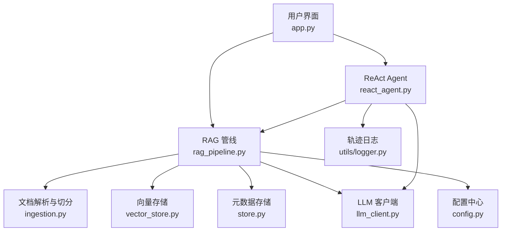
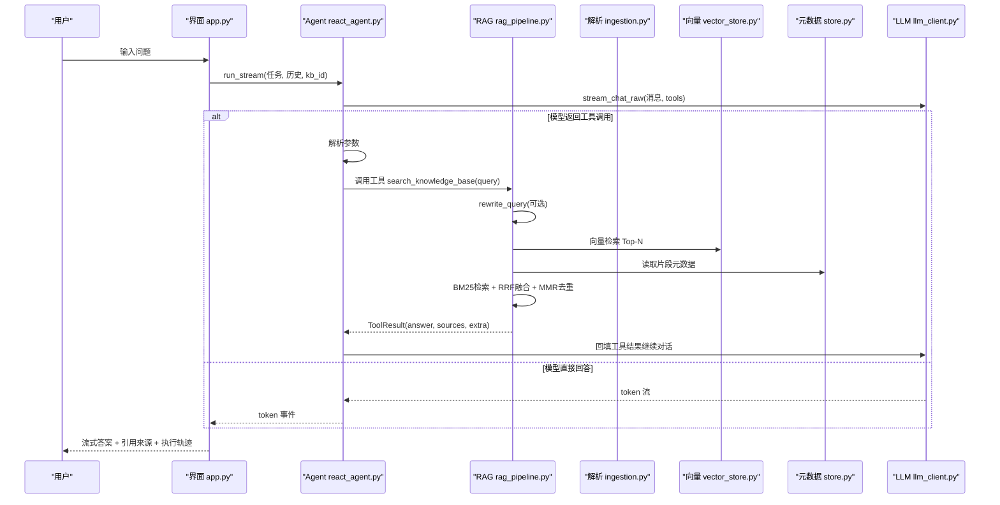
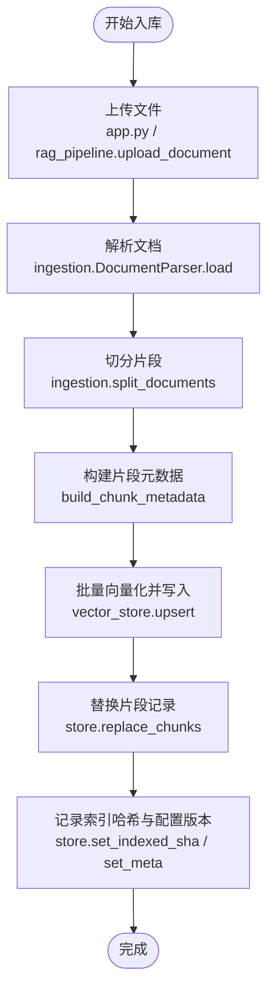
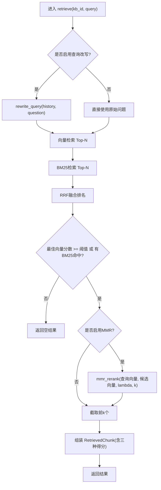
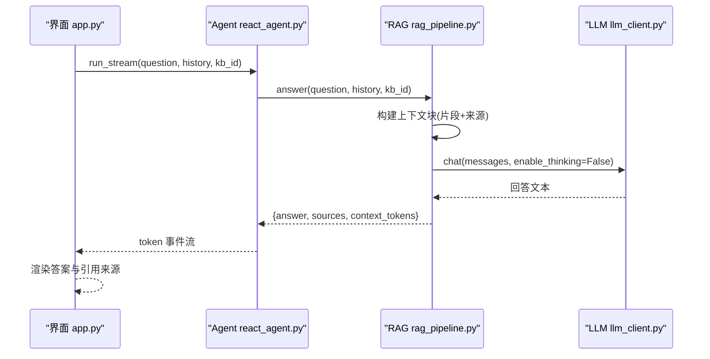
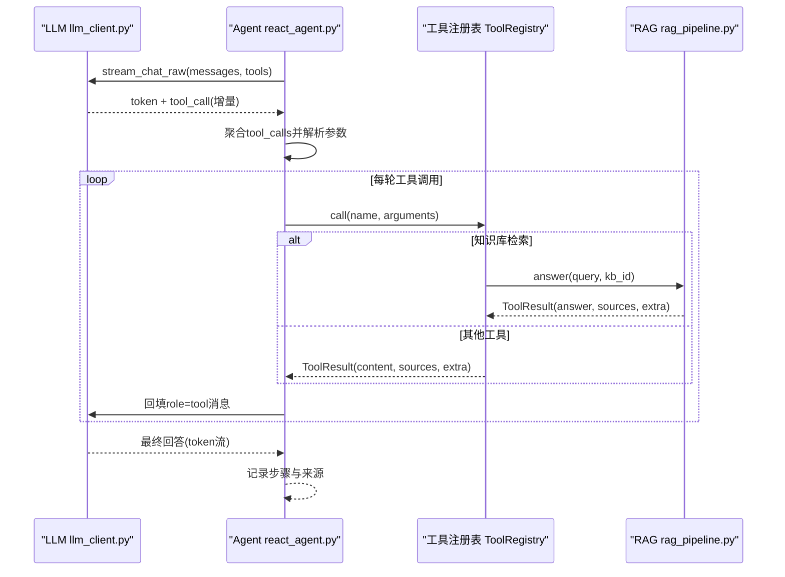
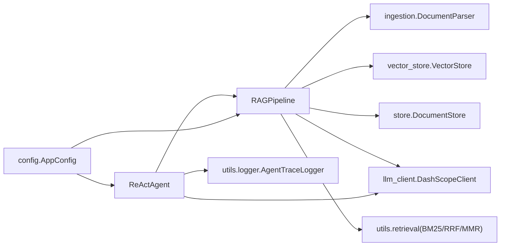

# 数据流架构

<cite>
**本文引用的文件**
- [app.py](file://app.py)
- [rag_pipeline.py](file://rag_pipeline.py)
- [ingestion.py](file://ingestion.py)
- [react_agent.py](file://react_agent.py)
- [vector_store.py](file://vector_store.py)
- [store.py](file://store.py)
- [config.py](file://config.py)
- [llm_client.py](file://llm_client.py)
- [utils/logger.py](file://utils/logger.py)
</cite>

## 目录
1. [简介](#简介)
2. [项目结构](#项目结构)
3. [核心组件](#核心组件)
4. [架构总览](#架构总览)
5. [详细组件分析](#详细组件分析)
6. [依赖关系分析](#依赖关系分析)
7. [性能考虑](#性能考虑)
8. [故障排查指南](#故障排查指南)
9. [结论](#结论)
10. [附录](#附录)

## 简介
本文件面向“智能文档助手”的数据流与处理链路，覆盖以下关键流程：
- 文档入库：上传 → 解析 → 切分 → 向量化 → 存储（向量库 + 元数据）
- 混合检索：查询改写 → 向量检索 → BM25检索 → RRF融合 → MMR去重
- 问答生成：上下文构建 → LLM生成 → 流式输出
- Agent执行：工具选择 → 参数解析 → 执行 → 结果处理

系统采用多知识库、增量索引、可配置参数、流式交互与可观测性设计，兼顾准确性、可扩展性与用户体验。

## 项目结构
- 应用入口与界面：app.py（Streamlit 单页应用，负责上传、后台入库、聊天与展示）
- RAG 管线：rag_pipeline.py（知识库管理、入库、混合检索、问答）
- 文档解析与切分：ingestion.py（PDF/Word/Markdown/TXT 解析与文本切分）
- Agent 框架：react_agent.py（工具注册、函数调用循环、流式事件）
- 向量存储：vector_store.py（Chroma 封装，批量 upsert、相似度检索、MMR 所需向量获取）
- 元数据存储：store.py（SQLite 持久化知识库、文档、片段、版本与配置）
- 配置中心：config.py（集中环境变量配置）
- LLM 客户端：llm_client.py（百炼 OpenAI 兼容接口、嵌入、联网搜索）
- 日志与估算：utils/logger.py（Agent 轨迹日志、token 估算）

**图表来源**
- [app.py:51-127](file://app.py#L51-L127)
- [rag_pipeline.py:196-219](file://rag_pipeline.py#L196-L219)
- [ingestion.py:24-38](file://ingestion.py#L24-L38)
- [vector_store.py:38-55](file://vector_store.py#L38-L55)
- [store.py:123-138](file://store.py#L123-L138)
- [llm_client.py:22-46](file://llm_client.py#L22-L46)
- [utils/logger.py:12-45](file://utils/logger.py#L12-L45)

**章节来源**
- [app.py:51-127](file://app.py#L51-L127)
- [rag_pipeline.py:196-219](file://rag_pipeline.py#L196-L219)
- [ingestion.py:24-38](file://ingestion.py#L24-L38)
- [vector_store.py:38-55](file://vector_store.py#L38-L55)
- [store.py:123-138](file://store.py#L123-L138)
- [llm_client.py:22-46](file://llm_client.py#L22-L46)
- [utils/logger.py:12-45](file://utils/logger.py#L12-L45)

## 核心组件
- RAGPipeline：统一门面，协调解析、切分、向量化、检索与问答；支持多知识库、增量索引、查询改写、混合检索与引用回答。
- ReActAgent：基于 Function Calling 的工具调度器，支持多步循环与流式事件输出。
- VectorStore：Chroma 向量库封装，提供批量 upsert、相似度检索、按条件删除、取回向量等能力。
- DocumentStore：SQLite 持久化，维护知识库、文档、片段、版本与配置，支持 WAL 并发安全。
- DashScopeClient：统一 LLM 与 Embedding 访问，支持流式与非流式调用、联网搜索与 token 用量记录。
- 配置中心 AppConfig：集中管理所有可调参数，支持环境变量覆盖。

**章节来源**
- [rag_pipeline.py:196-219](file://rag_pipeline.py#L196-L219)
- [react_agent.py:144-161](file://react_agent.py#L144-L161)
- [vector_store.py:38-55](file://vector_store.py#L38-L55)
- [store.py:123-138](file://store.py#L123-L138)
- [llm_client.py:22-46](file://llm_client.py#L22-L46)
- [config.py:56-113](file://config.py#L56-L113)

## 架构总览
下图展示了从用户提问到最终回答的端到端数据流，包括 Agent 工具选择、RAG 混合检索、LLM 生成与流式输出。

**图表来源**
- [app.py:303-349](file://app.py#L303-L349)
- [react_agent.py:272-369](file://react_agent.py#L272-L369)
- [rag_pipeline.py:566-666](file://rag_pipeline.py#L566-L666)
- [vector_store.py:100-137](file://vector_store.py#L100-L137)
- [store.py:425-442](file://store.py#L425-L442)
- [llm_client.py:203-278](file://llm_client.py#L203-L278)

## 详细组件分析

### 文档入库流程（上传→解析→切分→向量化→存储）
- 上传：app.py 接收文件并调用 RAGPipeline.upload_document，保存物理文件与版本信息，标记缓存失效。
- 解析：ingestion.DocumentParser 根据后缀加载 PDF/Word/Markdown/TXT，PDF 具备质量评估与本地 OCR 回退。
- 切分：ingestion.split_documents 使用递归字符切分器，保留 page/段落等元数据。
- 向量化与存储：rag_pipeline.ingest 对每个文档计算 chunk，写入向量库（VectorStore.upsert），更新片段记录（DocumentStore.replace_chunks），记录已索引哈希与配置版本。

**图表来源**
- [app.py:173-208](file://app.py#L173-L208)
- [rag_pipeline.py:260-288](file://rag_pipeline.py#L260-L288)
- [rag_pipeline.py:306-435](file://rag_pipeline.py#L306-L435)
- [ingestion.py:24-38](file://ingestion.py#L24-L38)
- [ingestion.py:178-190](file://ingestion.py#L178-L190)
- [ingestion.py:193-215](file://ingestion.py#L193-L215)
- [vector_store.py:61-78](file://vector_store.py#L61-L78)
- [store.py:386-411](file://store.py#L386-L411)

**章节来源**
- [app.py:173-208](file://app.py#L173-L208)
- [rag_pipeline.py:260-288](file://rag_pipeline.py#L260-L288)
- [rag_pipeline.py:306-435](file://rag_pipeline.py#L306-L435)
- [ingestion.py:24-38](file://ingestion.py#L24-L38)
- [ingestion.py:178-190](file://ingestion.py#L178-L190)
- [ingestion.py:193-215](file://ingestion.py#L193-L215)
- [vector_store.py:61-78](file://vector_store.py#L61-L78)
- [store.py:386-411](file://store.py#L386-L411)

### 混合检索流程（查询改写→向量检索→BM25检索→RRF融合→MMR去重）
- 查询改写：若启用且存在历史，先通过 LLM 将追问题改写为独立问题。
- 向量检索：按知识库集合查询 Top-N，得到候选与分数。
- BM25检索：构建或复用 BM25 索引，查询 Top-N。
- RRF融合：对两份排名做倒数秩融合，得到综合排序。
- MMR去重：可选地用最大边际相关性重排，提升多样性。
- 相关性门槛：若向量最佳分数低于阈值且无 BM25 命中，则视为无相关内容。

**图表来源**
- [rag_pipeline.py:566-588](file://rag_pipeline.py#L566-L588)
- [rag_pipeline.py:439-523](file://rag_pipeline.py#L439-L523)
- [vector_store.py:100-137](file://vector_store.py#L100-L137)

**章节来源**
- [rag_pipeline.py:566-588](file://rag_pipeline.py#L566-L588)
- [rag_pipeline.py:439-523](file://rag_pipeline.py#L439-L523)
- [vector_store.py:100-137](file://vector_store.py#L100-L137)

### 问答生成流程（上下文构建→LLM生成→流式输出）
- 上下文构建：将检索到的片段按“来源+内容”拼接，结合历史消息裁剪至预算内。
- LLM生成：注入系统提示与用户提示，调用 LLM 生成带引用的回答；关闭深度思考以降低首字延迟。
- 流式输出：Agent 通过 stream_chat_raw 以 token 事件流式推送，UI 逐帧渲染。

**图表来源**
- [rag_pipeline.py:590-666](file://rag_pipeline.py#L590-L666)
- [react_agent.py:272-369](file://react_agent.py#L272-L369)
- [llm_client.py:94-127](file://llm_client.py#L94-L127)
- [app.py:303-349](file://app.py#L303-L349)

**章节来源**
- [rag_pipeline.py:590-666](file://rag_pipeline.py#L590-L666)
- [react_agent.py:272-369](file://react_agent.py#L272-L369)
- [llm_client.py:94-127](file://llm_client.py#L94-L127)
- [app.py:303-349](file://app.py#L303-L349)

### Agent执行流程（工具选择→参数解析→执行→结果处理）
- 工具选择：LLM 在 Function Calling 模式下返回 tool_calls，Agent 聚合后解析名称与参数。
- 参数解析：容忍 Markdown 代码块包裹的 JSON，失败时降级为空参。
- 执行：ToolRegistry 按名调用具体工具（知识库检索、天气、联网搜索、数据库只读查询）。
- 结果处理：将工具结果截断后回填给模型，记录步骤与来源，持续循环直到模型给出最终回答或达到最大步数。

**图表来源**
- [react_agent.py:165-246](file://react_agent.py#L165-L246)
- [react_agent.py:272-369](file://react_agent.py#L272-L369)
- [rag_pipeline.py:590-666](file://rag_pipeline.py#L590-L666)
- [llm_client.py:203-278](file://llm_client.py#L203-L278)

**章节来源**
- [react_agent.py:165-246](file://react_agent.py#L165-L246)
- [react_agent.py:272-369](file://react_agent.py#L272-L369)
- [rag_pipeline.py:590-666](file://rag_pipeline.py#L590-L666)
- [llm_client.py:203-278](file://llm_client.py#L203-L278)

## 依赖关系分析
- RAGPipeline 依赖：
  - ingestion.DocumentParser：解析与切分
  - vector_store.VectorStore：向量存储与检索
  - store.DocumentStore：元数据与片段持久化
  - llm_client.DashScopeClient：LLM 与嵌入
  - utils.retrieval（BM25Index、reciprocal_rank_fusion、mmr_rerank）：混合检索算法
- ReActAgent 依赖：
  - llm_client.DashScopeClient：Function Calling 与联网搜索
  - rag_pipeline.RAGPipeline：知识库检索工具
  - utils.logger.AgentTraceLogger：轨迹日志
- 配置由 config.AppConfig 集中注入，影响切分、检索、重排、历史与 Agent 行为。

**图表来源**
- [rag_pipeline.py:196-219](file://rag_pipeline.py#L196-L219)
- [react_agent.py:144-161](file://react_agent.py#L144-L161)
- [config.py:56-113](file://config.py#L56-L113)

**章节来源**
- [rag_pipeline.py:196-219](file://rag_pipeline.py#L196-L219)
- [react_agent.py:144-161](file://react_agent.py#L144-L161)
- [config.py:56-113](file://config.py#L56-L113)

## 性能考虑
- 增量入库与配置签名：通过 SHA-256 与 index_config_version 实现增量重建，避免重复计算与旧向量污染。
- 批量向量化：VectorStore 使用 batch_size 控制嵌入批大小，降低 API 压力与内存占用。
- 历史与上下文裁剪：truncate_history 与 fit_context_indices 按 token 预算裁剪历史与上下文，减少无效 token 与成本。
- 混合检索优化：fusion_pool 扩大候选池，RRF 融合不依赖分值尺度，MMR 提升多样性，降低重复片段。
- 流式输出：stream_chat_raw 以 token 事件流式推送，降低首字延迟，提升交互体验。
- 并发安全：SQLite 使用 WAL 模式与 busy_timeout，后台入库与前台问答可安全并发。

[本节为通用性能建议，不直接分析具体文件]

## 故障排查指南
- 未配置密钥：DashScopeClient 会抛出明确错误，检查 DASHSCOPE_API_KEY 与 BASE_URL。
- PDF 解析失败：当文本层不可读且本地 OCR 依赖缺失时会报错，需安装 pymupdf、rapidocr、onnxruntime。
- 向量检索无命中：若向量最佳分数低于阈值且无 BM25 命中，将返回空结果；可通过调整 RETRIEVAL_RELEVANCE_THRESHOLD 或增加 fusion_pool。
- 工具执行异常：ToolRegistry 捕获异常并返回友好消息，模型有机会重试或降级回答。
- 日志写入失败：AgentTraceLogger 写入失败不影响主流程，确保 data 目录可写。

**章节来源**
- [llm_client.py:59-66](file://llm_client.py#L59-L66)
- [ingestion.py:124-150](file://ingestion.py#L124-L150)
- [rag_pipeline.py:439-523](file://rag_pipeline.py#L439-L523)
- [react_agent.py:130-142](file://react_agent.py#L130-L142)
- [utils/logger.py:12-45](file://utils/logger.py#L12-L45)

## 结论
本系统以 RAGPipeline 为核心，串联文档入库、混合检索与问答生成；以 ReActAgent 驱动工具选择与多步推理，形成“检索增强 + 工具扩展”的智能助手。通过增量索引、流式输出、可配置参数与可观测性设计，系统在准确性、性能与可维护性之间取得平衡。后续可在更多工具集成、检索策略调优与监控指标方面持续演进。

[本节为总结性内容，不直接分析具体文件]

## 附录
- 关键配置项说明（来自 AppConfig）：
  - 数据路径：data_dir、chroma_dir、db_path
  - 切分：chunk_size、chunk_overlap
  - 检索：top_k、fusion_pool、relevance_threshold、mmr_enabled、mmr_lambda
  - 对话：query_rewrite_enabled、history_max_tokens、rag_context_max_tokens
  - Agent：agent_max_steps
  - 嵌入：embedding_batch_size

**章节来源**
- [config.py:56-113](file://config.py#L56-L113)