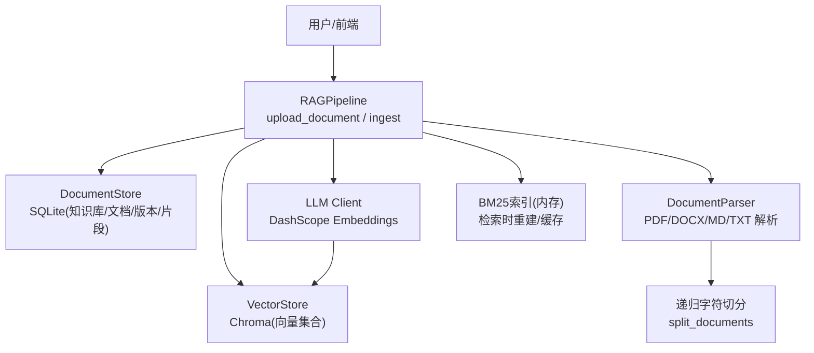
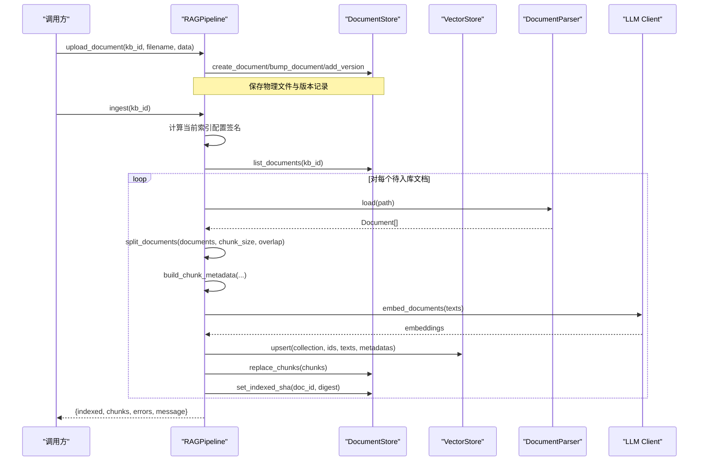
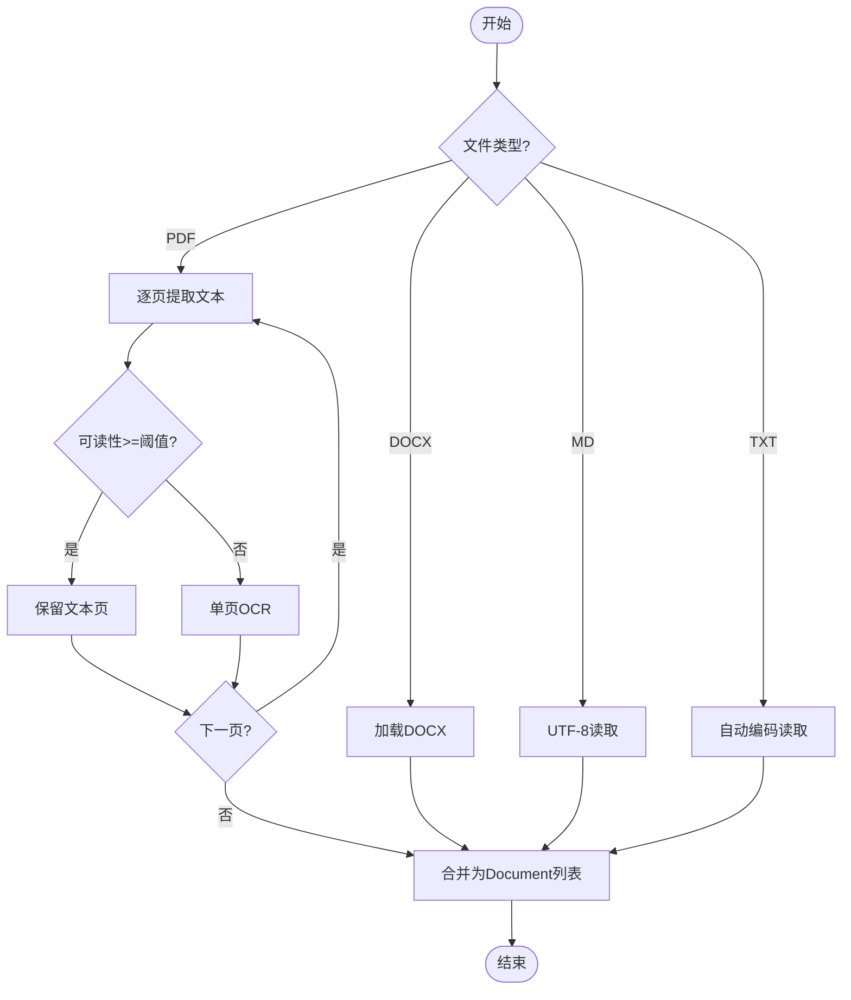
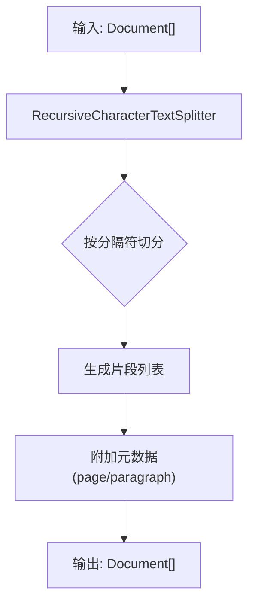
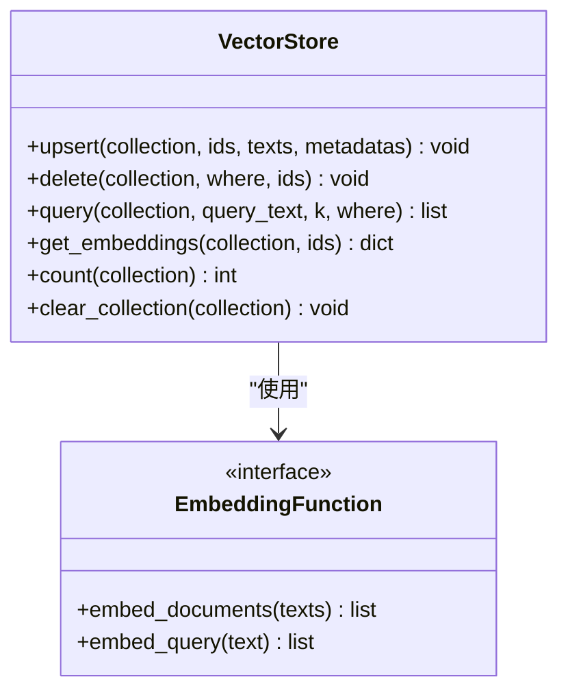
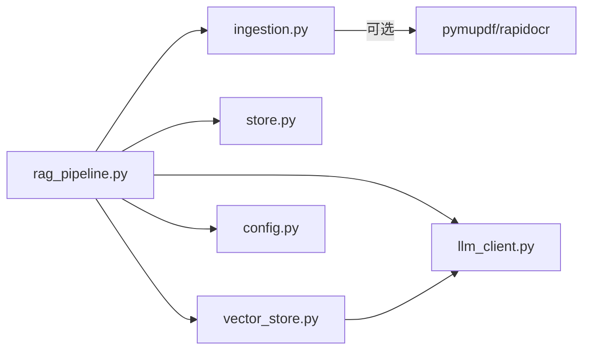

# 文档入库流程

<cite>
**本文引用的文件**
- [ingestion.py](file://ingestion.py)
- [vector_store.py](file://vector_store.py)
- [store.py](file://store.py)
- [config.py](file://config.py)
- [rag_pipeline.py](file://rag_pipeline.py)
- [llm_client.py](file://llm_client.py)
- [utils/logger.py](file://utils/logger.py)
- [tests/helpers.py](file://tests/helpers.py)
</cite>

## 目录
1. [简介](#简介)
2. [项目结构](#项目结构)
3. [核心组件](#核心组件)
4. [架构总览](#架构总览)
5. [详细组件分析](#详细组件分析)
6. [依赖关系分析](#依赖关系分析)
7. [性能考虑](#性能考虑)
8. [故障排查指南](#故障排查指南)
9. [结论](#结论)
10. [附录：配置与示例](#附录：配置与示例)

## 简介
本文件面向“从文件上传到向量存储”的完整文档入库流程，覆盖多格式解析（PDF/Word/Markdown/TXT）、智能质量检测、OCR识别切换、文本切分策略、元数据构建和向量化存储。文档同时说明每个阶段的输入输出、错误处理机制与性能优化策略，并给出可定位的代码片段路径与配置参数说明，帮助读者快速理解与落地。

## 项目结构
仓库采用按职责划分的模块化设计：
- 解析与切分：ingestion.py
- 向量存储：vector_store.py
- 元数据存储：store.py
- 配置中心：config.py
- RAG编排与入库流程：rag_pipeline.py
- LLM/Embedding客户端：llm_client.py
- 工具与日志：utils/logger.py
- 测试辅助：tests/helpers.py

图表来源
- [rag_pipeline.py:196-219](file://rag_pipeline.py#L196-L219)
- [ingestion.py:24-38](file://ingestion.py#L24-L38)
- [vector_store.py:38-78](file://vector_store.py#L38-L78)
- [store.py:123-148](file://store.py#L123-L148)

章节来源
- [rag_pipeline.py:1-15](file://rag_pipeline.py#L1-L15)
- [ingestion.py:1-5](file://ingestion.py#L1-L5)
- [vector_store.py:1-10](file://vector_store.py#L1-L10)
- [store.py:1-17](file://store.py#L1-L17)

## 核心组件
- 文档解析器：支持 PDF/DOCX/MD/TXT；PDF 先尝试文本层提取，质量低于阈值则自动切换本地 OCR（PyMuPDF + RapidOCR）。
- 文本切分器：基于递归字符切分，优先按段落/句子边界切分，保留页码等元信息。
- 元数据构建器：为每个片段生成 source/chunk_index/doc_id/kb_id/category/tags/page/paragraph 等元数据。
- 向量存储：封装 Chroma，提供批量 upsert、条件删除、相似度查询、取回原始向量等能力。
- 元数据存储：SQLite 持久化知识库、文档、版本、片段与键值配置，WAL 模式保证并发安全。
- 配置中心：集中管理切分、检索、重排、嵌入批大小等可调参数，支持环境变量覆盖。
- LLM/Embedding：统一接入 DashScope 模型与嵌入接口，失败时回退到模拟嵌入用于演示。

章节来源
- [ingestion.py:24-190](file://ingestion.py#L24-L190)
- [vector_store.py:22-148](file://vector_store.py#L22-L148)
- [store.py:88-148](file://store.py#L88-L148)
- [config.py:56-113](file://config.py#L56-L113)
- [llm_client.py:22-73](file://llm_client.py#L22-L73)

## 架构总览
下图展示一次完整的入库调用链：上传文件 → 增量检测 → 解析 → 切分 → 构建元数据 → 批量向量化 → 写入向量库与片段表 → 更新索引状态。

图表来源
- [rag_pipeline.py:260-435](file://rag_pipeline.py#L260-L435)
- [ingestion.py:27-190](file://ingestion.py#L27-L190)
- [vector_store.py:61-78](file://vector_store.py#L61-L78)
- [store.py:214-274](file://store.py#L214-L274)

## 详细组件分析

### 文档解析与OCR切换
- 支持格式：PDF、DOCX、Markdown、TXT。
- PDF 解析策略：
  - 优先使用 PyMuPDF 逐页提取文本层，若页面为空或可读性低于阈值，则对该页执行本地 OCR。
  - 若环境缺少 PyMuPDF，回退到 pypdf 整本质量判断，必要时整体走 OCR。
- 质量评估：通过可见字符统计与 Unicode 名称判断是否乱码/扫描件，阈值默认 0.85。
- OCR 实现：渲染为 PNG（2倍分辨率）后调用 RapidOCR 识别，失败抛错并附带页号与源文件名。

图表来源
- [ingestion.py:27-78](file://ingestion.py#L27-L78)
- [ingestion.py:104-175](file://ingestion.py#L104-L175)

章节来源
- [ingestion.py:24-175](file://ingestion.py#L24-L175)

### 文本切分策略
- 使用递归字符切分器，分隔符优先级：双换行、单换行、中文句号、分号、逗号、空格、空串。
- 通过 add_start_index 保留起始位置，便于后续定位。
- 切分后的每个片段携带 page/paragraph 等元信息，利于引用与溯源。

图表来源
- [ingestion.py:178-190](file://ingestion.py#L178-L190)

章节来源
- [ingestion.py:178-190](file://ingestion.py#L178-L190)

### 元数据构建
- 字段包括：source、chunk_index、doc_id、kb_id、category、tags、page（1起编号）、paragraph。
- 用途：
  - 向量库过滤与检索（如按 doc_id 限定范围）。
  - 答案引用标注（来源文件+页码/段落）。
  - BM25 重建与片段级审计。

章节来源
- [ingestion.py:193-215](file://ingestion.py#L193-L215)
- [rag_pipeline.py:775-782](file://rag_pipeline.py#L775-L782)

### 向量化与存储
- 批量嵌入：通过 LLMClient.embeddings() 获取嵌入函数，按 batch_size 分批调用 embed_documents。
- 向量库：Chroma 持久化，collection 命名 kb_<kb_id>，空间为余弦距离。
- 写入顺序：先 upsert 新向量，再清理旧片段 id，最后替换 SQLite 片段记录，确保一致性。
- 删除与清空：支持按 where 条件删除、按 id 删除、清空 collection。

图表来源
- [vector_store.py:22-148](file://vector_store.py#L22-L148)

章节来源
- [vector_store.py:38-148](file://vector_store.py#L38-L148)
- [rag_pipeline.py:395-418](file://rag_pipeline.py#L395-L418)

### 元数据存储（SQLite）
- 表结构：kbs、documents、document_versions、chunks、meta。
- 并发与安全：WAL 模式 + busy_timeout + RLock 写锁，保障后台入库与前台问答并发访问。
- 版本控制：同名文件重传自动升版本，记录 SHA-256、大小与物理路径。
- 片段原子替换：replace_chunks 先删后插，保证与向量库一致。

章节来源
- [store.py:31-77](file://store.py#L31-L77)
- [store.py:123-148](file://store.py#L123-L148)
- [store.py:214-274](file://store.py#L214-L274)
- [store.py:386-411](file://store.py#L386-L411)

### 增量入库与全量重建
- 增量判定：比较文件 SHA-256 与 indexed_sha，未变化则跳过。
- 全量重建：当索引配置签名变化（切分参数、嵌入模型、解析器版本等），强制全量重建。
- 进度回调：on_progress(stage, done, total) 供 UI 显示阶段与进度。
- 错误收集：单个文档异常不影响其他文档，最终汇总错误列表。

章节来源
- [rag_pipeline.py:306-435](file://rag_pipeline.py#L306-L435)
- [rag_pipeline.py:739-752](file://rag_pipeline.py#L739-L752)

### 混合检索与重排（与入库相关）
- 混合检索：向量 Top-N 与 BM25 Top-N 经 RRF 融合，可选 MMR 去重。
- 相关性门槛：最佳向量相似度低于阈值且无 BM25 命中时，视为无相关内容。
- 文档限定：根据问题中的文件名/人物短名，自动限定检索范围至指定文档。

章节来源
- [rag_pipeline.py:439-523](file://rag_pipeline.py#L439-L523)
- [rag_pipeline.py:525-562](file://rag_pipeline.py#L525-L562)

## 依赖关系分析
- rag_pipeline.py 依赖 ingestion.py、store.py、vector_store.py、llm_client.py、config.py 与 utils.retrieval。
- ingestion.py 依赖 langchain 文档加载器与文本切分器，PDF 解析可选依赖 pymupdf/rapidocr。
- vector_store.py 依赖 chromadb 与 llm_client 提供的嵌入接口。
- store.py 依赖 sqlite3，无外部服务依赖。
- config.py 通过环境变量集中注入所有可调参数。

图表来源
- [rag_pipeline.py:17-38](file://rag_pipeline.py#L17-L38)
- [vector_store.py:19-27](file://vector_store.py#L19-L27)
- [ingestion.py:13-15](file://ingestion.py#L13-L15)

章节来源
- [rag_pipeline.py:17-38](file://rag_pipeline.py#L17-L38)
- [vector_store.py:19-27](file://vector_store.py#L19-L27)
- [ingestion.py:13-15](file://ingestion.py#L13-L15)

## 性能考虑
- 批量嵌入：embedding_batch_size 默认 16，避免超过嵌入接口限制（如单次最多 20 条）。
- 向量写入：按 batch_size 分批 upsert，减少网络与序列化开销。
- 文本切分：合理设置 chunk_size 与 chunk_overlap，平衡上下文完整性与检索精度。
- 并发存储：SQLite WAL + busy_timeout + 写锁，降低并发冲突。
- 索引重建：仅对变化文件或配置变更触发，减少不必要计算。
- 检索优化：RRF 融合 + MMR 去重，提升结果多样性与相关性。

[本节为通用性能建议，不直接分析具体代码]

## 故障排查指南
- PDF 无法解析或 OCR 失败：
  - 检查是否安装 pymupdf 与 rapidocr onnxruntime；否则将抛出运行时错误提示安装命令。
  - 单页 OCR 失败会包含页号与源文件名，便于定位问题页面。
- 向量库写入失败：
  - 检查 embedding 接口可用性；若未配置密钥，将回退到模拟嵌入用于演示。
- 元数据不一致：
  - 确认 replace_chunks 与 upsert 的顺序与事务边界；当前实现先 upsert 新向量，再清理旧 id，最后替换片段记录。
- 重复入库：
  - 检查 indexed_sha 与文件 SHA-256 是否一致；若一致则跳过。
- 配置变更导致全量重建：
  - 查看 _current_index_config 生成的签名，确认 chunk_size、chunk_overlap、embedding_model、parser_version 等是否变化。

章节来源
- [ingestion.py:124-175](file://ingestion.py#L124-L175)
- [vector_store.py:179-188](file://vector_store.py#L179-L188)
- [rag_pipeline.py:395-435](file://rag_pipeline.py#L395-L435)
- [rag_pipeline.py:739-752](file://rag_pipeline.py#L739-L752)

## 结论
该文档入库流程以“解析→切分→元数据→向量化→存储”为主线，结合智能质量检测与 OCR 切换，确保多格式文档高质量入库；通过增量判定与配置签名机制，实现高效稳定的索引维护；配合混合检索与重排，提升检索效果与用户体验。整体架构清晰、可扩展性强，适合在平台阶段 A 快速落地并在后续迁移到更复杂的数据存储方案。

[本节为总结性内容，不直接分析具体代码]

## 附录：配置与示例

### 关键配置项（来自 AppConfig）
- 数据与存储路径：data_dir、chroma_dir、db_path
- 切分参数：chunk_size、chunk_overlap
- 检索参数：top_k、fusion_pool、relevance_threshold、mmr_enabled、mmr_lambda
- 对话与上下文：history_max_tokens、rag_context_max_tokens
- Agent 参数：agent_max_steps
- 嵌入批大小：embedding_batch_size（受限于嵌入接口上限）

章节来源
- [config.py:56-113](file://config.py#L56-L113)

### 常用入口与用法路径
- 上传与入库：
  - 上传：[upload_document:260-288](file://rag_pipeline.py#L260-L288)
  - 入库：[ingest:306-435](file://rag_pipeline.py#L306-L435)
- 解析与切分：
  - 解析：[DocumentParser.load:27-38](file://ingestion.py#L27-L38)
  - PDF 解析与 OCR：[PDF 处理:40-78](file://ingestion.py#L40-L78)、[OCR 单页:152-175](file://ingestion.py#L152-L175)
  - 切分：[split_documents:178-190](file://ingestion.py#L178-L190)
- 元数据与存储：
  - 元数据构建：[build_chunk_metadata:193-215](file://ingestion.py#L193-L215)
  - 向量写入：[VectorStore.upsert:61-78](file://vector_store.py#L61-L78)
  - 片段写入：[DocumentStore.replace_chunks:386-411](file://store.py#L386-L411)
- 错误处理与日志：
  - 错误包装：[safe_error:297-299](file://llm_client.py#L297-L299)
  - Token 估算：[estimate_tokens:48-62](file://utils/logger.py#L48-L62)

### 测试与示例
- 测试辅助：
  - 假嵌入与假 LLM：[FakeEmbeddings/FakeLLMClient:16-133](file://tests/helpers.py#L16-L133)
  - 配置构造：[make_config:136-157](file://tests/helpers.py#L136-L157)
- 向量库自测示例：
  - 主程序示例：[VectorStore.__main__:191-255](file://vector_store.py#L191-L255)

章节来源
- [tests/helpers.py:16-166](file://tests/helpers.py#L16-L166)
- [vector_store.py:191-255](file://vector_store.py#L191-L255)