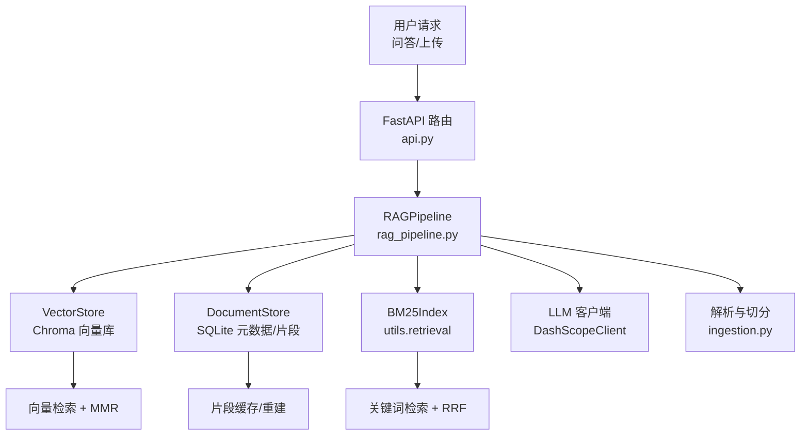
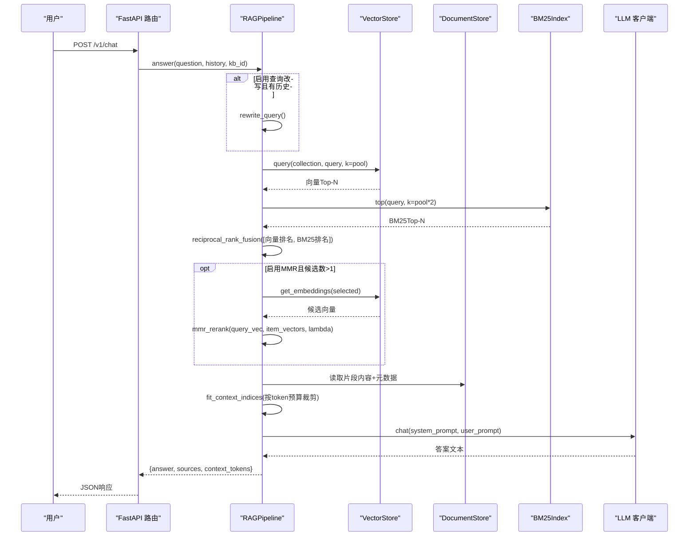
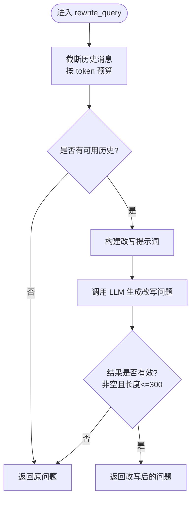
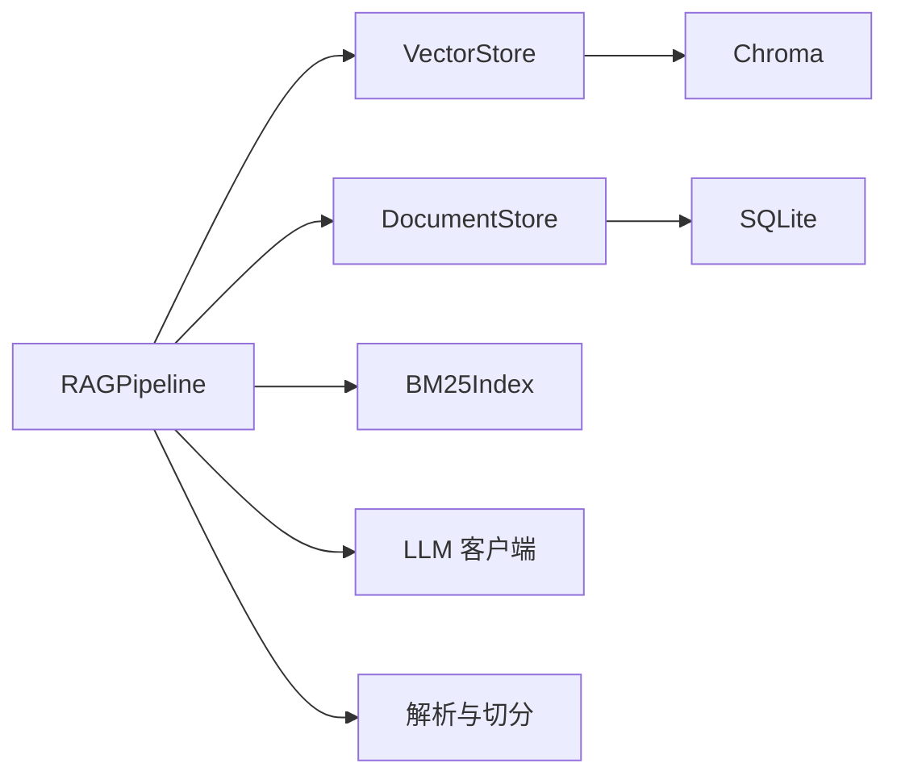

# 混合检索流程

<cite>
**本文引用的文件**
- [rag_pipeline.py](file://rag_pipeline.py)
- [vector_store.py](file://vector_store.py)
- [store.py](file://store.py)
- [config.py](file://config.py)
- [ingestion.py](file://ingestion.py)
- [api.py](file://api.py)
- [tests/test_retrieval.py](file://tests/test_retrieval.py)
- [evals/run_eval.py](file://evals/run_eval.py)
</cite>

## 目录
1. [简介](#简介)
2. [项目结构](#项目结构)
3. [核心组件](#核心组件)
4. [架构总览](#架构总览)
5. [详细组件分析](#详细组件分析)
6. [依赖关系分析](#依赖关系分析)
7. [性能与调优](#性能与调优)
8. [效果评估与调试](#效果评估与调试)
9. [故障排查](#故障排查)
10. [结论](#结论)

## 简介
本文件系统性说明本项目的“混合检索”完整流程：从查询改写、向量语义检索、BM25关键词检索，到RRF结果融合与MMR去重，再到上下文组装与大模型问答。文档同时给出各组件参数配置、权重调优建议与性能优化要点，并提供检索效果评估方法与调试工具使用指南，帮助读者快速定位问题并提升检索质量。

## 项目结构
- 管线门面与检索编排：RAGPipeline 负责知识库管理、增量入库、混合检索、问答生成。
- 向量存储：VectorStore 封装 Chroma，提供批量 upsert、相似度查询、取回向量等能力。
- 元数据与片段存储：DocumentStore 基于 SQLite，维护知识库、文档版本、片段与索引配置。
- 解析与切分：DocumentParser 支持 PDF/Word/Markdown/TXT，含 OCR 回退；split_documents 进行递归字符切分。
- 配置中心：AppConfig 集中读取环境变量，控制切分、检索、重排等关键参数。
- API 服务：FastAPI 暴露知识库管理、文档上传、入库与问答接口。
- 评测与测试：单元测试覆盖 BM25/RRF/MMR；轻量评测脚本输出 hit@k、keyword_hit、citation 等指标。

图表来源
- [api.py:185-199](file://api.py#L185-L199)
- [rag_pipeline.py:196-523](file://rag_pipeline.py#L196-L523)
- [vector_store.py:38-140](file://vector_store.py#L38-L140)
- [store.py:123-470](file://store.py#L123-L470)
- [ingestion.py:24-216](file://ingestion.py#L24-L216)

章节来源
- [api.py:1-204](file://api.py#L1-L204)
- [rag_pipeline.py:1-792](file://rag_pipeline.py#L1-L792)
- [vector_store.py:1-255](file://vector_store.py#L1-L255)
- [store.py:1-470](file://store.py#L1-L470)
- [ingestion.py:1-216](file://ingestion.py#L1-L216)
- [config.py:1-113](file://config.py#L1-L113)

## 核心组件
- RAGPipeline：统一入口，串联查询改写、混合检索、上下文裁剪与问答生成；内置相关性阈值与来源提示过滤。
- VectorStore：基于 Chroma 的向量存取与查询，支持按条件删除、批量向量化、取回原始向量用于 MMR。
- DocumentStore：SQLite 持久化知识库、文档版本、片段与索引配置；WAL 模式保障并发安全。
- 解析与切分：PDF/Word/Markdown/TXT 解析，自动 OCR 回退；按段落/句子边界递归切分，保留页码与段落信息。
- 配置中心：集中管理 chunk_size、top_k、fusion_pool、relevance_threshold、mmr_enabled/lambda、history_max_tokens、rag_context_max_tokens 等。

章节来源
- [rag_pipeline.py:196-523](file://rag_pipeline.py#L196-L523)
- [vector_store.py:38-140](file://vector_store.py#L38-L140)
- [store.py:123-470](file://store.py#L123-L470)
- [ingestion.py:24-216](file://ingestion.py#L24-L216)
- [config.py:56-113](file://config.py#L56-L113)

## 架构总览
下图展示一次问答请求的端到端流程：可选查询改写 → 向量检索与 BM25 检索 → RRF 融合 → 可选 MMR 去重 → 上下文裁剪 → LLM 生成带引用回答。

图表来源
- [api.py:185-199](file://api.py#L185-L199)
- [rag_pipeline.py:566-666](file://rag_pipeline.py#L566-L666)
- [rag_pipeline.py:439-523](file://rag_pipeline.py#L439-L523)
- [vector_store.py:100-137](file://vector_store.py#L100-L137)
- [store.py:425-442](file://store.py#L425-L442)

## 详细组件分析

### 查询改写
- 目的：在多轮对话中把追问题改写成独立、明确的问题，避免指代歧义。
- 策略：截取最近若干条消息（受 history_max_tokens 限制），构造提示词调用 LLM；对异常长或空结果做回退保护。
- 触发：当启用 query_rewrite_enabled 且存在历史时执行。

图表来源
- [rag_pipeline.py:159-193](file://rag_pipeline.py#L159-L193)
- [rag_pipeline.py:566-588](file://rag_pipeline.py#L566-L588)

章节来源
- [rag_pipeline.py:159-193](file://rag_pipeline.py#L159-L193)
- [rag_pipeline.py:566-588](file://rag_pipeline.py#L566-L588)

### 向量语义检索
- 实现：通过 VectorStore 将查询文本向量化，在对应 collection 中执行相似度检索（余弦空间）。
- 特性：支持 where 条件过滤（如限定 doc_id）、批量 upsert、按 id 删除、取回原始向量。
- 用途：为 RRF 提供语义相关 Top-N，并为 MMR 提供候选向量。

章节来源
- [vector_store.py:38-140](file://vector_store.py#L38-L140)
- [rag_pipeline.py:463-483](file://rag_pipeline.py#L463-L483)

### BM25 关键词检索
- 作用：弥补向量检索对精确术语（型号、编号、人名等）的不足，提供强关键词匹配。
- 行为：空索引时返回空；命中后参与 RRF 融合；若向量未命中但 BM25 强命中，可兜底放行。
- 重建：按知识库维度懒加载构建，变更时失效重建。

章节来源
- [rag_pipeline.py:471-483](file://rag_pipeline.py#L471-L483)
- [rag_pipeline.py:550-556](file://rag_pipeline.py#L550-L556)
- [tests/test_retrieval.py:21-37](file://tests/test_retrieval.py#L21-L37)

### RRF 结果融合
- 原理：对向量与 BM25 的两份排名列表进行倒数秩融合，只看排名不看分值，天然兼容不同量纲。
- 位置：在 retrieve 中先分别取 Top-N，再融合排序，得到候选集。

章节来源
- [rag_pipeline.py:483-488](file://rag_pipeline.py#L483-L488)
- [tests/test_retrieval.py:40-45](file://tests/test_retrieval.py#L40-L45)

### MMR 去重重排
- 目标：降低 Top-K 片段之间的重复度，提高多样性。
- 机制：每步选择“与查询最相关且与已选片段差异最大”的候选；λ 越大越看重相关性，越小越看重多样性。
- 降级：若候选无向量（仅 BM25 命中），直接截取前 k 项。

章节来源
- [rag_pipeline.py:489-503](file://rag_pipeline.py#L489-L503)
- [tests/test_retrieval.py:48-61](file://tests/test_retrieval.py#L48-L61)

### 相关性门槛与来源提示
- 相关性门槛：若最佳向量分数低于阈值且 BM25 也无命中，视为无相关内容，直接返回空结果，避免硬凑答案。
- 来源提示：根据问题中的文件名或人物短名，自动限定检索范围到特定文档，减少无关片段污染。

章节来源
- [rag_pipeline.py:484-486](file://rag_pipeline.py#L484-L486)
- [rag_pipeline.py:525-548](file://rag_pipeline.py#L525-L548)

### 上下文裁剪与问答生成
- 上下文裁剪：按 rag_context_max_tokens 预算保留片段块，优先保留靠前的块，保证首因效应。
- 问答生成：注入系统提示与检索资料，关闭深度思考以降低首字延迟；失败时返回友好提示。

章节来源
- [rag_pipeline.py:590-666](file://rag_pipeline.py#L590-L666)

## 依赖关系分析
- RAGPipeline 依赖：
  - VectorStore：向量检索与 MMR 所需向量获取。
  - DocumentStore：片段内容与元数据读取、知识库/文档元数据管理。
  - BM25Index：关键词检索与融合输入。
  - LLM 客户端：查询改写与问答生成。
- 外部依赖：
  - Chroma：向量数据库。
  - SQLite：元数据与片段持久化。
  - LangChain 组件：文档解析与切分。

图表来源
- [rag_pipeline.py:196-218](file://rag_pipeline.py#L196-L218)
- [vector_store.py:38-140](file://vector_store.py#L38-L140)
- [store.py:123-150](file://store.py#L123-L150)
- [ingestion.py:24-216](file://ingestion.py#L24-L216)

章节来源
- [rag_pipeline.py:196-218](file://rag_pipeline.py#L196-L218)
- [vector_store.py:38-140](file://vector_store.py#L38-L140)
- [store.py:123-150](file://store.py#L123-L150)
- [ingestion.py:24-216](file://ingestion.py#L24-L216)

## 性能与调优
- 切分参数
  - chunk_size、chunk_overlap：影响片段粒度与重叠度；过大导致上下文冗余，过小可能丢失语义连贯性。
  - 建议：中文场景可从 500/50 起步，结合业务文档长度逐步微调。
- 检索参数
  - top_k：最终返回给模型的片段数；过小可能遗漏关键信息，过大增加 token 成本。
  - fusion_pool：向量与 BM25 各自取回的候选数；增大可提升召回但增加计算与融合开销。
  - relevance_threshold：相关性门槛；过低易引入噪声，过高可能误杀有效查询。
- 重排参数
  - mmr_enabled：是否启用 MMR；开启可降低重复度，但需额外向量计算。
  - mmr_lambda：相关性 vs 多样性的权衡；较大更关注相关性，较小更关注多样性。
- 上下文预算
  - history_max_tokens：历史消息 token 上限；过长会稀释注意力并增加计费。
  - rag_context_max_tokens：检索上下文 token 上限；按预算保留靠前片段。
- 批处理
  - embedding_batch_size：向量化批次大小；受模型接口限制（默认 16，上限 20）。

章节来源
- [config.py:56-113](file://config.py#L56-L113)
- [rag_pipeline.py:439-523](file://rag_pipeline.py#L439-L523)
- [rag_pipeline.py:590-666](file://rag_pipeline.py#L590-L666)

## 效果评估与调试
- 单元测试
  - 覆盖 tokenize、BM25 排序、RRF 融合、MMR 多样性选择与空输入退化路径。
  - 验证 BM25 兜底：当向量未命中且低于阈值时，BM25 强命中仍可返回结果。
- 轻量评测
  - 指标：hit@k（期望来源是否在 Top-k）、keyword_hit（回答是否包含预期关键词）、citation（是否附带引用）。
  - 运行方式：在线模式使用真实 Embedding/LLM；离线模式使用确定性伪向量，不调用大模型。
  - 输出：last_run_report.json 记录明细与汇总。
- 调试建议
  - 观察 RetrievedChunk 的 vector_score、bm25_score、rrf_score，定位哪一检索器贡献更大。
  - 调整 fusion_pool 与 top_k 对比引用变化；关闭/开启 MMR 对比重复度。
  - 检查相关性门槛是否过严导致误杀；必要时放宽或结合来源提示缩小检索范围。

章节来源
- [tests/test_retrieval.py:1-81](file://tests/test_retrieval.py#L1-L81)
- [evals/run_eval.py:1-179](file://evals/run_eval.py#L1-L179)
- [rag_pipeline.py:134-145](file://rag_pipeline.py#L134-L145)

## 故障排查
- 向量检索为空
  - 检查集合是否存在、where 条件是否过严、embedding 是否正常。
  - 确认 ingestion 成功写入向量与片段，且索引配置版本一致。
- BM25 无命中
  - 检查分词与索引构建；确认片段内容是否被正确切分与存储。
- 相关性门槛导致无结果
  - 适当降低 relevance_threshold；或启用来源提示限定检索范围。
- 上下文过长
  - 调整 rag_context_max_tokens 与 history_max_tokens，确保不超出模型窗口。
- 服务不可用
  - API 层捕获异常并返回友好错误；检查 LLM 客户端与向量库连接。

章节来源
- [rag_pipeline.py:439-523](file://rag_pipeline.py#L439-L523)
- [rag_pipeline.py:590-666](file://rag_pipeline.py#L590-L666)
- [api.py:185-199](file://api.py#L185-L199)

## 结论
本项目通过“查询改写 + 向量语义检索 + BM25 关键词检索 + RRF 融合 + MMR 去重”的混合检索链路，兼顾了语义理解与精确匹配，并以相关性门槛与来源提示增强鲁棒性。配合可配置的切分与检索参数、上下文预算控制以及完善的评测与调试手段，可在不同业务场景下稳定获得高质量、可溯源的回答。建议在实际部署中依据数据分布与用户反馈持续调参，并结合评测报告迭代优化。