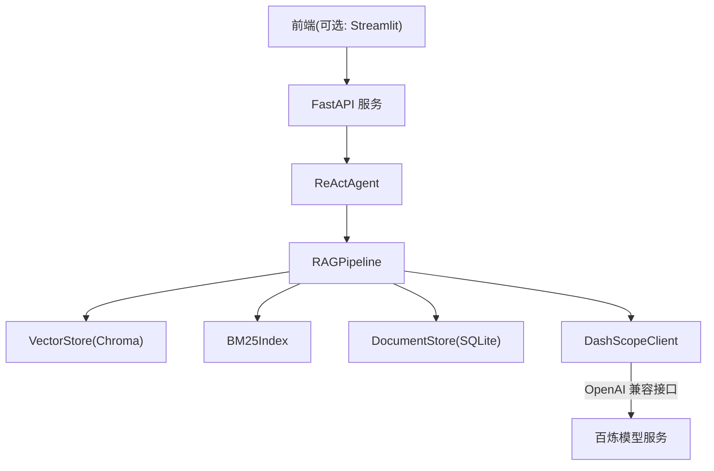
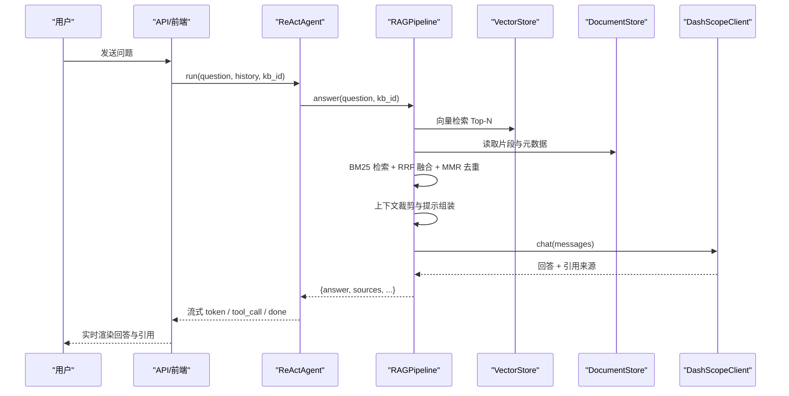
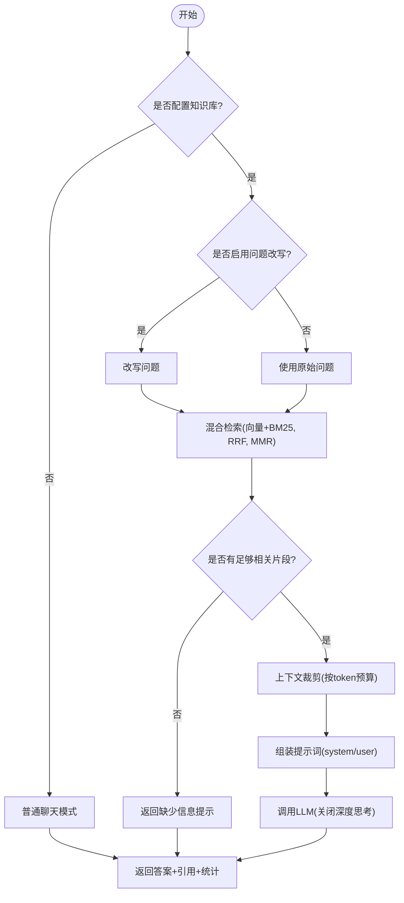
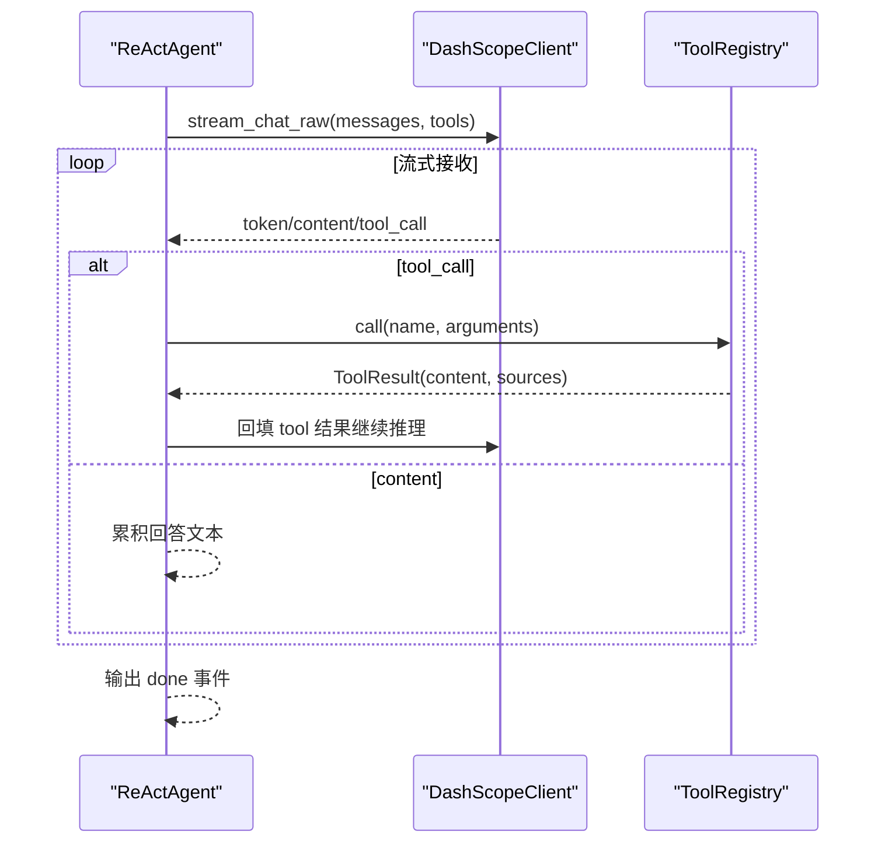
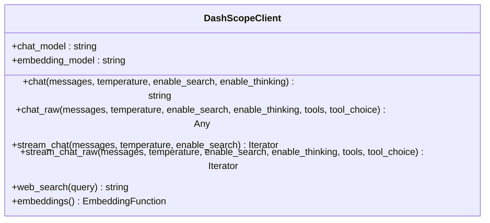
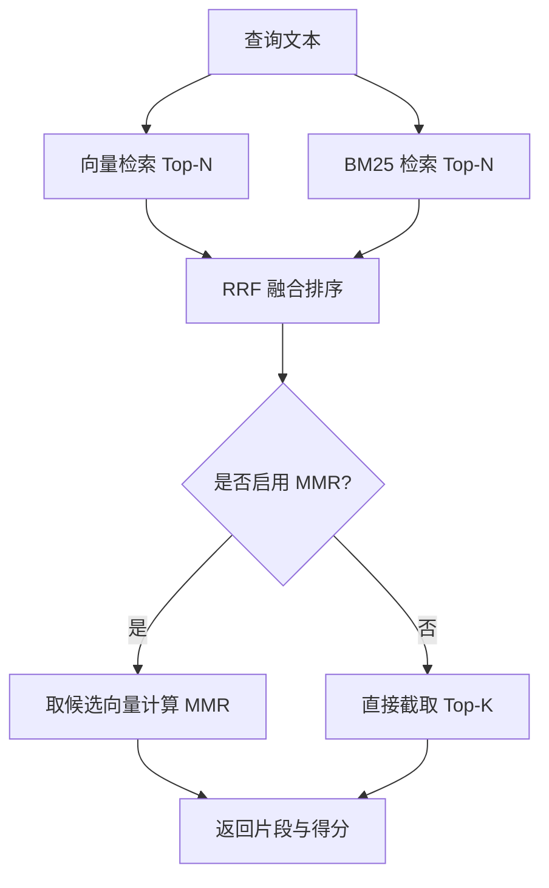
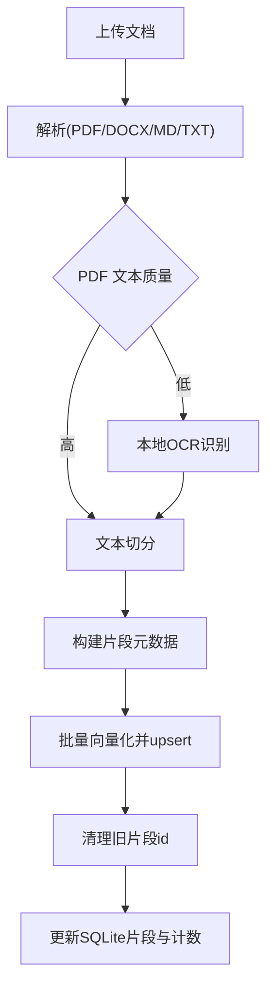
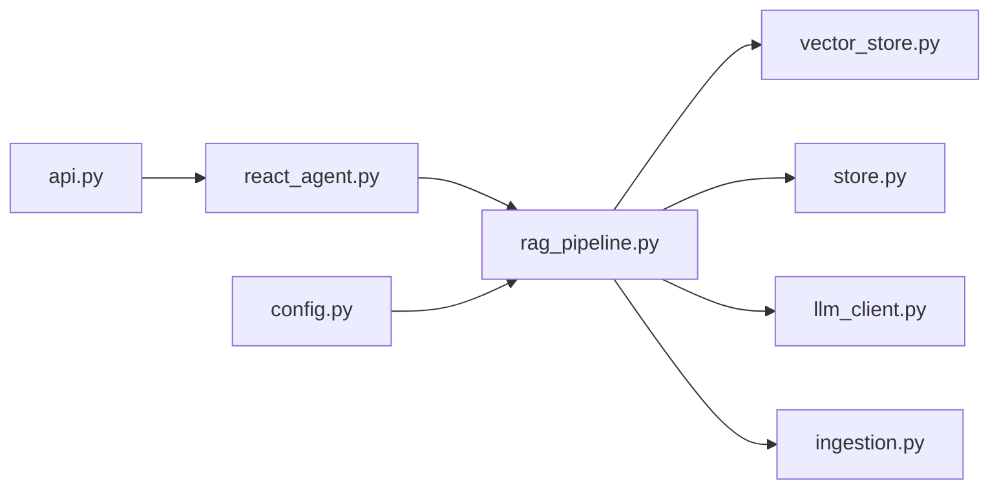

# 问答生成流程

<cite>
**本文引用的文件**
- [rag_pipeline.py](file://rag_pipeline.py)
- [api.py](file://api.py)
- [llm_client.py](file://llm_client.py)
- [config.py](file://config.py)
- [vector_store.py](file://vector_store.py)
- [react_agent.py](file://react_agent.py)
- [ingestion.py](file://ingestion.py)
- [store.py](file://store.py)
- [app.py](file://app.py)
</cite>

## 目录
1. [简介](#简介)
2. [项目结构](#项目结构)
3. [核心组件](#核心组件)
4. [架构总览](#架构总览)
5. [详细组件分析](#详细组件分析)
6. [依赖关系分析](#依赖关系分析)
7. [性能与可扩展性](#性能与可扩展性)
8. [故障排查指南](#故障排查指南)
9. [结论](#结论)
10. [附录：API 与前端集成示例](#附录api-与前端集成示例)

## 简介
本文件面向“从用户查询到最终回答”的完整 RAG 问答生成流程，覆盖上下文构建策略、提示词模板设计、LLM 调用封装、流式输出处理、引用信息提取、错误重试机制与响应格式规范。文档同时给出流式事件处理与前端集成的参考实现路径，帮助读者快速理解并落地企业级知识库问答系统。

## 项目结构
仓库采用分层模块化组织：
- 配置层：集中管理所有可调参数（切分大小、检索阈值、历史长度等）
- 数据层：SQLite 元数据存储、Chroma 向量存储、BM25 索引
- 解析与入库：多格式文档解析、OCR 回退、文本切分与增量入库
- 检索与问答：混合检索（向量 + BM25）、RRF 融合、MMR 去重、上下文裁剪与提示组装
- LLM 封装：统一 OpenAI 兼容接口，支持同步/流式调用与工具调用
- Agent：基于 Function Calling 的多步工具调度（知识库检索、天气、联网搜索、只读 SQL）
- API 与前端：FastAPI 暴露 REST 接口；Streamlit 提供交互式界面与流式渲染

图表来源
- [api.py:185-199](file://api.py#L185-L199)
- [react_agent.py:250-369](file://react_agent.py#L250-L369)
- [rag_pipeline.py:196-737](file://rag_pipeline.py#L196-L737)
- [vector_store.py:38-148](file://vector_store.py#L38-L148)
- [store.py:123-470](file://store.py#L123-L470)
- [llm_client.py:22-299](file://llm_client.py#L22-L299)

章节来源
- [api.py:1-204](file://api.py#L1-L204)
- [app.py:1-342](file://app.py#L1-L342)
- [config.py:56-113](file://config.py#L56-L113)

## 核心组件
- RAGPipeline：知识库管理、文档上传、增量入库、混合检索、问答生成（含上下文裁剪与引用标注）
- ReActAgent：Function Calling 驱动的工具选择与多步执行，流式事件输出
- DashScopeClient：统一 LLM 调用封装，支持 chat/chat_raw/stream_chat/stream_chat_raw
- VectorStore：Chroma 向量库封装，批量 upsert、条件删除、相似度查询、取回向量用于 MMR
- DocumentStore：SQLite 持久化知识库、文档、片段、版本与元数据
- Ingestion：PDF/Word/Markdown/TXT 解析与 OCR 回退，文本切分与元数据构建
- AppConfig：集中配置项，环境变量覆盖

章节来源
- [rag_pipeline.py:196-737](file://rag_pipeline.py#L196-L737)
- [react_agent.py:144-369](file://react_agent.py#L144-L369)
- [llm_client.py:22-299](file://llm_client.py#L22-L299)
- [vector_store.py:38-148](file://vector_store.py#L38-L148)
- [store.py:123-470](file://store.py#L123-L470)
- [ingestion.py:24-216](file://ingestion.py#L24-L216)
- [config.py:56-113](file://config.py#L56-L113)

## 架构总览
端到端数据流：
- 用户上传文档 → 解析与切分 → 向量化与 BM25 索引 → 增量写入向量库与 SQLite
- 用户提问 → 可选问题改写 → 混合检索（向量+BM25，RRF 融合，MMR 去重）→ 上下文裁剪 → 组装提示词 → LLM 生成带引用回答
- Agent 模式：LLM 决定调用工具（知识库检索/天气/联网/只读 SQL），多步循环直至得到答案或达到最大步数

图表来源
- [api.py:185-199](file://api.py#L185-L199)
- [react_agent.py:250-369](file://react_agent.py#L250-L369)
- [rag_pipeline.py:590-666](file://rag_pipeline.py#L590-L666)
- [vector_store.py:100-137](file://vector_store.py#L100-L137)
- [store.py:425-442](file://store.py#L425-L442)
- [llm_client.py:94-127](file://llm_client.py#L94-L127)

## 详细组件分析

### RAGPipeline：上下文构建、检索与问答
- 上下文构建策略
  - 混合检索：向量余弦相似度与 BM25 词面检索，使用 RRF 融合排序，可选 MMR 去重提升多样性
  - 相关性门槛：当向量最高分低于阈值且无 BM25 命中时，视为无相关内容，避免硬凑答案
  - 来源限定：根据问题中的文件名/人物短名自动限定检索范围，减少无关片段污染
  - 上下文裁剪：按 token 预算保留块顺序，保证不拆分块且至少保留首块，控制提示词长度
- 提示词模板
  - 系统提示：强调严格基于检索资料、逐条标注来源、禁止编造事实
  - 用户提示：包含最近对话历史、当前问题与检索资料块，要求保留来源标识
  - 问题改写：多轮对话时先改写为独立明确的问题，失败则回退原问题
- 问答流程
  - 若未配置知识库或未检索到内容，降级为通用聊天或直接返回“缺少信息”
  - 组装消息后调用 LLM，关闭深度思考以降低首字延迟
  - 统计上下文 token 数量，便于前端展示成本与效果
- 错误处理
  - 异常捕获并转换为可读错误，返回兜底回答
  - 增量入库失败记录错误列表，不影响其他文档处理

图表来源
- [rag_pipeline.py:566-666](file://rag_pipeline.py#L566-L666)
- [rag_pipeline.py:439-523](file://rag_pipeline.py#L439-L523)
- [rag_pipeline.py:159-193](file://rag_pipeline.py#L159-L193)

章节来源
- [rag_pipeline.py:42-78](file://rag_pipeline.py#L42-L78)
- [rag_pipeline.py:159-193](file://rag_pipeline.py#L159-L193)
- [rag_pipeline.py:439-523](file://rag_pipeline.py#L439-L523)
- [rag_pipeline.py:566-666](file://rag_pipeline.py#L566-L666)

### ReActAgent：工具选择与流式事件
- 工具注册表
  - 通过 JSON Schema 描述工具参数，模型自行选择工具与参数
  - 内置工具：知识库检索、天气查询、联网搜索、只读数据库查询
- 多步循环
  - 每轮调用流式接口，聚合 tool_calls 后执行工具，将结果回填给模型继续推理
  - 限制最大步骤，防止无限循环
- 流式事件
  - 事件类型：tool_start、tool_end、step、token、done、error
  - 前端可据此逐步渲染工具调用状态与最终回答

图表来源
- [react_agent.py:272-369](file://react_agent.py#L272-L369)
- [react_agent.py:93-142](file://react_agent.py#L93-L142)
- [llm_client.py:203-278](file://llm_client.py#L203-L278)

章节来源
- [react_agent.py:144-369](file://react_agent.py#L144-L369)
- [react_agent.py:93-142](file://react_agent.py#L93-L142)

### LLM 封装：同步/流式与工具调用
- 同步调用：chat/chat_raw 返回最终回答或完整消息对象（含 tool_calls）
- 流式调用：stream_chat/stream_chat_raw 产出事件，支持 reasoning/content/token/tool_call
- 安全封装：统一异常转换、连接超时与重试、用量记录
- 联网搜索：通过 enable_search 开启模型侧联网能力

图表来源
- [llm_client.py:22-299](file://llm_client.py#L22-L299)

章节来源
- [llm_client.py:94-127](file://llm_client.py#L94-L127)
- [llm_client.py:172-201](file://llm_client.py#L172-L201)
- [llm_client.py:203-278](file://llm_client.py#L203-L278)

### 向量存储与混合检索
- 向量存储：Chroma 持久化，cosine 空间，批量 upsert，条件删除，相似度查询，取回向量用于 MMR
- 混合检索：向量 Top-N 与 BM25 Top-N 做 RRF 融合，可选 MMR 重排提升多样性
- 相关性门槛：低相关查询直接返回空，避免无效上下文

图表来源
- [vector_store.py:100-137](file://vector_store.py#L100-L137)
- [rag_pipeline.py:439-523](file://rag_pipeline.py#L439-L523)

章节来源
- [vector_store.py:38-148](file://vector_store.py#L38-L148)
- [rag_pipeline.py:439-523](file://rag_pipeline.py#L439-L523)

### 文档解析与增量入库
- 解析器：支持 PDF/Word/Markdown/TXT；PDF 文本质量评估，低质量走本地 OCR
- 切分：递归字符切分，优先段落/句子边界，保留页码与段落编号
- 增量入库：SHA-256 判重，索引配置变化触发全量重建；upsert 新向量后清理旧片段 id
- 元数据：source、page/paragraph、doc_id、kb_id、category、tags

图表来源
- [ingestion.py:24-216](file://ingestion.py#L24-L216)
- [rag_pipeline.py:306-435](file://rag_pipeline.py#L306-L435)
- [store.py:386-442](file://store.py#L386-L442)

章节来源
- [ingestion.py:24-216](file://ingestion.py#L24-L216)
- [rag_pipeline.py:306-435](file://rag_pipeline.py#L306-L435)
- [store.py:386-442](file://store.py#L386-L442)

### 配置与环境
- 集中配置：切分大小、重叠、top_k、融合池大小、相关性阈值、MMR 开关与权重、历史长度、上下文长度、Agent 最大步数、嵌入批大小
- 环境变量覆盖：便于部署调整而不改代码
- 默认值：合理默认值确保开箱即用

章节来源
- [config.py:56-113](file://config.py#L56-L113)

## 依赖关系分析
- RAGPipeline 依赖：
  - VectorStore：向量检索与 MMR
  - DocumentStore：片段与元数据
  - BM25Index：词面检索
  - LLMClient：问答与问题改写
- ReActAgent 依赖：
  - RAGPipeline：作为工具之一（知识库检索）
  - DashScopeClient：流式工具调用与联网搜索
- API 层依赖：
  - FastAPI：路由、鉴权、请求校验
  - ReActAgent/RAGPipeline：业务逻辑

图表来源
- [api.py:185-199](file://api.py#L185-L199)
- [react_agent.py:250-369](file://react_agent.py#L250-L369)
- [rag_pipeline.py:196-737](file://rag_pipeline.py#L196-L737)

章节来源
- [api.py:1-204](file://api.py#L1-L204)
- [react_agent.py:144-369](file://react_agent.py#L144-L369)
- [rag_pipeline.py:196-737](file://rag_pipeline.py#L196-L737)

## 性能与可扩展性
- 性能优化
  - 上下文裁剪：按 token 预算保留块，避免超长提示导致延迟与费用上升
  - 关闭深度思考：文档问答场景降低首字延迟
  - 批量向量化：按配置批次大小提交，避免超出嵌入接口限制
  - 混合检索：RRF 融合与 MMR 去重提升召回质量与多样性
- 可扩展性
  - 工具注册表：新增工具无需修改循环逻辑
  - 配置外置：环境变量覆盖，便于不同环境调参
  - 存储解耦：SQLite 与 Chroma 分离，便于后续迁移至 PostgreSQL/向量数据库

[本节为通用指导，不直接分析具体文件]

## 故障排查指南
- LLM 调用失败
  - 检查环境变量 DASHSCOPE_API_KEY、DASHSCOPE_BASE_URL、模型名称
  - 查看 safe_error 返回的可读错误信息
- 向量检索为空
  - 确认已执行入库并刷新缓存
  - 检查相关性阈值与 top_k/fusion_pool 配置
- PDF 解析失败
  - 安装 pymupdf/rapidocr/onnxruntime，或使用 pypdf 回退
- 并发访问冲突
  - API 层使用全局锁串行化读写，避免 SQLite/Chroma 并发问题
  - 后台入库线程完成后调用 refresh 重建客户端连接

章节来源
- [llm_client.py:297-299](file://llm_client.py#L297-L299)
- [api.py:185-199](file://api.py#L185-L199)
- [ingestion.py:40-78](file://ingestion.py#L40-L78)
- [rag_pipeline.py:720-728](file://rag_pipeline.py#L720-L728)

## 结论
该 RAG 系统以“混合检索 + 上下文裁剪 + 流式输出”为核心，结合 Function Calling Agent 实现智能工具调度，具备完善的增量入库、引用标注与错误处理机制。通过集中配置与解耦存储，系统具备良好的可维护性与扩展性，适合在企业环境中快速落地知识库问答应用。

[本节为总结，不直接分析具体文件]

## 附录：API 与前端集成示例

### REST API 定义
- 健康检查
  - GET /health
- 知识库管理
  - GET /v1/kbs
  - POST /v1/kbs
  - DELETE /v1/kbs/{kb_id}
- 文档管理
  - POST /v1/kbs/{kb_id}/documents（multipart 表单）
  - GET /v1/kbs/{kb_id}/documents
  - DELETE /v1/documents/{doc_id}
- 入库
  - POST /v1/kbs/{kb_id}/ingest
- 问答
  - POST /v1/chat（JSON：question、history、kb_id）

鉴权：可选 Bearer Token，通过 API_AUTH_TOKEN 控制

章节来源
- [api.py:98-199](file://api.py#L98-L199)

### 流式事件与前端集成
- 事件类型
  - token：回答增量
  - tool_start/tool_end：工具调用起止
  - step：执行轨迹
  - done：完成
  - error：错误
- 前端渲染建议
  - 收到 token 即追加显示，降低首字延迟
  - 工具调用期间显示状态提示，完成后收起
  - 展示引用来源与 Agent 执行轨迹，增强可解释性

章节来源
- [react_agent.py:272-369](file://react_agent.py#L272-L369)
- [app.py:288-342](file://app.py#L288-L342)