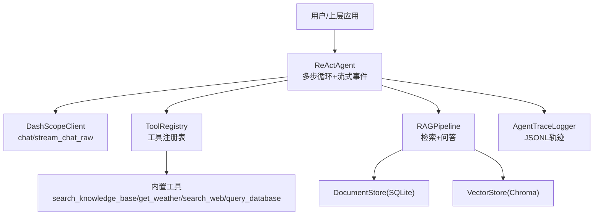
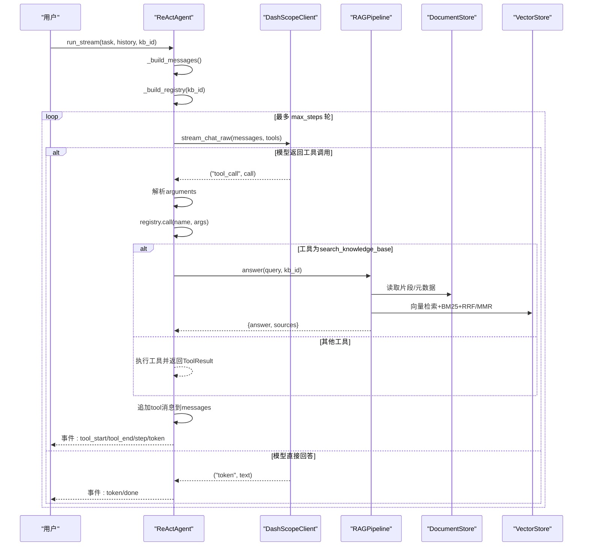
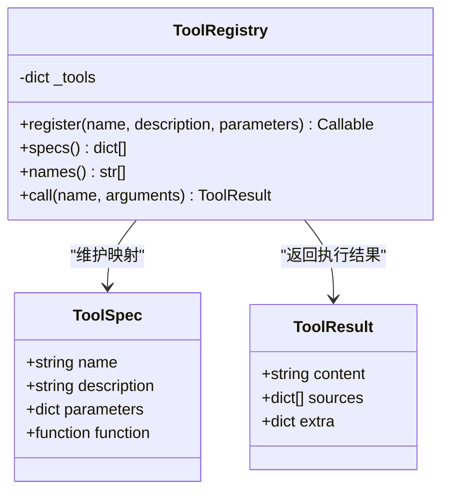
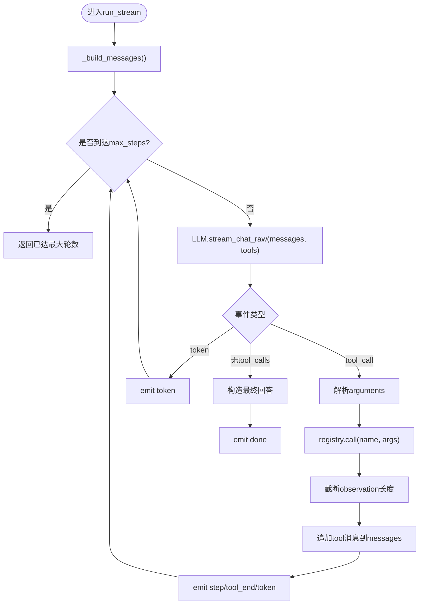
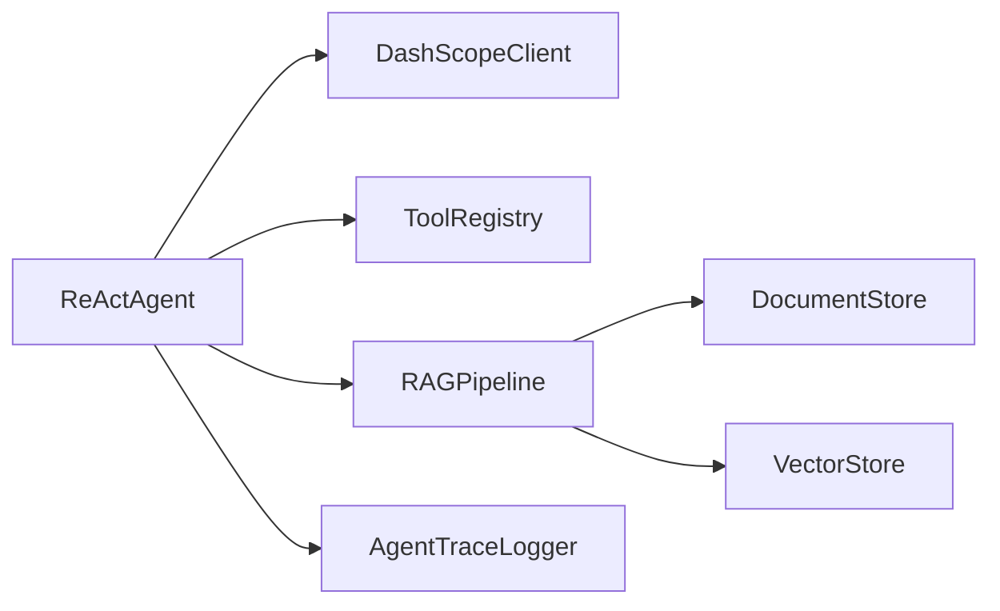

# Agent系统模块

<cite>
**本文引用的文件**
- [react_agent.py](file://react_agent.py)
- [rag_pipeline.py](file://rag_pipeline.py)
- [llm_client.py](file://llm_client.py)
- [store.py](file://store.py)
- [vector_store.py](file://vector_store.py)
- [config.py](file://config.py)
- [utils/logger.py](file://utils/logger.py)
- [tests/test_agent.py](file://tests/test_agent.py)
</cite>

## 目录
1. [简介](#简介)
2. [项目结构](#项目结构)
3. [核心组件](#核心组件)
4. [架构总览](#架构总览)
5. [详细组件分析](#详细组件分析)
6. [依赖关系分析](#依赖关系分析)
7. [性能考量](#性能考量)
8. [故障排查指南](#故障排查指南)
9. [结论](#结论)
10. [附录：使用示例与最佳实践](#附录使用示例与最佳实践)

## 简介
本模块实现了一个基于 Function Calling 的轻量 ReActAgent，具备工具注册表、多步任务循环、流式事件输出与错误恢复能力。Agent 将工具以 JSON Schema 形式交给大模型，由模型自主决定调用哪个工具及参数；每轮执行后将结果回填给模型，直到生成最终回答或达到最大步骤限制。同时提供与 RAG 管线的集成（知识库检索、联网搜索、天气查询、只读数据库查询），并支持可插拔自定义工具扩展。

## 项目结构
- react_agent.py：ReActAgent、ToolRegistry、工具定义与主循环、流式事件输出、轨迹记录。
- rag_pipeline.py：RAGPipeline 门面，负责知识库管理、增量入库、混合检索、问答改写与带引用回答。
- llm_client.py：DashScopeClient 统一封装，提供 chat/chat_raw/stream_chat/stream_chat_raw/web_search 等接口，支持 Function Calling 流式事件。
- store.py：SQLite 元数据存储（知识库、文档、片段、版本、配置）。
- vector_store.py：Chroma 向量存储封装（批量 upsert、条件删除、相似度查询、取回向量用于 MMR）。
- config.py：集中配置项（切分、检索、MMR、历史截断、Agent 最大步骤等）。
- utils/logger.py：线程安全的 JSONL 轨迹日志与 token 估算。
- tests/test_agent.py：覆盖工具注册、Function Calling 循环、参数解析、最大轮数、天气工具、流式事件顺序等。

图表来源
- [react_agent.py:144-369](file://react_agent.py#L144-L369)
- [rag_pipeline.py:196-697](file://rag_pipeline.py#L196-L697)
- [llm_client.py:22-294](file://llm_client.py#L22-L294)
- [store.py:123-470](file://store.py#L123-L470)
- [vector_store.py:38-148](file://vector_store.py#L38-L148)

章节来源
- [react_agent.py:1-567](file://react_agent.py#L1-L567)
- [rag_pipeline.py:1-792](file://rag_pipeline.py#L1-L792)
- [llm_client.py:1-322](file://llm_client.py#L1-L322)
- [store.py:1-470](file://store.py#L1-L470)
- [vector_store.py:1-255](file://vector_store.py#L1-L255)
- [config.py:1-113](file://config.py#L1-L113)
- [utils/logger.py:1-76](file://utils/logger.py#L1-L76)
- [tests/test_agent.py:1-159](file://tests/test_agent.py#L1-L159)

## 核心组件
- ReActAgent：实现 Function Calling 的多步循环、消息构建、流式事件输出、轨迹记录与错误处理。
- ToolRegistry：工具注册表，维护工具名到函数实现的映射，生成 OpenAI 兼容 tools 描述，按名调用并统一异常包装。
- RAGPipeline：RAG 管线门面，提供知识库管理、增量入库、混合检索（向量+BM25+RRF/MMR）、问答改写与带引用回答。
- DashScopeClient：统一封装百炼 OpenAI 兼容接口，支持普通对话、raw 返回、流式对话与 Function Calling 流式事件。
- DocumentStore：SQLite 持久化知识库元数据（知识库、文档、片段、版本、配置）。
- VectorStore：Chroma 向量库封装，支持批量 upsert、条件删除、相似度查询、取回向量用于 MMR。
- AgentTraceLogger：线程安全 JSONL 轨迹日志，记录每一步的工具调用、观察、成本估算等。

章节来源
- [react_agent.py:69-142](file://react_agent.py#L69-L142)
- [react_agent.py:144-369](file://react_agent.py#L144-L369)
- [rag_pipeline.py:196-697](file://rag_pipeline.py#L196-L697)
- [llm_client.py:22-294](file://llm_client.py#L22-L294)
- [store.py:123-470](file://store.py#L123-L470)
- [vector_store.py:38-148](file://vector_store.py#L38-L148)
- [utils/logger.py:12-63](file://utils/logger.py#L12-L63)

## 架构总览
ReActAgent 通过 LLM 的 Function Calling 能力驱动工具选择与参数生成，内部维护消息历史并在每轮将工具执行结果作为 tool 消息回填，形成 observe → think → act 的闭环。RAGPipeline 提供知识库检索与问答能力，被 search_knowledge_base 工具调用；其他工具如天气、联网搜索、只读数据库查询直接由 Agent 或 LLMClient 完成。所有关键步骤通过 AgentTraceLogger 记录轨迹，便于调试与审计。

图表来源
- [react_agent.py:272-369](file://react_agent.py#L272-L369)
- [rag_pipeline.py:590-666](file://rag_pipeline.py#L590-L666)
- [llm_client.py:203-278](file://llm_client.py#L203-L278)

## 详细组件分析

### 工具注册表设计（ToolRegistry）
- 职责：维护工具名到函数实现的映射；生成 OpenAI 兼容 tools 描述；按名调用并统一异常包装。
- 关键点：
  - register(name, description, parameters) 装饰器方式注册，重复名抛错。
  - specs() 生成 tools 列表供 LLM 选择。
  - call(name, arguments) 执行工具，捕获异常并返回 ToolResult(content=错误信息)，让模型有机会重试或直接回答。
  - names() 暴露可用工具名。

图表来源
- [react_agent.py:69-142](file://react_agent.py#L69-L142)

章节来源
- [react_agent.py:93-142](file://react_agent.py#L93-L142)

### 工具调用流程与多步任务处理
- 消息构建：_build_messages 组装 system prompt、最近历史（按 token 预算截断）与当前任务。
- 流式调用：stream_chat_raw 返回 token 与 tool_call 事件；tool_calls 在流结束后聚合为 assistant message 以便回填。
- 工具执行：registry.call 执行对应工具，返回 ToolResult；content 截断至 TOOL_OBSERVATION_MAX_CHARS 防止上下文膨胀。
- 回填与循环：将 tool 消息追加到 messages，继续下一轮；若无 tool_calls 则视为最终回答。
- 最大步骤：超过 max_steps 时返回“已达到最大工具调用轮数”。

图表来源
- [react_agent.py:272-369](file://react_agent.py#L272-L369)

章节来源
- [react_agent.py:248-369](file://react_agent.py#L248-L369)

### 流式事件处理
- 事件类型：
  - token：最终回答增量，低首字延迟。
  - tool_start / tool_end：工具调用开始与结束，附带参数与观察结果、sources、extra。
  - step：每步执行摘要（工具名、参数、观察、成本估算）。
  - done：完成事件，包含最终答案。
  - error：模型调用失败时的错误事件。
- 优势：UI 可逐帧渲染，提升交互体验；便于追踪与调试。

章节来源
- [react_agent.py:272-369](file://react_agent.py#L272-L369)
- [tests/test_agent.py:115-138](file://tests/test_agent.py#L115-L138)

### 错误恢复机制
- 模型调用异常：捕获后 yield error 与 done，避免崩溃。
- 工具执行异常：registry.call 捕获异常并返回 ToolResult(content="工具执行失败：...")，让模型有机会换参数重试或直接回答。
- 天气/网络请求异常：_weather/_get_json 捕获异常并返回友好提示。
- 数据库只读保护：_query_database 仅允许 SELECT/PRAGMA/EXPLAIN/WITH，并以只读模式连接，写入语句会被拒绝。

章节来源
- [react_agent.py:307-311](file://react_agent.py#L307-L311)
- [react_agent.py:136-141](file://react_agent.py#L136-L141)
- [react_agent.py:373-435](file://react_agent.py#L373-L435)
- [react_agent.py:443-470](file://react_agent.py#L443-L470)

### 自定义工具定义与注册
- 步骤：
  1) 实现一个返回 ToolResult 的函数（或返回任意值会被自动包装为 ToolResult）。
  2) 使用 @registry.register(name, description, parameters) 装饰器注册。
  3) parameters 为 JSON Schema，用于约束参数类型与必填字段。
- 参数验证：由 LLM 根据 JSON Schema 生成参数；Agent 侧对非 JSON 或非法内容做容错解析（_parse_arguments 容忍 markdown 代码块包裹）。
- 执行结果格式化：ToolResult.content 作为 observation 回填；sources 用于 UI 引用展示；extra 可携带额外信息（如 context_tokens）。
- 异常处理：工具内异常被捕获并转为 ToolResult(content=错误信息)，不会中断主流程。

章节来源
- [react_agent.py:93-142](file://react_agent.py#L93-L142)
- [react_agent.py:165-246](file://react_agent.py#L165-L246)
- [react_agent.py:493-504](file://react_agent.py#L493-L504)
- [tests/test_agent.py:11-27](file://tests/test_agent.py#L11-L27)

### 与 RAG 管线的集成
- search_knowledge_base：调用 RAGPipeline.answer，返回带引用的答案与 sources；context_tokens 可用于成本估算。
- 混合检索：RAGPipeline.retrieve 使用向量检索 + BM25 + RRF 融合，可选 MMR 去重；相关性门槛控制是否返回空结果。
- 问答改写：rewrite_query 在多轮对话中将追问题改写为独立问题，提高检索质量。
- 上下文预算：fit_context_indices 与 truncate_history 控制历史与上下文长度，避免超出 token 限制。

章节来源
- [react_agent.py:165-196](file://react_agent.py#L165-L196)
- [rag_pipeline.py:439-523](file://rag_pipeline.py#L439-L523)
- [rag_pipeline.py:566-666](file://rag_pipeline.py#L566-L666)
- [rag_pipeline.py:159-193](file://rag_pipeline.py#L159-L193)

### 性能优化策略
- 流式输出：stream_chat_raw 边到边产出 token，降低首字延迟。
- 上下文截断：truncate_history 与 fit_context_indices 控制历史与上下文长度，减少无效 token 消耗。
- 工具观察截断：TOOL_OBSERVATION_MAX_CHARS 防止长结果稀释注意力。
- 混合检索优化：RRF 融合 + MMR 去重，提升召回质量与多样性。
- 批量向量化：VectorStore.upsert 分批 embedding，避免单次过大请求。
- 只读数据库：_query_database 以只读模式连接，限制 SQL 关键字，降低风险与开销。

章节来源
- [react_agent.py:64-66](file://react_agent.py#L64-L66)
- [react_agent.py:272-369](file://react_agent.py#L272-L369)
- [rag_pipeline.py:439-523](file://rag_pipeline.py#L439-L523)
- [vector_store.py:61-78](file://vector_store.py#L61-L78)
- [react_agent.py:443-470](file://react_agent.py#L443-L470)

## 依赖关系分析
- ReActAgent 依赖：
  - DashScopeClient：Function Calling 流式事件与 web_search。
  - RAGPipeline：知识库检索与问答。
  - ToolRegistry：工具注册与调用。
  - AgentTraceLogger：轨迹记录。
- RAGPipeline 依赖：
  - DocumentStore：SQLite 元数据。
  - VectorStore：Chroma 向量存储。
  - BM25Index、mmr_rerank、reciprocal_rank_fusion：检索与重排算法。
- 配置：AppConfig 集中管理所有可调参数。

图表来源
- [react_agent.py:144-369](file://react_agent.py#L144-L369)
- [rag_pipeline.py:196-697](file://rag_pipeline.py#L196-L697)
- [llm_client.py:22-294](file://llm_client.py#L22-L294)
- [store.py:123-470](file://store.py#L123-L470)
- [vector_store.py:38-148](file://vector_store.py#L38-L148)

章节来源
- [react_agent.py:144-369](file://react_agent.py#L144-L369)
- [rag_pipeline.py:196-697](file://rag_pipeline.py#L196-L697)
- [llm_client.py:22-294](file://llm_client.py#L22-L294)
- [store.py:123-470](file://store.py#L123-L470)
- [vector_store.py:38-148](file://vector_store.py#L38-L148)

## 性能考量
- 流式事件降低首字延迟，提升用户体验。
- 上下文与历史截断避免 token 浪费与注意力稀释。
- 工具观察结果截断防止污染上下文。
- 混合检索（向量+BM25+RRF/MMR）提升召回质量与多样性。
- 批量向量化与只读数据库查询降低外部依赖开销与风险。
- 配置项（top_k、fusion_pool、relevance_threshold、mmr_lambda、agent_max_steps）可按场景调优。

[本节为通用指导，不直接分析具体文件]

## 故障排查指南
- 模型调用失败：检查 DASHSCOPE_API_KEY、DASHSCOPE_BASE_URL、模型名称；查看 error 事件中的 safe_error 信息。
- 工具执行失败：检查工具参数是否符合 JSON Schema；查看 ToolResult.content 中的错误信息；必要时调整提示词或参数。
- 天气查询不可用：检查网络连接与 Open-Meteo API；查看 _weather 异常返回。
- 数据库查询失败：确认 SQL 为只读且语法正确；检查 db_path 是否存在；查看 _query_database 异常返回。
- 轨迹日志：查看 data/agent_trace.jsonl 中的 step、tool、args、observation、cost_estimate 等信息定位问题。

章节来源
- [llm_client.py:297-299](file://llm_client.py#L297-L299)
- [react_agent.py:307-311](file://react_agent.py#L307-L311)
- [react_agent.py:373-435](file://react_agent.py#L373-L435)
- [react_agent.py:443-470](file://react_agent.py#L443-L470)
- [utils/logger.py:12-63](file://utils/logger.py#L12-L63)

## 结论
该 Agent 模块通过 Function Calling 实现了真正的 ReAct 多步循环，结合 RAG 管线提供强大的知识库问答能力。工具注册表设计简洁可扩展，流式事件与错误恢复机制提升了鲁棒性与用户体验。通过合理的上下文截断、混合检索与批量向量化等优化策略，系统在性能与准确性之间取得良好平衡。

[本节为总结性内容，不直接分析具体文件]

## 附录：使用示例与最佳实践

### 创建 Agent 实例与注册工具
- 创建 ReActAgent 实例，默认使用 DashScopeClient 与 RAGPipeline。
- 通过 _build_registry 获取 ToolRegistry，或使用 @registry.register 装饰器注册自定义工具。
- 工具参数使用 JSON Schema 定义，确保模型能正确生成参数。

章节来源
- [react_agent.py:144-161](file://react_agent.py#L144-L161)
- [react_agent.py:165-246](file://react_agent.py#L165-L246)
- [tests/test_agent.py:11-27](file://tests/test_agent.py#L11-L27)

### 执行多步任务与获取执行轨迹
- 使用 run_stream 获取事件流（token/tool_start/tool_end/step/done/error），适合 UI 逐帧渲染。
- 使用 run 获取最终答案、sources 与 steps，便于离线分析与展示。
- 轨迹日志通过 AgentTraceLogger 记录到 JSONL 文件，便于回溯与审计。

章节来源
- [react_agent.py:248-369](file://react_agent.py#L248-L369)
- [utils/logger.py:12-63](file://utils/logger.py#L12-L63)
- [tests/test_agent.py:115-138](file://tests/test_agent.py#L115-L138)

### 与 RAG 管线集成
- 在工具中调用 RAGPipeline.answer 进行知识库检索，返回带引用的答案与 sources。
- 使用 retrieve 进行混合检索，结合向量与 BM25 结果，并通过 RRF 融合与 MMR 去重提升质量。
- 使用 rewrite_query 在多轮对话中改写问题，提高检索效果。

章节来源
- [react_agent.py:165-196](file://react_agent.py#L165-L196)
- [rag_pipeline.py:439-523](file://rag_pipeline.py#L439-L523)
- [rag_pipeline.py:566-666](file://rag_pipeline.py#L566-L666)

### 性能优化建议
- 调整 AppConfig 中的 agent_max_steps、top_k、fusion_pool、relevance_threshold、mmr_lambda 等参数。
- 合理设置 CHUNK_SIZE、CHUNK_OVERLAP、HISTORY_MAX_TOKENS、RAG_CONTEXT_MAX_TOKENS 以平衡上下文长度与质量。
- 使用流式输出降低首字延迟，提升交互体验。
- 利用只读数据库与工具观察截断降低风险与开销。

章节来源
- [config.py:56-113](file://config.py#L56-L113)
- [react_agent.py:64-66](file://react_agent.py#L64-L66)
- [rag_pipeline.py:439-523](file://rag_pipeline.py#L439-L523)