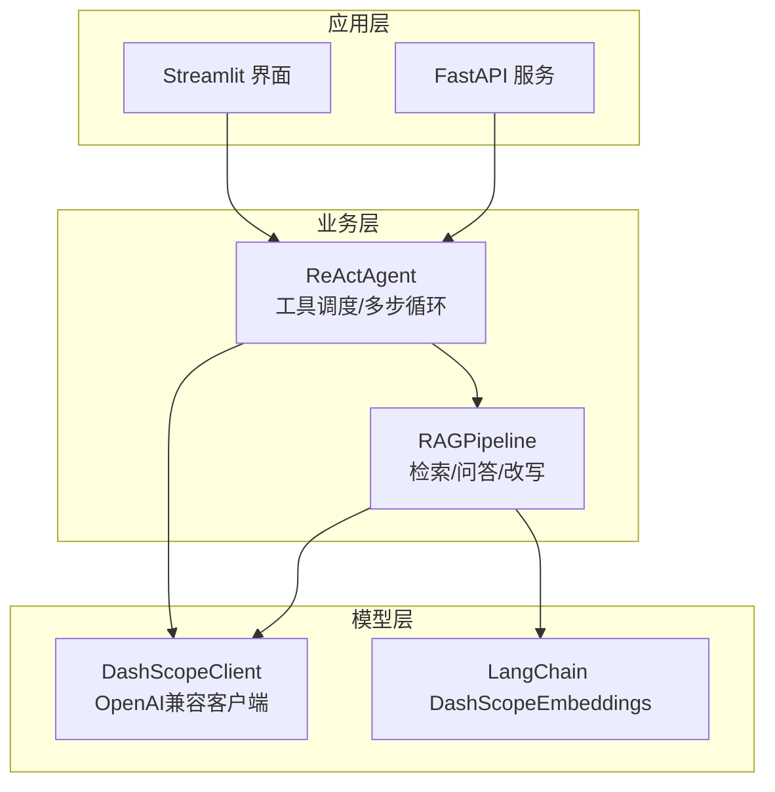
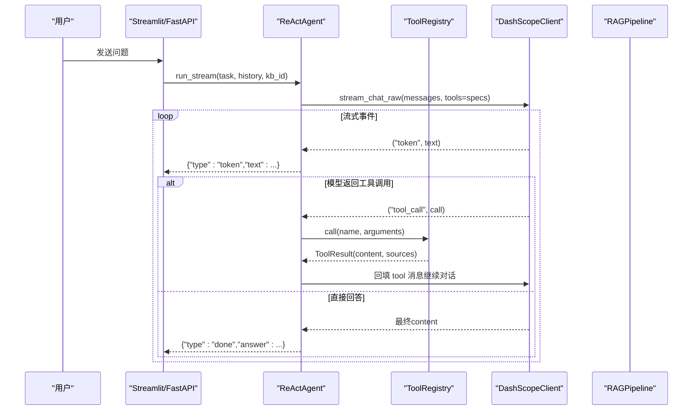
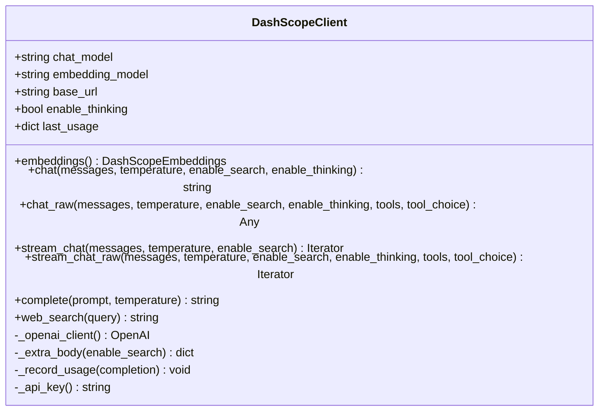
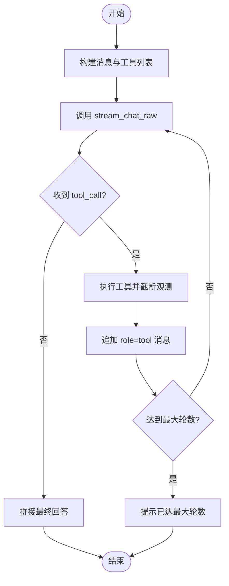
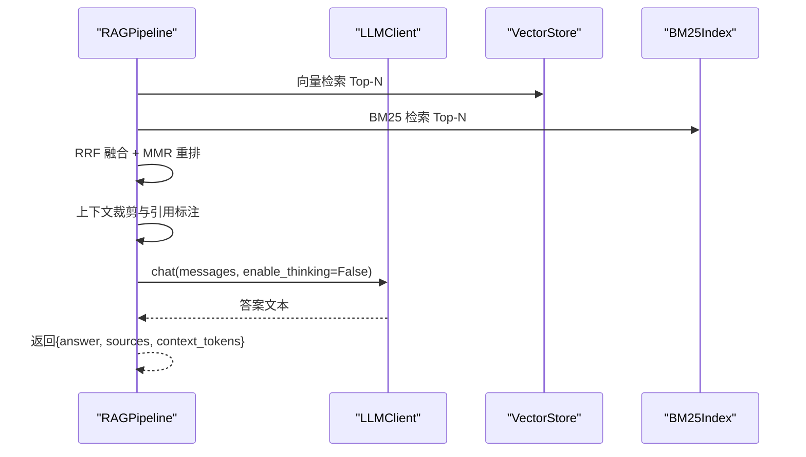
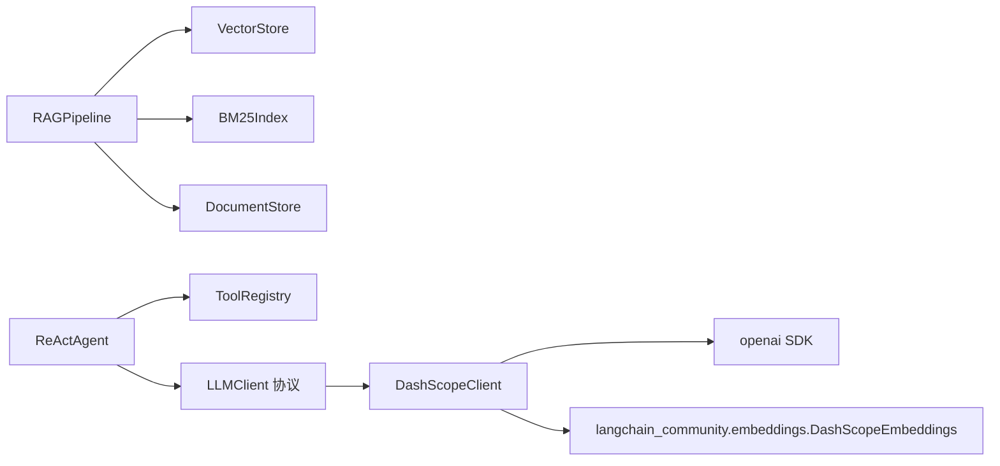

# LLM客户端模块

<cite>
**本文引用的文件**
- [llm_client.py](file://llm_client.py)
- [rag_pipeline.py](file://rag_pipeline.py)
- [react_agent.py](file://react_agent.py)
- [config.py](file://config.py)
- [api.py](file://api.py)
- [app.py](file://app.py)
</cite>

## 目录
1. [简介](#简介)
2. [项目结构](#项目结构)
3. [核心组件](#核心组件)
4. [架构总览](#架构总览)
5. [详细组件分析](#详细组件分析)
6. [依赖关系分析](#依赖关系分析)
7. [性能与可靠性](#性能与可靠性)
8. [故障排查指南](#故障排查指南)
9. [结论](#结论)
10. [附录：使用示例与集成要点](#附录使用示例与集成要点)

## 简介
本模块提供统一的LLM客户端封装，重点围绕 DashScopeClient 的设计与抽象接口展开。它基于 OpenAI 兼容接口对接百炼（DashScope），实现普通对话、流式输出、Function Calling（工具调用）、联网搜索与嵌入向量生成等能力；并通过 RAGPipeline 的 LLMClient 协议与 ReActAgent 解耦，便于替换不同LLM服务提供商或注入测试替身。文档同时说明错误处理、重试机制、API密钥管理、请求格式转换与响应解析，以及与 LangChain 的集成方式与扩展点。

## 项目结构
- llm_client.py：DashScopeClient 实现，统一封装 OpenAI 兼容客户端、Embedding、流式与非流式对话、Function Calling、联网搜索、用量记录与安全错误包装。
- rag_pipeline.py：RAG 管线门面，定义 LLMClient 协议（最小接口），并实现检索、问答、查询改写等逻辑；通过注入 LLMClient 实现厂商解耦。
- react_agent.py：基于 Function Calling 的轻量 Agent，负责工具注册表、多步循环与事件流输出；默认使用 DashScopeClient。
- config.py：集中配置项（数据路径、切分参数、检索阈值、Agent 最大步骤、Embedding 批大小等），支持环境变量覆盖。
- api.py：FastAPI 服务层，暴露知识库管理、文档上传、入库与问答等 REST API。
- app.py：Streamlit 单页应用，演示知识库管理与流式聊天交互。

图表来源
- [app.py:51-54](file://app.py#L51-L54)
- [api.py:52-57](file://api.py#L52-L57)
- [react_agent.py:144-157](file://react_agent.py#L144-L157)
- [rag_pipeline.py:196-219](file://rag_pipeline.py#L196-L219)
- [llm_client.py:22-86](file://llm_client.py#L22-L86)

章节来源
- [app.py:1-342](file://app.py#L1-L342)
- [api.py:1-204](file://api.py#L1-L204)
- [react_agent.py:1-567](file://react_agent.py#L1-L567)
- [rag_pipeline.py:1-792](file://rag_pipeline.py#L1-L792)
- [llm_client.py:1-322](file://llm_client.py#L1-L322)
- [config.py:1-113](file://config.py#L1-L113)

## 核心组件
- DashScopeClient：统一封装百炼 OpenAI 兼容接口，提供 chat/chat_raw/stream_chat/stream_chat_raw/embeddings/web_search 等方法；内置 API Key 校验、base_url 校验、超时与重试、token 用量记录与安全错误包装。
- RAGPipeline.LLMClient 协议：定义最小 LLM 接口（chat/chat_raw/stream_chat/stream_chat_raw/web_search/embeddings），使 RAG/Agent 与具体厂商解耦，便于替换或测试。
- ReActAgent：基于 Function Calling 的工具调度器，将工具以 JSON Schema 形式交给模型，自动执行并回填结果，支持流式 token 输出与执行轨迹记录。
- AppConfig：集中化配置，所有可调参数从环境变量读取，带默认值与范围限制。

章节来源
- [llm_client.py:22-299](file://llm_client.py#L22-L299)
- [rag_pipeline.py:81-132](file://rag_pipeline.py#L81-L132)
- [react_agent.py:93-142](file://react_agent.py#L93-L142)
- [config.py:56-113](file://config.py#L56-L113)

## 架构总览
DashScopeClient 作为底层适配层，屏蔽了百炼 OpenAI 兼容接口的细节；上层 RAGPipeline 与 ReActAgent 仅依赖 LLMClient 协议，从而可无缝替换为其他兼容厂商或测试替身。Agent 通过工具注册表声明工具能力，由模型决定调用时机与参数，形成“思考-行动-观察”的多步循环。

图表来源
- [react_agent.py:272-369](file://react_agent.py#L272-L369)
- [llm_client.py:203-278](file://llm_client.py#L203-L278)
- [rag_pipeline.py:590-666](file://rag_pipeline.py#L590-L666)

## 详细组件分析

### DashScopeClient 设计与实现
- 初始化与配置
  - 从环境变量读取模型名、Embedding 模型、base_url、是否启用深度思考；提供默认值，确保开箱即用。
  - base_url 必须指向 OpenAI 兼容端点（以 /compatible-mode/v1 结尾），否则抛出运行时错误。
- API Key 管理
  - 通过 _api_key() 强制从环境变量读取 DASHSCOPE_API_KEY，未配置时立即报错，避免静默失败。
- 客户端创建与重试
  - _openai_client() 每次创建新的 OpenAI 实例，设置超时与 max_retries=2，降低连接状态污染风险。
- 普通对话
  - chat()：非流式，返回最终文本；内部构建 extra_body（enable_thinking/enable_search），校验返回值并记录 token 用量。
- 原始消息与 Function Calling
  - chat_raw()：返回完整 message 对象（含 tool_calls），供 Agent 工具循环使用；当 tool_calls 为空表示模型已给出最终回答。
- 流式对话
  - stream_chat()：按增量产出 (event_type, content)，区分 reasoning 与 content，适合展示“思考过程+答案”。
- 流式 Function Calling
  - stream_chat_raw()：边到边产出 token 与 tool_call；tool_calls 以增量帧到达，按 index 累积并在流结束后统一产出，保证语义完整性。
- 联网搜索
  - web_search()：通过 enable_search=True 触发百炼联网搜索能力，上层 Agent 可据此降级或增强回答。
- 嵌入向量
  - embeddings()：返回 LangChain DashScopeEmbeddings 实例，用于向量化文档片段。
- 错误处理
  - 统一捕获外部异常并转换为 RuntimeError，附带 model/base_url 信息；提供 safe_error() 对 UI 隐藏冗长堆栈。

图表来源
- [llm_client.py:22-299](file://llm_client.py#L22-L299)

章节来源
- [llm_client.py:22-299](file://llm_client.py#L22-L299)

### ReActAgent 与工具调度
- 工具注册表
  - ToolRegistry 维护工具名称、描述、JSON Schema 参数与函数实现；提供 specs() 生成 OpenAI tools 格式，call() 按名调用并捕获异常。
- 内置工具
  - search_knowledge_base：调用 RAGPipeline.answer 获取带引用来源的回答。
  - search_web：调用 DashScopeClient.web_search 进行联网搜索。
  - get_weather：调用 Open-Meteo 免费天气接口。
  - query_database：只读 SQLite 查询（SELECT/PRAGMA/EXPLAIN/WITH），防止写入。
- 主流程
  - run()/run_stream()：构建 messages，传入 tools，循环接收流式事件；若无 tool_calls 则直接输出回答；若有则执行工具并将结果回填为 role=tool 的消息，直到达到最大步骤或模型给出最终回答。
- 流式输出
  - 以事件字典序列呈现 tool_start/tool_end/step/token/done/error，UI 可逐帧渲染，首字延迟低。

图表来源
- [react_agent.py:272-369](file://react_agent.py#L272-L369)
- [react_agent.py:165-246](file://react_agent.py#L165-L246)

章节来源
- [react_agent.py:93-142](file://react_agent.py#L93-L142)
- [react_agent.py:165-246](file://react_agent.py#L165-L246)
- [react_agent.py:272-369](file://react_agent.py#L272-L369)

### RAGPipeline 与 LLMClient 协议
- 协议设计
  - LLMClient 协议定义了 chat/chat_raw/stream_chat/stream_chat_raw/web_search/embeddings 等最小接口，使 RAG/Agent 不耦合具体厂商。
- 问答流程
  - answer()：混合检索 Top-k 后组装上下文，调用 llm.chat 生成带引用回答；无知识库时走 chat() 通用模式。
  - rewrite_query()：多轮对话时将追问题改写为独立问题，失败回退原问题。
- 检索策略
  - 向量检索 + BM25 词面检索，RRF 融合，可选 MMR 去重；相关性门槛过滤低相关查询；支持按文档限定检索范围。
- 上下文裁剪
  - truncate_history()/fit_context_indices() 控制历史与上下文长度，避免注意力稀释与超预算。

图表来源
- [rag_pipeline.py:439-523](file://rag_pipeline.py#L439-L523)
- [rag_pipeline.py:590-666](file://rag_pipeline.py#L590-L666)
- [rag_pipeline.py:81-132](file://rag_pipeline.py#L81-L132)

章节来源
- [rag_pipeline.py:81-132](file://rag_pipeline.py#L81-L132)
- [rag_pipeline.py:439-523](file://rag_pipeline.py#L439-L523)
- [rag_pipeline.py:590-666](file://rag_pipeline.py#L590-L666)

### 配置与环境变量
- 集中配置
  - AppConfig.from_env() 从环境变量加载运行参数，包括 chunk_size/chunk_overlap/top_k/fusion_pool/relevance_threshold/mmr_enabled/mmr_lambda/query_rewrite_enabled/history_max_tokens/rag_context_max_tokens/agent_max_steps/embedding_batch_size 等。
- 安全与健壮性
  - 数值型参数具备类型转换与范围钳制；路径解析支持相对/绝对路径；冻结 dataclass 防止运行时意外修改。

章节来源
- [config.py:21-54](file://config.py#L21-L54)
- [config.py:56-113](file://config.py#L56-L113)

## 依赖关系分析
- DashScopeClient 依赖 openai SDK 与 langchain_community.embeddings.DashScopeEmbeddings，通过环境变量注入密钥与端点。
- RAGPipeline 依赖 VectorStore、BM25Index、DocumentStore、ingestion 等组件，并通过 LLMClient 协议与具体实现解耦。
- ReActAgent 依赖 ToolRegistry 与 LLMClient，默认注入 DashScopeClient；也可注入 FakeLLMClient 进行测试。
- api.py/app.py 作为入口层，组合 RAGPipeline 与 ReActAgent 对外提供服务。

图表来源
- [llm_client.py:10-12](file://llm_client.py#L10-L12)
- [rag_pipeline.py:27-38](file://rag_pipeline.py#L27-L38)
- [react_agent.py:27-29](file://react_agent.py#L27-L29)

章节来源
- [llm_client.py:10-12](file://llm_client.py#L10-L12)
- [rag_pipeline.py:27-38](file://rag_pipeline.py#L27-L38)
- [react_agent.py:27-29](file://react_agent.py#L27-L29)

## 性能与可靠性
- 流式输出
  - stream_chat/stream_chat_raw 以增量事件推送，显著降低首字延迟；stream_chat_raw 在工具调用场景下先累积再统一产出，保证 tool_calls 完整性。
- 重试与超时
  - OpenAI 客户端设置 timeout=90.0、max_retries=2，提升网络抖动下的鲁棒性。
- Token 用量记录
  - 非流式与非流式 raw 调用记录 usage；流式调用在包含 usage 的 chunk 中更新 last_usage，便于 UI 展示实际输入/输出 token。
- 上下文裁剪
  - 历史与上下文按 token 预算裁剪，避免超长上下文导致注意力分散与计费浪费。
- 检索质量
  - 向量+BM25 双路检索，RRF 融合与 MMR 去重，结合相关性阈值与文档限定，提高召回与精准度。

[本节为通用性能讨论，不直接分析具体代码行]

## 故障排查指南
- 常见错误与定位
  - 未配置 API Key：_api_key() 会抛出运行时错误，提示复制 .env.example 并填写有效密钥。
  - base_url 格式错误：必须以 /compatible-mode/v1 结尾，否则抛出运行时错误。
  - 流式调用失败：stream_chat/stream_chat_raw 捕获异常并包装为 RuntimeError，附带 model/base_url 信息。
  - 工具执行失败：ToolRegistry.call() 捕获异常并返回 ToolResult(content=f"工具执行失败：{safe_error(exc)}")，让模型有机会重试或直接回答。
  - 数据库只读保护：query_database 仅允许 SELECT/PRAGMA/EXPLAIN/WITH，写入语句会被拒绝。
- 调试建议
  - 使用 safe_error() 获取简洁错误信息，避免 UI 显示冗长堆栈。
  - 检查 AppConfig 中的 agent_max_steps、relevance_threshold、mmr_enabled 等参数，调整检索与循环行为。
  - 在本地通过 __main__ 或单元测试验证流式输出与工具调用链路。

章节来源
- [llm_client.py:60-86](file://llm_client.py#L60-L86)
- [llm_client.py:172-201](file://llm_client.py#L172-L201)
- [llm_client.py:203-278](file://llm_client.py#L203-L278)
- [react_agent.py:130-142](file://react_agent.py#L130-L142)
- [react_agent.py:443-470](file://react_agent.py#L443-L470)

## 结论
本模块通过 DashScopeClient 提供了稳定、可扩展的 LLM 客户端封装，并以 LLMClient 协议实现了与 RAG/Agent 的解耦。其流式输出、Function Calling、联网搜索与嵌入向量能力覆盖了企业级智能助手的核心需求；配合 RAGPipeline 的混合检索与上下文裁剪，以及 ReActAgent 的工具调度与事件流，形成了高可用、高性能、易扩展的整体方案。通过环境变量与集中配置，部署与调优便捷；通过错误处理与重试机制，提升了鲁棒性。

[本节为总结性内容，不直接分析具体代码行]

## 附录：使用示例与集成要点

- 普通对话
  - 使用 DashScopeClient.chat() 或 RAGPipeline.chat() 进行非流式问答；可通过 enable_thinking 控制是否启用深度思考。
  - 参考路径：[llm_client.py:94-127](file://llm_client.py#L94-L127)、[rag_pipeline.py:668-696](file://rag_pipeline.py#L668-L696)

- 流式输出
  - 使用 DashScopeClient.stream_chat() 获取 reasoning/content 事件；或使用 stream_chat_raw() 获取 token/tool_call 事件。
  - 参考路径：[llm_client.py:172-201](file://llm_client.py#L172-L201)、[llm_client.py:203-278](file://llm_client.py#L203-L278)

- 工具调用（Function Calling）
  - 在 ReActAgent 中注册工具，通过 stream_chat_raw() 接收 tool_call 事件，执行工具后将结果回填为 role=tool 消息，直至模型给出最终回答。
  - 参考路径：[react_agent.py:165-246](file://react_agent.py#L165-L246)、[react_agent.py:272-369](file://react_agent.py#L272-L369)

- 嵌入向量生成
  - 通过 DashScopeClient.embeddings() 获取 DashScopeEmbeddings 实例，用于文档切片后的向量化。
  - 参考路径：[llm_client.py:68-73](file://llm_client.py#L68-L73)、[rag_pipeline.py:210-214](file://rag_pipeline.py#L210-L214)

- 与 LangChain 的集成
  - 使用 langchain_community.embeddings.DashScopeEmbeddings 完成嵌入；通过 LLMClient 协议将 DashScopeClient 注入 RAGPipeline/ReActAgent，实现厂商无关。
  - 参考路径：[llm_client.py:10-12](file://llm_client.py#L10-L12)、[rag_pipeline.py:81-132](file://rag_pipeline.py#L81-L132)

- 与 FastAPI/Streamlit 的集成
  - api.py 暴露 REST 接口，app.py 提供交互式界面；两者均组合 RAGPipeline 与 ReActAgent，支持流式事件渲染与引用来源展示。
  - 参考路径：[api.py:52-57](file://api.py#L52-L57)、[app.py:51-54](file://app.py#L51-L54)、[app.py:293-341](file://app.py#L293-L341)

- 环境变量与配置
  - 必需：DASHSCOPE_API_KEY、可选：DASHSCOPE_CHAT_MODEL/DASHSCOPE_EMBEDDING_MODEL/DASHSCOPE_BASE_URL/DASHSCOPE_ENABLE_THINKING；AppConfig 提供大量可调参数。
  - 参考路径：[llm_client.py:31-46](file://llm_client.py#L31-L46)、[config.py:90-113](file://config.py#L90-L113)

[本节为使用指引，不直接分析具体代码行]