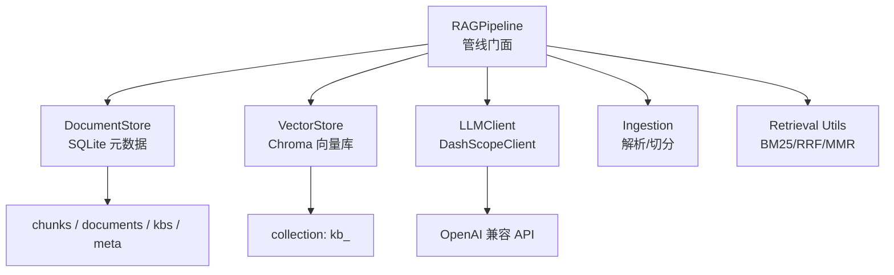
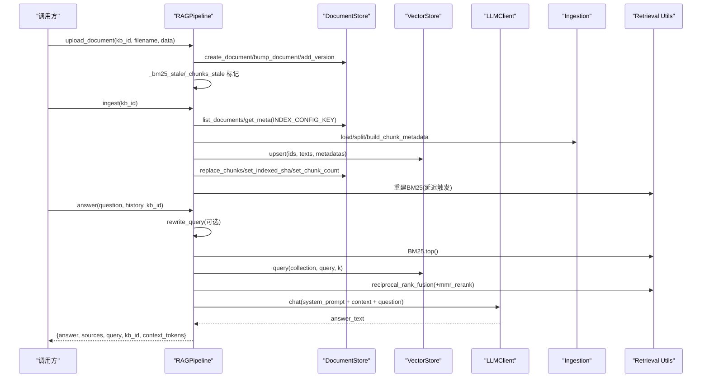
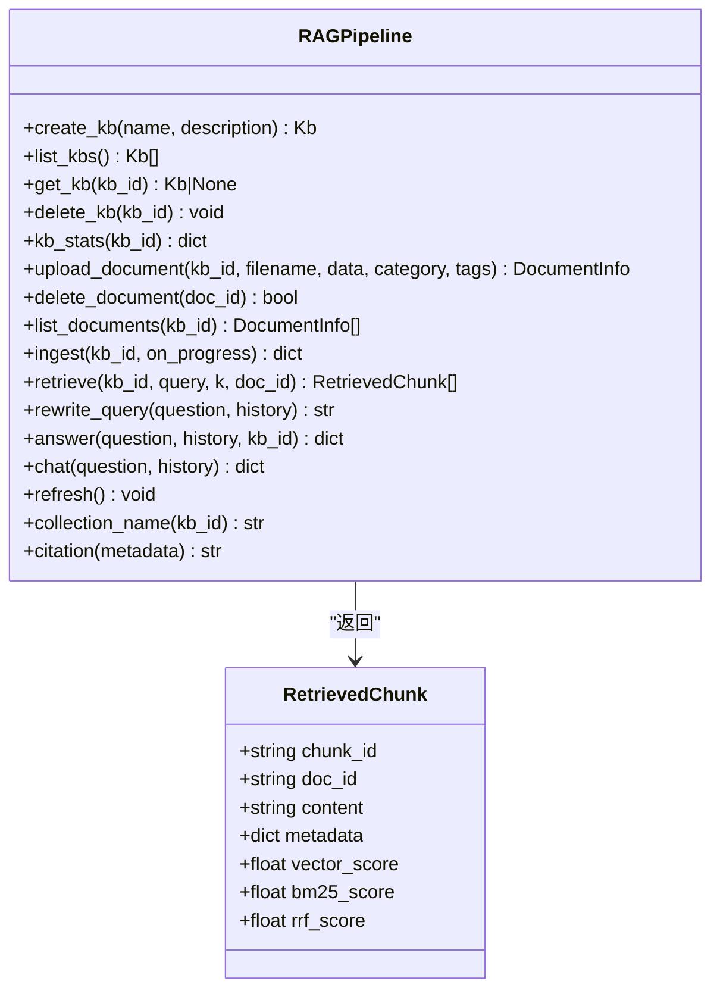
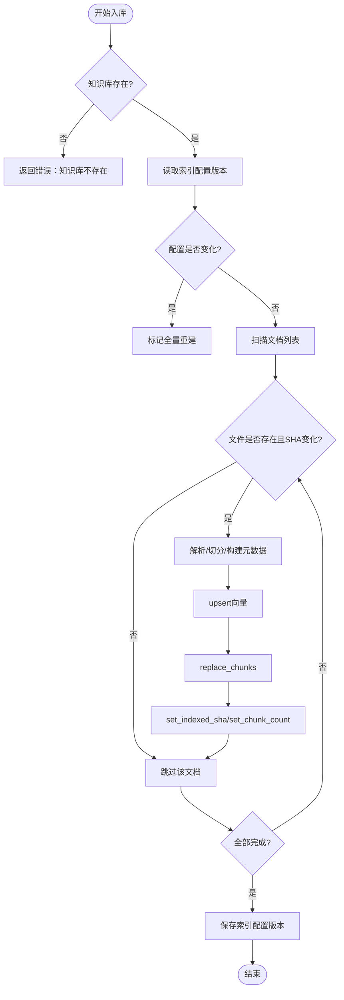
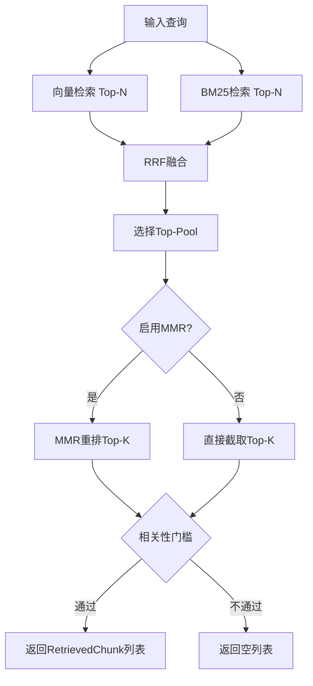
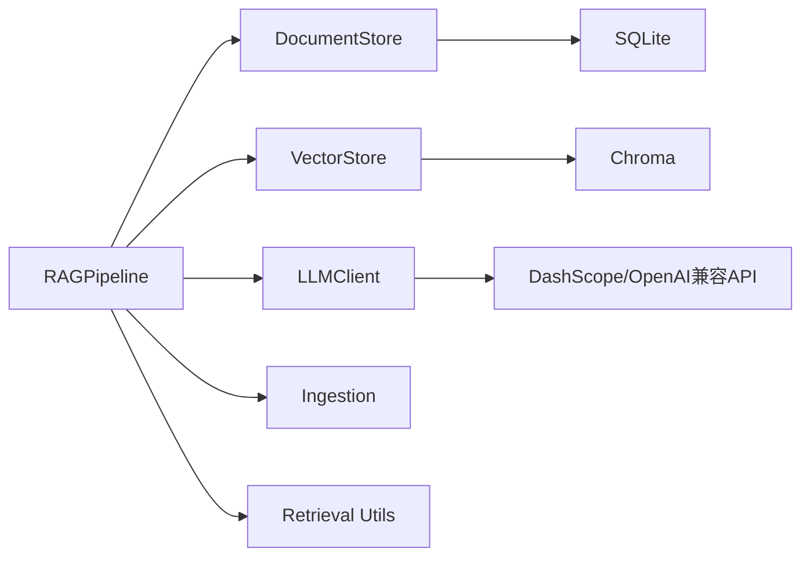

# RAG管线模块

<cite>
**本文引用的文件**
- [rag_pipeline.py](file://rag_pipeline.py)
- [store.py](file://store.py)
- [vector_store.py](file://vector_store.py)
- [llm_client.py](file://llm_client.py)
- [config.py](file://config.py)
- [ingestion.py](file://ingestion.py)
- [utils/retrieval.py](file://utils/retrieval.py)
- [tests/test_rag_answer.py](file://tests/test_rag_answer.py)
- [tests/test_ingestion.py](file://tests/test_ingestion.py)
</cite>

## 目录
1. [简介](#简介)
2. [项目结构](#项目结构)
3. [核心组件](#核心组件)
4. [架构总览](#架构总览)
5. [详细组件分析](#详细组件分析)
6. [依赖关系分析](#依赖关系分析)
7. [性能考量](#性能考量)
8. [故障排查指南](#故障排查指南)
9. [结论](#结论)
10. [附录：使用示例与最佳实践](#附录使用示例与最佳实践)

## 简介
本模块提供面向企业文档的检索增强生成（RAG）管线，围绕 RAGPipeline 类实现知识库管理、文档上传与版本控制、增量入库、混合检索（向量+BM25）、查询改写、多轮对话问答以及带引用来源的回答。其设计强调可配置、可扩展与健壮性：通过 SQLite 持久化元数据、Chroma 存储向量、BM25 词面索引、可选 MMR 去重，以及与 LLM 客户端解耦的协议抽象，便于替换或测试。

## 项目结构
- 管线门面与业务编排：rag_pipeline.py
- 元数据存储：store.py（SQLite，知识库/文档/片段/版本/键值配置）
- 向量存储：vector_store.py（Chroma，按知识库隔离 collection）
- LLM 客户端：llm_client.py（DashScope OpenAI 兼容接口，统一安全封装）
- 配置中心：config.py（集中环境变量参数）
- 解析与切分：ingestion.py（PDF/Word/Markdown/TXT，OCR回退，文本质量评估）
- 混合检索工具：utils/retrieval.py（中文分词、BM25、RRF融合、MMR重排）
- 测试用例：tests/*（覆盖问答、阈值、改写、来源限定、解析质量等）

图表来源
- [rag_pipeline.py:196-752](file://rag_pipeline.py#L196-L752)
- [store.py:123-470](file://store.py#L123-L470)
- [vector_store.py:38-148](file://vector_store.py#L38-L148)
- [llm_client.py:22-294](file://llm_client.py#L22-L294)
- [ingestion.py:24-216](file://ingestion.py#L24-L216)
- [utils/retrieval.py:48-148](file://utils/retrieval.py#L48-L148)

章节来源
- [rag_pipeline.py:1-792](file://rag_pipeline.py#L1-L792)
- [store.py:1-470](file://store.py#L1-L470)
- [vector_store.py:1-255](file://vector_store.py#L1-L255)
- [llm_client.py:1-322](file://llm_client.py#L1-L322)
- [config.py:1-113](file://config.py#L1-L113)
- [ingestion.py:1-216](file://ingestion.py#L1-L216)
- [utils/retrieval.py:1-148](file://utils/retrieval.py#L1-L148)

## 核心组件
- RAGPipeline：知识库管理、文档上传/删除、增量入库、混合检索、查询改写、问答与聊天。
- DocumentStore：SQLite 持久化知识库、文档、版本、片段与元配置；支持软删除与并发安全。
- VectorStore：Chroma 向量库封装，按知识库隔离 collection，支持批量 upsert、条件删除、相似度查询、取回向量。
- DashScopeClient：统一调用大模型与嵌入，流式与非流式接口，错误安全包装。
- AppConfig：集中化配置，所有可调参数来自环境变量，冻结对象避免运行时篡改。
- Ingestion：文档解析与切分，PDF OCR 回退，文本质量评估，构建片段元数据。
- Retrieval Utils：中文分词、BM25 索引、RRF 融合、MMR 去重重排。

章节来源
- [rag_pipeline.py:196-752](file://rag_pipeline.py#L196-L752)
- [store.py:123-470](file://store.py#L123-L470)
- [vector_store.py:38-148](file://vector_store.py#L38-L148)
- [llm_client.py:22-294](file://llm_client.py#L22-L294)
- [config.py:56-113](file://config.py#L56-L113)
- [ingestion.py:24-216](file://ingestion.py#L24-L216)
- [utils/retrieval.py:34-148](file://utils/retrieval.py#L34-L148)

## 架构总览
RAGPipeline 作为门面协调各层：
- 入库流程：upload_document → ingest（解析/切分/向量化/更新 BM25/片段记录）→ 更新 indexed_sha 与 chunk_count。
- 检索流程：retrieve（向量 Top-N + BM25 Top-N → RRF 融合 → 可选 MMR 重排 → 相关性门槛过滤）。
- 问答流程：answer（可选 query rewrite → retrieve → 上下文裁剪 → 组装 prompt → LLM 回答 → 生成 citation）。

图表来源
- [rag_pipeline.py:260-435](file://rag_pipeline.py#L260-L435)
- [rag_pipeline.py:439-523](file://rag_pipeline.py#L439-L523)
- [rag_pipeline.py:590-666](file://rag_pipeline.py#L590-L666)
- [ingestion.py:24-216](file://ingestion.py#L24-L216)
- [vector_store.py:61-126](file://vector_store.py#L61-L126)
- [utils/retrieval.py:48-148](file://utils/retrieval.py#L48-L148)
- [llm_client.py:94-127](file://llm_client.py#L94-L127)

## 详细组件分析

### RAGPipeline 设计与核心功能
- 知识库管理
  - 创建/列出/获取/删除知识库；删除时清理元数据、向量集合、物理文件目录与缓存。
  - 统计：返回文档数、片段总数、向量数量。
- 文档上传与版本控制
  - 同名文件自动升版本，旧版本物理文件保留；登记 SHA-256、大小、路径。
  - 删除文档为软删除，保留历史以便审计恢复。
- 增量入库机制
  - 基于 indexed_sha 判重：仅处理新增或内容变化的文件。
  - 索引配置变更检测：chunk_size、chunk_overlap、embedding_model、parser_version 变化时全量重建。
  - 失败重试友好：先写新向量再清理旧片段 id，indexed_sha 未更新则下次继续。
- 混合检索算法
  - 向量检索（余弦相似度）与 BM25 词面检索并行，RRF 融合排序。
  - 可选 MMR 重排提升多样性；相关性阈值过滤低相关结果。
  - 来源提示：根据文件名/人物短名自动限定检索范围，减少无关片段污染。
- 查询改写与多轮对话
  - 基于最近两轮历史进行独立问题改写；失败或异常长度时退回原问题。
  - 历史截断：按 token 预算从后往前保留，避免长上下文稀释注意力。
- 问答与引用生成
  - 组装系统提示与用户提示，限制思考模式以降低首字延迟。
  - 上下文块按 token 预算裁剪，保留前若干块。
  - citation 生成：基于片段元数据的 source + page/paragraph 定位。

图表来源
- [rag_pipeline.py:134-145](file://rag_pipeline.py#L134-L145)
- [rag_pipeline.py:196-752](file://rag_pipeline.py#L196-L752)

章节来源
- [rag_pipeline.py:223-256](file://rag_pipeline.py#L223-L256)
- [rag_pipeline.py:260-303](file://rag_pipeline.py#L260-L303)
- [rag_pipeline.py:306-435](file://rag_pipeline.py#L306-L435)
- [rag_pipeline.py:439-523](file://rag_pipeline.py#L439-L523)
- [rag_pipeline.py:566-588](file://rag_pipeline.py#L566-L588)
- [rag_pipeline.py:590-666](file://rag_pipeline.py#L590-L666)
- [rag_pipeline.py:775-782](file://rag_pipeline.py#L775-L782)

### 知识库管理与存储层集成
- 表结构：kbs、documents、document_versions、chunks、meta。
- 并发安全：WAL 模式 + busy_timeout + RLock 保护写事务。
- 版本与软删除：同一文件名重传递增版本；删除文档仅软删并清空片段。
- 增量入库配合：set_indexed_sha 记录已索引内容哈希；replace_chunks 原子替换片段。

图表来源
- [rag_pipeline.py:306-435](file://rag_pipeline.py#L306-L435)
- [store.py:214-354](file://store.py#L214-L354)

章节来源
- [store.py:31-77](file://store.py#L31-L77)
- [store.py:123-155](file://store.py#L123-L155)
- [store.py:158-210](file://store.py#L158-L210)
- [store.py:214-354](file://store.py#L214-L354)
- [store.py:386-442](file://store.py#L386-L442)

### 文档解析与切分
- 支持 PDF/DOCX/MD/TXT；PDF 逐页质量评估，低于阈值走本地 OCR（PyMuPDF + RapidOCR）。
- 递归字符切分器按段落/句子边界切分，保留 page 等元数据。
- 构建片段元数据：source、page（1 起）、paragraph、doc_id、kb_id、category、tags。

章节来源
- [ingestion.py:17-21](file://ingestion.py#L17-L21)
- [ingestion.py:24-78](file://ingestion.py#L24-L78)
- [ingestion.py:80-102](file://ingestion.py#L80-L102)
- [ingestion.py:104-150](file://ingestion.py#L104-L150)
- [ingestion.py:178-216](file://ingestion.py#L178-L216)

### 混合检索算法（向量+BM25的RRF融合、MMR去重）
- 向量检索：余弦相似度，top-k 候选。
- BM25 检索：中文分词（jieba），英文/数字按单词切分；兜底重叠计数应对小语料 IDF=0。
- RRF 融合：对两份排名列表按 1/(k+rank) 加权合并，无需分数可比。
- MMR 重排：在“与查询相似度”和“彼此不重复”之间平衡，lambda 控制多样性权重。
- 相关性门槛：若向量最高分低于阈值且无 BM25 命中，视为无相关内容。

图表来源
- [rag_pipeline.py:439-523](file://rag_pipeline.py#L439-L523)
- [utils/retrieval.py:48-148](file://utils/retrieval.py#L48-L148)

章节来源
- [utils/retrieval.py:34-95](file://utils/retrieval.py#L34-L95)
- [utils/retrieval.py:97-148](file://utils/retrieval.py#L97-L148)
- [rag_pipeline.py:439-523](file://rag_pipeline.py#L439-L523)

### 查询改写与多轮对话处理
- 改写策略：仅看最近两轮历史，构造独立问题；失败或过长时退回原问题。
- 历史截断：按 token 预算从后往前保留，至少保留最后一条。
- 问答流程：若无知识库或无需检索，走普通聊天；否则组装 RAG 提示并生成带引用回答。

章节来源
- [rag_pipeline.py:159-193](file://rag_pipeline.py#L159-L193)
- [rag_pipeline.py:566-588](file://rag_pipeline.py#L566-L588)
- [rag_pipeline.py:590-666](file://rag_pipeline.py#L590-L666)
- [rag_pipeline.py:668-696](file://rag_pipeline.py#L668-L696)

### RetrievedChunk 数据结构与引用生成机制
- RetrievedChunk：包含 chunk_id、doc_id、content、metadata、vector_score、bm25_score、rrf_score，便于观察检索效果。
- 引用生成：citation 由 metadata.source 与 page/paragraph 组成，用于标注答案来源。

章节来源
- [rag_pipeline.py:134-145](file://rag_pipeline.py#L134-L145)
- [rag_pipeline.py:775-782](file://rag_pipeline.py#L775-L782)

### 与存储层、LLM客户端的集成方式
- 存储层：DocumentStore 负责知识库、文档、版本、片段与元配置；RAGPipeline 通过它进行增删改查与统计。
- 向量层：VectorStore 按知识库隔离 collection，支持批量 upsert、条件删除、相似度查询、取回向量（用于 MMR）。
- LLM 客户端：LLMClient 协议抽象，默认 DashScopeClient；支持 chat、stream_chat、web_search、embeddings；错误安全包装 safe_error。

章节来源
- [store.py:123-470](file://store.py#L123-L470)
- [vector_store.py:38-148](file://vector_store.py#L38-L148)
- [llm_client.py:22-294](file://llm_client.py#L22-L294)
- [rag_pipeline.py:196-219](file://rag_pipeline.py#L196-L219)

## 依赖关系分析
- RAGPipeline 依赖：
  - store.DocumentStore：知识库/文档/片段/版本/元配置。
  - vector_store.VectorStore：向量检索与重排所需向量。
  - llm_client.LLMClient：问答、查询改写、嵌入。
  - ingestion.DocumentParser：解析与切分。
  - utils.retrieval：BM25Index、reciprocal_rank_fusion、mmr_rerank。
- 配置集中：AppConfig 提供所有可调参数，影响切分、检索、重排、上下文裁剪等。

图表来源
- [rag_pipeline.py:196-219](file://rag_pipeline.py#L196-L219)
- [store.py:123-155](file://store.py#L123-L155)
- [vector_store.py:38-59](file://vector_store.py#L38-L59)
- [llm_client.py:22-86](file://llm_client.py#L22-L86)

章节来源
- [rag_pipeline.py:196-219](file://rag_pipeline.py#L196-L219)
- [config.py:56-113](file://config.py#L56-L113)

## 性能考量
- 向量批处理：embedding_batch_size 限制单次请求条数，避免超出模型限制。
- 上下文裁剪：fit_context_indices 按 token 预算保留前若干块，降低 LLM 输入成本。
- 历史截断：truncate_history 仅保留最近且放得下的消息，减少 token 消耗。
- 混合检索优化：fusion_pool 扩大候选池，RRF 融合鲁棒；MMR 提升多样性但增加计算。
- 增量入库：indexed_sha 判重避免重复向量化；配置变更检测触发全量重建，保证一致性。
- 并发安全：SQLite WAL + busy_timeout + RLock 保障多线程写入安全。

[本节为通用性能建议，不直接分析具体文件]

## 故障排查指南
- 未配置密钥：DashScopeClient 会抛出明确错误，检查 .env 中的 DASHSCOPE_API_KEY 等。
- 不支持的文件类型：upload_document 会拒绝非法后缀；确认文件扩展名在 SUPPORTED_SUFFIXES。
- PDF 无法识别：若文本不可读且本地 OCR 依赖缺失，将抛出 RuntimeError；安装 pymupdf、rapidocr、onnxruntime。
- 检索结果为空：可能因相关性阈值过高或无 BM25 命中；调整 relevance_threshold 或 fusion_pool。
- 问答服务不可用：answer/chat 捕获异常并返回安全错误信息；检查网络与模型端点。

章节来源
- [llm_client.py:59-66](file://llm_client.py#L59-L66)
- [ingestion.py:124-150](file://ingestion.py#L124-L150)
- [rag_pipeline.py:260-273](file://rag_pipeline.py#L260-L273)
- [rag_pipeline.py:439-486](file://rag_pipeline.py#L439-L486)
- [rag_pipeline.py:590-666](file://rag_pipeline.py#L590-L666)

## 结论
RAGPipeline 提供了完整的企业级 RAG 能力：多知识库隔离、文档版本控制、增量入库、混合检索与引用生成。通过配置化与模块化设计，系统在准确性、效率与可维护性之间取得平衡。结合测试用例，可验证问答正确性、阈值行为、来源限定与解析质量。

[本节为总结性内容，不直接分析具体文件]

## 附录：使用示例与最佳实践

### 基本用法流程
- 初始化管线与配置：
  - 通过 AppConfig.from_env() 加载环境变量；设置 CHUNK_SIZE、CHUNK_OVERLAP、RETRIEVAL_TOP_K、RETRIEVAL_FUSION_POOL、RETRIEVAL_RELEVANCE_THRESHOLD、RETRIEVAL_MMR_ENABLED、RETRIEVAL_MMR_LAMBDA、QUERY_REWRITE_ENABLED、HISTORY_MAX_TOKENS、RAG_CONTEXT_MAX_TOKENS、EMBEDDING_BATCH_SIZE 等。
- 创建知识库与上传文档：
  - pipeline.create_kb(...) 创建知识库；pipeline.upload_document(...) 上传文件，同名自动升版本。
- 执行入库：
  - pipeline.ingest(kb_id, on_progress) 增量入库；首次或配置变更时全量重建。
- 检索与问答：
  - pipeline.retrieve(kb_id, query, k) 混合检索；pipeline.answer(question, history, kb_id) 生成带引用回答。
- 查看统计与刷新：
  - pipeline.kb_stats(kb_id) 统计；pipeline.refresh() 后台入库完成后刷新缓存。

章节来源
- [config.py:89-113](file://config.py#L89-L113)
- [rag_pipeline.py:223-256](file://rag_pipeline.py#L223-L256)
- [rag_pipeline.py:260-303](file://rag_pipeline.py#L260-L303)
- [rag_pipeline.py:306-435](file://rag_pipeline.py#L306-L435)
- [rag_pipeline.py:439-523](file://rag_pipeline.py#L439-L523)
- [rag_pipeline.py:590-666](file://rag_pipeline.py#L590-L666)
- [rag_pipeline.py:720-728](file://rag_pipeline.py#L720-L728)

### 错误处理建议
- 捕获 safe_error 输出，隐藏堆栈但保留原因。
- 对 PDF OCR 缺失依赖提前安装，避免运行时报错。
- 对检索为空的情况提示用户调整问法或补充资料。

章节来源
- [llm_client.py:297-299](file://llm_client.py#L297-L299)
- [ingestion.py:124-150](file://ingestion.py#L124-L150)
- [rag_pipeline.py:590-666](file://rag_pipeline.py#L590-L666)

### 性能优化建议
- 合理设置 embedding_batch_size 与 fusion_pool，平衡吞吐与召回。
- 开启 MMR 以提升多样性，但注意计算开销。
- 调整 relevance_threshold 与 rag_context_max_tokens，控制召回严格度与上下文长度。
- 使用增量入库避免重复向量化，关注 indexed_sha 与配置版本。

章节来源
- [config.py:95-112](file://config.py#L95-L112)
- [rag_pipeline.py:306-435](file://rag_pipeline.py#L306-L435)
- [rag_pipeline.py:439-523](file://rag_pipeline.py#L439-L523)

### 测试参考
- 问答与引用：验证 sources 存在与 citation 包含文件名。
- 阈值拦截：无关查询应返回空 sources 与提示信息。
- 查询改写：有历史时改写成功，无历史时退回原问题。
- 多知识库隔离：不同知识库的 chunks 与文档计数独立。
- 来源提示：文件名/人物短名匹配限定检索范围。
- 解析质量：中文可读性与乱码检测阈值有效。

章节来源
- [tests/test_rag_answer.py:15-113](file://tests/test_rag_answer.py#L15-L113)
- [tests/test_ingestion.py:10-64](file://tests/test_ingestion.py#L10-L64)