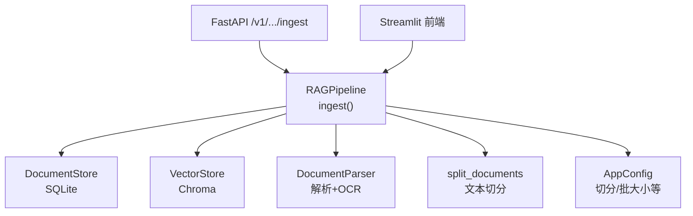
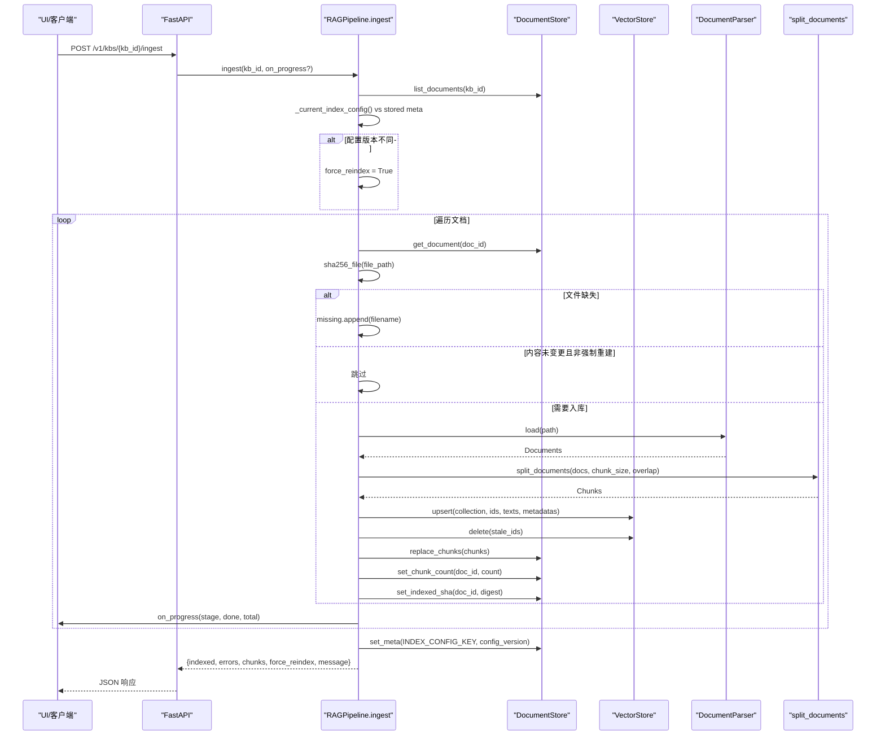
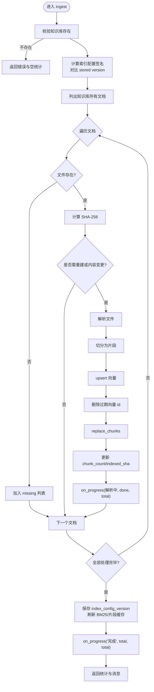
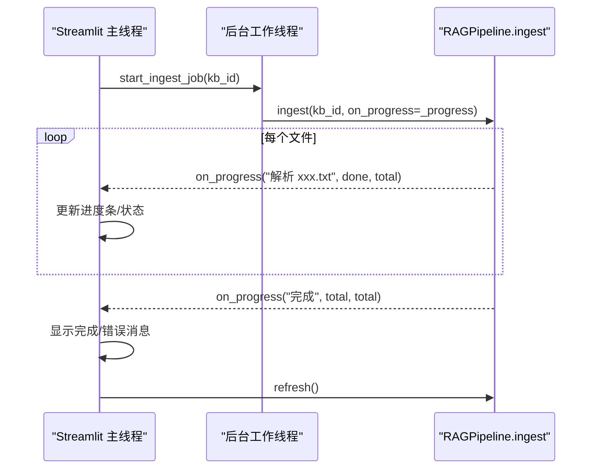
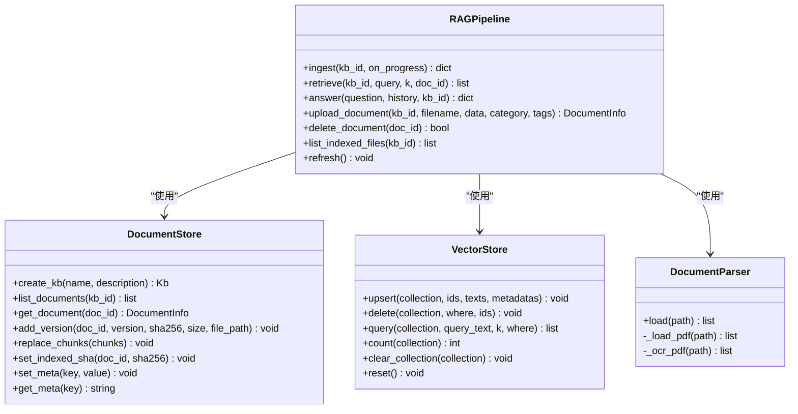

# 增量入库机制

<cite>
**本文引用的文件**
- [rag_pipeline.py](file://rag_pipeline.py)
- [store.py](file://store.py)
- [vector_store.py](file://vector_store.py)
- [ingestion.py](file://ingestion.py)
- [config.py](file://config.py)
- [api.py](file://api.py)
- [app.py](file://app.py)
- [tests/test_ingest.py](file://tests/test_ingest.py)
- [tests/helpers.py](file://tests/helpers.py)
</cite>

## 目录
1. [简介](#简介)
2. [项目结构](#项目结构)
3. [核心组件](#核心组件)
4. [架构总览](#架构总览)
5. [详细组件分析](#详细组件分析)
6. [依赖关系分析](#依赖关系分析)
7. [性能考量](#性能考量)
8. [故障排查指南](#故障排查指南)
9. [结论](#结论)
10. [附录：调用示例与结果处理](#附录调用示例与结果处理)

## 简介
本文件系统性说明“增量入库”的实现原理与优化策略，重点围绕 ingest 方法的核心逻辑展开，包括索引配置版本检测、文件内容变更检测、缺失文件处理、SHA-256 哈希比对避免重复处理、全量重建触发条件（切分参数变化、Embedding 模型变更等）、进度回调 on_progress 的使用与 UI 集成方式，以及错误收集与统计信息返回。

## 项目结构
- 管线门面与增量入库：RAGPipeline.ingest 负责增量/全量重建决策、解析切分、向量化与持久化。
- 元数据与片段存储：DocumentStore 使用 SQLite 维护知识库、文档、版本、片段与配置键值。
- 向量存储：VectorStore 封装 Chroma，提供批量 upsert、删除、查询与集合管理。
- 文档解析与切分：DocumentParser 支持 PDF/Word/Markdown/TXT，含 OCR 回退；split_documents 进行递归字符切分。
- 配置中心：AppConfig 集中读取环境变量，控制 chunk_size/chunk_overlap/embedding_batch_size 等。
- API 与 UI：FastAPI 暴露 /v1/kbs/{kb_id}/ingest；Streamlit 应用通过后台线程 + on_progress 展示进度。

图表来源
- [rag_pipeline.py:306-435](file://rag_pipeline.py#L306-L435)
- [store.py:123-470](file://store.py#L123-L470)
- [vector_store.py:38-149](file://vector_store.py#L38-L149)
- [ingestion.py:24-190](file://ingestion.py#L24-L190)
- [config.py:56-113](file://config.py#L56-L113)
- [api.py:153-160](file://api.py#L153-L160)
- [app.py:76-104](file://app.py#L76-L104)

章节来源
- [rag_pipeline.py:1-16](file://rag_pipeline.py#L1-L16)
- [store.py:1-17](file://store.py#L1-L17)
- [vector_store.py:1-10](file://vector_store.py#L1-L10)
- [ingestion.py:1-5](file://ingestion.py#L1-L5)
- [config.py:1-6](file://config.py#L1-L6)
- [api.py:1-14](file://api.py#L1-L14)
- [app.py:1-9](file://app.py#L1-L9)

## 核心组件
- RAGPipeline.ingest：增量入库入口，负责配置版本检测、文件存在性与内容变更判断、解析切分、向量化写入、旧片段清理、统计与错误收集、进度回调。
- DocumentStore：维护 documents、document_versions、chunks、meta 表，提供 indexed_sha 记录、replace_chunks、set_meta 等能力。
- VectorStore：基于 Chroma 的批量 upsert/delete/query/count/clear_collection/reset。
- DocumentParser/split_documents：按后缀加载并解析，PDF 自动质量评估与 OCR 回退；递归字符切分保留页码/段落等元数据。
- AppConfig：集中配置 chunk_size/chunk_overlap/embedding_batch_size 等关键参数。

章节来源
- [rag_pipeline.py:196-435](file://rag_pipeline.py#L196-L435)
- [store.py:123-470](file://store.py#L123-L470)
- [vector_store.py:38-149](file://vector_store.py#L38-L149)
- [ingestion.py:24-190](file://ingestion.py#L24-L190)
- [config.py:56-113](file://config.py#L56-L113)

## 架构总览
下图展示了 ingest 的关键流程：从配置版本检测开始，遍历文档列表，计算 SHA-256 并与 indexed_sha 比较，决定是否需要重新解析/切分/向量化；对缺失文件进行记录；完成后更新 indexed_sha、配置版本、BM25/片段缓存失效，并通过 on_progress 上报进度。

图表来源
- [api.py:153-160](file://api.py#L153-L160)
- [rag_pipeline.py:306-435](file://rag_pipeline.py#L306-L435)
- [store.py:276-345](file://store.py#L276-L345)
- [vector_store.py:61-86](file://vector_store.py#L61-L86)
- [ingestion.py:27-190](file://ingestion.py#L27-L190)

## 详细组件分析

### ingest 方法核心逻辑
- 索引配置版本检测：
  - 计算当前索引配置签名（包含 chunk_size、chunk_overlap、embedding_model、collection_space、parser_version），与数据库中 meta.index_config_version 比较，若不一致则标记 force_reindex=True，触发全量重建。
- 文件存在性与内容变更检测：
  - 遍历文档，检查 file_path 是否存在；不存在则加入 missing 列表。
  - 对存在的文件计算 SHA-256，与 documents.indexed_sha 比较；相同且非强制重建则跳过，否则纳入 to_index。
- 缺失文件处理：
  - 将缺失文件名汇总到 missing，并在最终消息中提示数量与部分文件名。
- 解析、切分与向量化：
  - 使用 DocumentParser.load 解析原始文件（PDF 支持质量阈值与本地 OCR 回退）。
  - 使用 split_documents 按 chunk_size/chunk_overlap 切分，生成带 page/paragraph/doc_id/kb_id/category/tags 的元数据。
  - 先 upsert 新向量，再根据 old_ids/new_ids 差集删除过期向量，保证一致性。
  - 用 replace_chunks 原子替换该文档的片段记录，并更新 chunk_count。
  - 最后 set_indexed_sha 记录本次已索引内容的哈希，避免下次重复处理。
- 进度回调 on_progress：
  - 在每步处理前调用 on_progress(stage, done, total)，stage 为“解析 xxx.txt”，total 为待处理文件数；完成时调用 on_progress("完成", total, total)。
- 错误收集与统计：
  - 捕获每个文件的异常，记录为 errors 列表（最多展示前三条）；返回 indexed、errors、chunks、force_reindex、message。

图表来源
- [rag_pipeline.py:306-435](file://rag_pipeline.py#L306-L435)
- [store.py:337-354](file://store.py#L337-L354)
- [vector_store.py:61-86](file://vector_store.py#L61-L86)
- [ingestion.py:27-190](file://ingestion.py#L27-L190)

章节来源
- [rag_pipeline.py:306-435](file://rag_pipeline.py#L306-L435)
- [store.py:337-354](file://store.py#L337-L354)
- [vector_store.py:61-86](file://vector_store.py#L61-L86)
- [ingestion.py:27-190](file://ingestion.py#L27-L190)

### SHA-256 哈希比对与避免重复处理
- 上传阶段：upload_document 将文件写入版本目录，并记录 sha256_bytes(data) 到 document_versions。
- 入库阶段：ingest 对每个文件计算 sha256_file(path)，与 documents.indexed_sha 比较；相等且非强制重建则跳过，避免重复解析/切分/向量化。
- 成功后：set_indexed_sha 记录本次已索引内容的哈希，确保下次增量检测有效。

章节来源
- [rag_pipeline.py:147-156](file://rag_pipeline.py#L147-L156)
- [rag_pipeline.py:260-288](file://rag_pipeline.py#L260-L288)
- [rag_pipeline.py:322-331](file://rag_pipeline.py#L322-L331)
- [rag_pipeline.py:412-418](file://rag_pipeline.py#L412-L418)
- [store.py:255-274](file://store.py#L255-L274)
- [store.py:337-345](file://store.py#L337-L345)

### 全量重建触发条件
- 索引配置变化：_current_index_config 包含 chunk_size、chunk_overlap、embedding_model、collection_space、parser_version；任一变化都会导致 stored version 不匹配，从而 force_reindex=True。
- 典型场景：
  - 切分参数变化：调整 CHUNK_SIZE/CHUNK_OVERLAP。
  - Embedding 模型变更：更换 embedding_model（如切换 DashScope 模型）。
  - 解析器/切分行为升级：parser_version 递增。
- 行为：当 force_reindex 为真时，即使文件未变更也会重新解析/切分/向量化，确保向量与索引配置一致。

章节来源
- [rag_pipeline.py:739-752](file://rag_pipeline.py#L739-L752)
- [rag_pipeline.py:318-320](file://rag_pipeline.py#L318-L320)
- [rag_pipeline.py:418-424](file://rag_pipeline.py#L418-L424)
- [config.py:96-112](file://config.py#L96-L112)

### 进度回调 on_progress 与 UI 集成
- 接口约定：on_progress(stage: str, done: int, total: int)
  - stage：当前阶段描述（如“解析 xxx.txt”、“完成”）。
  - done：已完成文件数。
  - total：本次待处理文件总数。
- Streamlit 集成：
  - 后台线程启动 worker.ingest(kb_id, on_progress=_progress)，_progress 更新 IngestJob 的状态（stage/done/total）。
  - render_job_status 定时刷新，显示进度条、状态信息与错误/成功消息。
  - 完成后调用 rag.refresh() 重建向量客户端并使 BM25/片段缓存失效。

图表来源
- [app.py:76-104](file://app.py#L76-L104)
- [app.py:107-124](file://app.py#L107-L124)
- [rag_pipeline.py:354-356](file://rag_pipeline.py#L354-L356)
- [rag_pipeline.py:427-428](file://rag_pipeline.py#L427-L428)

章节来源
- [app.py:76-104](file://app.py#L76-L104)
- [app.py:107-124](file://app.py#L107-L124)
- [rag_pipeline.py:354-356](file://rag_pipeline.py#L354-L356)
- [rag_pipeline.py:427-428](file://rag_pipeline.py#L427-L428)

### 错误收集与统计信息
- 错误收集：每个文件处理异常被捕获，记录为 errors 列表；最终消息中包含失败数量与部分错误摘要。
- 统计信息：返回 indexed（已入库文件名列表）、errors（错误列表）、chunks（新增片段总数）、force_reindex（是否全量重建）、message（人类可读消息）。
- 测试验证：test_ingest_and_reingest_noop、test_file_change_triggers_reindex、test_config_change_forces_reindex 覆盖无操作、文件变更、配置变更三种路径。

章节来源
- [rag_pipeline.py:415-435](file://rag_pipeline.py#L415-L435)
- [tests/test_ingest.py:9-49](file://tests/test_ingest.py#L9-L49)

## 依赖关系分析
- RAGPipeline 依赖：
  - DocumentStore：读写 SQLite，维护 indexed_sha、chunks、meta。
  - VectorStore：批量 upsert/delete/query/count/clear_collection/reset。
  - DocumentParser/split_documents：解析与切分。
  - AppConfig：切分与批大小等参数。
- 外部系统：
  - Chroma：向量存储（余弦空间）。
  - LLM/Embeddings：DashScope 或 Mock 嵌入函数。
- 并发与一致性：
  - SQLite 使用 WAL 模式与 busy_timeout，写事务加锁。
  - VectorStore 批量 upsert 天然支持增量更新（id 相同覆盖）。

图表来源
- [rag_pipeline.py:196-752](file://rag_pipeline.py#L196-L752)
- [store.py:123-470](file://store.py#L123-L470)
- [vector_store.py:38-149](file://vector_store.py#L38-L149)
- [ingestion.py:24-190](file://ingestion.py#L24-L190)

章节来源
- [rag_pipeline.py:196-752](file://rag_pipeline.py#L196-L752)
- [store.py:123-470](file://store.py#L123-L470)
- [vector_store.py:38-149](file://vector_store.py#L38-L149)
- [ingestion.py:24-190](file://ingestion.py#L24-L190)

## 性能考量
- 增量检测：通过 indexed_sha 与 SHA-256 比对，避免重复解析/切分/向量化，显著降低 CPU 与 I/O 开销。
- 批量向量化：VectorStore.upsert 按 batch_size 分批调用 embed_documents，减少单次请求压力（默认 16，上限 20）。
- 原子更新：replace_chunks 先删后插，保证片段与向量一致；indexed_sha 仅在成功后更新，失败可重试。
- 缓存失效：ingest 完成后标记 BM25/片段缓存 stale，refresh 重建客户端连接，避免内存索引过期。
- 并发安全：SQLite WAL + busy_timeout + RLock；服务层使用全局锁串行化读写，避免并发冲突。

[本节为通用指导，不直接分析具体文件]

## 故障排查指南
- 文件缺失：
  - 现象：ingest 返回 missing 列表，提示缺失文件数量与部分文件名。
  - 处理：确认物理文件路径是否存在；必要时重新上传或恢复备份。
- 解析失败：
  - 现象：errors 列表包含失败文件与错误信息；indexed_sha 未更新，下次会重试。
  - 处理：检查文件格式、编码、OCR 依赖（pymupdf/rapidocr/onnxruntime）。
- 配置不匹配：
  - 现象：force_reindex=True，提示检测到索引配置变更。
  - 处理：确认 chunk_size/chunk_overlap/embedding_model 是否有意变更；必要时统一环境配置。
- 向量不一致：
  - 现象：片段记录存在但向量缺失或多余。
  - 处理：删除文档或重建知识库；确保 replace_chunks 与 upsert 顺序正确。

章节来源
- [rag_pipeline.py:322-347](file://rag_pipeline.py#L322-L347)
- [rag_pipeline.py:415-435](file://rag_pipeline.py#L415-L435)
- [ingestion.py:40-78](file://ingestion.py#L40-L78)
- [vector_store.py:61-86](file://vector_store.py#L61-L86)

## 结论
本实现通过 indexed_sha 与 SHA-256 哈希比对实现精确的增量检测，结合索引配置版本检测确保全量重建在必要时机触发；解析/切分/向量化流程健壮，具备 PDF 质量评估与本地 OCR 回退；on_progress 提供细粒度进度反馈，便于 UI 集成；错误收集与统计信息返回使运维可观测性良好。整体设计兼顾性能与一致性，适合企业级知识库场景。

[本节为总结，不直接分析具体文件]

## 附录：调用示例与结果处理
- FastAPI 调用：
  - 端点：POST /v1/kbs/{kb_id}/ingest
  - 鉴权：可选 Bearer Token（API_AUTH_TOKEN）
  - 返回：{indexed, errors, chunks, force_reindex, message}
- Streamlit 调用：
  - 后台线程调用 worker.ingest(kb_id, on_progress=_progress)
  - 进度面板显示 stage/done/total，完成后刷新缓存
- 单元测试参考：
  - test_ingest_and_reingest_noop：验证二次 ingests 无操作
  - test_file_change_triggers_reindex：文件内容变更触发重入
  - test_config_change_forces_reindex：配置版本变化触发全量重建

章节来源
- [api.py:153-160](file://api.py#L153-L160)
- [app.py:76-104](file://app.py#L76-L104)
- [tests/test_ingest.py:9-49](file://tests/test_ingest.py#L9-L49)
- [tests/helpers.py:160-166](file://tests/helpers.py#L160-L166)