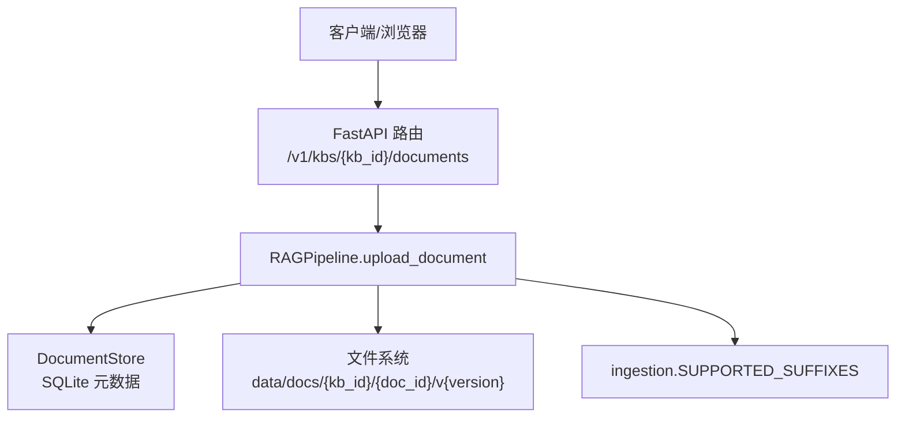
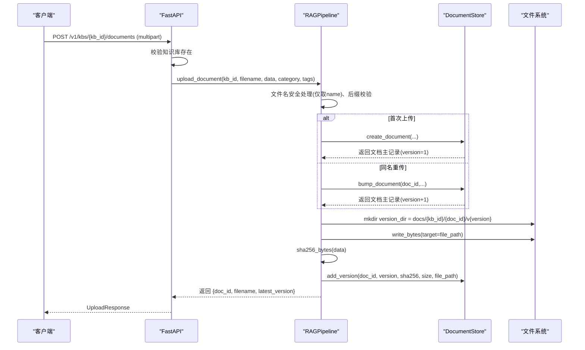
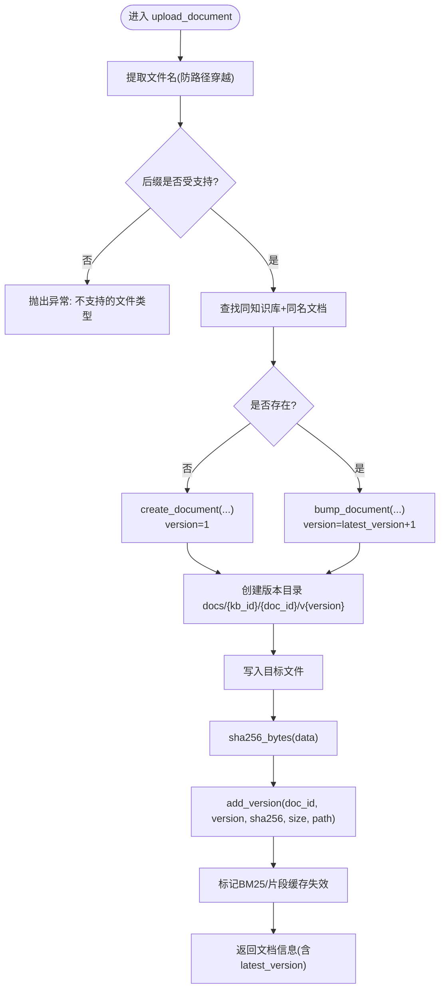
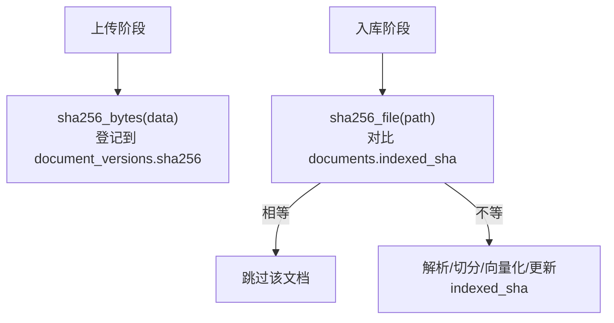
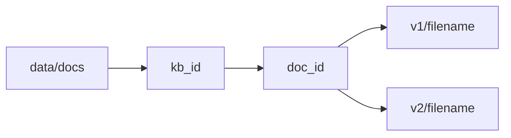
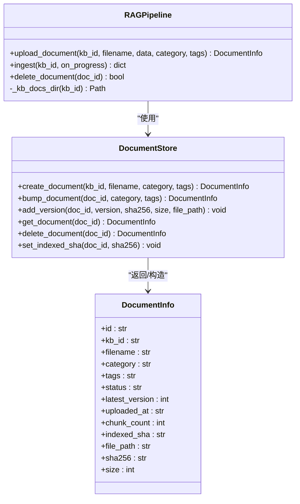
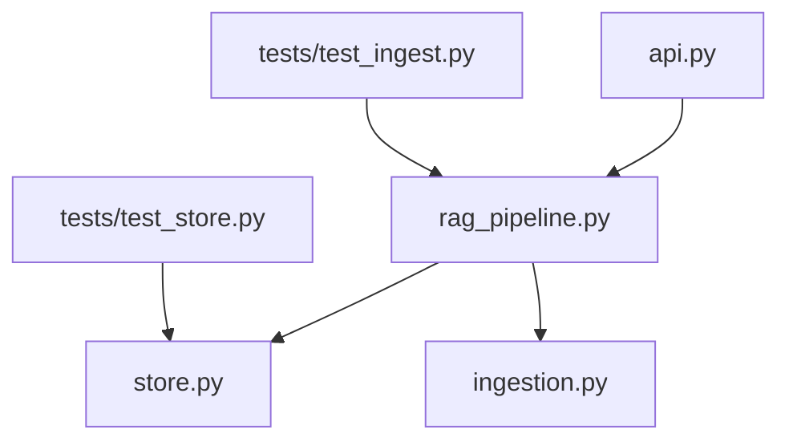

# 文件上传与版本管理

<cite>
**本文引用的文件**
- [api.py](file://api.py)
- [rag_pipeline.py](file://rag_pipeline.py)
- [store.py](file://store.py)
- [ingestion.py](file://ingestion.py)
- [app.py](file://app.py)
- [tests/test_ingest.py](file://tests/test_ingest.py)
- [tests/test_store.py](file://tests/test_store.py)
</cite>

## 目录
1. [简介](#简介)
2. [项目结构](#项目结构)
3. [核心组件](#核心组件)
4. [架构总览](#架构总览)
5. [详细组件分析](#详细组件分析)
6. [依赖关系分析](#依赖关系分析)
7. [性能考虑](#性能考虑)
8. [故障排查指南](#故障排查指南)
9. [结论](#结论)
10. [附录：使用示例与路径约定](#附录使用示例与路径约定)

## 简介
本文件围绕“文件上传流程与版本管理机制”展开，重点说明 upload_document 的完整处理链路：文件名安全处理、后缀校验、同名重传时的版本自动递增、物理文件存储策略、SHA-256 哈希在版本控制中的作用（内存数据与磁盘文件），以及版本目录结构与路径管理。文档同时给出不同场景下的调用方式与错误处理要点，帮助读者快速理解并正确使用该能力。

## 项目结构
与文件上传和版本管理直接相关的代码主要分布在以下模块：
- API 层：接收 HTTP 请求，解析表单/文件，调用 RAGPipeline.upload_document
- 管线层：实现 upload_document 的核心逻辑（安全处理、版本判断、存储、哈希）
- 存储层：SQLite 持久化知识库、文档主记录、版本历史、片段等元数据
- 解析层：定义支持的后缀集合与解析器（用于后续入库阶段）
- 前端/演示：Streamlit 页面通过 API 或本地管线进行上传与索引

图表来源
- [api.py:126-150](file://api.py#L126-L150)
- [rag_pipeline.py:260-288](file://rag_pipeline.py#L260-L288)
- [store.py:214-274](file://store.py#L214-L274)
- [ingestion.py:17-30](file://ingestion.py#L17-L30)

章节来源
- [api.py:126-150](file://api.py#L126-L150)
- [rag_pipeline.py:260-288](file://rag_pipeline.py#L260-L288)
- [store.py:214-274](file://store.py#L214-L274)
- [ingestion.py:17-30](file://ingestion.py#L17-L30)

## 核心组件
- FastAPI 路由 upload_document：负责鉴权、参数校验、读取上传内容并调用管线方法
- RAGPipeline.upload_document：实现文件名安全处理、后缀校验、版本判断、写入磁盘、计算并登记 SHA-256、标记缓存失效
- DocumentStore：维护知识库、文档主表、版本历史表、片段表；提供创建文档、版本递增、登记版本、软删除等方法
- ingestion.DocumentParser/SUPPORTED_SUFFIXES：集中声明支持的文件后缀，供上传与解析复用
- Streamlit app：演示如何从 UI 触发上传并启动后台索引

章节来源
- [api.py:126-150](file://api.py#L126-L150)
- [rag_pipeline.py:260-288](file://rag_pipeline.py#L260-L288)
- [store.py:214-274](file://store.py#L214-L274)
- [ingestion.py:17-30](file://ingestion.py#L17-L30)
- [app.py:173-204](file://app.py#L173-L204)

## 架构总览
下图展示了从 HTTP 请求到文件落盘与元数据登记的完整时序。

图表来源
- [api.py:126-150](file://api.py#L126-L150)
- [rag_pipeline.py:260-288](file://rag_pipeline.py#L260-L288)
- [store.py:214-274](file://store.py#L214-L274)

## 详细组件分析

### 1) upload_document 完整处理流程
- 文件名安全处理：仅保留文件名部分，防止路径穿越攻击
- 后缀验证：仅允许 .pdf/.md/.txt/.docx 四种类型
- 版本判断：
  - 若知识库中不存在同名文档：创建文档主记录，初始版本为 1
  - 若已存在同名文档：对主记录执行版本递增（latest_version + 1），并更新分类/标签与上传时间
- 文件存储：按 kb_id -> doc_id -> v{version} 的目录结构保存当前版本文件
- 哈希登记：对内存中的 bytes 计算 SHA-256，连同文件大小与物理路径登记到版本表
- 缓存失效：将 BM25 与片段缓存标记为过期，以便下次检索时重建

图表来源
- [rag_pipeline.py:260-288](file://rag_pipeline.py#L260-L288)
- [store.py:214-274](file://store.py#L214-L274)

章节来源
- [rag_pipeline.py:260-288](file://rag_pipeline.py#L260-L288)
- [store.py:214-274](file://store.py#L214-L274)

### 2) 同名文件重传与旧版本保留策略
- 版本自动递增：同一知识库下同名文件再次上传时，主记录的 latest_version 会自增，确保每次重传都产生新版本
- 旧版本物理保留：每个版本以独立目录 v{version} 存放，旧版本文件不会被覆盖或删除，便于审计与回溯
- 元数据关联：每个版本记录包含 SHA-256、文件大小、物理路径与创建时间，便于定位与校验

章节来源
- [store.py:236-274](file://store.py#L236-L274)
- [rag_pipeline.py:281-285](file://rag_pipeline.py#L281-L285)

### 3) SHA-256 哈希在版本控制中的作用
- 内存数据哈希：upload_document 对传入的 bytes 直接计算 SHA-256，作为版本唯一标识之一，避免重复写入相同内容
- 磁盘文件哈希：入库阶段 ingest 会对磁盘上的最新版本文件计算 SHA-256，并与 documents.indexed_sha 比较，决定是否重新解析/向量化
- 增量入库：当 indexed_sha 变化或索引配置版本变化时，触发对应文档的重新入库；否则跳过，提升效率

图表来源
- [rag_pipeline.py:147-156](file://rag_pipeline.py#L147-L156)
- [rag_pipeline.py:329-331](file://rag_pipeline.py#L329-L331)
- [rag_pipeline.py:359-360](file://rag_pipeline.py#L359-L360)
- [store.py:337-343](file://store.py#L337-L343)

章节来源
- [rag_pipeline.py:147-156](file://rag_pipeline.py#L147-L156)
- [rag_pipeline.py:329-331](file://rag_pipeline.py#L329-L331)
- [rag_pipeline.py:359-360](file://rag_pipeline.py#L359-L360)
- [store.py:337-343](file://store.py#L337-L343)

### 4) 版本目录结构与文件路径管理
- 根目录：data/docs/{kb_id}
- 文档目录：{doc_id}（唯一标识，避免同名冲突）
- 版本目录：v{version}（如 v1、v2...）
- 文件路径：data/docs/{kb_id}/{doc_id}/v{version}/{filename}
- 删除策略：删除文档为软删除（状态置为 deleted），不删除物理文件与版本历史，便于恢复与审计

图表来源
- [rag_pipeline.py:730-731](file://rag_pipeline.py#L730-L731)
- [store.py:322-333](file://store.py#L322-L333)

章节来源
- [rag_pipeline.py:730-731](file://rag_pipeline.py#L730-L731)
- [store.py:322-333](file://store.py#L322-L333)

### 5) 类与数据结构关系

图表来源
- [rag_pipeline.py:196-288](file://rag_pipeline.py#L196-L288)
- [store.py:88-111](file://store.py#L88-L111)
- [store.py:214-274](file://store.py#L214-L274)

章节来源
- [rag_pipeline.py:196-288](file://rag_pipeline.py#L196-L288)
- [store.py:88-111](file://store.py#L88-L111)
- [store.py:214-274](file://store.py#L214-L274)

## 依赖关系分析
- api.py 依赖 rag_pipeline.py 暴露 REST 接口
- rag_pipeline.py 依赖 store.py 进行元数据持久化，依赖 ingestion.py 获取支持的后缀集合
- ingestion.py 定义 SUPPORTED_SUFFIXES，被上传与解析共用
- tests 验证版本递增、增量入库、配置变更触发全量重建等行为

图表来源
- [api.py:126-150](file://api.py#L126-L150)
- [rag_pipeline.py:260-288](file://rag_pipeline.py#L260-L288)
- [store.py:214-274](file://store.py#L214-L274)
- [ingestion.py:17-30](file://ingestion.py#L17-L30)
- [tests/test_ingest.py:24-36](file://tests/test_ingest.py#L24-L36)
- [tests/test_store.py:27-38](file://tests/test_store.py#L27-L38)

章节来源
- [api.py:126-150](file://api.py#L126-L150)
- [rag_pipeline.py:260-288](file://rag_pipeline.py#L260-L288)
- [store.py:214-274](file://store.py#L214-L274)
- [ingestion.py:17-30](file://ingestion.py#L17-L30)
- [tests/test_ingest.py:24-36](file://tests/test_ingest.py#L24-L36)
- [tests/test_store.py:27-38](file://tests/test_store.py#L27-L38)

## 性能考虑
- 增量入库：基于 indexed_sha 与索引配置版本判断是否需要重新解析/向量化，减少不必要的计算
- 缓存失效：上传后标记 BM25 与片段缓存为 stale，按需重建，避免全局锁竞争
- 并发安全：API 层与服务内部使用线程锁串行化关键读写，降低 SQLite/Chroma 并发风险
- 大文件哈希：磁盘文件哈希采用分块读取，避免一次性加载大文件导致内存峰值

[本节为通用性能建议，不直接分析具体文件]

## 故障排查指南
- 不支持的文件类型：检查文件后缀是否在 SUPPORTED_SUFFIXES 内（.pdf/.md/.txt/.docx）
- 知识库不存在：确保 kb_id 有效，或在 API 层先创建知识库
- 同名重传未生效：确认数据库 documents.latest_version 是否递增，且版本目录是否正确生成
- 入库未触发：检查 documents.indexed_sha 是否与最新文件一致，或索引配置版本是否发生变化
- 删除文档后仍可见：删除为软删除，需查询 include_deleted=True 才能看到；向量与片段会被清理

章节来源
- [ingestion.py:17-30](file://ingestion.py#L17-L30)
- [api.py:126-150](file://api.py#L126-L150)
- [store.py:322-333](file://store.py#L322-L333)
- [rag_pipeline.py:329-331](file://rag_pipeline.py#L329-L331)

## 结论
本系统通过“文件名安全处理 + 后缀校验 + 版本自动递增 + 物理文件多版本保留 + SHA-256 双重哈希（内存与磁盘）”的组合，实现了稳健的文件上传与版本管理能力。配合增量入库与缓存失效机制，在保证可追溯性的同时兼顾了性能与可维护性。

[本节为总结性内容，不直接分析具体文件]

## 附录：使用示例与路径约定

- 首次上传
  - 调用位置：FastAPI 路由 /v1/kbs/{kb_id}/documents
  - 行为：创建文档主记录，版本为 1，写入 data/docs/{kb_id}/{doc_id}/v1/{filename}，登记 SHA-256
  - 参考路径：[api.py:126-150](file://api.py#L126-L150)，[rag_pipeline.py:260-288](file://rag_pipeline.py#L260-L288)

- 版本更新（同名重传）
  - 行为：latest_version 自增，新文件写入 v{new_version}，旧版本文件保留
  - 参考路径：[store.py:236-274](file://store.py#L236-L274)，[rag_pipeline.py:273-285](file://rag_pipeline.py#L273-L285)

- 错误处理
  - 不支持的文件类型：抛出异常，由 API 层转换为 400 响应
  - 知识库不存在：抛出异常，由 API 层转换为 404 响应
  - 参考路径：[api.py:126-150](file://api.py#L126-L150)，[rag_pipeline.py:268-272](file://rag_pipeline.py#L268-L272)

- 前端演示
  - 通过 Streamlit 选择文件并调用 rag.upload_document，随后启动后台索引
  - 参考路径：[app.py:173-204](file://app.py#L173-L204)

- 测试用例参考
  - 版本递增与增量入库：[tests/test_ingest.py:24-36](file://tests/test_ingest.py#L24-L36)
  - 版本历史与哈希字段：[tests/test_store.py:27-38](file://tests/test_store.py#L27-L38)