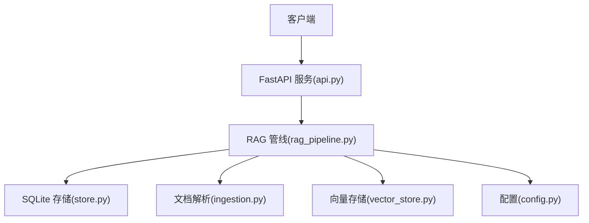
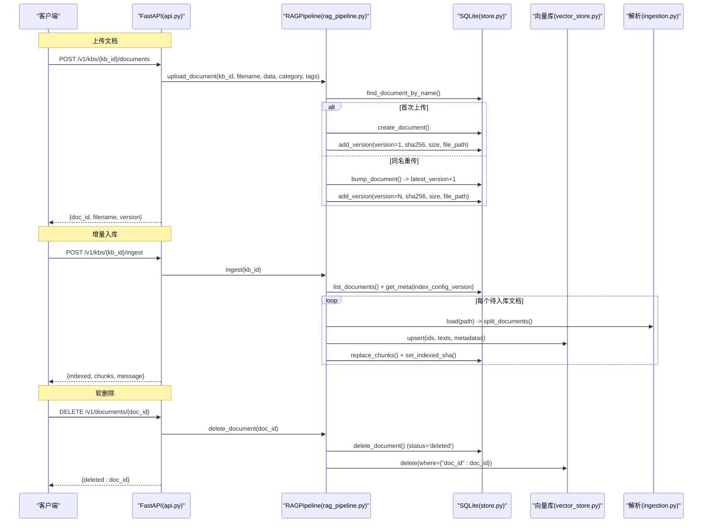
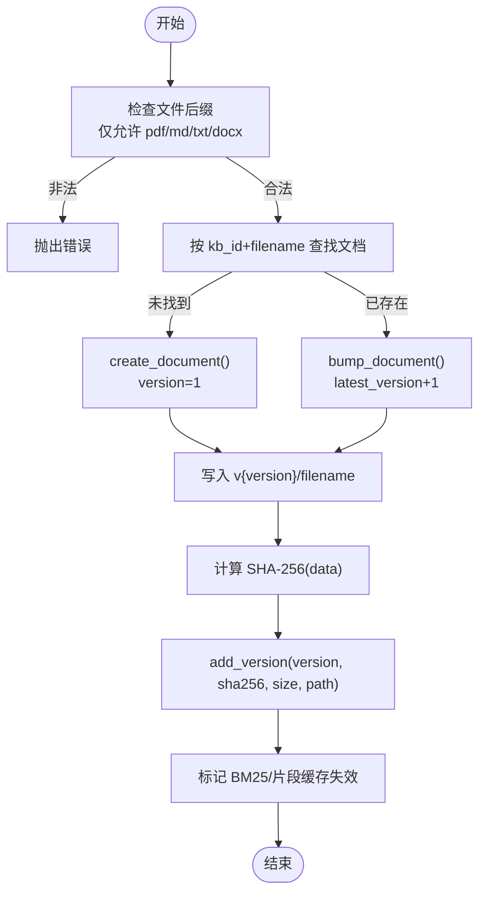
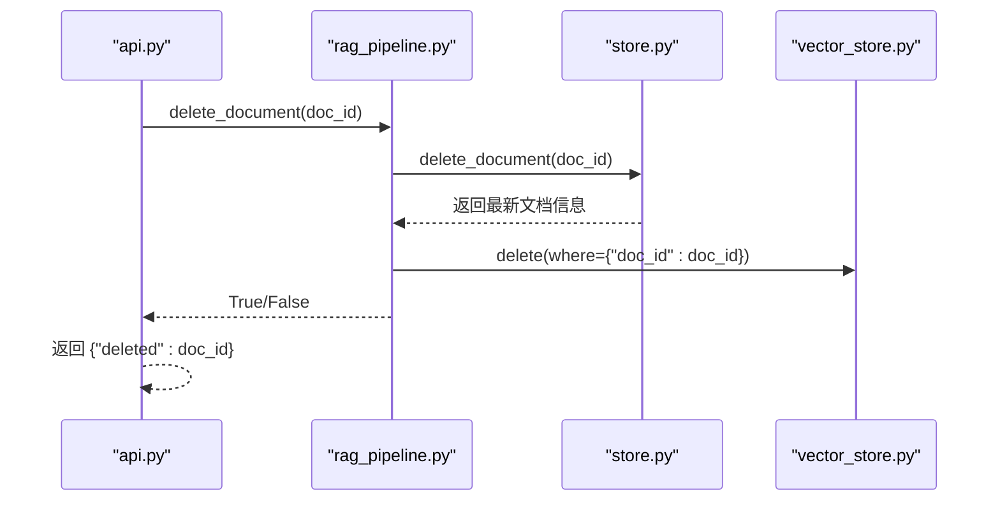
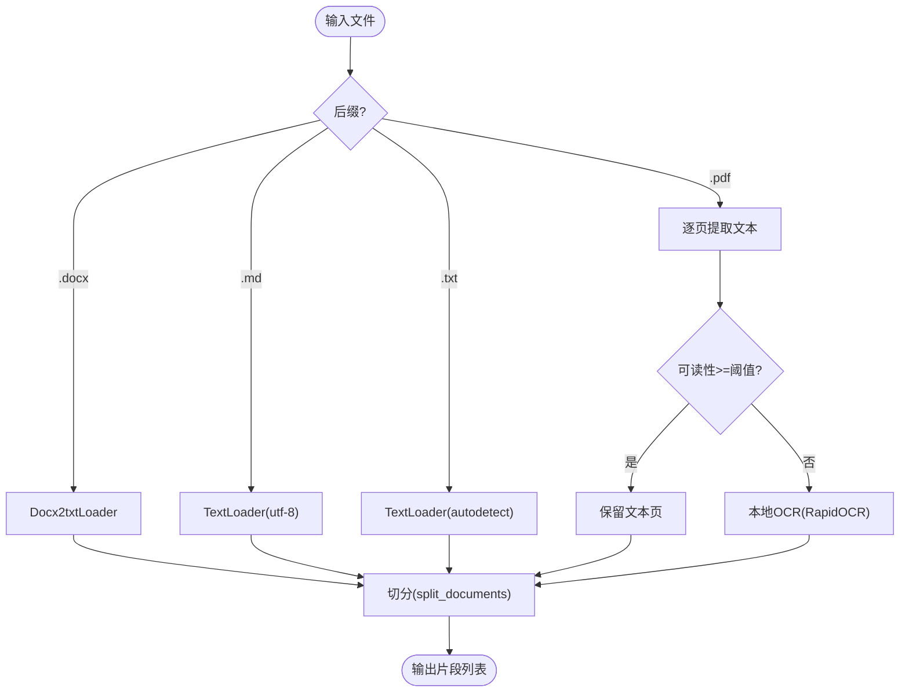
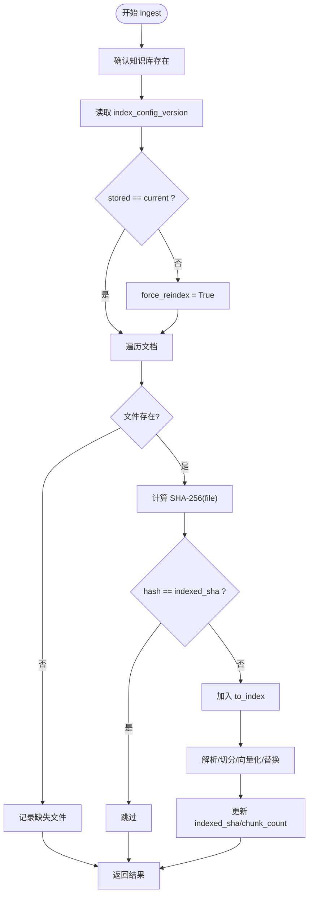
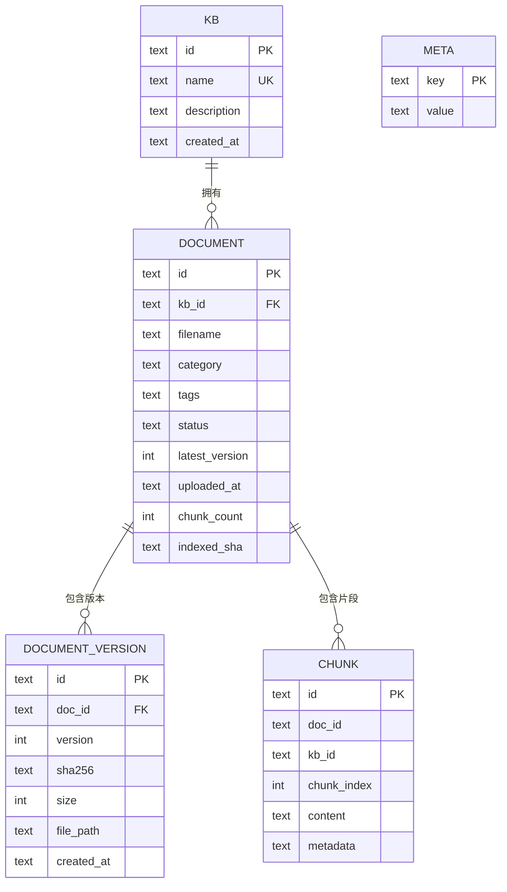
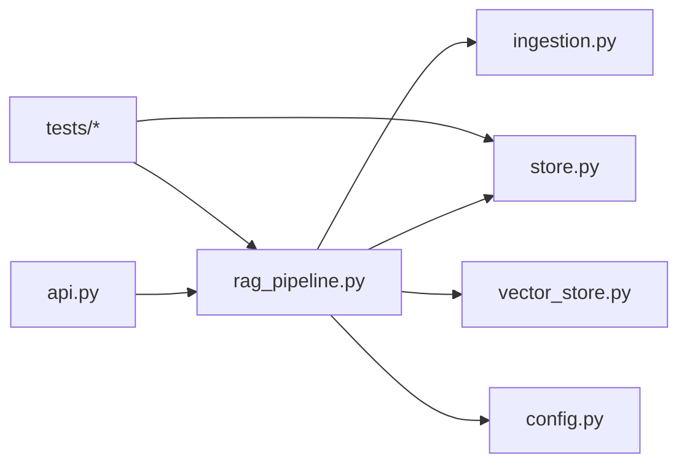

# 文档处理与版本控制

<cite>
**本文引用的文件**
- [api.py](file://api.py)
- [rag_pipeline.py](file://rag_pipeline.py)
- [store.py](file://store.py)
- [ingestion.py](file://ingestion.py)
- [vector_store.py](file://vector_store.py)
- [config.py](file://config.py)
- [tests/test_ingest.py](file://tests/test_ingest.py)
- [tests/test_store.py](file://tests/test_store.py)
</cite>

## 目录
1. [简介](#简介)
2. [项目结构](#项目结构)
3. [核心组件](#核心组件)
4. [架构总览](#架构总览)
5. [详细组件分析](#详细组件分析)
6. [依赖关系分析](#依赖关系分析)
7. [性能考量](#性能考量)
8. [故障排查指南](#故障排查指南)
9. [结论](#结论)
10. [附录：使用示例](#附录使用示例)

## 简介
本文件面向“文档处理与版本控制”能力，系统性说明以下要点：
- upload_document 的文件上传流程：文件格式验证、版本自动递增、SHA-256 哈希计算、物理文件落盘与元数据登记。
- 同名文件重传时的版本管理策略与旧版本保留机制。
- delete_document 的软删除实现：向量数据清理、片段记录清理、元数据状态更新。
- 支持的文档格式（PDF、Word、Markdown、TXT）与解析流程（含 PDF 文本质量评估与本地 OCR 回退）。
- 增量入库的检测机制：文件内容变更检测（基于 indexed_sha）与索引配置变更检测（基于 index_config_version），确保只处理新增或变化的文件。

## 项目结构
系统由 API 层、RAG 管线、存储层、解析与切分、向量存储与配置组成。关键职责如下：
- api.py：暴露 REST 接口，封装并发锁，调用 RAGPipeline 完成上传、入库、问答等。
- rag_pipeline.py：核心业务编排，负责文档上传、版本管理、增量入库、检索与问答。
- store.py：SQLite 持久化知识库、文档主记录、版本历史、片段与键值配置。
- ingestion.py：多格式解析与文本切分，PDF 支持按页质量评估与本地 OCR。
- vector_store.py：Chroma 向量库封装，提供 upsert、delete、query、MMR 所需向量化能力。
- config.py：集中配置，驱动切分参数、检索阈值、批量大小等。

图表来源
- [api.py:126-150](file://api.py#L126-L150)
- [rag_pipeline.py:260-288](file://rag_pipeline.py#L260-L288)
- [store.py:214-274](file://store.py#L214-L274)
- [ingestion.py:24-39](file://ingestion.py#L24-L39)
- [vector_store.py:61-86](file://vector_store.py#L61-L86)
- [config.py:90-112](file://config.py#L90-L112)

章节来源
- [api.py:1-204](file://api.py#L1-L204)
- [rag_pipeline.py:1-792](file://rag_pipeline.py#L1-L792)
- [store.py:1-470](file://store.py#L1-L470)
- [ingestion.py:1-216](file://ingestion.py#L1-L216)
- [vector_store.py:1-255](file://vector_store.py#L1-L255)
- [config.py:1-113](file://config.py#L1-L113)

## 核心组件
- 文档上传与版本管理：RAGPipeline.upload_document 负责校验后缀、查找同名文档、创建或升级版本、写入物理文件、计算并登记 SHA-256、标记缓存失效。
- 软删除：RAGPipeline.delete_document 调用存储层软删除、清理向量与片段、标记 BM25/片段缓存失效。
- 增量入库：RAGPipeline.ingest 通过 indexed_sha 与 index_config_version 双重判断，仅对新增或变化文件进行解析、切分、向量化与替换。
- 解析与切分：DocumentParser 支持 PDF/DOCX/MD/TXT；PDF 逐页质量评估，低于阈值则走本地 OCR；split_documents 使用递归字符切分器。
- 向量存储：VectorStore 提供 upsert/delete/query/get_embeddings，按 collection(kb_<kb_id>) 隔离。
- 配置：AppConfig 集中读取环境变量，控制 chunk_size/chunk_overlap/top_k/fusion_pool/relevance_threshold/mmr_enabled/mmr_lambda/embedding_batch_size 等。

章节来源
- [rag_pipeline.py:260-288](file://rag_pipeline.py#L260-L288)
- [rag_pipeline.py:290-299](file://rag_pipeline.py#L290-L299)
- [rag_pipeline.py:306-435](file://rag_pipeline.py#L306-L435)
- [ingestion.py:24-39](file://ingestion.py#L24-L39)
- [ingestion.py:40-78](file://ingestion.py#L40-L78)
- [ingestion.py:178-216](file://ingestion.py#L178-L216)
- [vector_store.py:61-86](file://vector_store.py#L61-L86)
- [config.py:90-112](file://config.py#L90-L112)

## 架构总览
下图展示从 API 到存储与向量库的端到端流程，突出上传、版本、增量入库与删除的关键路径。

图表来源
- [api.py:126-150](file://api.py#L126-L150)
- [api.py:153-160](file://api.py#L153-L160)
- [api.py:177-182](file://api.py#L177-L182)
- [rag_pipeline.py:260-288](file://rag_pipeline.py#L260-L288)
- [rag_pipeline.py:306-435](file://rag_pipeline.py#L306-L435)
- [store.py:214-274](file://store.py#L214-L274)
- [vector_store.py:61-86](file://vector_store.py#L61-L86)
- [ingestion.py:24-39](file://ingestion.py#L24-L39)

## 详细组件分析

### 文档上传与版本管理（upload_document）
- 文件类型校验：仅允许 .pdf/.md/.txt/.docx，否则抛出错误。
- 同名重传策略：
  - 若不存在同名文档：创建新文档，version=1。
  - 若存在同名文档：调用 bump_document 将 latest_version+1，并更新分类/标签与上传时间。
- 物理文件落盘：在 data/docs/{kb_id}/{doc_id}/v{version}/{filename} 下保存。
- SHA-256 计算：对上传字节流计算摘要，并登记到 document_versions 表。
- 缓存失效：标记 BM25 与片段缓存为 stale，以便下次入库重建。

图表来源
- [rag_pipeline.py:260-288](file://rag_pipeline.py#L260-L288)
- [store.py:214-274](file://store.py#L214-L274)

章节来源
- [rag_pipeline.py:260-288](file://rag_pipeline.py#L260-L288)
- [store.py:214-274](file://store.py#L214-L274)

### 软删除（delete_document）
- 软删除主记录：将 documents.status 置为 'deleted'，不再出现在默认列表。
- 清理片段记录：删除 chunks 中该 doc_id 的所有片段。
- 清理向量数据：按 doc_id 条件删除向量集合中的对应条目。
- 保留版本历史与物理文件：便于审计与恢复。

图表来源
- [api.py:177-182](file://api.py#L177-L182)
- [rag_pipeline.py:290-299](file://rag_pipeline.py#L290-L299)
- [store.py:322-335](file://store.py#L322-L335)
- [vector_store.py:80-86](file://vector_store.py#L80-L86)

章节来源
- [rag_pipeline.py:290-299](file://rag_pipeline.py#L290-L299)
- [store.py:322-335](file://store.py#L322-L335)
- [vector_store.py:80-86](file://vector_store.py#L80-L86)

### 支持的文档格式与解析流程
- 支持格式：PDF(.pdf)、Word(.docx)、Markdown(.md)、纯文本(.txt)。
- 解析策略：
  - DOCX：使用 Docx2txtLoader 加载。
  - MD/TXT：使用 TextLoader，MD 指定 UTF-8，TXT 尝试自动编码。
  - PDF：优先用 PyMuPDF 提取文本层，逐页评估可读性；低于阈值的页面走本地 OCR（PyMuPDF + RapidOCR）。若缺少 PyMuPDF，回退到 pypdf 并按整本质量判断是否 OCR。
- 文本质量评估：统计可见字符中“可读”比例，中文、ASCII、标点、日文假名等视为可读；低于阈值判定为乱码/扫描件。
- 切分：使用 RecursiveCharacterTextSplitter，按段落/句子边界切分，保留 page/paragraph 等元数据。

图表来源
- [ingestion.py:24-39](file://ingestion.py#L24-L39)
- [ingestion.py:40-78](file://ingestion.py#L40-L78)
- [ingestion.py:104-122](file://ingestion.py#L104-L122)
- [ingestion.py:124-175](file://ingestion.py#L124-L175)
- [ingestion.py:178-190](file://ingestion.py#L178-L190)

章节来源
- [ingestion.py:24-39](file://ingestion.py#L24-L39)
- [ingestion.py:40-78](file://ingestion.py#L40-L78)
- [ingestion.py:104-122](file://ingestion.py#L104-L122)
- [ingestion.py:124-175](file://ingestion.py#L124-L175)
- [ingestion.py:178-190](file://ingestion.py#L178-L190)

### 增量入库的检测机制
- 文件内容变更检测：
  - 每次入库前计算当前文件的 SHA-256，并与 documents.indexed_sha 比较；不同则纳入 to_index。
  - 若文件缺失，记录 missing 列表并在结果中提示。
- 索引配置变更检测：
  - 维护 index_config_version（包含 chunk_size、chunk_overlap、embedding_model、collection_space、parser_version 等）。
  - 若 stored_version != current_version，触发全量重建，避免旧向量与新配置不匹配。
- 入库过程：
  - 解析与切分后生成 ids/texts/metadatas，先 upsert 新向量，再删除旧片段 id（old_ids - new_ids）。
  - 替换 chunks 记录，更新 chunk_count 与 indexed_sha，最后刷新 BM25/片段缓存。

图表来源
- [rag_pipeline.py:306-435](file://rag_pipeline.py#L306-L435)
- [store.py:337-345](file://store.py#L337-L345)
- [vector_store.py:61-86](file://vector_store.py#L61-L86)

章节来源
- [rag_pipeline.py:306-435](file://rag_pipeline.py#L306-L435)
- [store.py:337-345](file://store.py#L337-L345)
- [vector_store.py:61-86](file://vector_store.py#L61-L86)

### 数据模型与关系

图表来源
- [store.py:31-77](file://store.py#L31-L77)

章节来源
- [store.py:31-77](file://store.py#L31-L77)

## 依赖关系分析
- API 层依赖 RAGPipeline 暴露上传、入库、删除、问答等能力。
- RAGPipeline 依赖 DocumentStore（SQLite）、DocumentParser（解析）、VectorStore（Chroma）、BM25Index（词面检索）、LLMClient（嵌入与对话）。
- 配置 AppConfig 驱动切分、检索、批大小等关键参数。
- 测试用例覆盖版本管理、软删除、增量入库等行为。

图表来源
- [api.py:126-182](file://api.py#L126-L182)
- [rag_pipeline.py:196-219](file://rag_pipeline.py#L196-L219)
- [store.py:123-138](file://store.py#L123-L138)
- [ingestion.py:24-39](file://ingestion.py#L24-L39)
- [vector_store.py:38-55](file://vector_store.py#L38-L55)
- [config.py:56-112](file://config.py#L56-L112)

章节来源
- [api.py:126-182](file://api.py#L126-L182)
- [rag_pipeline.py:196-219](file://rag_pipeline.py#L196-L219)
- [store.py:123-138](file://store.py#L123-L138)
- [ingestion.py:24-39](file://ingestion.py#L24-L39)
- [vector_store.py:38-55](file://vector_store.py#L38-L55)
- [config.py:56-112](file://config.py#L56-L112)

## 性能考量
- 并发安全：API 层使用线程锁串行化读写，避免 SQLite/Chroma 并发问题。
- 向量入库批次：VectorStore.upsert 按 embedding_batch_size 分批向量化，避免单次过大导致失败。
- PDF 解析优化：逐页质量评估，仅对不可读页执行 OCR，降低整体耗时。
- 增量入库：通过 indexed_sha 与 index_config_version 避免重复解析与向量化，减少不必要开销。
- 缓存失效：入库完成后统一刷新 BM25 与片段缓存，保证查询一致性。

[本节为通用指导，无需特定文件引用]

## 故障排查指南
- 不支持的文件类型：检查文件后缀是否在 SUPPORTED_SUFFIXES 内。
- PDF 无法识别文字：确认是否安装 pymupdf 与 rapidocr；若缺失会抛出运行时错误。
- 增量入库无变化：检查 indexed_sha 是否与文件一致；若配置变更需等待下一次 ingest 触发全量重建。
- 软删除后仍可检索：确认是否清除了向量与片段；必要时手动清理 collection 或重新入库。
- 向量库不一致：当 upsert 中途失败时，旧向量仍可用；再次运行 ingest 可补齐缺失片段。

章节来源
- [ingestion.py:124-175](file://ingestion.py#L124-L175)
- [rag_pipeline.py:306-435](file://rag_pipeline.py#L306-L435)
- [vector_store.py:61-86](file://vector_store.py#L61-L86)

## 结论
本系统实现了健壮的文档上传、版本管理与软删除能力，并通过 SHA-256 与索引配置签名实现精准的增量入库。解析层对 PDF 的逐页质量评估与本地 OCR 回退提升了鲁棒性。配合向量库与 BM25 混合检索，形成完整的 RAG 数据流水线。

[本节为总结性内容，无需特定文件引用]

## 附录：使用示例
以下为典型操作的使用方式与对应源码位置参考（不包含具体代码内容）：
- 上传文档（同名重传自动升版本）
  - 接口：POST /v1/kbs/{kb_id}/documents
  - 行为：校验后缀、创建或 bump 版本、写入 v{version}/filename、计算 SHA-256、登记版本
  - 参考路径
    - [api.py:126-150](file://api.py#L126-L150)
    - [rag_pipeline.py:260-288](file://rag_pipeline.py#L260-L288)
    - [store.py:214-274](file://store.py#L214-L274)
- 增量入库（检测内容与配置变更）
  - 接口：POST /v1/kbs/{kb_id}/ingest
  - 行为：比较 indexed_sha 与 index_config_version，仅处理变化文件，更新向量与片段
  - 参考路径
    - [api.py:153-160](file://api.py#L153-L160)
    - [rag_pipeline.py:306-435](file://rag_pipeline.py#L306-L435)
- 软删除文档（清理向量与片段）
  - 接口：DELETE /v1/documents/{doc_id}
  - 行为：软删除主记录、删除向量与片段、保留版本历史
  - 参考路径
    - [api.py:177-182](file://api.py#L177-L182)
    - [rag_pipeline.py:290-299](file://rag_pipeline.py#L290-L299)
    - [store.py:322-335](file://store.py#L322-L335)
    - [vector_store.py:80-86](file://vector_store.py#L80-L86)
- 解析与切分（PDF/Word/Markdown/TXT）
  - 行为：按后缀选择解析器，PDF 逐页质量评估与 OCR 回退，递归字符切分
  - 参考路径
    - [ingestion.py:24-39](file://ingestion.py#L24-L39)
    - [ingestion.py:40-78](file://ingestion.py#L40-L78)
    - [ingestion.py:178-190](file://ingestion.py#L178-L190)
- 配置项（影响解析与入库）
  - 关键项：CHUNK_SIZE、CHUNK_OVERLAP、RETRIEVAL_TOP_K、EMBEDDING_BATCH_SIZE 等
  - 参考路径
    - [config.py:90-112](file://config.py#L90-L112)

章节来源
- [api.py:126-182](file://api.py#L126-L182)
- [rag_pipeline.py:260-435](file://rag_pipeline.py#L260-L435)
- [store.py:214-335](file://store.py#L214-L335)
- [ingestion.py:24-190](file://ingestion.py#L24-L190)
- [vector_store.py:61-86](file://vector_store.py#L61-L86)
- [config.py:90-112](file://config.py#L90-L112)