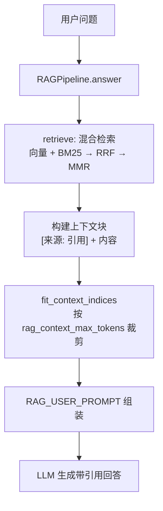
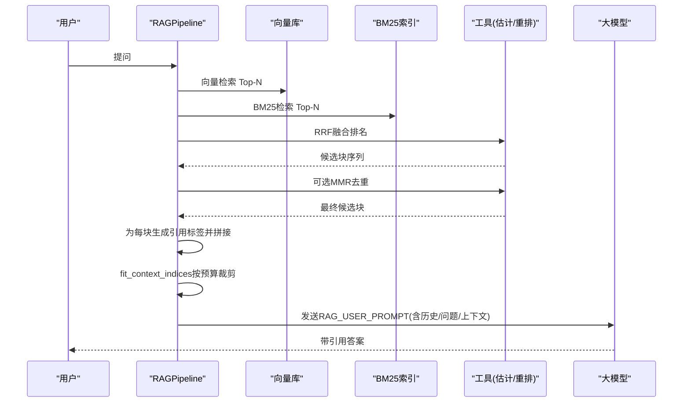
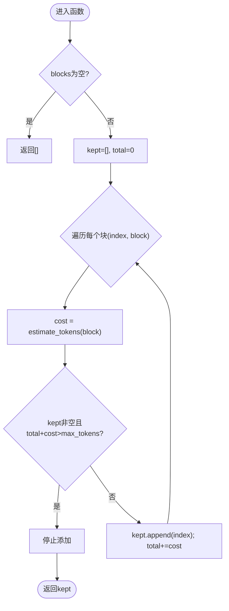
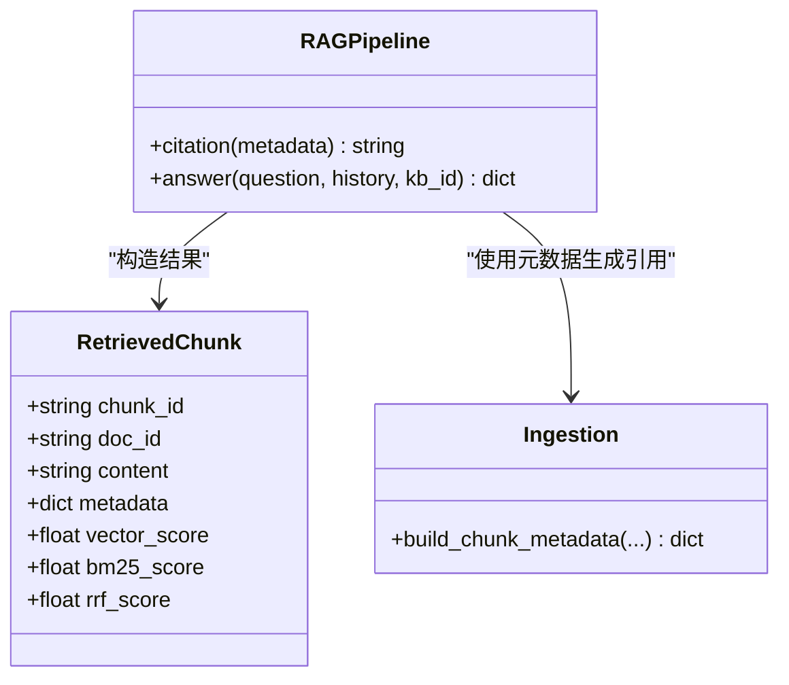
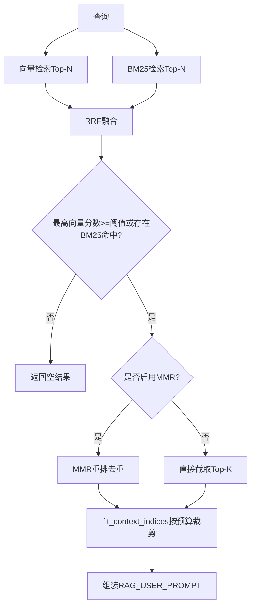
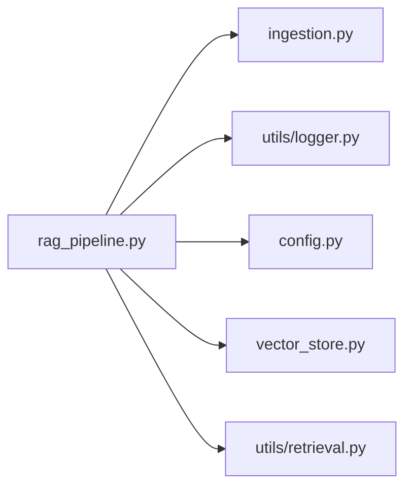

# 上下文管理与构建

<cite>
**本文引用的文件**
- [rag_pipeline.py](file://rag_pipeline.py)
- [config.py](file://config.py)
- [ingestion.py](file://ingestion.py)
- [utils/logger.py](file://utils/logger.py)
- [tests/test_context.py](file://tests/test_context.py)
- [tests/test_retrieval.py](file://tests/test_retrieval.py)
</cite>

## 目录
1. [简介](#简介)
2. [项目结构](#项目结构)
3. [核心组件](#核心组件)
4. [架构总览](#架构总览)
5. [详细组件分析](#详细组件分析)
6. [依赖关系分析](#依赖关系分析)
7. [性能考量](#性能考量)
8. [故障排查指南](#故障排查指南)
9. [结论](#结论)
10. [附录](#附录)

## 简介
本文件聚焦于检索增强生成（RAG）中的“上下文管理与构建”机制，围绕以下目标展开：
- 解释 fit_context_indices 的上下文块选择算法：token 预算分配、块不可拆分原则与完整性保证。
- 说明上下文块的格式化过程：引用标注与内容组织方式。
- 详解 RAG_SYSTEM_PROMPT 与 RAG_USER_PROMPT 的设计思路：指令遵循、幻觉抑制与引用规范。
- 阐述上下文裁剪策略：重要性排序、冗余信息过滤与长度控制。
- 提供具体代码示例路径，展示上下文构建的不同阶段与效果对比。
- 总结上下文长度限制与性能优化技巧。

## 项目结构
与上下文管理直接相关的模块与职责如下：
- rag_pipeline.py：RAG 管线主流程，包含检索、上下文组装、提示词模板、上下文裁剪等。
- ingestion.py：文档解析与切分，负责生成片段元数据，支撑后续引用定位。
- utils/logger.py：轻量 token 估算工具 estimate_tokens，用于历史与上下文的预算控制。
- config.py：集中配置项，包括 chunk_size、top_k、fusion_pool、relevance_threshold、history_max_tokens、rag_context_max_tokens 等。
- tests/test_context.py：针对历史截断与上下文块裁剪的单元测试，验证预算与完整性约束。
- tests/test_retrieval.py：混合检索相关测试，覆盖 BM25、RRF、MMR 等行为，间接影响上下文质量。

图表来源
- [rag_pipeline.py:439-523](file://rag_pipeline.py#L439-L523)
- [rag_pipeline.py:590-666](file://rag_pipeline.py#L590-L666)
- [rag_pipeline.py:181-193](file://rag_pipeline.py#L181-L193)

章节来源
- [rag_pipeline.py:439-523](file://rag_pipeline.py#L439-L523)
- [rag_pipeline.py:590-666](file://rag_pipeline.py#L590-L666)
- [rag_pipeline.py:181-193](file://rag_pipeline.py#L181-L193)

## 核心组件
- 上下文块选择算法：fit_context_indices
  - 输入：已排序的上下文块列表与最大 token 预算。
  - 规则：按顺序累加 token 成本；一旦加入下一块会超预算则停止；至少保留第一块以保证完整性。
  - 输出：被保留的块下标列表。
- 上下文格式化：citation + 块拼接
  - 每个检索到的片段通过 citation 生成“来源, 页码/段落”的引用标签，并前置到块内容前，形成统一格式。
- 提示词设计：RAG_SYSTEM_PROMPT 与 RAG_USER_PROMPT
  - 系统提示强调严格基于检索资料、逐条标注来源、禁止编造事实。
  - 用户提示将历史、问题与上下文组合，要求模型保留来源标识。
- 上下文裁剪策略：
  - 重要性排序：由混合检索（向量+BM25→RRF→可选MMR）决定候选块的重要性。
  - 冗余过滤：MMR 重排降低重复片段占比。
  - 长度控制：fit_context_indices 在 rag_context_max_tokens 预算内裁剪。
- Token 估算：estimate_tokens
  - 中文约 1 token/字，英文/数字约 4 字符/token，用于历史与上下文预算控制。

章节来源
- [rag_pipeline.py:181-193](file://rag_pipeline.py#L181-L193)
- [rag_pipeline.py:775-782](file://rag_pipeline.py#L775-L782)
- [rag_pipeline.py:42-64](file://rag_pipeline.py#L42-L64)
- [utils/logger.py:48-62](file://utils/logger.py#L48-L62)
- [config.py:76-112](file://config.py#L76-L112)

## 架构总览
下图展示了从检索到上下文构建再到 LLM 生成的完整流程，以及各阶段的控制点与约束。

图表来源
- [rag_pipeline.py:439-523](file://rag_pipeline.py#L439-L523)
- [rag_pipeline.py:590-666](file://rag_pipeline.py#L590-L666)
- [rag_pipeline.py:181-193](file://rag_pipeline.py#L181-L193)

## 详细组件分析

### fit_context_indices 上下文块选择算法
- 算法要点
  - 顺序扫描块列表，累计 estimate_tokens(block)。
  - 若当前 total + cost > max_tokens，则停止添加后续块。
  - 至少保留第一块，确保即使预算极小也有上下文可用。
- 复杂度
  - 时间 O(n)，空间 O(k)（k 为保留块数）。
- 边界条件
  - 空输入返回空列表。
  - 单块超长时仍保留该块，避免无上下文。
- 测试验证
  - 保持整块不被拆分，且预算内尽可能多保留。
  - 最小预算下仍保留首块。

图表来源
- [rag_pipeline.py:181-193](file://rag_pipeline.py#L181-L193)
- [utils/logger.py:48-62](file://utils/logger.py#L48-L62)

章节来源
- [rag_pipeline.py:181-193](file://rag_pipeline.py#L181-L193)
- [tests/test_context.py:26-33](file://tests/test_context.py#L26-L33)

### 上下文块的格式化与引用标注
- 引用生成
  - citation 根据 metadata 的 source、page/paragraph 生成“文件名, 第X页/段落Y”的字符串。
- 块组织
  - 每个检索到的块以“[来源: 引用]\n内容”的形式拼接成 context_blocks。
  - 同时记录 sources 列表，便于 UI 展示与审计。
- 数据来源
  - 片段元数据由 build_chunk_metadata 生成，包含 source、doc_id、kb_id、category、tags、page、paragraph 等。

图表来源
- [rag_pipeline.py:134-145](file://rag_pipeline.py#L134-L145)
- [rag_pipeline.py:775-782](file://rag_pipeline.py#L775-L782)
- [ingestion.py:193-215](file://ingestion.py#L193-L215)

章节来源
- [rag_pipeline.py:614-635](file://rag_pipeline.py#L614-L635)
- [rag_pipeline.py:775-782](file://rag_pipeline.py#L775-L782)
- [ingestion.py:193-215](file://ingestion.py#L193-L215)

### RAG_SYSTEM_PROMPT 与 RAG_USER_PROMPT 设计思路
- 指令遵循
  - 系统提示明确要求“严格基于检索资料”，并强制逐条标注来源，避免自由发挥。
- 幻觉抑制
  - 明确禁止补充模型自身知识；当资料不足时直接说明缺失信息。
- 引用规范
  - 每个关键结论后需标注来源；无法标注的信息不得写入回答。
- 用户提示
  - 将最近对话历史、用户问题与检索资料组合，要求模型保留来源标识。

章节来源
- [rag_pipeline.py:42-64](file://rag_pipeline.py#L42-L64)

### 上下文裁剪策略：重要性排序、冗余过滤与长度控制
- 重要性排序
  - 向量检索与 BM25 各自取 Top-N，再通过 RRF 融合排名，综合语义与关键词匹配。
  - 相关性阈值：若最高向量相似度低于阈值且无 BM25 命中，视为无相关内容，直接返回空结果。
- 冗余过滤
  - 启用 MMR 时，对候选块进行多样性重排，减少重复片段占用上下文。
- 长度控制
  - 使用 fit_context_indices 在 rag_context_max_tokens 预算内裁剪上下文块，保证不超限。
- 历史压缩
  - truncate_history 从后往前保留最近消息，避免长对话稀释注意力并节省 token。

图表来源
- [rag_pipeline.py:439-523](file://rag_pipeline.py#L439-L523)
- [rag_pipeline.py:590-666](file://rag_pipeline.py#L590-L666)
- [rag_pipeline.py:159-178](file://rag_pipeline.py#L159-L178)
- [rag_pipeline.py:181-193](file://rag_pipeline.py#L181-L193)

章节来源
- [rag_pipeline.py:439-523](file://rag_pipeline.py#L439-L523)
- [rag_pipeline.py:590-666](file://rag_pipeline.py#L590-L666)
- [rag_pipeline.py:159-178](file://rag_pipeline.py#L159-L178)
- [tests/test_retrieval.py:40-80](file://tests/test_retrieval.py#L40-L80)

### 代码级示例与效果对比
- 上下文块选择
  - 参考测试用例：验证 fit_context_indices 在预算内保留整块，且始终保留首块。
  - 路径：[tests/test_context.py:26-33](file://tests/test_context.py#L26-L33)
- 历史截断
  - 参考测试用例：验证 truncate_history 仅保留最近消息并在预算内。
  - 路径：[tests/test_context.py:9-23](file://tests/test_context.py#L9-L23)
- 混合检索兜底
  - 参考测试用例：当向量无命中但 BM25 强命中时，仍能返回相关片段。
  - 路径：[tests/test_retrieval.py:64-80](file://tests/test_retrieval.py#L64-L80)
- 上下文构建阶段
  - 检索后为每块生成引用标签并拼接，再按预算裁剪，最后组装提示词。
  - 路径：[rag_pipeline.py:614-643](file://rag_pipeline.py#L614-L643)

章节来源
- [tests/test_context.py:9-33](file://tests/test_context.py#L9-L33)
- [tests/test_retrieval.py:64-80](file://tests/test_retrieval.py#L64-L80)
- [rag_pipeline.py:614-643](file://rag_pipeline.py#L614-L643)

## 依赖关系分析
- 模块耦合
  - rag_pipeline.py 依赖 ingestion.py 的片段元数据生成，依赖 utils/logger.py 的 token 估算，依赖 config.py 的配置项。
  - 混合检索依赖外部检索工具（向量库与 BM25），并通过 RRF/MMR 提升上下文质量。
- 外部依赖
  - 向量库：Chroma（通过 VectorStore）。
  - BM25：自定义 BM25Index。
  - 文本切分：langchain_text_splitters。
- 潜在循环依赖
  - 当前实现中未见循环导入；RAGPipeline 作为门面聚合各子系统。

图表来源
- [rag_pipeline.py:27-38](file://rag_pipeline.py#L27-L38)
- [rag_pipeline.py:439-523](file://rag_pipeline.py#L439-L523)

章节来源
- [rag_pipeline.py:27-38](file://rag_pipeline.py#L27-L38)
- [rag_pipeline.py:439-523](file://rag_pipeline.py#L439-L523)

## 性能考量
- 上下文长度限制
  - rag_context_max_tokens：控制上下文块总 token 预算，防止超出模型窗口。
  - history_max_tokens：控制历史消息总 token 预算，避免长对话稀释注意力。
- 检索效率
  - fusion_pool：扩大候选池后再裁剪，提高召回质量。
  - relevance_threshold：低相关查询直接返回空，减少无效上下文。
  - mmr_enabled / mmr_lambda：开启 MMR 可降低重复，但增加计算开销。
- Token 估算
  - estimate_tokens 采用轻量规则，适合快速预算控制；如需更精确可替换为真实 tokenizer。
- 批量嵌入
  - embedding_batch_size：默认上限 20，避免接口报错；合理设置可提升入库吞吐。

章节来源
- [config.py:76-112](file://config.py#L76-L112)
- [rag_pipeline.py:439-523](file://rag_pipeline.py#L439-L523)
- [utils/logger.py:48-62](file://utils/logger.py#L48-L62)

## 故障排查指南
- 无相关内容
  - 现象：retrieve 返回空列表。
  - 可能原因：向量相似度低于阈值且无 BM25 命中。
  - 处理：调整 relevance_threshold 或改进检索词；检查知识库是否已正确入库。
  - 参考：[rag_pipeline.py:483-486](file://rag_pipeline.py#L483-L486)
- 上下文过短或过长
  - 现象：回答缺少引用或提示词过长。
  - 可能原因：rag_context_max_tokens 过小或过大；块大小不合适。
  - 处理：调整 rag_context_max_tokens 与 chunk_size/chunk_overlap。
  - 参考：[config.py:100-110](file://config.py#L100-L110)
- 历史被过度截断
  - 现象：多轮对话丢失重要上下文。
  - 可能原因：history_max_tokens 过小。
  - 处理：增大 history_max_tokens；必要时精简历史内容。
  - 参考：[rag_pipeline.py:159-178](file://rag_pipeline.py#L159-L178)
- 检索结果重复
  - 现象：多个块内容高度相似。
  - 可能原因：未启用 MMR 或 lambda 设置不当。
  - 处理：启用 mmr_enabled 并调整 mmr_lambda。
  - 参考：[rag_pipeline.py:489-503](file://rag_pipeline.py#L489-L503)

章节来源
- [rag_pipeline.py:483-503](file://rag_pipeline.py#L483-L503)
- [rag_pipeline.py:159-178](file://rag_pipeline.py#L159-L178)
- [config.py:100-110](file://config.py#L100-L110)

## 结论
本系统的上下文管理与构建围绕“高质量检索 + 严格预算控制 + 强约束提示词”展开：
- fit_context_indices 保证块不可拆分与完整性，结合 estimate_tokens 实现稳健的 token 预算控制。
- 混合检索（向量+BM25→RRF→MMR）提升上下文的相关性与多样性。
- RAG_SYSTEM_PROMPT 与 RAG_USER_PROMPT 强化指令遵循与幻觉抑制，确保回答有据可查。
- 通过可配置参数灵活平衡召回、去重与长度限制，满足不同场景需求。

## 附录
- 关键配置项速览
  - CHUNK_SIZE / CHUNK_OVERLAP：切分粒度与重叠。
  - RETRIEVAL_TOP_K / RETRIEVAL_FUSION_POOL：最终返回与候选池大小。
  - RETRIEVAL_RELEVANCE_THRESHOLD：相关性门槛。
  - RETRIEVAL_MMR_ENABLED / RETRIEVAL_MMR_LAMBDA：去重开关与权重。
  - HISTORY_MAX_TOKENS / RAG_CONTEXT_MAX_TOKENS：历史与上下文预算。
  - AGENT_MAX_STEPS：Agent 最大工具调用轮数。
  - EMBEDDING_BATCH_SIZE：向量化批大小。
- 参考路径
  - 上下文裁剪算法：[rag_pipeline.py:181-193](file://rag_pipeline.py#L181-L193)
  - 提示词模板：[rag_pipeline.py:42-64](file://rag_pipeline.py#L42-L64)
  - 片段元数据生成：[ingestion.py:193-215](file://ingestion.py#L193-L215)
  - Token 估算：[utils/logger.py:48-62](file://utils/logger.py#L48-L62)
  - 配置项定义：[config.py:76-112](file://config.py#L76-L112)