# 对话流程控制

<cite>
**本文引用的文件**
- [app.py](file://app.py)
- [api.py](file://api.py)
- [rag_pipeline.py](file://rag_pipeline.py)
- [react_agent.py](file://react_agent.py)
- [llm_client.py](file://llm_client.py)
- [store.py](file://store.py)
- [vector_store.py](file://vector_store.py)
- [ingestion.py](file://ingestion.py)
- [config.py](file://config.py)
</cite>

## 更新摘要
**变更内容**
- 新增了上下文菜单系统和对话置顶功能，改进了对话管理的用户体验
- 实现了对话列表的三点菜单操作，支持重命名、置顶/取消置顶和删除操作
- 置顶的对话会显示📌前缀并自动排在列表顶部
- 优化了欢迎页面消息重复显示的问题，提升了用户交互体验
- 完善了多对话管理系统，支持每个对话独立的消息历史和知识库选择

## 目录
1. [简介](#简介)
2. [项目结构](#项目结构)
3. [核心组件](#核心组件)
4. [架构总览](#架构总览)
5. [详细组件分析](#详细组件分析)
6. [依赖关系分析](#依赖关系分析)
7. [性能考量](#性能考量)
8. [故障排查指南](#故障排查指南)
9. [结论](#结论)
10. [附录：关键调用序列与数据模型](#附录：关键调用序列与数据模型)

## 简介
本文件聚焦"对话流程控制"的实现机制，覆盖以下目标：
- 说明 answer 方法的通用问答流程：知识库检测、查询改写、检索执行、回答生成。
- 说明 chat 方法的普通对话功能：系统提示词设置与历史消息处理。
- 详解对话状态管理：历史记录截断、会话持久化（Streamlit 会话）、状态同步（后台入库刷新）。
- 解释知识库问答与通用对话的区别与切换逻辑。
- 提供具体代码示例路径，展示不同对话场景的处理流程与响应格式。
- 说明对话性能优化与错误处理机制。

**更新** 新增了上下文菜单系统和对话置顶功能，显著提升了对话管理的用户体验。现在对话列表支持通过三点菜单进行重命名、置顶/取消置顶和删除操作，置顶的对话会显示📌前缀并排在列表顶部。同时优化了欢迎页面的用户体验，解决了消息重复显示的问题。

## 项目结构
本项目采用分层模块化设计：
- 表现层：Streamlit 应用（app.py）与 FastAPI 服务（api.py），负责用户交互与 API 暴露。
- 编排层：ReActAgent（react_agent.py）实现工具选择与多步循环；RAGPipeline（rag_pipeline.py）封装知识库管理、入库、检索与问答。
- 基础设施层：LLM 客户端（llm_client.py）、向量存储（vector_store.py）、元数据存储（store.py）、文档解析与切分（ingestion.py）、配置（config.py）。

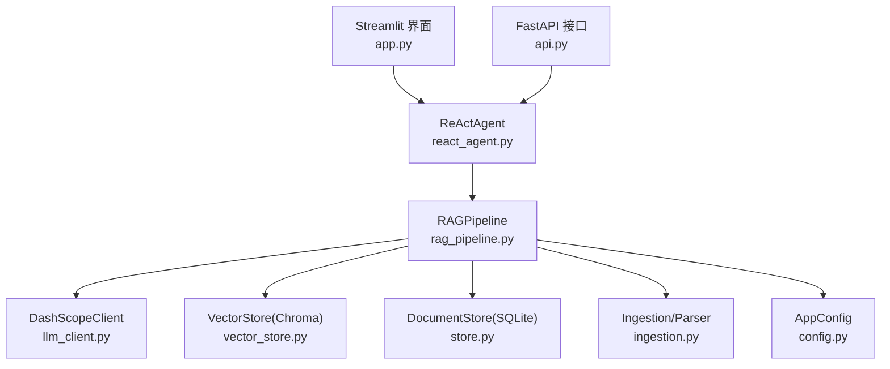

图表来源
- [app.py:51-54](file://app.py#L51-L54)
- [api.py:52-57](file://api.py#L52-L57)
- [rag_pipeline.py:196-219](file://rag_pipeline.py#L196-L219)
- [react_agent.py:144-161](file://react_agent.py#L144-L161)
- [llm_client.py:22-46](file://llm_client.py#L22-L46)
- [vector_store.py:38-59](file://vector_store.py#L38-L59)
- [store.py:123-139](file://store.py#L123-L139)
- [ingestion.py:24-38](file://ingestion.py#L24-L38)
- [config.py:56-112](file://config.py#L56-L112)

章节来源
- [app.py:1-613](file://app.py#L1-L613)
- [api.py:1-204](file://api.py#L1-L204)
- [rag_pipeline.py:1-792](file://rag_pipeline.py#L1-L792)
- [react_agent.py:1-567](file://react_agent.py#L1-L567)
- [llm_client.py:1-322](file://llm_client.py#L1-L322)
- [store.py:1-470](file://store.py#L1-L470)
- [vector_store.py:1-255](file://vector_store.py#L1-L255)
- [ingestion.py:1-216](file://ingestion.py#L1-L216)
- [config.py:1-113](file://config.py#L1-L113)

## 核心组件
- RAGPipeline：统一入口，负责知识库管理、增量入库、混合检索、查询改写、带引用回答与通用聊天。
- ReActAgent：基于 Function Calling 的轻量 Agent，支持工具注册表、多步循环与流式输出。
- DashScopeClient：对百炼 OpenAI 兼容接口的安全封装，提供 chat/chat_raw/stream_chat/stream_chat_raw/web_search/embeddings。
- VectorStore：Chroma 向量库封装，支持批量 upsert、条件删除、相似度查询、MMR 所需向量获取。
- DocumentStore：SQLite 元数据存储，维护知识库、文档、版本、片段与键值配置。
- Ingestion：文档解析与切分，支持 PDF/Word/Markdown/TXT，含 OCR 回退。
- AppConfig：集中配置项，通过环境变量注入，控制检索、上下文、Agent 行为等。

章节来源
- [rag_pipeline.py:196-219](file://rag_pipeline.py#L196-L219)
- [react_agent.py:144-161](file://react_agent.py#L144-L161)
- [llm_client.py:22-46](file://llm_client.py#L22-L46)
- [vector_store.py:38-59](file://vector_store.py#L38-L59)
- [store.py:123-139](file://store.py#L123-L139)
- [ingestion.py:24-38](file://ingestion.py#L24-L38)
- [config.py:56-112](file://config.py#L56-L112)

## 架构总览
对话从 UI 或 API 进入，由 ReActAgent 决定是否需要调用工具（知识库检索、天气、联网搜索、数据库查询）。若需要知识库检索，则委托 RAGPipeline.answer 完成检索与生成；若无知识库或无需检索，则走 RAGPipeline.chat 进行通用对话。所有外部调用均通过 DashScopeClient 完成，并记录 token 用量。

**更新** 新增了上下文菜单系统和对话置顶功能，每个对话会话独立维护消息历史、选定的知识库和元数据，支持通过三点菜单进行重命名、置顶/取消置顶和删除操作。特别优化了欢迎页面的用户体验，通过pending_question字段和防重复渲染机制解决了消息重复显示的问题。

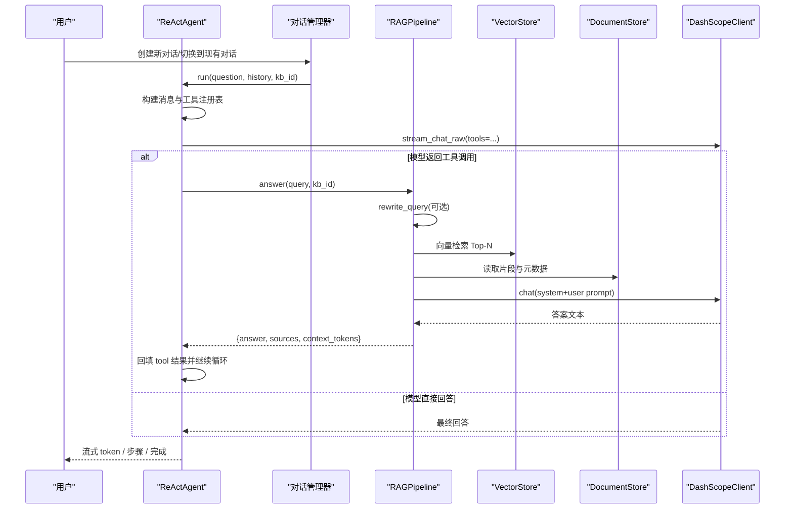

图表来源
- [react_agent.py:272-369](file://react_agent.py#L272-L369)
- [rag_pipeline.py:566-666](file://rag_pipeline.py#L566-L666)
- [rag_pipeline.py:439-523](file://rag_pipeline.py#L439-L523)
- [llm_client.py:203-278](file://llm_client.py#L203-L278)
- [app.py:216-231](file://app.py#L216-L231)

## 详细组件分析

### answer 方法：通用问答流程
answer 是知识库问答的核心入口，流程如下：
- 知识库检测：通过 _resolve_kb 解析 kb_id；若未找到有效知识库，则降级为 chat 通用对话。
- 查询改写：当启用 query_rewrite_enabled 且存在历史时，调用 rewrite_query 将追问题改写为独立明确的问题。
- 检索执行：调用 retrieve 进行混合检索（向量 + BM25，RRF 融合，可选 MMR 去重），并依据相关性阈值过滤低相关结果。
- 上下文组装：按 chunk 构造带来源标注的上下文块，结合 truncate_history 保留最近历史，使用 fit_context_indices 在 token 预算内裁剪上下文。
- 回答生成：以 RAG_SYSTEM_PROMPT 和 RAG_USER_PROMPT 组织 messages，调用 llm.chat 生成带引用的回答，统计 context_tokens。
- 异常处理：捕获异常并返回友好错误信息。

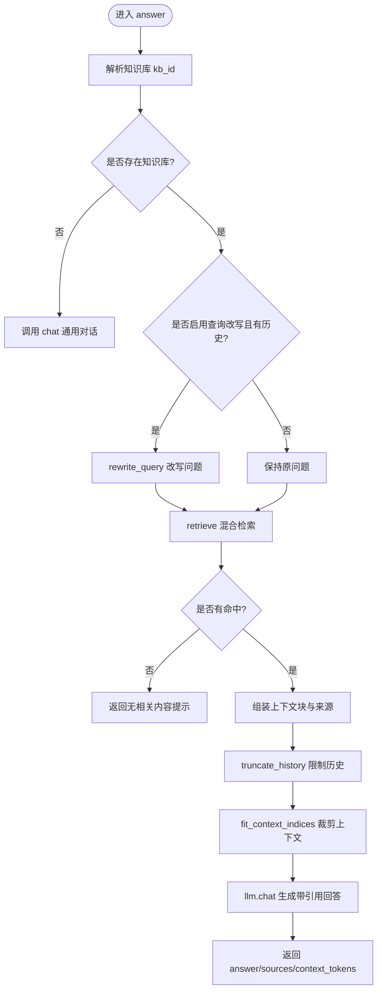

图表来源
- [rag_pipeline.py:590-666](file://rag_pipeline.py#L590-L666)
- [rag_pipeline.py:566-588](file://rag_pipeline.py#L566-L588)
- [rag_pipeline.py:439-523](file://rag_pipeline.py#L439-L523)
- [rag_pipeline.py:159-193](file://rag_pipeline.py#L159-L193)

章节来源
- [rag_pipeline.py:590-666](file://rag_pipeline.py#L590-L666)
- [rag_pipeline.py:566-588](file://rag_pipeline.py#L566-L588)
- [rag_pipeline.py:439-523](file://rag_pipeline.py#L439-L523)
- [rag_pipeline.py:159-193](file://rag_pipeline.py#L159-L193)

### chat 方法：普通对话功能
chat 用于无知识库或无需检索时的通用对话：
- 系统提示词：CHAT_SYSTEM_PROMPT 设定助手角色与约束（不声称读取用户文件、时效性提示等）。
- 历史处理：truncate_history 限制历史长度，避免长上下文稀释注意力与增加计费。
- 消息构建：system + 历史 + 当前问题，调用 llm.chat 生成回答。
- 异常处理：捕获异常并返回友好错误信息。

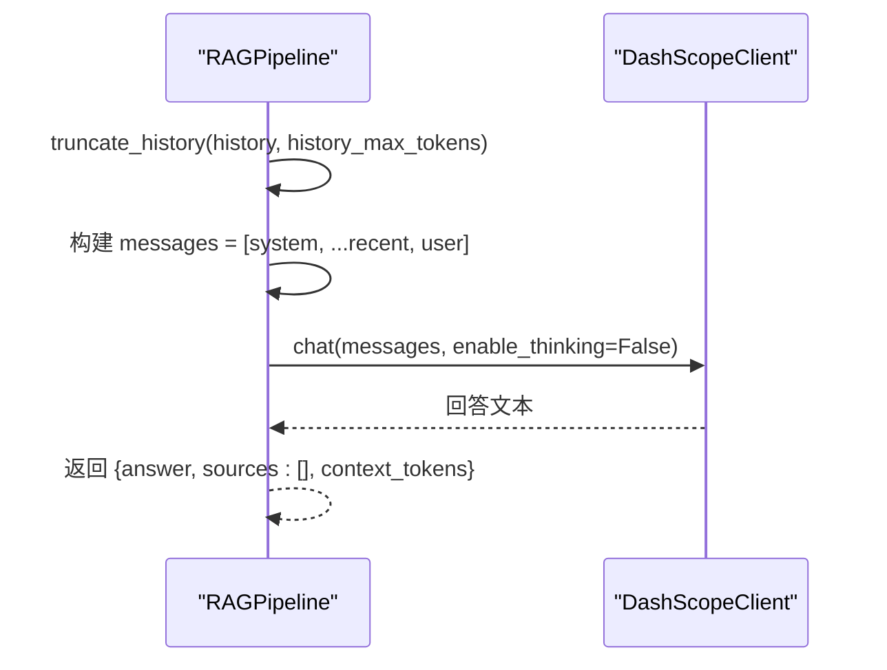

图表来源
- [rag_pipeline.py:668-696](file://rag_pipeline.py#L668-L696)
- [rag_pipeline.py:159-178](file://rag_pipeline.py#L159-L178)
- [llm_client.py:94-127](file://llm_client.py#L94-L127)

章节来源
- [rag_pipeline.py:668-696](file://rag_pipeline.py#L668-L696)
- [rag_pipeline.py:159-178](file://rag_pipeline.py#L159-L178)
- [llm_client.py:94-127](file://llm_client.py#L94-L127)

### 上下文菜单系统与对话置顶功能
**新增** 系统实现了完整的上下文菜单系统和对话置顶功能，大幅提升了对话管理的用户体验：

#### 上下文菜单实现
- **三点菜单按钮**：每行对话右侧显示"⋯"按钮，鼠标悬停时显示
- **菜单功能**：包含重命名、置顶/取消置顶、删除三个主要操作
- **CSS样式**：通过自定义样式实现悬停显示效果和视觉优化

#### 对话置顶功能
- **置顶标记**：置顶的对话显示📌前缀，便于识别
- **排序逻辑**：置顶对话自动排在列表顶部，非置顶对话按时间倒序排列
- **状态管理**：每个对话独立维护pinned状态，支持动态切换

#### 对话重命名功能
- **输入框**：弹出菜单中包含会话名称输入框
- **保存机制**：点击"保存名称"按钮后更新对话标题
- **默认标题**：基于第一条用户消息自动生成标题

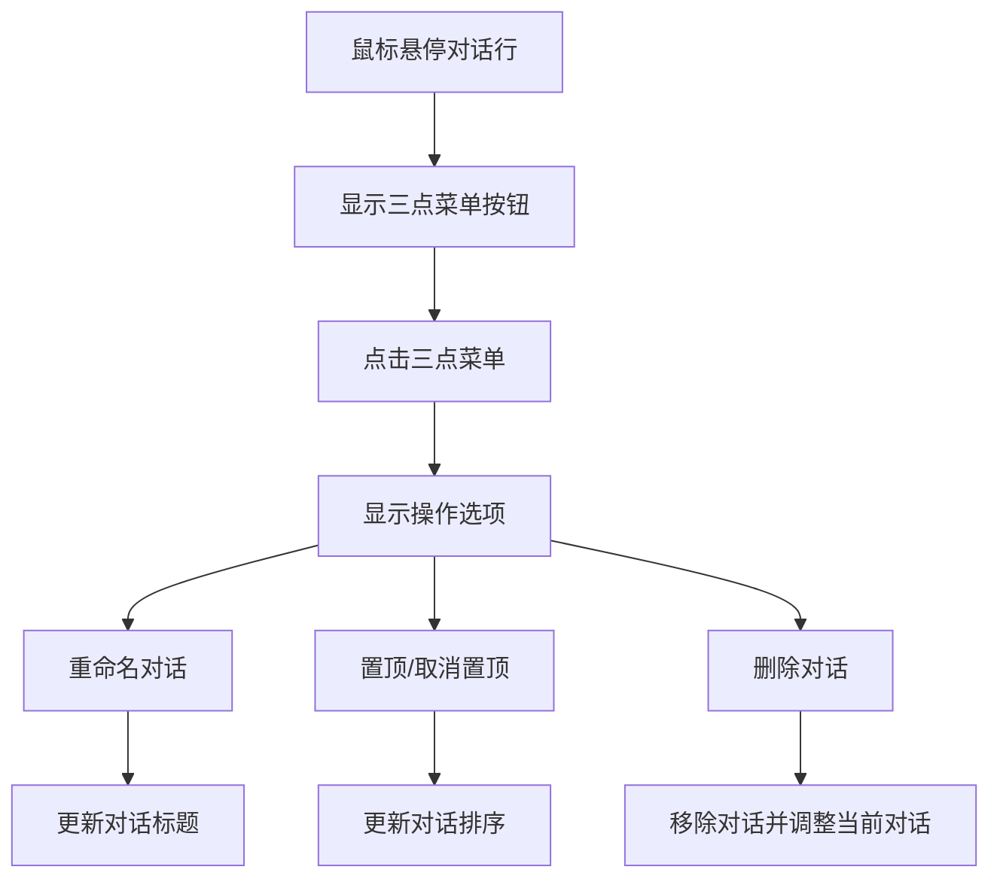

图表来源
- [app.py:106-122](file://app.py#L106-L122)
- [app.py:307-355](file://app.py#L307-L355)

章节来源
- [app.py:106-122](file://app.py#L106-L122)
- [app.py:307-355](file://app.py#L307-L355)

### 多对话管理系统
系统实现了完整的多对话管理功能，支持同时维护多个独立的对话会话：

#### 对话数据结构
每个对话会话包含以下字段：
- `id`: 唯一标识符（UUID前10位）
- `title`: 对话标题（基于第一条用户消息自动生成）
- `messages`: 消息历史列表
- `kb_id`: 选定的知识库ID
- `pinned`: 置顶状态标记

#### 核心管理函数
- `_new_conversation(kb_id, title)`: 创建新对话，默认标题为"新对话"
- `_current_conversation()`: 获取当前活动对话
- `_conversation_title_from(text)`: 从文本生成对话标题（截取前18个字符）
- `_init_conversations()`: 初始化对话系统，创建默认对话
- `_history_messages()`: 获取当前对话的历史消息（排除最后一条）

#### 会话状态管理
- 使用 `st.session_state.conversations` 字典存储所有对话
- `st.session_state.current_conv_id` 跟踪当前活动对话
- 每个对话独立维护消息历史和选定的知识库
- 支持对话的创建、切换、删除和清空操作

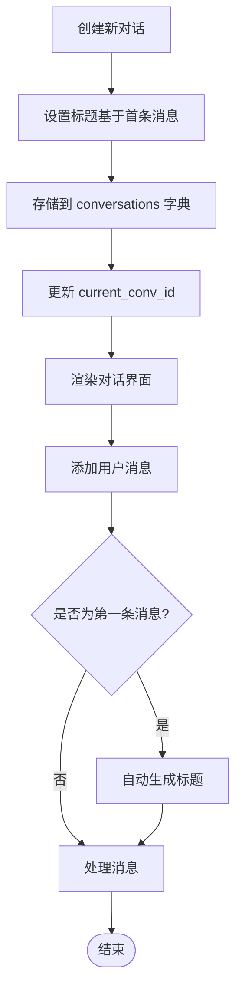

图表来源
- [app.py:216-231](file://app.py#L216-L231)
- [app.py:234-249](file://app.py#L234-L249)
- [app.py:501-504](file://app.py#L501-L504)

章节来源
- [app.py:216-231](file://app.py#L216-L231)
- [app.py:234-249](file://app.py#L234-L249)
- [app.py:263-312](file://app.py#L263-L312)
- [app.py:501-504](file://app.py#L501-L504)

### 对话状态管理
- 历史记录截断：
  - truncate_history：按 token 预算从后往前保留最近历史，至少保留最后一条，避免长对话稀释注意力与浪费 token。
  - fit_context_indices：在 RAG 上下文中按 token 预算保留片段块下标，保证块不可拆分且至少保留第一块。
- 会话持久化：
  - Streamlit 侧使用 st.session_state 保存 messages、kb_id、入库任务状态等；UI 渲染时仅显示最近 20 条消息。
  - API 侧通过请求体中的 history 字段传递历史，服务端不持久化会话。
- 状态同步：
  - 后台入库完成后调用 rag.refresh()，重置向量客户端连接并标记 BM25/片段缓存失效，确保后续检索使用最新数据。

**更新** 会话状态管理现已支持多对话模式和上下文菜单操作，每个对话独立维护状态，互不影响。特别优化了欢迎页面的消息处理逻辑，通过pending_question字段和防重复渲染机制解决了消息重复显示的问题。

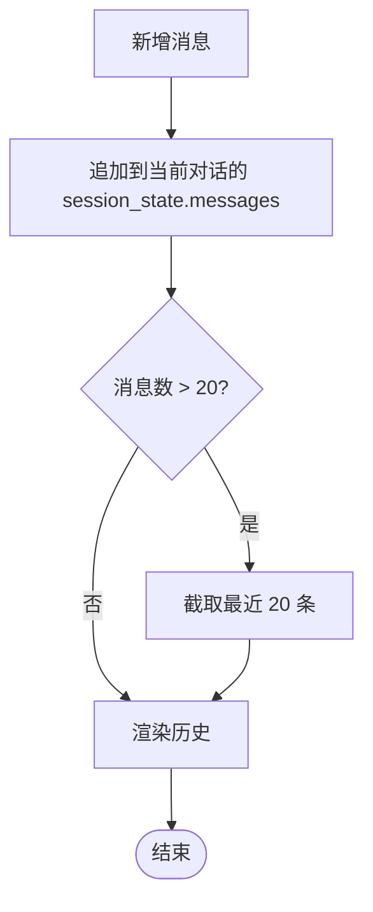

图表来源
- [app.py:127-136](file://app.py#L127-L136)
- [app.py:251-255](file://app.py#L251-L255)
- [app.py:327-341](file://app.py#L327-L341)
- [rag_pipeline.py:720-726](file://rag_pipeline.py#L720-L726)

章节来源
- [app.py:127-136](file://app.py#L127-L136)
- [app.py:251-255](file://app.py#L251-L255)
- [app.py:327-341](file://app.py#L327-L341)
- [rag_pipeline.py:720-726](file://rag_pipeline.py#L720-L726)
- [rag_pipeline.py:159-193](file://rag_pipeline.py#L159-L193)

### 知识库问答与通用对话的区别与切换逻辑
- 区别：
  - 知识库问答：先检索再回答，强调"严格基于检索资料"，强制引用来源，禁止幻觉补充。
  - 通用对话：直接基于模型知识回答，不声称读取用户文件，必要时提示联网工具。
- 切换逻辑：
  - answer 中通过 _resolve_kb 判断是否存在有效知识库；若无则直接调用 chat 降级为通用对话。
  - Agent 工具层面，search_knowledge_base 工具内部也调用 RAGPipeline.answer，从而复用同一套问答流程。

**更新** 在多对话模式下，每个对话可以独立选择不同的知识库，支持在同一会话中进行不同类型的问题解答。上下文菜单系统提供了便捷的对话管理功能。

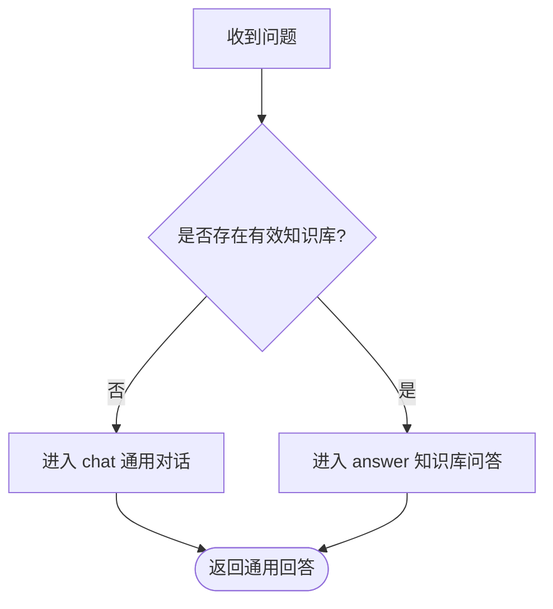

图表来源
- [rag_pipeline.py:590-604](file://rag_pipeline.py#L590-L604)
- [rag_pipeline.py:733-737](file://rag_pipeline.py#L733-L737)
- [react_agent.py:165-174](file://react_agent.py#L165-L174)

章节来源
- [rag_pipeline.py:590-604](file://rag_pipeline.py#L590-L604)
- [rag_pipeline.py:733-737](file://rag_pipeline.py#L733-L737)
- [react_agent.py:165-174](file://react_agent.py#L165-L174)

### 具体代码示例与响应格式
- Streamlit 聊天事件流：
  - 事件类型：tool_start、tool_end、step、token、done、error。
  - 参考路径：[app.py:300-339](file://app.py#L300-L339)
- API 聊天请求与响应：
  - 请求体：ChatRequest(question, history, kb_id)。
  - 响应体：ChatResponse(answer, sources, steps, kb_id)。
  - 参考路径：[api.py:63-77](file://api.py#L63-L77)、[api.py:185-199](file://api.py#L185-L199)
- Agent 流式输出：
  - run_stream 产出事件字典，包含工具调用、步骤轨迹与 token 增量。
  - 参考路径：[react_agent.py:272-369](file://react_agent.py#L272-L369)
- 知识库问答返回：
  - answer 返回 {answer, sources, query, kb_id, context_tokens}。
  - 参考路径：[rag_pipeline.py:658-664](file://rag_pipeline.py#L658-L664)
- 通用对话返回：
  - chat 返回 {answer, sources:[], context_tokens}。
  - 参考路径：[rag_pipeline.py:690-694](file://rag_pipeline.py#L690-L694)

**更新** 欢迎页面消息处理优化：
- 用户提交问题时立即追加到会话，避免重复渲染
- 使用pending_question字段实现跨渲染周期的状态传递
- 通过already_queued检查防止消息重复处理
- 上下文菜单系统提供便捷的对话管理操作

章节来源
- [app.py:300-339](file://app.py#L300-L339)
- [api.py:63-77](file://api.py#L63-L77)
- [api.py:185-199](file://api.py#L185-L199)
- [react_agent.py:272-369](file://react_agent.py#L272-L369)
- [rag_pipeline.py:658-664](file://rag_pipeline.py#L658-L664)
- [rag_pipeline.py:690-694](file://rag_pipeline.py#L690-L694)
- [app.py:464-473](file://app.py#L464-L473)
- [app.py:507-519](file://app.py#L507-L519)

## 依赖关系分析
- 模块耦合：
  - app.py 与 api.py 分别依赖 ReActAgent 与 RAGPipeline，形成表现层与编排层的解耦。
  - ReActAgent 依赖 RAGPipeline 的工具能力与 LLM 客户端，工具注册表可插拔扩展。
  - RAGPipeline 依赖 VectorStore、DocumentStore、Ingestion 与 LLM 客户端，构成检索与生成的核心链路。
- 外部依赖：
  - DashScopeClient 对接百炼 OpenAI 兼容接口，提供 chat、stream_chat、web_search、embeddings。
  - Chroma 作为向量存储，SQLite 作为元数据存储，保障本地化部署与零运维成本。

**更新** 新增了上下文菜单系统和对话管理系统的依赖关系，app.py 现在管理多个对话实例，每个实例独立维护状态。特别优化了欢迎页面的消息处理逻辑，通过pending_question字段和防重复渲染机制提升了用户体验。

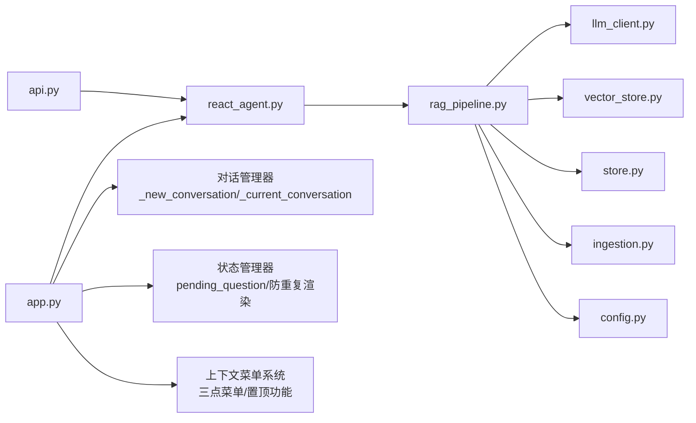

图表来源
- [app.py:51-54](file://app.py#L51-L54)
- [api.py:52-57](file://api.py#L52-L57)
- [react_agent.py:144-161](file://react_agent.py#L144-L161)
- [rag_pipeline.py:196-219](file://rag_pipeline.py#L196-L219)
- [llm_client.py:22-46](file://llm_client.py#L22-L46)
- [vector_store.py:38-59](file://vector_store.py#L38-L59)
- [store.py:123-139](file://store.py#L123-L139)
- [ingestion.py:24-38](file://ingestion.py#L24-L38)
- [config.py:56-112](file://config.py#L56-L112)
- [app.py:216-231](file://app.py#L216-L231)
- [app.py:464-473](file://app.py#L464-L473)
- [app.py:507-519](file://app.py#L507-L519)

章节来源
- [app.py:51-54](file://app.py#L51-L54)
- [api.py:52-57](file://api.py#L52-L57)
- [react_agent.py:144-161](file://react_agent.py#L144-L161)
- [rag_pipeline.py:196-219](file://rag_pipeline.py#L196-L219)
- [llm_client.py:22-46](file://llm_client.py#L22-L46)
- [vector_store.py:38-59](file://vector_store.py#L38-L59)
- [store.py:123-139](file://store.py#L123-L139)
- [ingestion.py:24-38](file://ingestion.py#L24-L38)
- [config.py:56-112](file://config.py#L56-L112)

## 性能考量
- 检索性能：
  - 混合检索：向量 Top-N 与 BM25 Top-N 经 RRF 融合，提升召回质量；可选 MMR 去重增强多样性。
  - 相关性阈值：低于 relevance_threshold 且无 BM25 命中时视为无相关内容，避免硬凑答案。
  - 候选池大小：fusion_pool 控制参与融合的候选数量，平衡召回与计算开销。
- 上下文与历史：
  - truncate_history 与 fit_context_indices 共同控制历史与上下文 token 预算，降低首字延迟与费用。
  - RAG 生成时关闭 enable_thinking，减少思考过程带来的额外延迟。
- 向量化与入库：
  - embedding_batch_size 控制批量嵌入大小，避免超出模型接口限制。
  - 增量入库：SHA-256 判重与索引配置签名变化触发全量重建，避免旧向量与新配置不匹配。
- 并发与锁：
  - API 层使用 threading.RLock 串行化读写，避免 SQLite/Chroma 并发访问问题。
  - Streamlit 后台入库线程与主线程通过 IngestJob 状态对象与 lock 同步进度。

**更新** 多对话模式下的性能考虑：
- 内存管理：每个对话独立维护消息历史，需要注意内存占用
- 并发处理：支持同时处理多个对话，但共享相同的 RAGPipeline 实例
- 资源隔离：每个对话可以选择不同的知识库，避免相互干扰
- 用户体验优化：通过pending_question字段和防重复渲染机制减少了不必要的重新渲染，提升了响应速度
- 上下文菜单性能：三点菜单仅在鼠标悬停时显示，减少了初始渲染开销

章节来源
- [rag_pipeline.py:439-523](file://rag_pipeline.py#L439-L523)
- [rag_pipeline.py:159-193](file://rag_pipeline.py#L159-L193)
- [rag_pipeline.py:306-435](file://rag_pipeline.py#L306-L435)
- [vector_store.py:61-78](file://vector_store.py#L61-L78)
- [api.py:31-33](file://api.py#L31-L33)
- [app.py:76-104](file://app.py#L76-L104)
- [app.py:464-473](file://app.py#L464-L473)
- [app.py:507-519](file://app.py#L507-L519)

## 故障排查指南
- 模型调用失败：
  - 检查 DASHSCOPE_API_KEY、DASHSCOPE_BASE_URL、模型名是否正确。
  - 参考路径：[llm_client.py:59-66](file://llm_client.py#L59-L66)、[llm_client.py:75-86](file://llm_client.py#L75-L86)
- 知识库不存在：
  - API 路由中对 kb_id 校验，不存在返回 404。
  - 参考路径：[api.py:90-93](file://api.py#L90-L93)
- 文档上传失败：
  - 不支持的文件类型会抛出 ValueError；入库过程中异常会被收集并报告。
  - 参考路径：[rag_pipeline.py:260-288](file://rag_pipeline.py#L260-L288)、[rag_pipeline.py:318-435](file://rag_pipeline.py#L318-L435)
- 向量检索为空：
  - 可能因相关性阈值过高或无 BM25 命中；可调整 RETRIEVAL_RELEVANCE_THRESHOLD、RETRIEVAL_TOP_K、RETRIEVAL_FUSION_POOL。
  - 参考路径：[rag_pipeline.py:484-486](file://rag_pipeline.py#L484-L486)
- 流式输出异常：
  - Agent 流式调用捕获异常并返回 error 事件；UI 显示错误消息。
  - 参考路径：[react_agent.py:307-311](file://react_agent.py#L307-L311)
- 后端服务健康检查：
  - 使用 /health 接口确认服务可用性。
  - 参考路径：[api.py:98-100](file://api.py#L98-L100)

**更新** 多对话模式下的故障排查：
- 对话状态丢失：检查 st.session_state.conversations 和 current_conv_id 是否正确设置
- 对话切换问题：验证 _current_conversation() 是否能正确获取当前对话
- 标题生成异常：检查 _conversation_title_from() 函数的输入参数
- 欢迎页面消息重复：检查pending_question字段的使用和already_queued检查逻辑
- 消息处理异常：验证消息追加逻辑和防重复渲染机制是否正常工作
- 上下文菜单问题：检查CSS样式是否正确加载，三点菜单按钮是否正常显示
- 置顶功能异常：验证pinned状态是否正确更新，对话排序逻辑是否正常工作

章节来源
- [llm_client.py:59-66](file://llm_client.py#L59-L66)
- [llm_client.py:75-86](file://llm_client.py#L75-L86)
- [api.py:90-93](file://api.py#L90-L93)
- [rag_pipeline.py:260-288](file://rag_pipeline.py#L260-L288)
- [rag_pipeline.py:318-435](file://rag_pipeline.py#L318-L435)
- [rag_pipeline.py:484-486](file://rag_pipeline.py#L484-L486)
- [react_agent.py:307-311](file://react_agent.py#L307-L311)
- [api.py:98-100](file://api.py#L98-L100)
- [app.py:464-473](file://app.py#L464-L473)
- [app.py:507-519](file://app.py#L507-L519)

## 结论
本项目的对话流程控制以 RAGPipeline 为核心，结合 ReActAgent 的工具调度能力，实现了知识库问答与通用对话的统一编排。通过查询改写、混合检索、上下文裁剪与流式输出，系统在准确性、实时性与用户体验之间取得平衡。配置化与模块化设计使得参数调优与功能扩展更加灵活。错误处理与性能优化措施保障了服务的稳定性与效率。

**更新** 新增的上下文菜单系统和对话置顶功能显著提升了用户体验，支持通过三点菜单进行重命名、置顶/取消置顶和删除操作。置顶的对话会显示📌前缀并自动排在列表顶部，便于用户快速定位重要对话。基于第一条用户消息的自动生成标题功能增强了对话的可识别性。特别优化的欢迎页面消息处理机制，通过pending_question字段和防重复渲染技术，有效解决了消息重复显示的问题，提供了更流畅的用户交互体验。这种架构设计使得系统能够更好地支持复杂的多轮对话场景和多任务处理需求。

## 附录：关键调用序列与数据模型

### 类图：核心数据结构
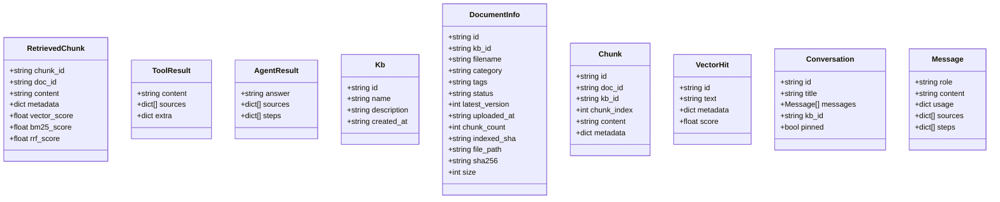

图表来源
- [rag_pipeline.py:134-145](file://rag_pipeline.py#L134-L145)
- [react_agent.py:70-83](file://react_agent.py#L70-83)
- [store.py:88-121](file://store.py#L88-L121)
- [vector_store.py:30-36](file://vector_store.py#L30-L36)
- [app.py:216-222](file://app.py#L216-L222)

### 序列图：API 聊天调用
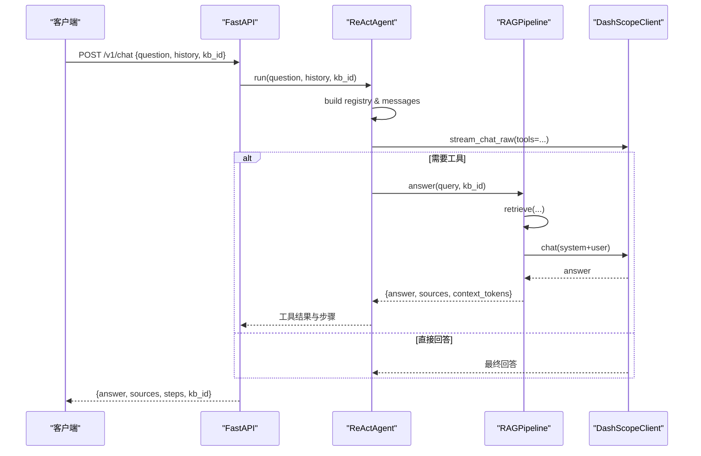

图表来源
- [api.py:185-199](file://api.py#L185-L199)
- [react_agent.py:250-270](file://react_agent.py#L250-270)
- [react_agent.py:272-369](file://react_agent.py#L272-L369)
- [rag_pipeline.py:590-666](file://rag_pipeline.py#L590-L666)
- [llm_client.py:203-278](file://llm_client.py#L203-L278)

### 序列图：多对话管理流程
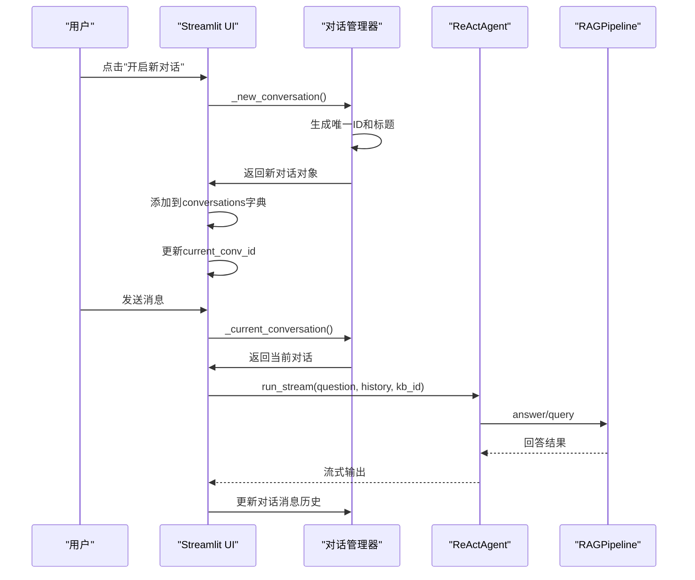

图表来源
- [app.py:265-275](file://app.py#L265-L275)
- [app.py:216-231](file://app.py#L216-L231)
- [app.py:501-504](file://app.py#L501-L504)
- [app.py:516-522](file://app.py#L516-L522)

### 序列图：上下文菜单操作流程
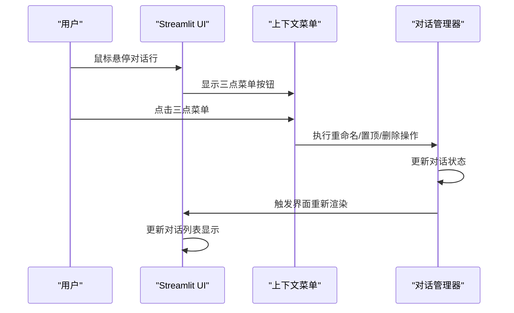

图表来源
- [app.py:106-122](file://app.py#L106-L122)
- [app.py:307-355](file://app.py#L307-L355)

### 序列图：欢迎页面消息处理优化
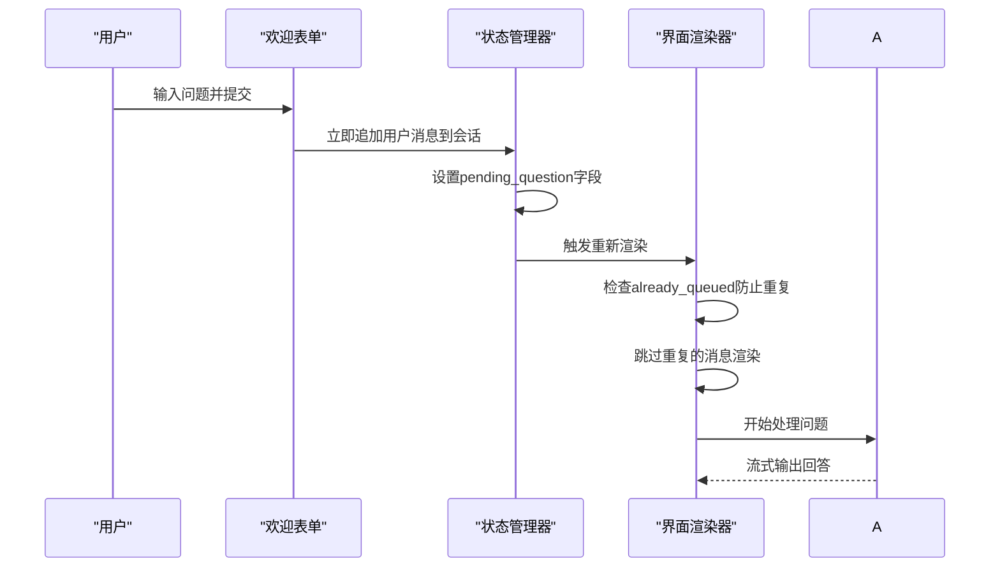

图表来源
- [app.py:464-473](file://app.py#L464-L473)
- [app.py:507-519](file://app.py#L507-L519)
- [app.py:528-569](file://app.py#L528-L569)