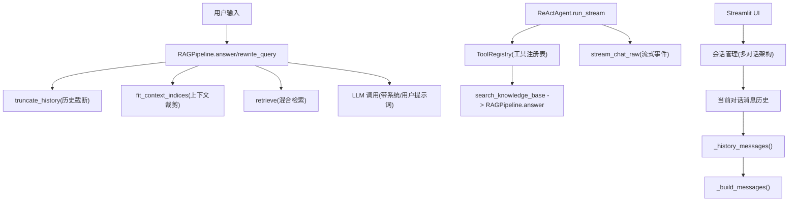
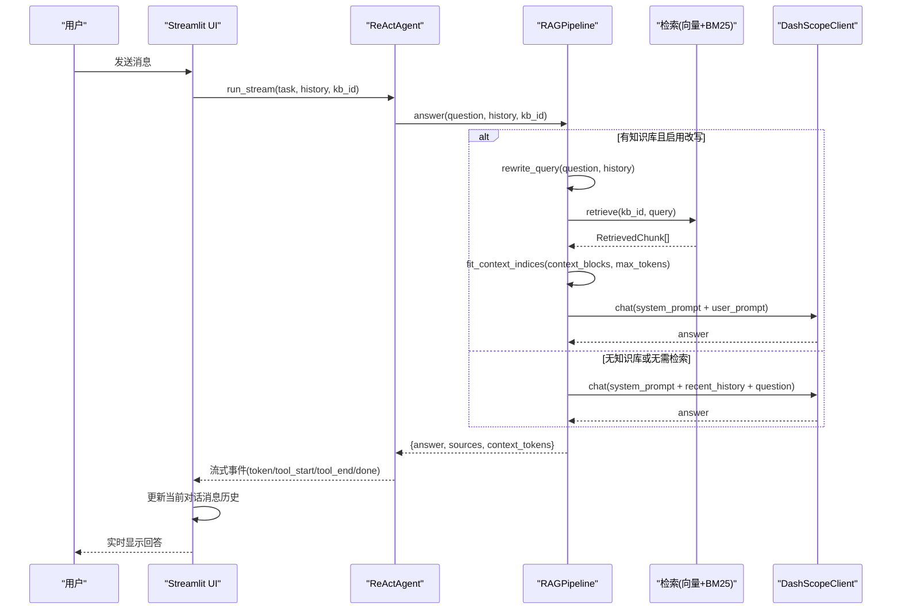
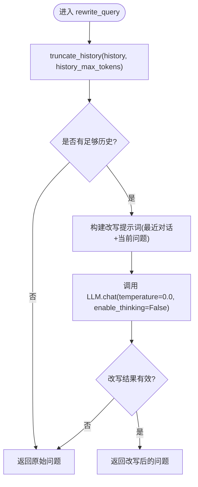
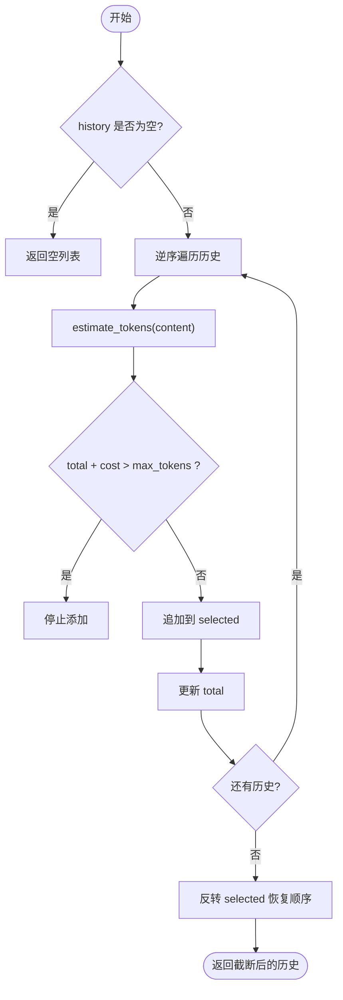
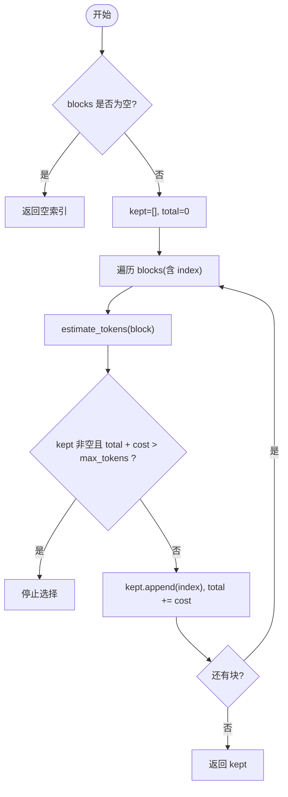
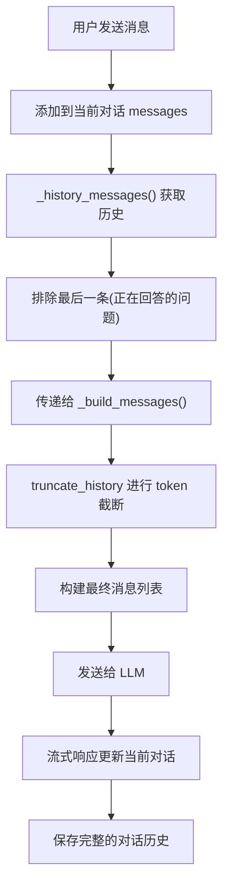
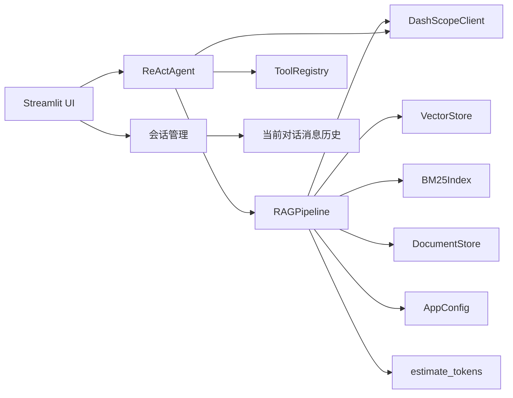
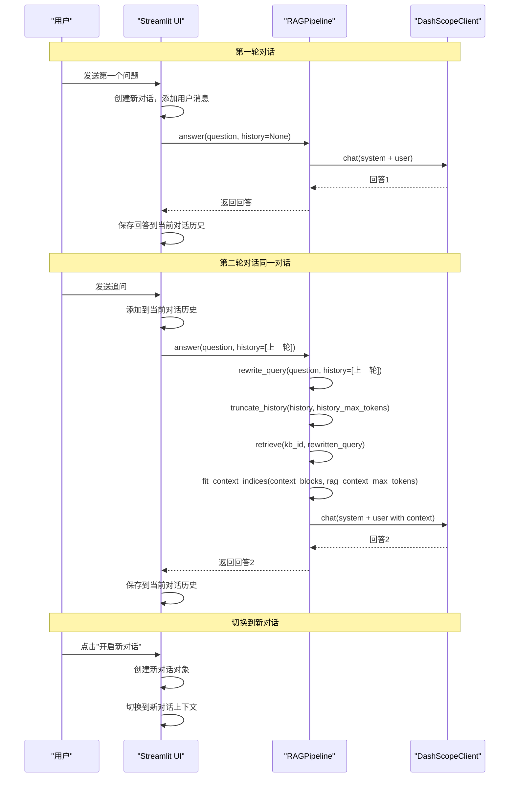

# 查询处理与对话管理

<cite>
**本文引用的文件**
- [rag_pipeline.py](file://rag_pipeline.py)
- [react_agent.py](file://react_agent.py)
- [llm_client.py](file://llm_client.py)
- [config.py](file://config.py)
- [app.py](file://app.py)
- [utils/logger.py](file://utils/logger.py)
- [tests/test_context.py](file://tests/test_context.py)
- [tests/test_retrieval.py](file://tests/test_retrieval.py)
</cite>

## 更新摘要
**所做更改**
- 更新了多对话架构的实现说明，包括会话管理和消息历史处理
- 移除了20条消息限制的相关描述，现在支持内存限制内的无限长对话
- 更新了聊天渲染逻辑，从当前对话显示消息的机制
- 增强了流式响应处理，确保正确附加到正确的对话消息历史中
- 更新了相关架构图表和流程图以反映新的对话管理结构

## 目录
1. [简介](#简介)
2. [项目结构](#项目结构)
3. [核心组件](#核心组件)
4. [架构总览](#架构总览)
5. [详细组件分析](#详细组件分析)
6. [依赖关系分析](#依赖关系分析)
7. [性能考量](#性能考量)
8. [故障排查指南](#故障排查指南)
9. [结论](#结论)
10. [附录：多轮对话示例流程](#附录多轮对话示例流程)

## 简介
本文件聚焦"查询处理与对话管理"能力，围绕以下目标展开：
- 解释多轮对话改写机制（rewrite_query）：历史消息截断、上下文提取、问题重写。
- 说明 truncate_history 的 token 预算管理机制：长对话注意力优化与成本节约策略。
- 说明 fit_context_indices 的上下文块选择算法：token 限制与块完整性保证。
- 详解问答流程中的提示词工程：系统提示词与用户提示词设计。
- 对比 chat 通用对话与知识库问答的差异。
- **新增**：多对话架构支持，每个会话独立管理消息历史和状态。
- **更新**：移除了20条消息限制，支持内存限制内的无限长对话。
- 提供具体代码路径与流程图，展示多轮对话处理效果与优化点。
- 总结错误处理与异常恢复机制。

## 项目结构
与查询处理和对话管理直接相关的模块分布如下：
- rag_pipeline.py：RAG 管线门面，包含检索、问答、改写、历史截断、上下文裁剪等核心逻辑。
- react_agent.py：基于 Function Calling 的 Agent，复用 RAG 管线进行工具调用与多步推理。
- llm_client.py：统一封装大模型接口（聊天、流式、联网搜索），并记录用量。
- config.py：集中配置项（历史 token 上限、RAG 上下文 token 上限、是否开启改写等）。
- app.py：**新增**：多对话界面实现，支持会话管理、消息历史和流式响应。
- utils/logger.py：轻量 token 估算函数 estimate_tokens，用于预算控制。
- tests/test_context.py：针对历史截断与上下文裁剪的单元测试。
- tests/test_retrieval.py：混合检索相关测试用例。

**图表来源**
- [rag_pipeline.py:159-193](file://rag_pipeline.py#L159-L193)
- [rag_pipeline.py:439-523](file://rag_pipeline.py#L439-L523)
- [rag_pipeline.py:566-696](file://rag_pipeline.py#L566-L566)
- [react_agent.py:165-246](file://react_agent.py#L165-L246)
- [react_agent.py:272-369](file://react_agent.py#L272-L369)
- [llm_client.py:94-170](file://llm_client.py#L94-L170)
- [llm_client.py:172-278](file://llm_client.py#L172-L278)
- [app.py:216-249](file://app.py#L216-L249)

章节来源
- [rag_pipeline.py:159-193](file://rag_pipeline.py#L159-L193)
- [rag_pipeline.py:439-523](file://rag_pipeline.py#L439-L523)
- [rag_pipeline.py:566-696](file://rag_pipeline.py#L566-L696)
- [react_agent.py:165-246](file://react_agent.py#L165-L246)
- [react_agent.py:272-369](file://react_agent.py#L272-L369)
- [llm_client.py:94-170](file://llm_client.py#L94-L170)
- [llm_client.py:172-278](file://llm_client.py#L172-L278)
- [config.py:56-112](file://config.py#L56-L112)
- [app.py:216-249](file://app.py#L216-L249)
- [utils/logger.py:48-62](file://utils/logger.py#L48-L62)

## 核心组件
- RAGPipeline：提供知识库管理、文档入库、混合检索、问答、多轮改写、历史截断、上下文裁剪等能力。
- ReActAgent：通过工具注册表将 LLM 与外部工具（知识库、天气、联网搜索、数据库）组合，实现多步推理。
- DashScopeClient：统一封装大模型聊天、流式输出、联网搜索，并记录 token 用量。
- AppConfig：集中化配置，包括 history_max_tokens、rag_context_max_tokens、query_rewrite_enabled 等关键参数。
- **新增**：Streamlit会话管理：支持多对话架构，每个会话独立存储消息历史和状态。
- estimate_tokens：中英文混合文本的轻量 token 估算，支撑历史与上下文预算控制。

章节来源
- [rag_pipeline.py:196-783](file://rag_pipeline.py#L196-L783)
- [react_agent.py:144-545](file://react_agent.py#L144-L545)
- [llm_client.py:22-299](file://llm_client.py#L22-L299)
- [config.py:56-112](file://config.py#L56-L112)
- [app.py:216-249](file://app.py#L216-L249)
- [utils/logger.py:48-62](file://utils/logger.py#L48-L62)

## 架构总览
下图展示了从用户输入到最终回答的关键路径，包括多轮改写、混合检索、上下文裁剪与大模型调用，以及新增的多对话架构支持。

**图表来源**
- [rag_pipeline.py:566-696](file://rag_pipeline.py#L566-L696)
- [rag_pipeline.py:439-523](file://rag_pipeline.py#L439-L523)
- [llm_client.py:94-170](file://llm_client.py#L94-L170)
- [react_agent.py:272-369](file://react_agent.py#L272-L369)
- [app.py:501-558](file://app.py#L501-L558)

## 详细组件分析

### 多轮对话改写：rewrite_query
- 目的：在多轮对话中把追问题改写成独立、明确的问题，提升后续检索与回答质量。
- 历史截断：使用 truncate_history 按 token 预算从后往前保留最近消息，避免长历史稀释注意力并节省计费 token。
- 上下文提取：仅取最近若干条（最多 4 条）作为改写提示的历史片段，降低被无关内容带偏的风险。
- 问题重写：构造 QUERY_REWRITE_PROMPT，调用 LLM 生成改写后的问题；若结果异常（空串或过长）则回退到原问题。
- 失败保护：任何异常均返回原始问题，确保主流程不中断。

**图表来源**
- [rag_pipeline.py:159-178](file://rag_pipeline.py#L159-L178)
- [rag_pipeline.py:566-588](file://rag_pipeline.py#L566-L588)
- [utils/logger.py:48-62](file://utils/logger.py#L48-L62)

章节来源
- [rag_pipeline.py:159-178](file://rag_pipeline.py#L159-L178)
- [rag_pipeline.py:566-588](file://rag_pipeline.py#L566-L588)
- [utils/logger.py:48-62](file://utils/logger.py#L48-L62)

### 历史消息截断：truncate_history
- 策略：按 token 预算从后往前保留历史消息，至少保留最后一条，避免丢失最新上下文。
- 成本节约：只保留"最近且放得下"的部分，减少不必要的 token 消耗。
- 注意力优化：缓解长对话导致的"中间遗忘"现象，提高模型对近期信息的关注。
- 估算依据：使用 estimate_tokens 对每条消息内容进行 token 估算，累计不超过 max_tokens。
- **更新**：不再限制消息数量，完全基于 token 预算进行截断，支持更长的对话历史。

**图表来源**
- [rag_pipeline.py:159-178](file://rag_pipeline.py#L159-L178)
- [utils/logger.py:48-62](file://utils/logger.py#L48-L62)

章节来源
- [rag_pipeline.py:159-178](file://rag_pipeline.py#L159-L178)
- [utils/logger.py:48-62](file://utils/logger.py#L48-L62)

### 上下文块选择：fit_context_indices
- 目标：在给定 token 预算内选择尽可能多的完整上下文块，保证块不被拆分。
- 规则：始终保留第一块，按顺序累加直到接近预算上限，超过则停止。
- 适用场景：问答组装阶段，将检索到的片段拼接为上下文时，控制总 token 量。
- 优势：兼顾相关性（Top-K 已排序）与完整性（块不可拆），避免上下文碎片化影响理解。

**图表来源**
- [rag_pipeline.py:181-193](file://rag_pipeline.py#L181-L193)
- [utils/logger.py:48-62](file://utils/logger.py#L48-L62)

章节来源
- [rag_pipeline.py:181-193](file://rag_pipeline.py#L181-L193)
- [utils/logger.py:48-62](file://utils/logger.py#L48-L62)

### 多对话架构与会话管理
- **新增功能**：实现了完整的多对话架构，每个会话独立管理消息历史和状态。
- 会话结构：每个对话包含 id、title、messages、kb_id 等属性，互不影响。
- 消息历史：通过 `_history_messages()` 函数获取当前会话除最后一条外的历史消息。
- 会话切换：支持在多个对话间切换，保持各自的消息历史和知识库设置。
- 内存管理：移除了之前的20条消息限制，现在支持内存限制内的无限长对话。
- 流式响应：实时更新当前对话的消息历史，确保正确的消息附加到正确的对话中。

**图表来源**
- [app.py:216-249](file://app.py#L216-L249)
- [app.py:501-558](file://app.py#L501-L558)
- [react_agent.py:474-491](file://react_agent.py#L474-L491)

章节来源
- [app.py:216-249](file://app.py#L216-L249)
- [app.py:501-558](file://app.py#L501-L558)
- [react_agent.py:474-491](file://react_agent.py#L474-L491)

### 问答流程中的提示词工程
- 系统提示词（RAG_SYSTEM_PROMPT）：强调严格基于检索资料、逐条标注引用、禁止编造事实、区分事实与建议、页码显示规则等，约束模型行为，降低幻觉风险。
- 用户提示词（RAG_USER_PROMPT）：包含"最近对话"、"用户问题"、"检索资料"，引导模型结合上下文与证据生成答案。
- 通用聊天系统提示词（CHAT_SYSTEM_PROMPT）：当无知识库时，指示模型以通用知识回答，避免声称读取了用户文件。
- 改写提示词（QUERY_REWRITE_PROMPT）：要求模型将多轮追问改写为独立明确的问题，仅输出改写结果，便于后续检索。

章节来源
- [rag_pipeline.py:42-78](file://rag_pipeline.py#L42-L78)
- [rag_pipeline.py:636-651](file://rag_pipeline.py#L636-L651)

### chat 方法与知识库问答的区别
- chat：通用对话模式，无知识库或无需检索时直接调用 LLM；历史经 truncate_history 截断后拼入 messages；返回 answer、sources 为空、context_tokens 统计。
- answer：知识库问答模式，先解析 kb_id，必要时进行 rewrite_query，再执行 retrieve 获取片段，随后 fit_context_indices 裁剪上下文，最后调用 LLM 生成带引用的回答；返回 answer、sources、query、kb_id、context_tokens。
- 区别要点：
  - 是否检索知识库与组装上下文。
  - 是否进行多轮改写与上下文裁剪。
  - 返回结构中 sources 与 context_tokens 的意义不同。

章节来源
- [rag_pipeline.py:590-696](file://rag_pipeline.py#L590-L696)
- [rag_pipeline.py:439-523](file://rag_pipeline.py#L439-L523)

### 混合检索与上下文组装
- 混合检索：向量检索与 BM25 各自取 Top-N，使用 RRF 融合排名；可选 MMR 重排以提升多样性；设置相关性阈值，避免低相关硬凑答案。
- 上下文组装：将检索到的片段加上来源标注，形成 context_blocks；使用 fit_context_indices 按 token 预算选择完整块；拼接历史与问题，构造用户提示词。
- 文档限定：根据问题中的文件名或人物短名自动限定检索范围，防止无关片段污染上下文。

章节来源
- [rag_pipeline.py:439-523](file://rag_pipeline.py#L439-L523)
- [rag_pipeline.py:525-562](file://rag_pipeline.py#L525-L562)
- [rag_pipeline.py:614-651](file://rag_pipeline.py#L614-L651)

### Agent 与 RAG 的协作
- ReActAgent 通过 ToolRegistry 注册工具（如 search_knowledge_base），由 LLM 决定调用哪个工具及参数。
- 工具执行结果回填给模型，支持多步循环；工具结果长度受限（TOOL_OBSERVATION_MAX_CHARS），防止上下文爆炸。
- 天气、联网搜索、数据库查询等工具与知识库问答共同构成 Agent 的能力集。
- **更新**：流式响应处理保持实时聊天体验，但正确附加到正确的对话消息历史中。

章节来源
- [react_agent.py:93-142](file://react_agent.py#L93-L142)
- [react_agent.py:165-246](file://react_agent.py#L165-L246)
- [react_agent.py:272-369](file://react_agent.py#L272-L369)

## 依赖关系分析
- RAGPipeline 依赖：
  - DashScopeClient：聊天、流式、联网搜索。
  - VectorStore/BM25Index：向量检索与词面检索。
  - DocumentStore/Ingestion：文档管理与切分。
  - AppConfig：运行参数。
  - estimate_tokens：token 估算。
- ReActAgent 依赖：
  - RAGPipeline：知识库问答。
  - DashScopeClient：流式事件与工具调用。
  - ToolRegistry：工具注册与调用。
- **新增**：Streamlit UI 依赖：
  - ReActAgent：处理用户输入和流式响应。
  - RAGPipeline：知识库管理和问题解答。
  - 会话管理：维护多对话状态和历史消息。
- 配置项影响：
  - history_max_tokens：历史截断预算。
  - rag_context_max_tokens：上下文块选择预算。
  - query_rewrite_enabled：是否启用多轮改写。
  - retrieval_top_k/fusion_pool/relevance_threshold/mmr_*：检索与重排策略。

**图表来源**
- [rag_pipeline.py:196-783](file://rag_pipeline.py#L196-L783)
- [react_agent.py:144-545](file://react_agent.py#L144-L545)
- [llm_client.py:22-299](file://llm_client.py#L22-L299)
- [config.py:56-112](file://config.py#L56-L112)
- [app.py:216-249](file://app.py#L216-L249)
- [utils/logger.py:48-62](file://utils/logger.py#L48-L62)

章节来源
- [rag_pipeline.py:196-783](file://rag_pipeline.py#L196-L783)
- [react_agent.py:144-545](file://react_agent.py#L144-L545)
- [llm_client.py:22-299](file://llm_client.py#L22-L299)
- [config.py:56-112](file://config.py#L56-L112)
- [app.py:216-249](file://app.py#L216-L249)
- [utils/logger.py:48-62](file://utils/logger.py#L48-L62)

## 性能考量
- 历史截断与上下文裁剪：通过 history_max_tokens 与 rag_context_max_tokens 控制 token 用量，降低首字延迟与计费成本。
- 混合检索优化：RRF 融合提升召回质量；MMR 去重减少重复；相关性阈值避免低质上下文。
- 改写策略：仅在启用且存在历史时进行改写，失败回退原问题，避免额外开销。
- 流式输出：Agent 使用 stream_chat_raw 边到边输出，提升用户体验。
- 批量嵌入：embedding_batch_size 限制以避免接口超限。
- **新增**：多对话内存管理：移除了20条消息限制，现在基于内存限制支持无限长对话，需要监控内存使用情况。
- **新增**：会话隔离：每个对话独立管理消息历史，避免对话间的相互干扰。

## 故障排查指南
- 模型调用失败：DashScopeClient 捕获异常并转换为可读错误；上层方法（answer/chat）捕获异常返回友好提示。
- 工具执行失败：ToolRegistry.call 捕获异常并返回失败信息，供模型重试或直接回答。
- 日志写入失败：AgentTraceLogger 单条写入失败不影响主流程。
- **新增**：会话管理问题：检查 Streamlit session_state 是否正确初始化和管理多个对话。
- **新增**：内存溢出：监控长时间对话的内存使用情况，必要时重启应用释放内存。
- 常见问题定位：
  - 检查环境变量（API Key、Base URL、模型名）。
  - 调整 relevance_threshold、top_k、fusion_pool 观察检索效果。
  - 调整 history_max_tokens、rag_context_max_tokens 平衡上下文与成本。
  - 关闭 query_rewrite_enabled 验证改写是否引入噪声。
  - 检查多对话切换时的消息历史是否正确传递。

章节来源
- [llm_client.py:94-170](file://llm_client.py#L94-L170)
- [llm_client.py:172-278](file://llm_client.py#L172-L278)
- [rag_pipeline.py:590-696](file://rag_pipeline.py#L590-L696)
- [react_agent.py:130-142](file://react_agent.py#L130-L142)
- [utils/logger.py:12-45](file://utils/logger.py#L12-L45)
- [app.py:216-249](file://app.py#L216-L249)

## 结论
本系统通过"历史截断 + 上下文裁剪 + 混合检索 + 提示词工程"的组合，实现了稳健的多轮对话与知识库问答能力。**新增的多对话架构**进一步提升了用户体验，支持同时处理多个独立的对话会话。关键优化点包括：
- 用 estimate_tokens 精确控制 token 预算，兼顾成本与质量。
- 用 RRF/MMR 提升检索质量与多样性。
- 用严格的系统提示词约束模型行为，降低幻觉。
- 用 Agent 的工具注册与流式输出扩展能力与体验。
- **新增**：多对话架构支持，每个会话独立管理消息历史和状态。
- **更新**：移除了20条消息限制，支持内存限制内的无限长对话。
建议在部署时根据业务场景调优配置项，并结合测试用例持续验证效果。

## 附录：多轮对话示例流程
以下为典型多轮对话的处理流程与优化点，配合新增的多对话架构：

**图表来源**
- [rag_pipeline.py:566-696](file://rag_pipeline.py#L566-L696)
- [rag_pipeline.py:159-193](file://rag_pipeline.py#L159-L193)
- [rag_pipeline.py:439-523](file://rag_pipeline.py#L439-L523)
- [app.py:216-249](file://app.py#L216-L249)
- [app.py:501-558](file://app.py#L501-L558)
- [utils/logger.py:48-62](file://utils/logger.py#L48-L62)

章节来源
- [rag_pipeline.py:566-696](file://rag_pipeline.py#L566-L696)
- [rag_pipeline.py:159-193](file://rag_pipeline.py#L159-L193)
- [rag_pipeline.py:439-523](file://rag_pipeline.py#L439-L523)
- [app.py:216-249](file://app.py#L216-L249)
- [app.py:501-558](file://app.py#L501-L558)
- [utils/logger.py:48-62](file://utils/logger.py#L48-L62)