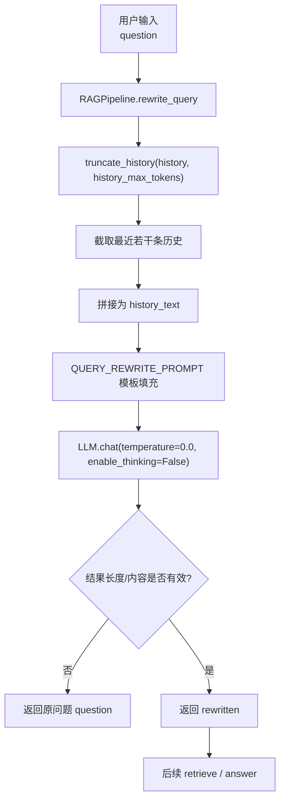
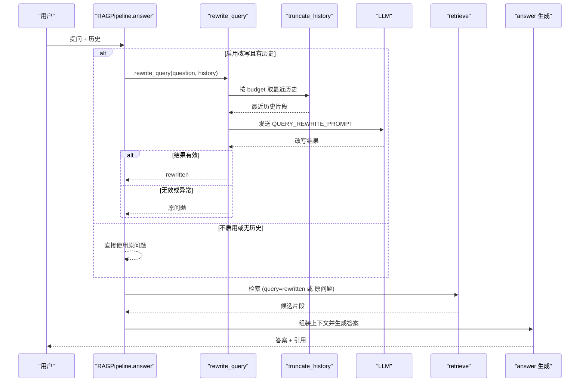
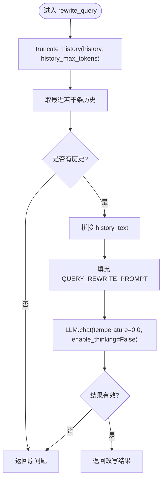
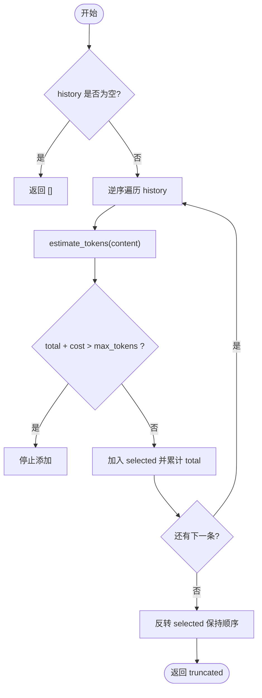
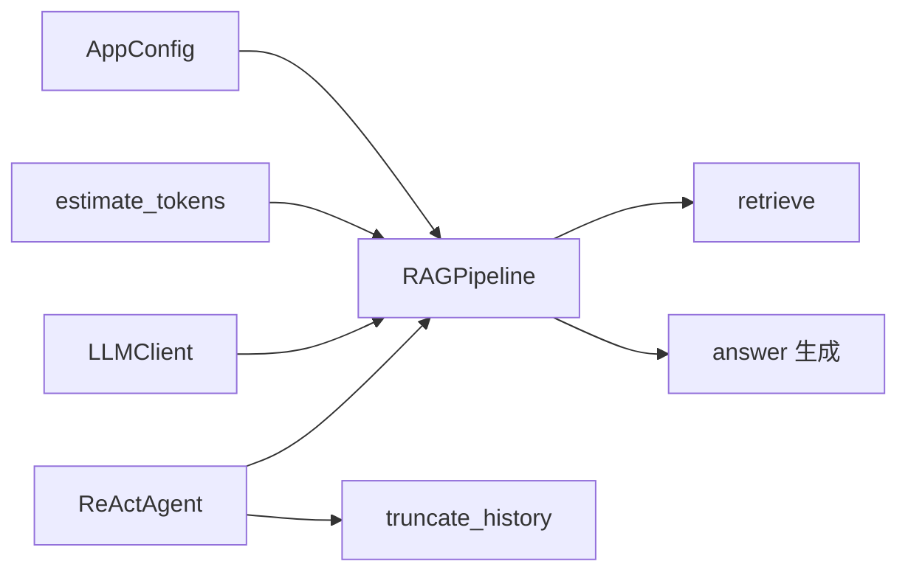

# 查询改写机制

<cite>
**本文引用的文件**
- [rag_pipeline.py](file://rag_pipeline.py)
- [config.py](file://config.py)
- [logger.py](file://utils/logger.py)
- [test_rag_answer.py](file://tests/test_rag_answer.py)
- [test_context.py](file://tests/test_context.py)
- [react_agent.py](file://react_agent.py)
</cite>

## 目录
1. [简介](#简介)
2. [项目结构](#项目结构)
3. [核心组件](#核心组件)
4. [架构总览](#架构总览)
5. [详细组件分析](#详细组件分析)
6. [依赖关系分析](#依赖关系分析)
7. [性能考量](#性能考量)
8. [故障排查指南](#故障排查指南)
9. [结论](#结论)
10. [附录：配置与调优](#附录配置与调优)

## 简介
本文件聚焦于多轮对话中的“查询改写”能力，解释其实现机制、效果优化策略以及失败降级处理。重点包括：
- rewrite_query 的多轮对话改写流程：最近对话提取、历史消息格式化、问题重写。
- QUERY_REWRITE_PROMPT 的设计思路：指令遵循与输出格式控制。
- truncate_history 的 token 预算管理与长对话注意力优化、成本节约策略。
- 改写失败的降级机制：异常恢复与原问题回退。
- 端到端示例与效果对比（通过测试用例路径引用）。
- 改写质量评估与可调参数说明。

## 项目结构
查询改写位于 RAG 管线中，作为检索前预处理步骤；历史截断与 token 估算在工具模块中提供；相关行为由集中配置管理；Agent 侧也复用历史截断逻辑以统一上下文预算。

图表来源
- [rag_pipeline.py:566-588](file://rag_pipeline.py#L566-L588)
- [rag_pipeline.py:159-178](file://rag_pipeline.py#L159-L178)
- [rag_pipeline.py:70-78](file://rag_pipeline.py#L70-L78)

章节来源
- [rag_pipeline.py:566-588](file://rag_pipeline.py#L566-L588)
- [rag_pipeline.py:159-178](file://rag_pipeline.py#L159-L178)
- [rag_pipeline.py:70-78](file://rag_pipeline.py#L70-L78)
- [config.py:90-112](file://config.py#L90-L112)

## 核心组件
- RAGPipeline.rewrite_query：多轮对话时把追问题改写成独立、明确的问题；失败或无效时回退到原问题。
- truncate_history：按 token 预算从后往前保留历史消息，避免长对话稀释注意力并节省计费 token。
- estimate_tokens：轻量中英文混合文本 token 估算，用于预算控制。
- QUERY_REWRITE_PROMPT：严格约束输出的提示词模板，要求仅输出改写后的问题本身。
- AppConfig：集中管理 query_rewrite_enabled、history_max_tokens、rag_context_max_tokens 等关键开关与阈值。

章节来源
- [rag_pipeline.py:566-588](file://rag_pipeline.py#L566-L588)
- [rag_pipeline.py:159-178](file://rag_pipeline.py#L159-L178)
- [utils/logger.py:48-62](file://utils/logger.py#L48-L62)
- [rag_pipeline.py:70-78](file://rag_pipeline.py#L70-L78)
- [config.py:90-112](file://config.py#L90-L112)

## 架构总览
查询改写嵌入在问答主流程中，仅在启用且存在历史时触发；改写后的问题进入检索阶段，最终生成带引用的回答。同时，Agent 侧也使用相同的历史截断策略保证上下文一致性。

图表来源
- [rag_pipeline.py:590-666](file://rag_pipeline.py#L590-L666)
- [rag_pipeline.py:566-588](file://rag_pipeline.py#L566-L588)
- [rag_pipeline.py:159-178](file://rag_pipeline.py#L159-L178)

## 详细组件分析

### 多轮对话改写：rewrite_query
- 最近对话提取：调用 truncate_history 限制历史 token 预算，再取最近若干条（代码中固定取最后 4 条）作为改写上下文。
- 历史消息格式化：将每条消息按“角色: 内容”的形式拼接成 history_text。
- 问题重写：使用 QUERY_REWRITE_PROMPT 模板注入 history 和 question，调用 LLM.chat 并以 temperature=0.0、关闭深度思考模式，确保稳定输出。
- 护栏与降级：若改写结果为空或过长（超过 300 字符），视为异常（可能把历史也抄进来了），直接回退到原问题；任何异常捕获后同样回退到原问题，保障主流程稳定性。

图表来源
- [rag_pipeline.py:566-588](file://rag_pipeline.py#L566-L588)
- [rag_pipeline.py:159-178](file://rag_pipeline.py#L159-L178)

章节来源
- [rag_pipeline.py:566-588](file://rag_pipeline.py#L566-L588)

### 提示词设计：QUERY_REWRITE_PROMPT
- 指令遵循：明确要求“只输出改写后的问题本身，不要输出任何其他内容”，减少多余输出对下游解析的影响。
- 输出格式控制：通过严格的指令与最小化温度（0.0）降低随机性，提升可预测性与稳定性。
- 上下文组织：以“最近对话 + 用户问题”的结构组织输入，帮助模型理解指代消解与上下文依赖。

章节来源
- [rag_pipeline.py:70-78](file://rag_pipeline.py#L70-L78)

### 历史截断：truncate_history 与 token 预算
- 预算策略：从历史末尾向前累加，直到达到 max_tokens 预算；至少保留最后一条，避免完全丢失最新信息。
- 注意力优化：长对话会稀释模型注意力（lost-in-the-middle），截断能缓解这一问题，提高对近期信息的关注。
- 成本节约：仅保留“最近且放得下”的部分，显著减少计费 token。
- 估算方法：estimate_tokens 对中英文混合文本进行轻量估算，中文约 1 token/字，英文/数字约 4 字符/token，适合快速预算控制。

图表来源
- [rag_pipeline.py:159-178](file://rag_pipeline.py#L159-L178)
- [utils/logger.py:48-62](file://utils/logger.py#L48-L62)

章节来源
- [rag_pipeline.py:159-178](file://rag_pipeline.py#L159-L178)
- [utils/logger.py:48-62](file://utils/logger.py#L48-L62)
- [tests/test_context.py:9-23](file://tests/test_context.py#L9-L23)

### 改写失败降级机制
- 异常恢复：外层 try/except 捕获所有异常，确保改写失败不影响主流程。
- 原问题回退：当改写结果为空或过长（>300 字符）时，直接返回原问题，避免污染检索与回答。
- 与 Agent 的一致性：Agent 侧也使用相同的 truncate_history 策略，保证整体上下文预算一致。

章节来源
- [rag_pipeline.py:566-588](file://rag_pipeline.py#L566-L588)
- [react_agent.py:480-491](file://react_agent.py#L480-L491)

### 端到端示例与效果对比
- 示例一：有历史时的改写
  - 场景：历史包含“介绍一下道岔综合监测系统”，当前问“它有哪些组成？”
  - 预期：改写为“道岔监测系统有哪些组成”
  - 参考测试路径：[tests/test_rag_answer.py:36-45](file://tests/test_rag_answer.py#L36-L45)
- 示例二：无历史时跳过改写
  - 场景：history=None
  - 预期：直接返回原问题
  - 参考测试路径：[tests/test_rag_answer.py:48-49](file://tests/test_rag_answer.py#L48-L49)
- 示例三：历史截断预算控制
  - 场景：长历史按 token 预算保留最近部分
  - 预期：截断后总 token 不超过预算，且至少保留最后一条
  - 参考测试路径：[tests/test_context.py:9-23](file://tests/test_context.py#L9-L23)

章节来源
- [tests/test_rag_answer.py:36-49](file://tests/test_rag_answer.py#L36-L49)
- [tests/test_context.py:9-23](file://tests/test_context.py#L9-L23)

## 依赖关系分析
- RAGPipeline 依赖：
  - AppConfig：读取 query_rewrite_enabled、history_max_tokens、rag_context_max_tokens 等。
  - utils.logger.estimate_tokens：token 估算。
  - LLMClient：执行 chat 请求。
- Agent 侧依赖：
  - 复用 truncate_history 以保持上下文预算一致。

图表来源
- [config.py:90-112](file://config.py#L90-L112)
- [rag_pipeline.py:590-666](file://rag_pipeline.py#L590-L666)
- [react_agent.py:480-491](file://react_agent.py#L480-L491)

章节来源
- [config.py:90-112](file://config.py#L90-L112)
- [rag_pipeline.py:590-666](file://rag_pipeline.py#L590-L666)
- [react_agent.py:480-491](file://react_agent.py#L480-L491)

## 性能考量
- 改写阶段：
  - temperature=0.0、关闭深度思考，降低延迟与随机性。
  - 仅使用最近若干条历史，减少 prompt 长度与计算开销。
- 历史与上下文预算：
  - truncate_history 与 fit_context_indices 共同控制历史与检索上下文的 token 上限，避免超长上下文导致的注意力分散与高成本。
- 估算精度：
  - estimate_tokens 为轻量估算，适合预算控制；如需更精确可替换为真实分词器。

[本节为通用指导，不直接分析具体文件]

## 故障排查指南
- 改写未生效：
  - 检查配置项 query_rewrite_enabled 是否为真。
  - 确认 history 非空且足够表达指代关系。
  - 参考路径：[config.py:107-108](file://config.py#L107-L108)、[rag_pipeline.py:602-603](file://rag_pipeline.py#L602-L603)
- 改写结果异常长：
  - 触发长度护栏（>300 字符）将回退到原问题，检查提示词与模型输出是否符合“仅输出问题”的要求。
  - 参考路径：[rag_pipeline.py:583-585](file://rag_pipeline.py#L583-L585)
- 历史被过度截断：
  - 调整 history_max_tokens，确保保留足够的最近对话。
  - 参考路径：[config.py:108-109](file://config.py#L108-L109)、[rag_pipeline.py:159-178](file://rag_pipeline.py#L159-L178)
- Agent 侧上下文不一致：
  - 确认 Agent 也使用相同的 truncate_history 策略。
  - 参考路径：[react_agent.py:480-491](file://react_agent.py#L480-L491)

章节来源
- [config.py:107-109](file://config.py#L107-L109)
- [rag_pipeline.py:583-585](file://rag_pipeline.py#L583-L585)
- [rag_pipeline.py:159-178](file://rag_pipeline.py#L159-L178)
- [react_agent.py:480-491](file://react_agent.py#L480-L491)

## 结论
查询改写通过“最近历史 + 严格提示词 + 低温度 + 护栏回退”的组合，在多轮对话中显著提升检索问题的独立性与明确性，从而改善检索召回与回答质量。配合 token 预算的历史截断，既优化了注意力又控制了成本。失败降级机制确保系统鲁棒性，测试覆盖验证了关键行为。

[本节为总结，不直接分析具体文件]

## 附录：配置与调优
- 关键配置项（环境变量覆盖）：
  - QUERY_REWRITE_ENABLED：是否启用查询改写。
  - HISTORY_MAX_TOKENS：历史最大 token 预算。
  - RAG_CONTEXT_MAX_TOKENS：检索上下文最大 token 预算。
  - RETRIEVAL_TOP_K、RETRIEVAL_FUSION_POOL、RETRIEVAL_RELEVANCE_THRESHOLD、RETRIEVAL_MMR_ENABLED、RETRIEVAL_MMR_LAMBDA：检索相关参数。
- 调优建议：
  - 若改写不稳定，可降低 temperature 或收紧提示词约束（已默认 0.0）。
  - 若历史过短导致改写不充分，适当增大 HISTORY_MAX_TOKENS。
  - 若上下文过长影响首字延迟，减小 RAG_CONTEXT_MAX_TOKENS 或 top_k。
  - 若检索相关性不足，调整 relevance_threshold 或启用 MMR 去重。

章节来源
- [config.py:90-112](file://config.py#L90-L112)