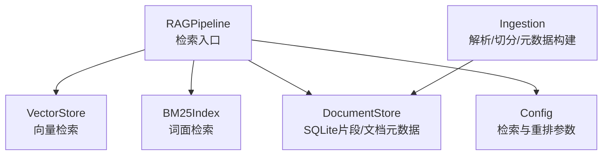
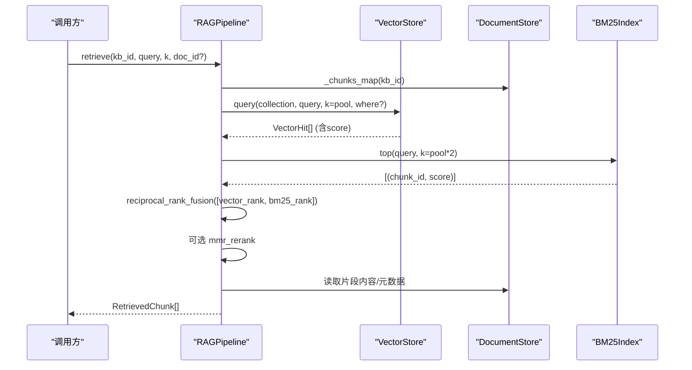
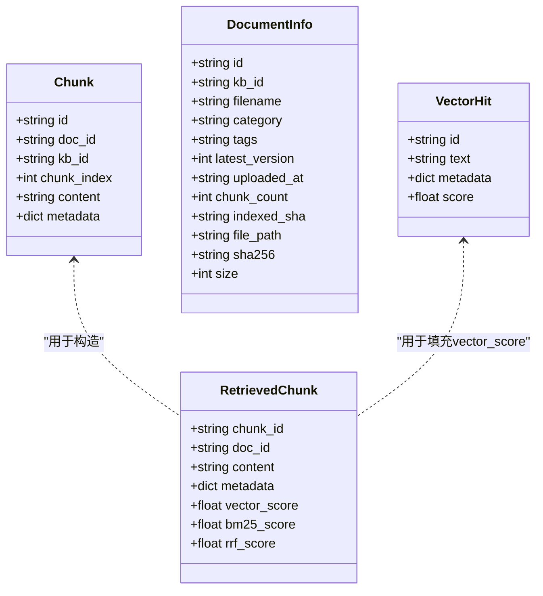
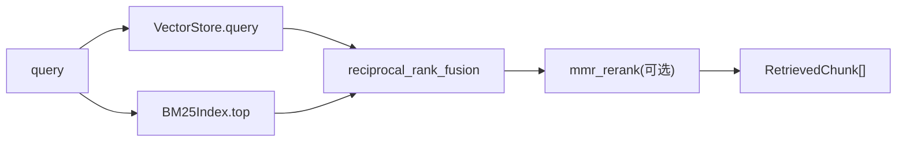

# 核心数据模型

<cite>
**本文引用的文件**
- [rag_pipeline.py](file://rag_pipeline.py)
- [store.py](file://store.py)
- [vector_store.py](file://vector_store.py)
- [ingestion.py](file://ingestion.py)
- [config.py](file://config.py)
- [LEARNING_GUIDE.md](file://docs/LEARNING_GUIDE.md)
- [test_retrieval.py](file://tests/test_retrieval.py)
</cite>

## 目录
1. [简介](#简介)
2. [项目结构](#项目结构)
3. [核心组件](#核心组件)
4. [架构总览](#架构总览)
5. [详细组件分析](#详细组件分析)
6. [依赖关系分析](#依赖关系分析)
7. [性能考虑](#性能考虑)
8. [故障排查指南](#故障排查指南)
9. [结论](#结论)
10. [附录：使用示例与序列化](#附录使用示例与序列化)

## 简介
本文件聚焦 RAG 管线中的“核心数据模型”，围绕检索返回的片段对象、评分机制、元数据结构、引用生成，以及与存储层的映射和转换进行系统化说明。目标是帮助读者理解从入库到检索再到问答的全链路中，数据如何被构造、评分、组织与输出。

## 项目结构
- 检索结果的数据载体定义在管线模块中，用于承载一次检索命中的片段及其多维得分。
- 片段持久化与查询通过 SQLite 存储层完成；向量检索由向量存储封装提供。
- 片段元数据在解析与切分阶段构建，贯穿入库、检索与引用生成。
- 配置集中管理检索参数（如 top_k、融合池大小、相关性阈值、MMR 开关等）。

图表来源
- [rag_pipeline.py:196-523](file://rag_pipeline.py#L196-L523)
- [vector_store.py:38-148](file://vector_store.py#L38-L148)
- [store.py:123-470](file://store.py#L123-L470)
- [ingestion.py:178-215](file://ingestion.py#L178-L215)
- [config.py:56-113](file://config.py#L56-L113)

章节来源
- [rag_pipeline.py:196-523](file://rag_pipeline.py#L196-L523)
- [vector_store.py:38-148](file://vector_store.py#L38-L148)
- [store.py:123-470](file://store.py#L123-L470)
- [ingestion.py:178-215](file://ingestion.py#L178-L215)
- [config.py:56-113](file://config.py#L56-L113)

## 核心组件
- 检索结果数据类：用于承载一次检索命中的片段及三种评分。
- 存储层数据类：用于持久化片段与文档信息。
- 向量命中数据类：用于承载向量检索结果。
- 元数据构建函数：负责为每个片段生成结构化元数据。
- 配置数据类：集中管理检索与重排相关参数。

章节来源
- [rag_pipeline.py:134-145](file://rag_pipeline.py#L134-L145)
- [store.py:88-121](file://store.py#L88-L121)
- [vector_store.py:30-36](file://vector_store.py#L30-L36)
- [ingestion.py:193-215](file://ingestion.py#L193-L215)
- [config.py:56-113](file://config.py#L56-L113)

## 架构总览
下图展示了检索流程中数据模型的流转：解析切分产生片段与元数据，写入存储层；检索时分别走向量与 BM25，再经 RRF 融合与可选 MMR 重排，最终组装为检索结果数据类并参与问答与引用生成。

图表来源
- [rag_pipeline.py:439-523](file://rag_pipeline.py#L439-L523)
- [vector_store.py:100-126](file://vector_store.py#L100-L126)
- [store.py:425-442](file://store.py#L425-L442)

## 详细组件分析

### 检索结果数据类：RetrievedChunk
- 字段含义
  - chunk_id：片段唯一标识，通常形如“doc_id:片段序号”。
  - doc_id：所属文档的唯一标识。
  - content：片段文本内容。
  - metadata：片段元数据字典，包含来源、位置、分类标签等。
  - vector_score：向量余弦相似度得分，越大越相关。
  - bm25_score：BM25 原始得分，反映词面匹配强度。
  - rrf_score：RRF 融合得分，综合向量与 BM25 排名。
- 用途
  - 作为检索阶段的统一输出结构，便于上层进行上下文拼接、引用生成与结果展示。
  - 三种评分可用于诊断检索质量、调参与对比不同策略效果。

章节来源
- [rag_pipeline.py:134-145](file://rag_pipeline.py#L134-L145)
- [rag_pipeline.py:505-523](file://rag_pipeline.py#L505-L523)

### 评分机制详解
- 向量余弦相似度（vector_score）
  - 计算方式：向量检索返回距离值，代码将其转换为相似度 = 1 - distance（cosine 空间）。
  - 应用场景：语义匹配，适合自然语言问题与长段落内容的匹配。
  - 参考实现：向量查询后对距离做转换得到相似度分数。
- BM25 原始得分（bm25_score）
  - 计算方式：基于词频与逆文档频率的词面打分，不依赖模型，可解释性强。
  - 应用场景：精确术语、型号、编号等关键词强命中场景，兜底避免误杀。
  - 参考行为：当向量低于阈值但 BM25 强命中时，仍会放行结果。
- RRF 融合得分（rrf_score）
  - 计算方式：将向量与 BM25 各自 Top-N 排名合并，按“倒数秩”求和（公式见学习指南），只看排名不看原始分值。
  - 应用场景：兼顾语义与词面，提升召回与排序稳定性。
  - 参考实现：融合逻辑位于检索流程中，随后按融合得分排序并截取候选集。

章节来源
- [vector_store.py:100-126](file://vector_store.py#L100-L126)
- [rag_pipeline.py:468-503](file://rag_pipeline.py#L468-L503)
- [LEARNING_GUIDE.md:38-75](file://docs/LEARNING_GUIDE.md#L38-L75)
- [test_retrieval.py:40-45](file://tests/test_retrieval.py#L40-L45)

### 元数据字典结构与组织
- 基本字段
  - source：来源文件名，用于引用显示。
  - chunk_index：片段序号，用于定位与去重。
  - doc_id/kb_id：关联文档与知识库标识。
  - category/tags：分类与标签，便于过滤与统计。
- 位置信息
  - page：页码（内部 0 起，对外展示 1 起）。
  - paragraph：段落编号（默认等于 chunk_index）。
- 组织方式
  - 在解析与切分阶段构建，随片段一起写入存储层与向量库，供检索与引用生成使用。

章节来源
- [ingestion.py:193-215](file://ingestion.py#L193-L215)
- [rag_pipeline.py:370-393](file://rag_pipeline.py#L370-L393)

### 引用生成机制
- 来源格式化
  - 格式：“来源文件名, 第X页”或“来源文件名, 段落Y”。
  - 优先使用 page 字段；若无页码则回退到 paragraph。
- 使用位置
  - 在问答阶段，将每个片段的元数据转换为引用字符串，拼入上下文与 sources 列表。
- 设计要点
  - 保证用户可见的定位信息清晰、稳定；与元数据中的 page/paragraph 保持一致。

章节来源
- [rag_pipeline.py:775-782](file://rag_pipeline.py#L775-L782)
- [rag_pipeline.py:614-627](file://rag_pipeline.py#L614-L627)

### 数据模型与存储层映射
- 片段持久化
  - 存储表 chunks 保存 id、doc_id、kb_id、chunk_index、content、metadata（JSON 序列化）。
  - 写入时整体替换某文档的片段，确保与向量库一致。
- 片段读取
  - 迭代读取 kb 下所有片段，反序列化 metadata 为字典。
- 向量存储
  - 每个知识库对应一个 collection，id 与片段 id 一致，documents 存文本，metadatas 存元数据，distance 转为相似度。
- 文档与版本
  - documents 表记录主信息；document_versions 表记录版本历史（sha256、size、路径）。

图表来源
- [store.py:113-121](file://store.py#L113-L121)
- [store.py:96-111](file://store.py#L96-L111)
- [vector_store.py:30-36](file://vector_store.py#L30-L36)
- [rag_pipeline.py:134-145](file://rag_pipeline.py#L134-L145)

章节来源
- [store.py:386-442](file://store.py#L386-L442)
- [vector_store.py:61-133](file://vector_store.py#L61-L133)
- [rag_pipeline.py:370-413](file://rag_pipeline.py#L370-L413)

## 依赖关系分析
- 检索流程依赖
  - 向量检索：VectorStore.query 返回带相似度的命中。
  - 词面检索：BM25Index.top 返回片段 id 与原始得分。
  - 融合与重排：reciprocal_rank_fusion 与 mmr_rerank。
  - 存储层：DocumentStore.iter_chunks 提供片段内容与元数据。
- 配置影响
  - top_k、fusion_pool、relevance_threshold、mmr_enabled、mmr_lambda 等直接影响检索范围与排序。

图表来源
- [rag_pipeline.py:468-503](file://rag_pipeline.py#L468-L503)
- [vector_store.py:100-126](file://vector_store.py#L100-L126)
- [config.py:76-87](file://config.py#L76-L87)

章节来源
- [rag_pipeline.py:439-523](file://rag_pipeline.py#L439-L523)
- [config.py:56-113](file://config.py#L56-L113)

## 性能考虑
- 批量向量化：VectorStore.upsert 支持分批嵌入，降低单次请求压力。
- 融合池大小：fusion_pool 控制参与融合的候选数，过大增加计算开销，过小可能漏召回。
- 相关性阈值：relevance_threshold 防止无关查询硬凑答案，减少无效上下文。
- MMR 去重：开启后可降低重复片段，但需额外向量相似度计算。
- 缓存失效：入库完成后标记 BM25 与片段缓存失效，按需重建索引。

[本节为通用指导，不直接分析具体文件]

## 故障排查指南
- 无检索结果
  - 检查 relevance_threshold 是否过高；确认向量与 BM25 是否均有命中。
  - 若向量为空但 BM25 有命中，应能兜底返回；否则检查 BM25 索引是否重建。
- 引用缺失或错误
  - 检查元数据中 page/paragraph 是否正确设置；确认 citation 生成逻辑是否取到 source。
- 重复片段过多
  - 调整 mmr_lambda 或关闭 MMR；增大 fusion_pool 以引入更多候选。
- 入库失败
  - 检查文件类型与解析器；关注 OCR 依赖是否安装；查看错误日志。

章节来源
- [rag_pipeline.py:483-503](file://rag_pipeline.py#L483-L503)
- [rag_pipeline.py:775-782](file://rag_pipeline.py#L775-L782)
- [ingestion.py:124-150](file://ingestion.py#L124-L150)

## 结论
RetrievedChunk 是 RAG 检索阶段的核心数据载体，承载片段内容与多维评分，支撑上下文组装与引用生成。结合向量与 BM25 的混合检索、RRF 融合与可选 MMR 重排，系统在语义与词面之间取得平衡。元数据的设计保证了引用与定位的准确性，存储层映射确保了数据的一致性与可追溯性。

[本节为总结，不直接分析具体文件]

## 附录：使用示例与序列化
以下示例仅描述用法与序列化过程，不直接粘贴代码内容。

- 构造检索结果
  - 在检索流程中，根据向量命中、BM25 命中与 RRF 融合结果，为每个选中的片段构造 RetrievedChunk，并填充三种评分。
  - 参考路径：检索结果组装处。
- 序列化与存储
  - 片段元数据在入库时序列化为 JSON 存入 SQLite；读取时反序列化为字典。
  - 向量库中以集合形式存储 id、文本、元数据与向量，查询时返回相似度。
  - 参考路径：片段写入与读取、向量 upsert/query。
- 引用生成
  - 问答阶段根据元数据生成“来源, 页码/段落”格式的引用，并放入 sources 列表。
  - 参考路径：citation 方法与问答上下文组装。

章节来源
- [rag_pipeline.py:505-523](file://rag_pipeline.py#L505-L523)
- [store.py:386-442](file://store.py#L386-L442)
- [vector_store.py:61-133](file://vector_store.py#L61-L133)
- [rag_pipeline.py:614-627](file://rag_pipeline.py#L614-L627)
- [rag_pipeline.py:775-782](file://rag_pipeline.py#L775-L782)