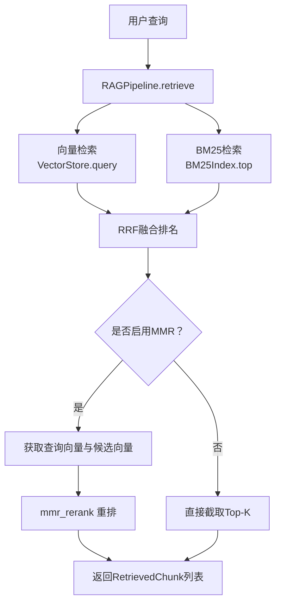
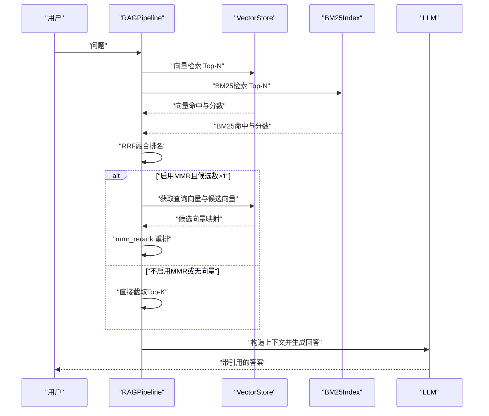
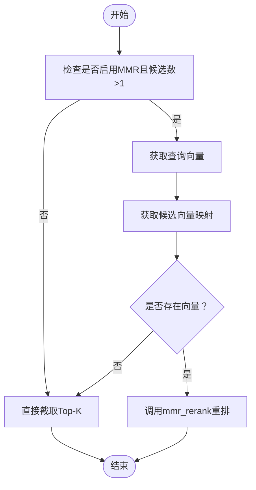
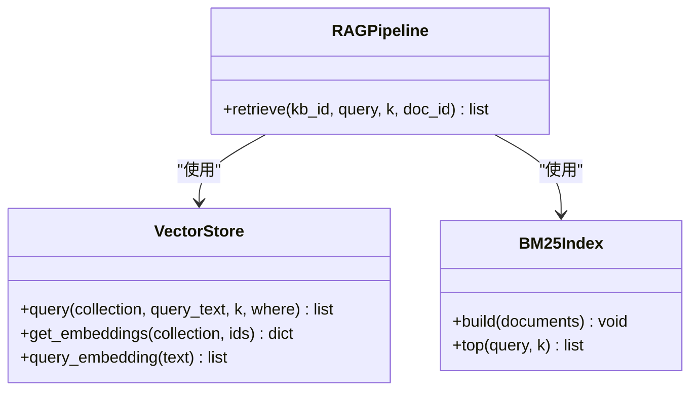
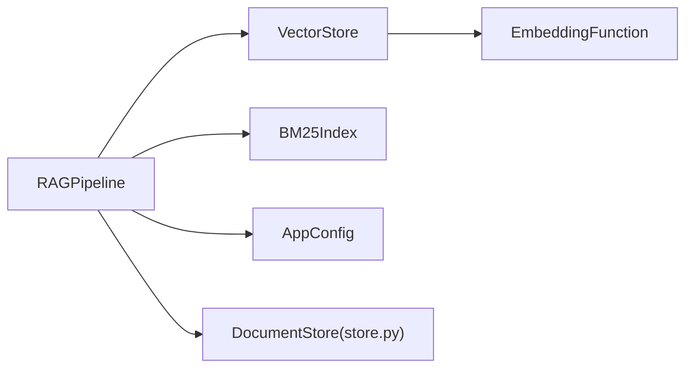

# MMR去重算法

<cite>
**本文引用的文件**
- [rag_pipeline.py](file://rag_pipeline.py)
- [vector_store.py](file://vector_store.py)
- [store.py](file://store.py)
- [config.py](file://config.py)
- [LEARNING_GUIDE.md](file://docs/LEARNING_GUIDE.md)
- [test_retrieval.py](file://tests/test_retrieval.py)
</cite>

## 目录
1. [简介](#简介)
2. [项目结构](#项目结构)
3. [核心组件](#核心组件)
4. [架构总览](#架构总览)
5. [详细组件分析](#详细组件分析)
6. [依赖关系分析](#依赖关系分析)
7. [性能考量](#性能考量)
8. [故障排查指南](#故障排查指南)
9. [结论](#结论)
10. [附录：使用示例与调参建议](#附录使用示例与调参建议)

## 简介
本文件围绕仓库中的检索管线，系统说明最大边际相关性（MMR）去重算法在本项目中的实现与应用。重点包括：
- MMR的基本原理：在“与查询的相关性”和“与已选项的多样性”之间进行平衡。
- lambda参数的作用与调优方法，以及其对结果多样性和相关性的影响。
- 向量相似度计算、混合检索融合（RRF）与MMR重排的配合方式。
- 候选项缺失向量时的降级策略。
- 结合测试与学习文档的具体使用示例与效果对比思路。
- 与其他去重策略的适用场景对比。

## 项目结构
本项目将检索与问答流程封装在 RAGPipeline 中，关键能力包括：
- 混合检索：向量检索 + BM25 词面检索，通过 RRF 融合排名。
- 可选 MMR 重排：对融合后的候选集进行去重与多样化排序。
- 向量存储：基于 Chroma 的向量库封装，支持批量 upsert、按条件删除、相似度查询与取回原始向量。
- 元数据与片段管理：SQLite 持久化知识库、文档版本与片段信息。
- 配置中心：所有可调参数来自统一配置类，支持环境变量覆盖。

图表来源
- [rag_pipeline.py:439-523](file://rag_pipeline.py#L439-L523)
- [vector_store.py:100-137](file://vector_store.py#L100-L137)

章节来源
- [rag_pipeline.py:439-523](file://rag_pipeline.py#L439-L523)
- [vector_store.py:100-137](file://vector_store.py#L100-L137)

## 核心组件
- RAGPipeline.retrieve：混合检索入口，负责向量与BM25召回、RRF融合、阈值判断、MMR重排与最终结果组装。
- VectorStore：Chroma 向量库封装，提供 query、get_embeddings、query_embedding 等接口，支撑相似度计算与MMR所需向量。
- BM25Index：词面索引与检索，用于精确术语匹配与兜底召回。
- AppConfig：集中管理检索与MMR相关参数，如 mmr_enabled、mmr_lambda、relevance_threshold、fusion_pool、top_k 等。
- 测试与学习文档：提供MMR行为验证与概念说明，辅助理解lambda对结果的影响。

章节来源
- [rag_pipeline.py:439-523](file://rag_pipeline.py#L439-L523)
- [vector_store.py:100-137](file://vector_store.py#L100-L137)
- [config.py:56-113](file://config.py#L56-L113)
- [LEARNING_GUIDE.md:55-66](file://docs/LEARNING_GUIDE.md#L55-L66)
- [test_retrieval.py:48-61](file://tests/test_retrieval.py#L48-L61)

## 架构总览
下图展示从查询到答案生成的整体流程，突出MMR在检索后重排阶段的作用位置。

图表来源
- [rag_pipeline.py:439-523](file://rag_pipeline.py#L439-L523)
- [vector_store.py:100-137](file://vector_store.py#L100-L137)

## 详细组件分析

### MMR去重算法在本项目中的实现
- 触发时机：在RRF融合后，若启用MMR且候选数量大于1，则进入重排阶段。
- 输入：查询向量与候选项向量集合；输出：按MMR得分降序排列的候选ID序列。
- 核心思想：每轮选择使“与查询的相关性”减去“与已选项的最大相似度”的加权差值最大的候选，从而兼顾相关性与多样性。
- 降级策略：当候选项在向量库中无向量时（例如仅由BM25命中的片段），无法计算MMR，直接按融合排名截取Top-K。

图表来源
- [rag_pipeline.py:488-503](file://rag_pipeline.py#L488-L503)
- [vector_store.py:128-137](file://vector_store.py#L128-L137)

章节来源
- [rag_pipeline.py:488-503](file://rag_pipeline.py#L488-L503)
- [vector_store.py:128-137](file://vector_store.py#L128-L137)

### 向量相似度计算与混合检索融合
- 向量相似度：使用余弦相似度（Chroma collection 设置 cosine 空间，距离=1-相似度）。
- 混合检索：分别取向量与BM25的Top-N，通过RRF合并排名，避免不同检索器得分尺度不一致的问题。
- 相关性门槛：若最佳向量相似度低于阈值且BM25也无命中，则视为无相关内容，直接返回空结果。

图表来源
- [vector_store.py:100-137](file://vector_store.py#L100-L137)
- [rag_pipeline.py:439-523](file://rag_pipeline.py#L439-L523)

章节来源
- [vector_store.py:100-137](file://vector_store.py#L100-L137)
- [rag_pipeline.py:439-523](file://rag_pipeline.py#L439-L523)

### lambda参数的作用与调优
- 含义：lambda控制“相关性”与“多样性”的权重。公式示意：得分 = λ × 与查询相似度 − (1−λ) × 与已选项最大相似度。
- 影响：
  - lambda较大：更看重与查询的相关性，结果可能更集中但重复度更高。
  - lambda较小：更看重多样性，结果更分散，可能牺牲部分相关性。
- 调优建议：
  - 默认值：可通过配置读取（默认0.7）。
  - 实验方法：固定查询与数据集，逐步调整lambda，观察返回片段的重复度与信息覆盖度。
  - 结合阈值：在高相关性阈值下适当提高lambda，避免误杀；在低相关性阈值下降低lambda，提升多样性。

章节来源
- [config.py:56-113](file://config.py#L56-L113)
- [LEARNING_GUIDE.md:55-66](file://docs/LEARNING_GUIDE.md#L55-L66)
- [test_retrieval.py:48-61](file://tests/test_retrieval.py#L48-L61)

### 候选项缺少向量数据的降级处理
- 现象：BM25命中的候选可能不在向量库中（例如历史数据或解析差异），导致无法计算MMR。
- 策略：当候选向量映射为空时，跳过MMR，直接按融合排名截取Top-K，保证检索可用性。
- 设计动机：避免因为部分候选缺失向量而中断整个检索流程，确保BM25兜底能力生效。

章节来源
- [rag_pipeline.py:488-503](file://rag_pipeline.py#L488-L503)

### 与测试和学习文档的对应关系
- 单元测试验证了MMR在不同lambda下的选择行为，体现多样性优先的效果。
- 学习文档提供了MMR的概念解释与动手实验建议，便于理解lambda对结果的影响。

章节来源
- [test_retrieval.py:48-61](file://tests/test_retrieval.py#L48-L61)
- [LEARNING_GUIDE.md:55-66](file://docs/LEARNING_GUIDE.md#L55-L66)

## 依赖关系分析
- RAGPipeline 依赖 VectorStore 与 BM25Index 完成混合检索，并通过 AppConfig 控制MMR开关与参数。
- VectorStore 依赖嵌入函数（EmbeddingFunction）进行向量化，支持批量写入与查询。
- store.py 提供片段与元数据持久化，保障入库与检索的数据一致性。

图表来源
- [rag_pipeline.py:439-523](file://rag_pipeline.py#L439-L523)
- [vector_store.py:22-28](file://vector_store.py#L22-L28)
- [store.py:123-139](file://store.py#L123-L139)
- [config.py:56-113](file://config.py#L56-L113)

章节来源
- [rag_pipeline.py:439-523](file://rag_pipeline.py#L439-L523)
- [vector_store.py:22-28](file://vector_store.py#L22-L28)
- [store.py:123-139](file://store.py#L123-L139)
- [config.py:56-113](file://config.py#L56-L113)

## 性能考量
- 批量向量化：VectorStore.upsert 支持分批嵌入，减少API调用次数与内存峰值。
- 融合池大小：fusion_pool 控制参与融合的候选数量，过大增加计算开销，过小可能遗漏重要片段。
- 阈值过滤：relevance_threshold 可避免无关查询浪费上下文与模型算力。
- 缓存与失效：BM25索引与片段缓存通过“stale”标记在入库后重建，保证一致性同时减少重复构建。
- 降级路径：当候选向量缺失时直接截取，避免额外计算，保持响应时间稳定。

章节来源
- [vector_store.py:61-78](file://vector_store.py#L61-L78)
- [rag_pipeline.py:439-523](file://rag_pipeline.py#L439-L523)
- [config.py:56-113](file://config.py#L56-L113)

## 故障排查指南
- 检索结果为空：检查相关性阈值与BM25命中情况；若向量相似度低于阈值且BM25无命中，将返回空结果。
- MMR未生效：确认 mmr_enabled 为真且候选数大于1；若候选向量缺失，会跳过MMR直接截取。
- 结果重复度高：降低 mmr_lambda 以提升多样性；或增大 fusion_pool 以引入更多候选。
- 性能瓶颈：调整 embedding_batch_size 与 fusion_pool；关注向量库查询与嵌入耗时。

章节来源
- [rag_pipeline.py:483-503](file://rag_pipeline.py#L483-L503)
- [config.py:56-113](file://config.py#L56-L113)

## 结论
本项目在混合检索基础上引入MMR去重，有效缓解Top-K片段重复问题，提升上下文质量。通过合理配置lambda与阈值，可在相关性与多样性之间取得平衡；同时具备完善的降级策略与性能优化手段，确保检索鲁棒性与效率。

## 附录：使用示例与调参建议
- 基本用法：
  - 在检索管线中启用MMR，传入查询与知识库ID，观察返回片段的多样性变化。
  - 参考测试用例中对MMR行为的断言，理解lambda对选择顺序的影响。
- 效果对比思路：
  - 关闭MMR与开启MMR各执行一次检索，比较返回片段的内容重复度与信息覆盖度。
  - 调整lambda为较高值（如0.8）与较低值（如0.3），观察结果从“更相关”到“更多样”的变化。
- 与其他去重策略的适用场景：
  - 简单去重（按内容哈希或相似度阈值）：适用于快速消除完全重复或高度相似片段，但不考虑多样性。
  - MMR去重：适用于需要兼顾相关性与多样性的场景，如长上下文生成、多视角信息聚合。
  - 聚类去重：适用于大规模候选集的粗粒度去重，可与MMR组合使用。

章节来源
- [test_retrieval.py:48-61](file://tests/test_retrieval.py#L48-L61)
- [LEARNING_GUIDE.md:55-66](file://docs/LEARNING_GUIDE.md#L55-L66)
- [rag_pipeline.py:488-503](file://rag_pipeline.py#L488-L503)
- [config.py:56-113](file://config.py#L56-L113)