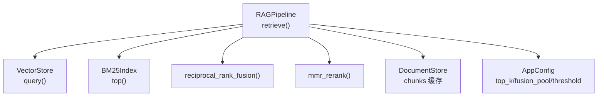
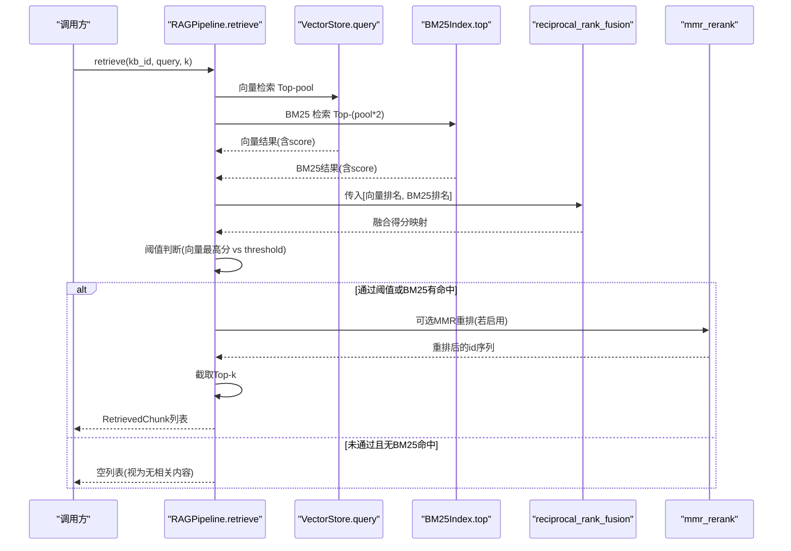
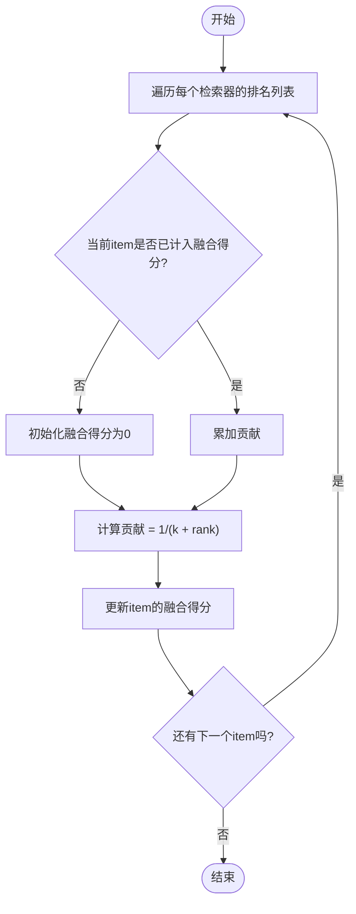
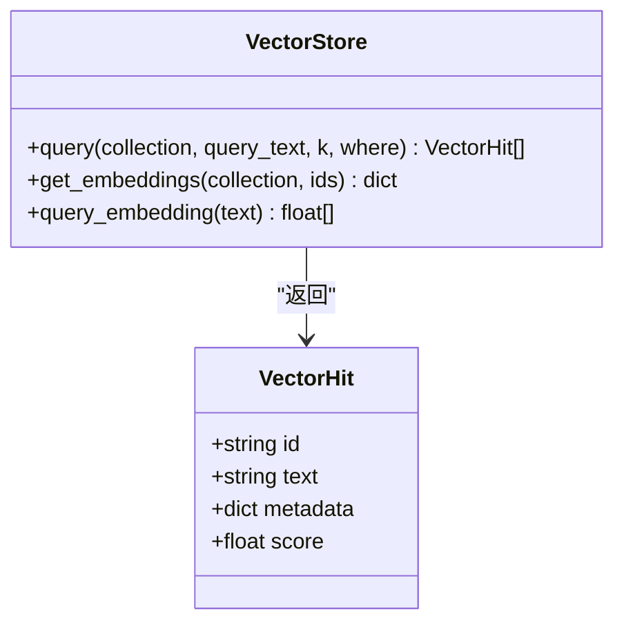
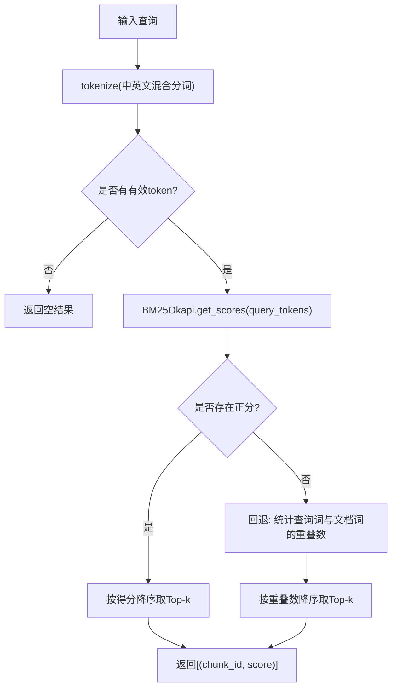
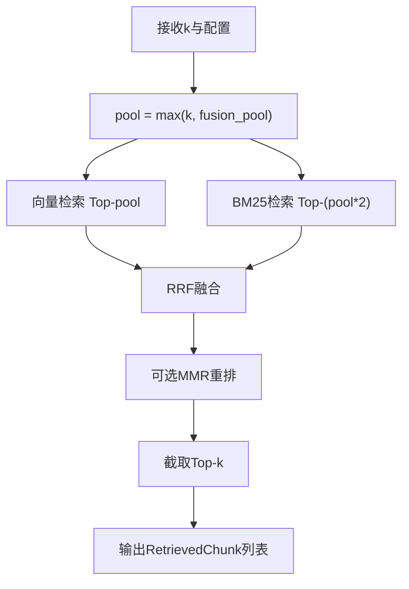
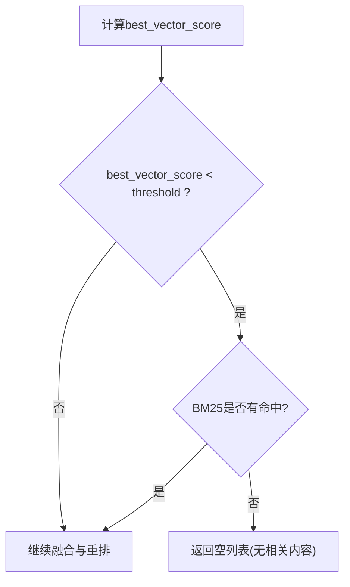
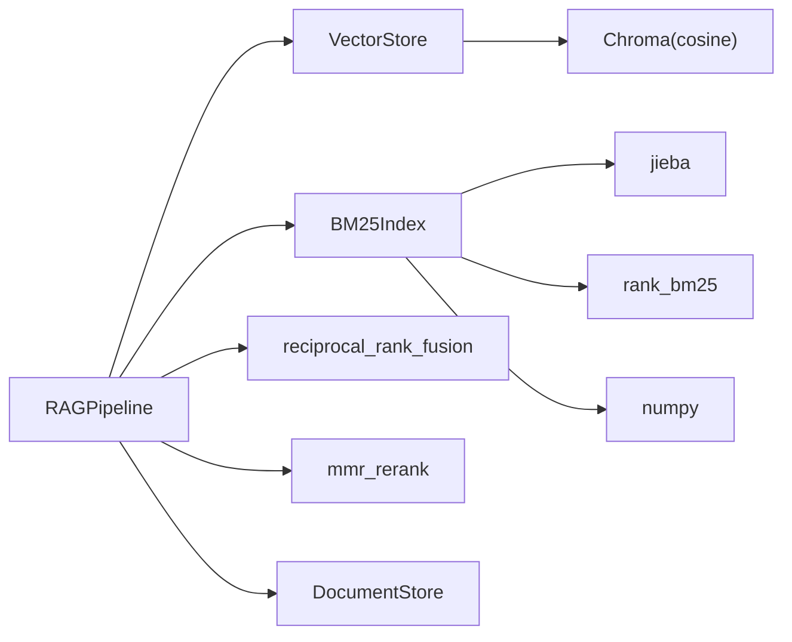

# 向量与BM25融合

<cite>
**本文引用的文件**
- [rag_pipeline.py](file://rag_pipeline.py)
- [vector_store.py](file://vector_store.py)
- [store.py](file://store.py)
- [config.py](file://config.py)
- [utils/retrieval.py](file://utils/retrieval.py)
- [tests/test_retrieval.py](file://tests/test_retrieval.py)
- [docs/LEARNING_GUIDE.md](file://docs/LEARNING_GUIDE.md)
</cite>

## 目录
1. [简介](#简介)
2. [项目结构](#项目结构)
3. [核心组件](#核心组件)
4. [架构总览](#架构总览)
5. [详细组件分析](#详细组件分析)
6. [依赖关系分析](#依赖关系分析)
7. [性能考量](#性能考量)
8. [故障排查指南](#故障排查指南)
9. [结论](#结论)
10. [附录：参数调优与实验建议](#附录参数调优与实验建议)

## 简介
本文件聚焦于“向量检索 + BM25 关键词检索”的融合实现，重点解释 RRF（Reciprocal Rank Fusion）算法、排名归一化与融合得分计算；说明向量相似度与 BM25 词面匹配各自的优势；详述融合池大小配置与 Top-N 选择策略；解释相关性阈值判断逻辑（向量分数阈值与 BM25 命中检测）；并提供基于测试用例的参数对比思路与排序筛选机制说明。

## 项目结构
- 管线入口与混合检索编排：RAGPipeline.retrieve 负责调用向量检索与 BM25 检索，执行 RRF 融合、MMR 重排与阈值过滤。
- 向量存储：VectorStore 封装 Chroma，提供余弦相似度查询与向量获取能力。
- 元数据与片段存储：DocumentStore 使用 SQLite 管理知识库、文档版本与文本片段，供 BM25 重建与检索使用。
- 配置中心：AppConfig 集中读取环境变量，控制 top_k、fusion_pool、relevance_threshold、mmr_lambda 等关键参数。
- 检索工具：utils.retrieval 提供中文分词、BM25Index、RRF 融合与 MMR 重排。
- 测试与学习材料：tests.test_retrieval 验证 BM25、RRF、MMR 行为；docs/LEARNING_GUIDE.md 给出概念与实验指引。

图表来源
- [rag_pipeline.py:439-523](file://rag_pipeline.py#L439-L523)
- [vector_store.py:100-137](file://vector_store.py#L100-L137)
- [utils/retrieval.py:48-148](file://utils/retrieval.py#L48-L148)
- [config.py:56-113](file://config.py#L56-L113)

章节来源
- [rag_pipeline.py:439-523](file://rag_pipeline.py#L439-L523)
- [vector_store.py:100-137](file://vector_store.py#L100-L137)
- [utils/retrieval.py:48-148](file://utils/retrieval.py#L48-L148)
- [config.py:56-113](file://config.py#L56-L113)

## 核心组件
- 混合检索编排器：RAGPipeline.retrieve
  - 并行发起向量检索与 BM25 检索，取候选池后做 RRF 融合，再按配置进行 MMR 重排与 Top-N 截断。
  - 支持按文档限定检索范围，避免无关片段污染上下文。
- 向量检索：VectorStore.query
  - 使用 Chroma 的 cosine 空间，返回余弦相似度作为 score（越大越相关）。
- BM25 检索：utils.retrieval.BM25Index.top
  - 基于 rank_bm25 的词频/逆文档频率打分；在极小语料 IDF=0 时回退到“查询词重叠数”排序。
- 融合算法：utils.retrieval.reciprocal_rank_fusion
  - 对每个列表中的 item 按排名贡献 1/(k+rank)，汇总得到融合得分。
- 去重重排：utils.retrieval.mmr_rerank
  - 平衡“与查询的相关性”和“与已选结果的多样性”，由 lambda_ 控制权衡。
- 配置项：AppConfig
  - top_k：最终返回片段数
  - fusion_pool：参与融合的候选池大小
  - relevance_threshold：向量相似度门槛
  - mmr_enabled / mmr_lambda：是否启用 MMR 及多样性权重

章节来源
- [rag_pipeline.py:439-523](file://rag_pipeline.py#L439-L523)
- [vector_store.py:100-137](file://vector_store.py#L100-L137)
- [utils/retrieval.py:48-148](file://utils/retrieval.py#L48-L148)
- [config.py:56-113](file://config.py#L56-L113)

## 架构总览
下图展示一次检索请求从输入到输出的完整流程，包括向量检索、BM25 检索、RRF 融合、阈值判断、MMR 重排与 Top-N 选择。

图表来源
- [rag_pipeline.py:439-523](file://rag_pipeline.py#L439-L523)
- [vector_store.py:100-137](file://vector_store.py#L100-L137)
- [utils/retrieval.py:48-148](file://utils/retrieval.py#L48-L148)

## 详细组件分析

### 1) RRF 融合算法与公式
- 工作原理
  - 将多个检索器的“排名列表”合并为统一排序，不依赖各检索器的原始得分尺度。
  - 对每个列表中的 item，按其排名 r 贡献 1/(k + r)，其中 k 为常数（默认 60），越小排名贡献越大。
- 排名归一化
  - 无需对各检索器得分做归一化，因为只关心相对顺序。
- 融合得分计算
  - 将所有列表中对同一 item 的贡献相加，得到该 item 的融合得分；得分越高，综合排名越靠前。
- 代码位置
  - 见 utils/retrieval.py 中 reciprocal_rank_fusion 的实现。

图表来源
- [utils/retrieval.py:97-106](file://utils/retrieval.py#L97-L106)

章节来源
- [utils/retrieval.py:97-106](file://utils/retrieval.py#L97-L106)
- [docs/LEARNING_GUIDE.md:38-53](file://docs/LEARNING_GUIDE.md#L38-L53)

### 2) 向量检索相似度计算
- 相似度度量
  - 使用余弦相似度，Chroma 以 cosine 空间存储，距离 d 与相似度 s 的关系为 s = 1 - d。
- 查询过程
  - 将查询文本向量化，与库中向量计算相似度，返回 Top-N 结果及其 score。
- 优势
  - 擅长语义理解，能捕捉同义表达与上下文含义。
- 代码位置
  - VectorStore.query 中构造查询向量并调用集合查询，score = 1 - distance。

图表来源
- [vector_store.py:30-36](file://vector_store.py#L30-L36)
- [vector_store.py:100-137](file://vector_store.py#L100-L137)

章节来源
- [vector_store.py:100-137](file://vector_store.py#L100-L137)

### 3) BM25 关键词匹配
- 工作原理
  - 基于词频（TF）与逆文档频率（IDF）计算相关性；出现越多且越稀有，得分越高。
  - 中文使用 jieba 分词，英文/数字按单词切分，统一小写。
  - 在极小语料导致 IDF=0 时，回退到“查询词与文档词的重叠数量”排序。
- 优势
  - 对精确术语、型号、编号等强匹配场景鲁棒，可解释性强。
- 代码位置
  - BM25Index.build/top 与 tokenize 实现。

图表来源
- [utils/retrieval.py:34-45](file://utils/retrieval.py#L34-L45)
- [utils/retrieval.py:48-94](file://utils/retrieval.py#L48-L94)

章节来源
- [utils/retrieval.py:34-45](file://utils/retrieval.py#L34-L45)
- [utils/retrieval.py:48-94](file://utils/retrieval.py#L48-L94)

### 4) 融合池大小配置与 Top-N 选择策略
- 融合池大小（fusion_pool）
  - 决定向量与 BM25 各自取回的候选数量，用于后续 RRF 融合。
  - 增大 pool 可提升召回但增加计算成本；过小可能漏掉相关片段。
- Top-N 选择（top_k）
  - 最终返回给大模型的片段数量，通常在融合与可选 MMR 重排之后截取。
- 代码位置
  - AppConfig 中定义 top_k、fusion_pool；retrieve 中使用 pool = max(k, fusion_pool)。

图表来源
- [config.py:56-113](file://config.py#L56-L113)
- [rag_pipeline.py:439-523](file://rag_pipeline.py#L439-L523)

章节来源
- [config.py:56-113](file://config.py#L56-L113)
- [rag_pipeline.py:439-523](file://rag_pipeline.py#L439-L523)

### 5) 相关性阈值判断逻辑
- 向量分数阈值
  - 若向量检索的最高相似度低于配置的 relevance_threshold，则初步判定“无相关内容”。
- BM25 兜底放行
  - 当向量分数低于阈值但 BM25 存在命中时，仍返回结果，避免误杀精确匹配（如型号、编号）。
- 代码位置
  - retrieve 中先计算 best_vector_score，若低于阈值且无 BM25 命中则返回空列表。

图表来源
- [rag_pipeline.py:483-486](file://rag_pipeline.py#L483-L486)

章节来源
- [rag_pipeline.py:483-486](file://rag_pipeline.py#L483-L486)

### 6) 排序与筛选机制
- 排序
  - RRF 融合后按融合得分降序排列；若启用 MMR，则在融合基础上进行多样性重排。
- 筛选
  - 根据 relevance_threshold 与 BM25 命中情况决定是否整体过滤。
  - 最终截取 Top-k 作为答案上下文。
- 代码位置
  - retrieve 中 sorted(fused, ...) 与 mmr_rerank 的使用。

章节来源
- [rag_pipeline.py:483-503](file://rag_pipeline.py#L483-L503)

### 7) 代码示例与效果对比（基于测试）
以下示例来自单元测试，可用于观察不同参数与策略对检索质量的影响：
- 分词与 BM25 命中
  - 验证中文与英文混合分词正确性，以及 BM25 对关键词匹配的优先性。
- RRF 融合
  - 两个列表中都排第 1 的 item 应获得最高融合分，体现“共同高排名”的增益。
- MMR 多样性
  - 低 lambda_ 时更倾向多样性，避免重复片段进入 Top-k。
- BM25 兜底
  - 当向量检索为空或低于阈值时，BM25 强命中仍可返回结果。

参考路径
- [tests/test_retrieval.py:12-18](file://tests/test_retrieval.py#L12-L18)
- [tests/test_retrieval.py:21-32](file://tests/test_retrieval.py#L21-L32)
- [tests/test_retrieval.py:40-45](file://tests/test_retrieval.py#L40-L45)
- [tests/test_retrieval.py:48-57](file://tests/test_retrieval.py#L48-L57)
- [tests/test_retrieval.py:64-80](file://tests/test_retrieval.py#L64-L80)

章节来源
- [tests/test_retrieval.py:12-80](file://tests/test_retrieval.py#L12-L80)

## 依赖关系分析
- RAGPipeline 依赖：
  - VectorStore（向量检索）、BM25Index（词面检索）、reciprocal_rank_fusion（融合）、mmr_rerank（重排）、DocumentStore（片段缓存）。
- VectorStore 依赖：
  - Chroma 客户端，cosine 空间，批量嵌入与查询。
- BM25Index 依赖：
  - jieba（中文分词）、rank_bm25（BM25 算法）、numpy（排序）。
- 配置依赖：
  - AppConfig 从环境变量读取所有可调参数，确保可复现实验与部署。

图表来源
- [rag_pipeline.py:439-523](file://rag_pipeline.py#L439-L523)
- [vector_store.py:100-137](file://vector_store.py#L100-L137)
- [utils/retrieval.py:48-148](file://utils/retrieval.py#L48-L148)

章节来源
- [rag_pipeline.py:439-523](file://rag_pipeline.py#L439-L523)
- [vector_store.py:100-137](file://vector_store.py#L100-L137)
- [utils/retrieval.py:48-148](file://utils/retrieval.py#L48-L148)

## 性能考量
- 向量检索
  - 批量嵌入（embedding_batch_size）可减少 API 调用次数，提高吞吐。
  - 余弦相似度计算在 Chroma 内部优化，注意 collection 规模对查询延迟的影响。
- BM25 检索
  - 构建索引时对全量片段分词与统计 IDF，增量更新需重建索引；可通过缓存与惰性加载降低开销。
  - 极小语料下 IDF=0 的回退逻辑避免零分问题，但可能影响排序稳定性。
- 融合与重排
  - RRF 仅依赖排名，计算成本低；MMR 需要向量相似度矩阵，候选较多时计算量上升。
- 阈值与池大小
  - fusion_pool 越大，召回越高但融合与重排成本增加；relevance_threshold 过高可能导致误杀，过低可能引入噪声。

## 故障排查指南
- 向量检索为空或分数过低
  - 检查 embedding 模型与 batch size 配置；确认向量库集合非空。
  - 调整 relevance_threshold 避免过度过滤。
- BM25 全零得分
  - 极小语料库可能出现 IDF=0，触发回退逻辑；检查分词与停用词设置。
- 融合结果异常
  - 检查各检索器返回的排名列表是否为空；确认 k 值与 pool 设置合理。
- MMR 重排无效
  - 若候选向量缺失（例如 BM25 命中的片段在向量库中无向量），将直接截取 Top-k；确保向量库与片段一致。

章节来源
- [rag_pipeline.py:483-503](file://rag_pipeline.py#L483-L503)
- [utils/retrieval.py:48-94](file://utils/retrieval.py#L48-L94)
- [vector_store.py:100-137](file://vector_store.py#L100-L137)

## 结论
本项目通过“向量语义检索 + BM25 词面检索 + RRF 融合 + 可选 MMR 重排”的组合，兼顾了语义理解与精确匹配的优势。RRF 以排名为基础，避免了不同检索器得分尺度不一致的问题；相关性阈值与 BM25 兜底机制有效降低了误判风险。通过合理配置 fusion_pool、top_k、relevance_threshold 与 mmr_lambda，可在召回率与准确率之间取得良好平衡。

## 附录：参数调优与实验建议
- 调整 fusion_pool
  - 减小至较小值（如 3）可观察检索结果变少、引用更集中；增大可提升召回但增加计算成本。
- 调整 relevance_threshold
  - 提高阈值会减少误报但可能误杀；降低阈值可增加召回但引入噪声。
- 调整 mmr_lambda
  - 较大值偏向相关性，较小值偏向多样性；结合业务需求选择。
- 参考学习材料
  - docs/LEARNING_GUIDE.md 提供了概念说明与动手实验建议，便于快速验证参数影响。

章节来源
- [config.py:56-113](file://config.py#L56-L113)
- [docs/LEARNING_GUIDE.md:38-75](file://docs/LEARNING_GUIDE.md#L38-L75)