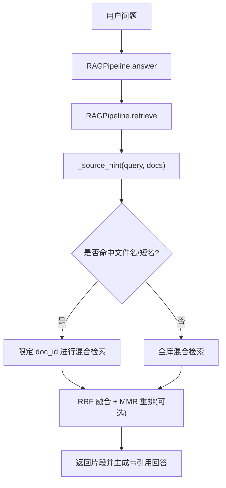
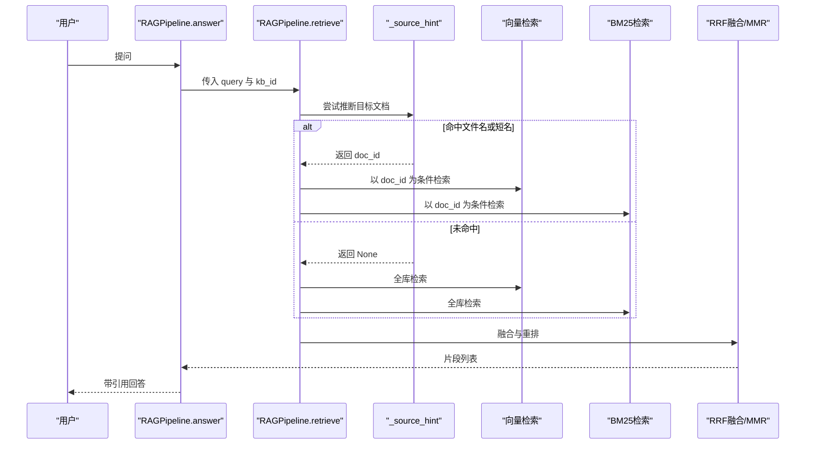
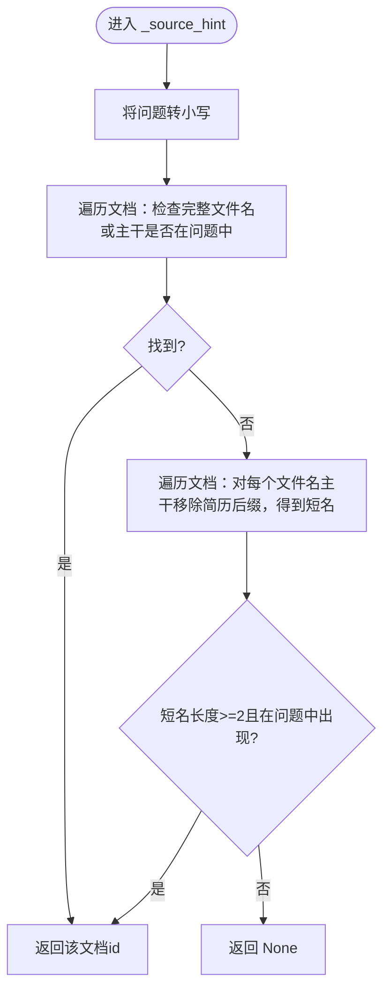
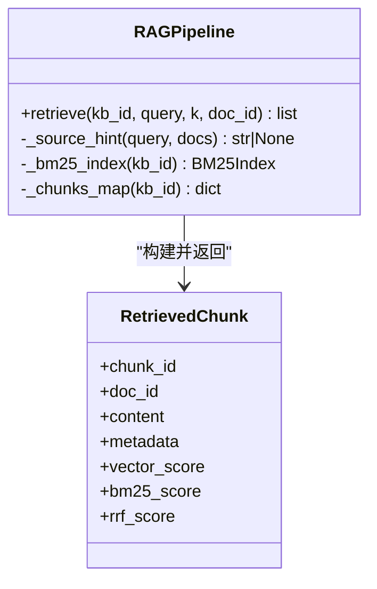
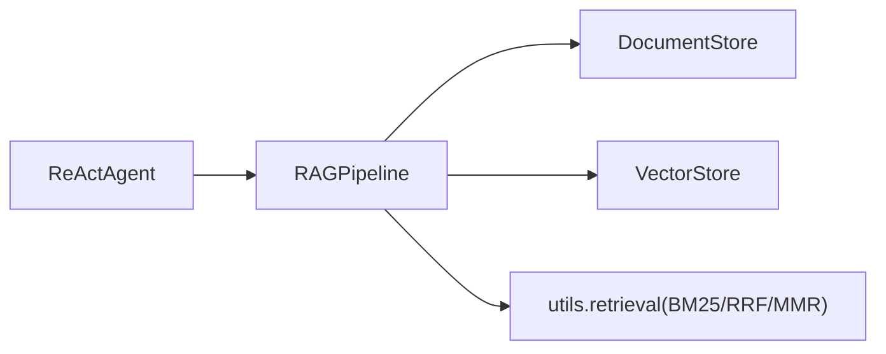

# 智能来源提示匹配

<cite>
**本文引用的文件**
- [rag_pipeline.py](file://rag_pipeline.py)
- [config.py](file://config.py)
- [react_agent.py](file://react_agent.py)
- [test_rag_answer.py](file://tests/test_rag_answer.py)
</cite>

## 目录
1. [简介](#简介)
2. [项目结构](#项目结构)
3. [核心组件](#核心组件)
4. [架构总览](#架构总览)
5. [详细组件分析](#详细组件分析)
6. [依赖关系分析](#依赖关系分析)
7. [性能与行为特性](#性能与行为特性)
8. [故障排查指南](#故障排查指南)
9. [结论](#结论)
10. [附录：场景示例与降级策略](#附录：场景示例与降级策略)

## 简介
本文件聚焦于 RAG 管线中的“智能来源提示匹配”机制，解释其如何通过用户问题自动识别并限定检索范围，从而提升回答准确性。重点包括：
- 两种匹配策略：文件名匹配、人物短名识别（简历类文档）
- SOURCE_HINT_SUFFIXES 配置的作用与简历类文档的特殊处理逻辑
- 匹配优先级与模糊匹配规则
- 通过关键词自动限定检索范围的流程
- 不同场景下的匹配效果说明
- 匹配失败时的降级策略

## 项目结构
该能力位于 RAG 管线的检索阶段，核心实现集中在 RAGPipeline 的 retrieve 与 _source_hint 方法中，并通过测试用例验证其行为。Agent 层通过工具调用间接使用 RAG 的问答能力，但来源提示匹配的核心逻辑在 RAG 管线内完成。

图表来源
- [rag_pipeline.py:439-523](file://rag_pipeline.py#L439-L523)
- [rag_pipeline.py:525-548](file://rag_pipeline.py#L525-L548)

章节来源
- [rag_pipeline.py:439-523](file://rag_pipeline.py#L439-L523)
- [rag_pipeline.py:525-548](file://rag_pipeline.py#L525-L548)

## 核心组件
- RAGPipeline._source_hint：根据问题文本推断目标文档，返回 doc_id 用于限定检索范围
- RAGPipeline.retrieve：执行混合检索（向量+BM25），并在必要时应用 MMR 去重；支持按 doc_id 过滤
- SOURCE_HINT_SUFFIXES：定义简历类文档后缀集合，用于从文件名主干提取“人物短名”
- 测试用例：覆盖短名匹配、文件名主干匹配、无关查询不触发限定等场景

章节来源
- [rag_pipeline.py:525-548](file://rag_pipeline.py#L525-L548)
- [rag_pipeline.py:439-523](file://rag_pipeline.py#L439-L523)
- [tests/test_rag_answer.py:66-104](file://tests/test_rag_answer.py#L66-L104)

## 架构总览
来源提示匹配嵌入在检索流程中，作为“检索前”的意图识别步骤。其目标是减少无关文档对上下文的污染，避免模型幻觉。

图表来源
- [rag_pipeline.py:439-523](file://rag_pipeline.py#L439-L523)
- [rag_pipeline.py:525-548](file://rag_pipeline.py#L525-L548)

## 详细组件分析

### 来源提示匹配器：_source_hint
- 输入：用户问题、当前知识库文档列表
- 输出：目标文档 id 或 None
- 匹配策略与优先级：
  1) 文件名匹配（含扩展名）或其主干直接出现在问题中
  2) 简历类短名匹配：从文件名主干去除简历类后缀后得到“短名”，若短名出现在问题中则命中
- 模糊匹配规则：
  - 大小写不敏感（统一转为小写）
  - 短名需长度至少为 2，且去除首尾空格、下划线、连字符后再判断
  - 仅做子串包含匹配，不做编辑距离或语义相似度计算

图表来源
- [rag_pipeline.py:525-548](file://rag_pipeline.py#L525-L548)

章节来源
- [rag_pipeline.py:525-548](file://rag_pipeline.py#L525-L548)

### 检索流程与来源限定的集成：retrieve
- 当 _source_hint 返回 doc_id 时，retrieve 会将 where={"doc_id": ...} 同时作用于向量检索与 BM25 检索，确保上下文只来自目标文档
- 当未返回 doc_id 时，进行全库检索
- 融合策略：向量 Top-N 与 BM25 Top-N 经 RRF 融合，再可选 MMR 去重
- 相关性门槛：若向量最佳分数低于阈值且 BM25 无命中，视为无相关内容，直接返回空结果

图表来源
- [rag_pipeline.py:439-523](file://rag_pipeline.py#L439-L523)
- [rag_pipeline.py:525-548](file://rag_pipeline.py#L525-L548)

章节来源
- [rag_pipeline.py:439-523](file://rag_pipeline.py#L439-L523)
- [rag_pipeline.py:525-548](file://rag_pipeline.py#L525-L548)

### 简历类文档特殊处理：SOURCE_HINT_SUFFIXES
- 作用：定义“简历类”后缀集合，用于从文件名主干中提取“人物短名”
- 默认值：包含“个人简历”“简历”“简介”“履历”
- 处理逻辑：
  - 对每个文档的文件名主干，依次替换掉这些后缀，得到候选短名
  - 若短名长度≥2，且在问题中以子串形式出现，则认为用户指向该文档
- 设计动机：避免其他类型文档（如汇报、制度）干扰答案，降低幻觉风险

章节来源
- [rag_pipeline.py:52-54](file://rag_pipeline.py#L52-L54)
- [rag_pipeline.py:542-547](file://rag_pipeline.py#L542-L547)

### 匹配优先级与模糊匹配规则总结
- 优先级：
  1) 文件名（含扩展名）或主干直接命中优先
  2) 简历类短名匹配次之
- 模糊匹配：
  - 大小写不敏感
  - 短名需满足最小长度与清洗规则
  - 仅子串匹配，非精确匹配
- 注意：不涉及语义相似度或编辑距离，属于轻量级字符串匹配

章节来源
- [rag_pipeline.py:525-548](file://rag_pipeline.py#L525-L548)

### 通过关键词自动限定检索范围
- 当问题中包含文件名或人物短名时，系统自动将检索范围限定到对应文档
- 这能显著减少无关片段进入上下文，提高回答准确性与可追溯性
- 若未命中任何文档，则退化为全库检索

章节来源
- [rag_pipeline.py:439-523](file://rag_pipeline.py#L439-L523)
- [rag_pipeline.py:525-548](file://rag_pipeline.py#L525-L548)

## 依赖关系分析
- RAGPipeline 依赖：
  - DocumentStore：获取文档列表与片段映射
  - VectorStore：向量检索与嵌入
  - utils.retrieval：BM25Index、reciprocal_rank_fusion、mmr_rerank
- Agent 层通过工具调用 RAG 的 answer/retrieve，但不改变来源提示匹配的内部逻辑

图表来源
- [rag_pipeline.py:439-523](file://rag_pipeline.py#L439-L523)
- [react_agent.py:165-174](file://react_agent.py#L165-L174)

章节来源
- [rag_pipeline.py:439-523](file://rag_pipeline.py#L439-L523)
- [react_agent.py:165-174](file://react_agent.py#L165-L174)

## 性能与行为特性
- 匹配复杂度：O(N) 遍历文档列表，N 为知识库中文档数量；每次匹配为常量时间子串检查
- 检索开销：命中 doc_id 会缩小检索空间，降低向量与 BM25 的计算量
- 相关性门槛：低相关查询可能直接返回空结果，避免无效上下文
- 可配置项：top_k、fusion_pool、relevance_threshold、mmr_enabled、mmr_lambda 等影响最终上下文质量与延迟

章节来源
- [config.py:56-113](file://config.py#L56-L113)
- [rag_pipeline.py:439-523](file://rag_pipeline.py#L439-L523)

## 故障排查指南
- 未命中任何文档：
  - 检查问题是否包含文件名或短名；确认文档命名是否符合预期（如包含简历后缀）
  - 确认知识库已正确入库，片段映射可用
- 检索结果为空：
  - 检查相关性阈值是否过高；调整 relevance_threshold
  - 确认向量与 BM25 索引是否有效
- 短名误匹配：
  - 短名为子串匹配，可能出现歧义；建议规范文档命名或使用更具体的关键词
- 多轮对话改写影响：
  - 若启用查询改写，注意改写结果可能改变匹配关键词；可在调试时关闭改写观察原始行为

章节来源
- [rag_pipeline.py:439-523](file://rag_pipeline.py#L439-L523)
- [rag_pipeline.py:566-588](file://rag_pipeline.py#L566-L588)
- [config.py:56-113](file://config.py#L56-L113)

## 结论
来源提示匹配通过轻量级的字符串匹配，在检索前自动识别用户意图并限定检索范围，显著提升回答准确性与可追溯性。配合混合检索与相关性门槛，能有效抑制无关信息干扰，降低幻觉风险。对于简历类文档，短名匹配进一步提升了针对人物信息的精准度。

## 附录：场景示例与降级策略

### 场景一：文件名匹配
- 示例：问题包含“李明简历.txt”或“李明简历”
- 行为：直接命中该文档，后续检索限定到该文档
- 参考路径
  - [tests/test_rag_answer.py:66-78](file://tests/test_rag_answer.py#L66-L78)
  - [rag_pipeline.py:537-541](file://rag_pipeline.py#L537-L541)

### 场景二：人物短名匹配（简历类）
- 示例：问题包含“李明的学历是什么？”
- 行为：从文件名主干去除简历后缀得到“李明”，匹配成功并限定检索
- 参考路径
  - [tests/test_rag_answer.py:66-81](file://tests/test_rag_answer.py#L66-L81)
  - [rag_pipeline.py:542-547](file://rag_pipeline.py#L542-L547)

### 场景三：无关查询不触发限定
- 示例：问题“今天天气怎么样”
- 行为：未命中任何文档，不做检索范围限定，走全库检索
- 参考路径
  - [tests/test_rag_answer.py:80-81](file://tests/test_rag_answer.py#L80-L81)
  - [rag_pipeline.py:548](file://rag_pipeline.py#L548)

### 场景四：限定检索的效果
- 示例：问题“李明的学历是什么”
- 行为：仅从简历文档检索，即使其他文档包含相似词也不会进入上下文
- 参考路径
  - [tests/test_rag_answer.py:84-104](file://tests/test_rag_answer.py#L84-L104)
  - [rag_pipeline.py:463-478](file://rag_pipeline.py#L463-L478)

### 降级策略
- 未命中任何文档：
  - 返回 None，retrieve 执行全库检索
  - 若相关性不足，answer 返回“未检索到足够相关内容”的提示
- 检索为空：
  - 返回空 sources，answer 给出友好提示
- 异常兜底：
  - 问答服务不可用时返回错误提示，保证系统可用性

章节来源
- [rag_pipeline.py:439-523](file://rag_pipeline.py#L439-L523)
- [rag_pipeline.py:590-666](file://rag_pipeline.py#L590-L666)
- [tests/test_rag_answer.py:26-33](file://tests/test_rag_answer.py#L26-L33)