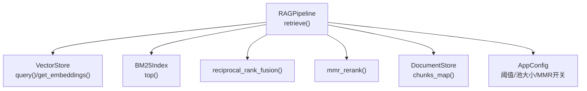
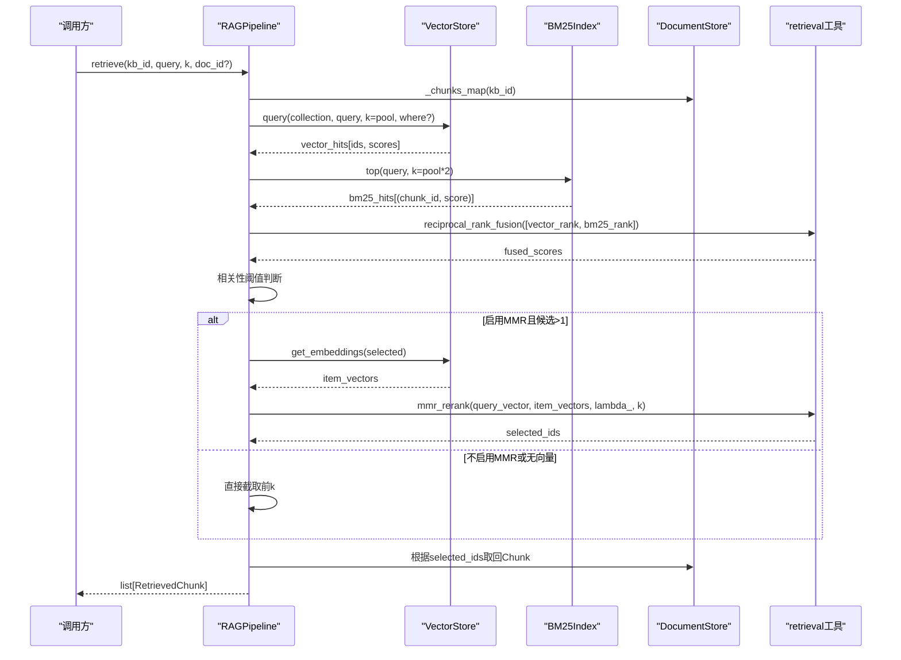
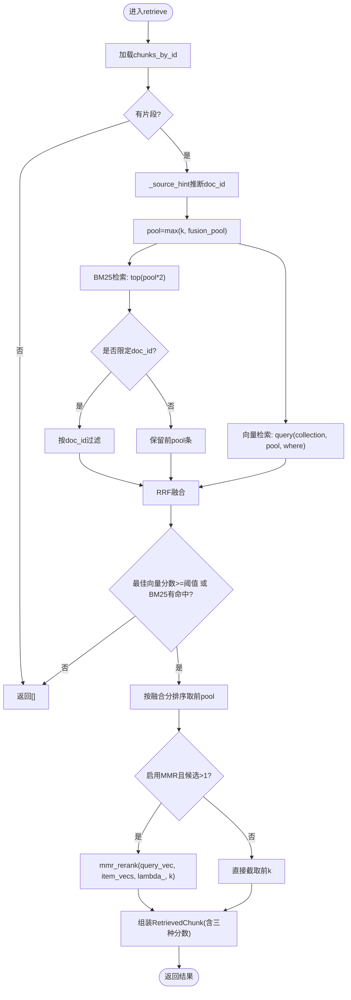
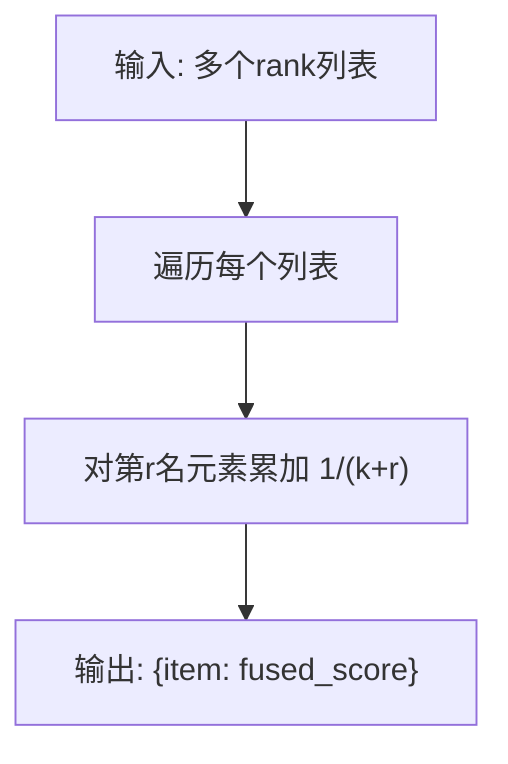
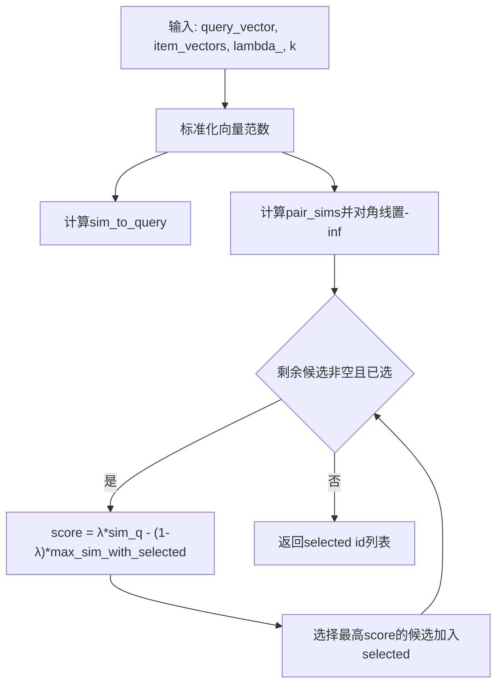
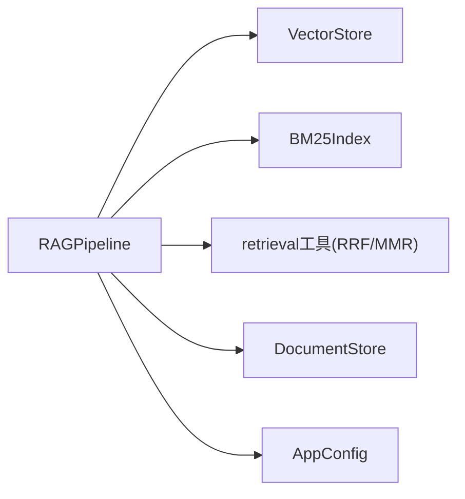

# 混合检索算法

<cite>
**本文引用的文件**
- [rag_pipeline.py](file://rag_pipeline.py)
- [utils/retrieval.py](file://utils/retrieval.py)
- [vector_store.py](file://vector_store.py)
- [store.py](file://store.py)
- [config.py](file://config.py)
- [tests/test_retrieval.py](file://tests/test_retrieval.py)
- [docs/LEARNING_GUIDE.md](file://docs/LEARNING_GUIDE.md)
</cite>

## 目录
1. [简介](#简介)
2. [项目结构](#项目结构)
3. [核心组件](#核心组件)
4. [架构总览](#架构总览)
5. [详细组件分析](#详细组件分析)
6. [依赖关系分析](#依赖关系分析)
7. [性能与调优](#性能与调优)
8. [故障排查](#故障排查)
9. [结论](#结论)
10. [附录：配置与使用示例](#附录配置与使用示例)

## 简介
本技术文档聚焦于混合检索算法的实现与原理，围绕 retrieve 方法展开，系统阐述向量语义检索与 BM25 关键词检索的融合策略；深入解释 RRF（Reciprocal Rank Fusion）排名融合公式、权重分配与实现细节；说明 MMR（Maximal Marginal Relevance）去重算法的作用与参数调优；讲解相关性阈值判断机制与低相关查询过滤策略；介绍文档限定功能（文件名匹配、人物短名识别等智能来源提示）；并提供具体配置与使用方法、参数调优建议，以及 RetrievedChunk 数据结构设计说明。

## 项目结构
本项目采用分层模块化设计：
- 管线层：RAGPipeline 负责知识库管理、入库、检索、问答编排。
- 检索工具层：BM25Index、RRF、MMR 等纯 Python 实现，不依赖外部模型。
- 存储层：VectorStore 封装 Chroma 向量库；DocumentStore 基于 SQLite 管理元数据与片段。
- 配置层：AppConfig 集中读取环境变量，统一控制检索与生成行为。

图表来源
- [rag_pipeline.py:439-523](file://rag_pipeline.py#L439-L523)
- [utils/retrieval.py:48-148](file://utils/retrieval.py#L48-L148)
- [vector_store.py:100-137](file://vector_store.py#L100-L137)
- [store.py:558-562](file://store.py#L558-L562)
- [config.py:96-112](file://config.py#L96-L112)

章节来源
- [rag_pipeline.py:1-15](file://rag_pipeline.py#L1-L15)
- [config.py:1-113](file://config.py#L1-L113)

## 核心组件
- RAGPipeline.retrieve：混合检索入口，串联向量检索、BM25 检索、RRF 融合、可选 MMR 重排、相关性阈值判断与结果组装。
- BM25Index：中文分词 + BM25 打分，支持 IDF 全零时的兜底重叠排序。
- reciprocal_rank_fusion：按排名贡献 1/(k+rank) 进行融合，无需对齐不同检索器的得分尺度。
- mmr_rerank：在“与查询相似度”和“候选间重复度”之间权衡，输出多样性更高的 Top-K。
- VectorStore：Chroma 向量库封装，提供批量 upsert、条件删除、相似度查询、取回原始向量。
- DocumentStore：SQLite 持久化知识库、文档版本、片段与元数据。
- AppConfig：集中配置检索池大小、Top-K、相关性阈值、MMR 开关与 lambda、上下文 token 预算等。

章节来源
- [rag_pipeline.py:134-145](file://rag_pipeline.py#L134-L145)
- [utils/retrieval.py:34-148](file://utils/retrieval.py#L34-L148)
- [vector_store.py:38-148](file://vector_store.py#L38-L148)
- [store.py:88-121](file://store.py#L88-L121)
- [config.py:56-112](file://config.py#L56-L112)

## 架构总览
下图展示一次检索请求从输入到返回的完整流程，包括检索器调用、融合与重排、阈值判定与结果构造。

图表来源
- [rag_pipeline.py:439-523](file://rag_pipeline.py#L439-L523)
- [utils/retrieval.py:97-148](file://utils/retrieval.py#L97-L148)
- [vector_store.py:100-137](file://vector_store.py#L100-L137)
- [store.py:558-562](file://store.py#L558-L562)

## 详细组件分析

### retrieve 方法：混合检索核心流程
- 输入处理与缓存：获取 chunks_by_id，若为空则直接返回空结果。
- 文档限定：若无显式 doc_id，尝试通过 _source_hint 从问题中推断目标文档（文件名/人物短名）。
- 候选池大小：pool = max(k, fusion_pool)，分别执行向量检索与 BM25 检索。
- 向量检索：调用 VectorStore.query，得到 ids 与余弦相似度分数。
- BM25 检索：构建 BM25Index（按需），对查询分词后打分，必要时按 doc_id 过滤。
- 融合：将两份 rank 列表传入 reciprocal_rank_fusion，得到每个 chunk_id 的融合分数。
- 相关性阈值：若最佳向量分数低于阈值且 BM25 无命中，视为无相关内容，直接返回空。
- 重排：若启用 MMR 且候选数大于 1，计算 query_embedding 并取回候选向量，调用 mmr_rerank 重排；否则直接截取前 k。
- 结果组装：按 selected 顺序从 chunks_by_id 取回 Chunk，填充 RetrievedChunk 的三个分数字段。

图表来源
- [rag_pipeline.py:439-523](file://rag_pipeline.py#L439-L523)
- [utils/retrieval.py:97-148](file://utils/retrieval.py#L97-L148)
- [vector_store.py:100-137](file://vector_store.py#L100-L137)

章节来源
- [rag_pipeline.py:439-523](file://rag_pipeline.py#L439-L523)

### RRF（Reciprocal Rank Fusion）融合算法
- 原理：对每个检索器输出的排名列表，第 r 名的元素贡献 1/(k+r) 的分数，多个列表的贡献相加得到最终融合分数。该方式不要求不同检索器的得分可比较，仅依赖相对排名。
- 实现：reciprocal_rank_fusion(ranked_lists, k=60) 遍历每个列表，累加贡献值。
- 权重分配：默认等权（每个列表贡献相同），可通过调整参与融合的列表数量间接影响权重；当前实现未引入显式权重系数。
- 优势：鲁棒性强，对个别检索器的噪声不敏感；适合多路召回后的粗排。

图表来源
- [utils/retrieval.py:97-106](file://utils/retrieval.py#L97-L106)

章节来源
- [utils/retrieval.py:97-106](file://utils/retrieval.py#L97-L106)
- [docs/LEARNING_GUIDE.md:38-53](file://docs/LEARNING_GUIDE.md#L38-L53)

### MMR（Maximal Marginal Relevance）去重算法
- 作用：在 Top-K 片段中平衡“与查询的相关性”和“候选之间的重复度”，避免返回高度相似的重复内容。
- 公式思想：每轮选择使 λ × 与查询相似度 − (1−λ) × 与已选结果的最大相似度 最大的候选；λ 越大越看重相关性，越小越看重多样性。
- 实现要点：
  - 计算候选与查询的余弦相似度。
  - 计算候选两两相似度矩阵，对角线置为负无穷以避免自相似。
  - 迭代选择直到达到 k 个。
- 参数调优：
  - mmr_lambda：推荐从 0.6~0.8 起步；若发现答案过于多样但不够精准，可适当增大；若重复度高，可降低。
  - mmr_enabled：小语料或高重复场景建议开启；大语料且检索质量稳定时可关闭以节省计算。
- 边界处理：若候选向量缺失（如仅由 BM25 兜底命中的条目），无法计算 MMR，直接截取前 k。

图表来源
- [utils/retrieval.py:109-148](file://utils/retrieval.py#L109-L148)

章节来源
- [utils/retrieval.py:109-148](file://utils/retrieval.py#L109-L148)
- [docs/LEARNING_GUIDE.md:55-66](file://docs/LEARNING_GUIDE.md#L55-L66)
- [tests/test_retrieval.py:48-61](file://tests/test_retrieval.py#L48-L61)

### 相关性阈值判断与低相关查询过滤
- 机制：若最佳向量分数低于配置的 relevance_threshold 且 BM25 无命中，则认为无相关内容，直接返回空结果，避免模型“硬凑答案”。
- 设计动机：纯关键词查询（型号、编号、人名等）可能向量相似度不高，但 BM25 能强命中；因此当 BM25 有命中时即使向量分数较低也放行，防止误杀精确匹配。
- 可调参数：RETRIEVAL_RELEVANCE_THRESHOLD（默认 0.3），可根据业务场景提高或降低阈值以平衡召回与准确率。

章节来源
- [rag_pipeline.py:483-486](file://rag_pipeline.py#L483-L486)
- [config.py:104](file://config.py#L104)
- [docs/LEARNING_GUIDE.md:68-75](file://docs/LEARNING_GUIDE.md#L68-L75)
- [tests/test_retrieval.py:64-80](file://tests/test_retrieval.py#L64-L80)

### 文档限定功能：智能来源提示
- 触发时机：retrieve 中若未显式传入 doc_id，会调用 _source_hint 从问题文本中猜测目标文档。
- 匹配规则：
  - 文件名（含扩展名）或其主干出现在问题中。
  - 针对简历类后缀（如“个人简历”“简历”“简介”“履历”），去除后缀后的短名出现在问题中。
- 效果：自动将检索范围限定到指定文档，减少无关文档片段污染答案，提升准确性与可解释性。

章节来源
- [rag_pipeline.py:525-548](file://rag_pipeline.py#L525-L548)

### RetrievedChunk 数据结构设计
- 字段含义：
  - chunk_id：片段唯一标识。
  - doc_id：所属文档 ID。
  - content：片段文本内容。
  - metadata：片段元数据（如来源、页码、段落等）。
  - vector_score：向量余弦相似度（用于评估语义相关性）。
  - bm25_score：BM25 原始得分（用于评估关键词匹配强度）。
  - rrf_score：RRF 融合得分（用于最终排序依据）。
- 用途：便于观察各检索器表现、调试融合效果、定位低相关片段。

章节来源
- [rag_pipeline.py:134-145](file://rag_pipeline.py#L134-L145)

## 依赖关系分析
- RAGPipeline 依赖：
  - VectorStore：向量检索与向量获取。
  - BM25Index：关键词检索。
  - retrieval 工具：RRF 融合与 MMR 重排。
  - DocumentStore：片段与元数据存取。
  - AppConfig：运行时参数。
- 耦合与内聚：
  - 检索逻辑集中在 retrieve，内聚度高；检索工具函数解耦，易于替换与测试。
  - 存储层抽象清晰，上层不直接接触底层 API。
- 外部依赖：
  - Chroma（向量库）、SQLite（元数据）、jieba/rank_bm25/numpy（检索工具）。

图表来源
- [rag_pipeline.py:439-523](file://rag_pipeline.py#L439-L523)
- [utils/retrieval.py:48-148](file://utils/retrieval.py#L48-L148)
- [vector_store.py:38-148](file://vector_store.py#L38-L148)
- [store.py:123-470](file://store.py#L123-L470)
- [config.py:56-112](file://config.py#L56-L112)

章节来源
- [rag_pipeline.py:439-523](file://rag_pipeline.py#L439-L523)
- [utils/retrieval.py:48-148](file://utils/retrieval.py#L48-L148)
- [vector_store.py:38-148](file://vector_store.py#L38-L148)
- [store.py:123-470](file://store.py#L123-L470)
- [config.py:56-112](file://config.py#L56-L112)

## 性能与调优
- 融合池大小（fusion_pool）：
  - 增大可提升召回多样性，但增加计算与内存开销；建议从 12 起步，逐步上调至 20~30 观察效果。
- Top-K（top_k）：
  - 控制最终返回给模型的片段数；过小可能遗漏关键信息，过大增加上下文成本与重复风险。
- 相关性阈值（relevance_threshold）：
  - 默认 0.3；提高可减少幻觉但可能误杀，降低可增加召回但需容忍更多噪声。
- MMR 开关与 lambda：
  - mmr_enabled=true 时，lambda 从 0.7 起步；若重复度高则降低，若过于发散则提高。
- 嵌入批大小（embedding_batch_size）：
  - 受限于后端接口限制（例如单次最多 20 条），默认 16 留有余量；可按硬件与接口能力调整。
- 上下文 Token 预算：
  - rag_context_max_tokens 控制注入上下文的长度；结合 fit_context_indices 保留重要块，避免超出模型窗口。
- 索引重建：
  - 切分参数或嵌入模型变化时自动全量重建，确保向量与索引一致。

章节来源
- [config.py:96-112](file://config.py#L96-L112)
- [rag_pipeline.py:306-435](file://rag_pipeline.py#L306-L435)
- [docs/LEARNING_GUIDE.md:38-75](file://docs/LEARNING_GUIDE.md#L38-L75)

## 故障排查
- 向量检索为空或分数过低：
  - 检查 embedding 模型与 batch size；确认向量库集合存在且数据已 upsert。
  - 若 BM25 有命中，仍应放行；若两者均无命中，属于正常“无相关内容”分支。
- BM25 全零得分：
  - 极小语料库可能出现 IDF 为 0，此时退化为词面重叠排序；检查分词与停用词设置。
- MMR 未生效：
  - 若候选向量缺失（仅 BM25 命中），无法计算 MMR，将直接截取；确保候选来自向量库。
- 文档限定未触发：
  - 检查问题是否包含文件名或人物短名；确认 SOURCE_HINT_SUFFIXES 配置符合预期。
- 上下文过长被截断：
  - 调整 rag_context_max_tokens；或使用 fit_context_indices 保留更重要块。

章节来源
- [vector_store.py:100-137](file://vector_store.py#L100-L137)
- [utils/retrieval.py:71-95](file://utils/retrieval.py#L71-L95)
- [rag_pipeline.py:483-503](file://rag_pipeline.py#L483-L503)
- [rag_pipeline.py:525-548](file://rag_pipeline.py#L525-L548)

## 结论
本混合检索方案通过向量语义检索与 BM25 关键词检索的互补，结合 RRF 融合与可选 MMR 重排，兼顾召回率与多样性；相关性阈值机制有效抑制低相关查询导致的幻觉；文档限定功能提升精准性与可解释性。整体实现简洁、可配置、易扩展，适合在多知识库场景下快速落地与持续优化。

## 附录：配置与使用示例
- 基本步骤
  - 创建知识库并上传文档。
  - 执行入库（ingest）以构建向量与 BM25 索引。
  - 调用 retrieve 进行混合检索，返回 RetrievedChunk 列表。
  - 将检索结果作为上下文输入问答模块，生成带引用回答。
- 关键配置项（环境变量）
  - RETRIEVAL_TOP_K：最终返回片段数。
  - RETRIEVAL_FUSION_POOL：融合候选池大小。
  - RETRIEVAL_RELEVANCE_THRESHOLD：相关性阈值。
  - RETRIEVAL_MMR_ENABLED / RETRIEVAL_MMR_LAMBDA：MMR 开关与 lambda。
  - CHUNK_SIZE / CHUNK_OVERLAP：切分参数。
  - EMBEDDING_BATCH_SIZE：向量化批大小。
  - RAG_CONTEXT_MAX_TOKENS：上下文 token 预算。
- 调优建议
  - 先固定 top_k 与 fusion_pool，调整相关性阈值与 MMR 参数观察效果。
  - 对关键词密集型查询，适当提高 fusion_pool 并放宽阈值。
  - 对长文档与重复内容多的场景，开启 MMR 并降低 lambda 以提升多样性。
- 参考路径
  - 检索入口与流程：[rag_pipeline.py:439-523](file://rag_pipeline.py#L439-L523)
  - 融合与重排实现：[utils/retrieval.py:97-148](file://utils/retrieval.py#L97-L148)
  - 配置项定义：[config.py:96-112](file://config.py#L96-L112)
  - 学习指南与概念说明：[docs/LEARNING_GUIDE.md:38-75](file://docs/LEARNING_GUIDE.md#L38-L75)
  - 单元测试验证：[tests/test_retrieval.py:12-80](file://tests/test_retrieval.py#L12-L80)