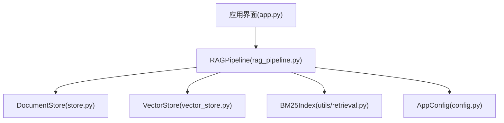
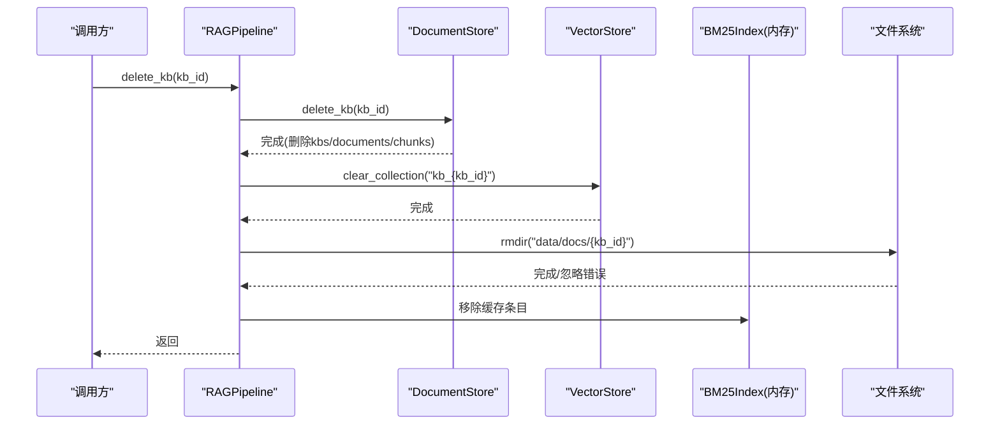
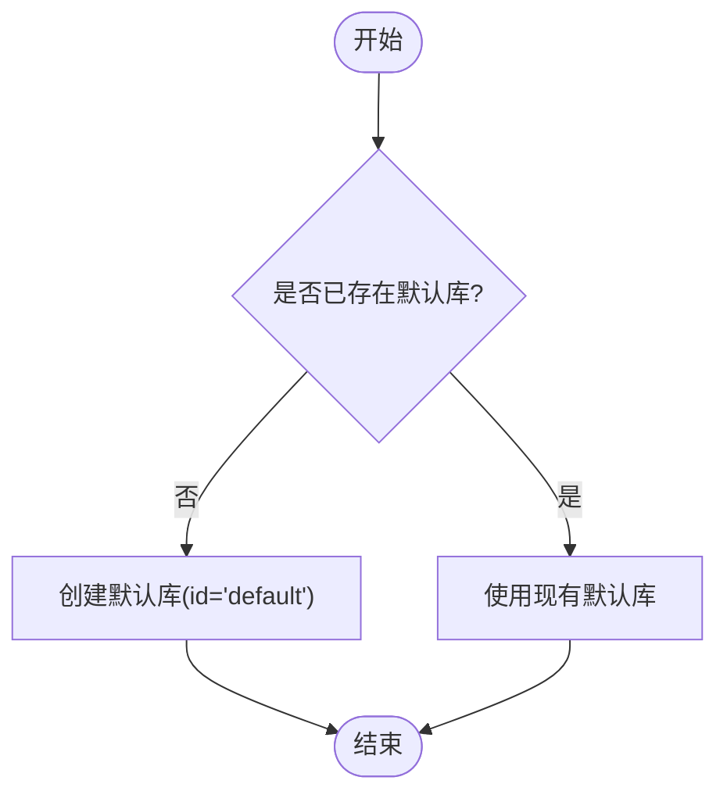
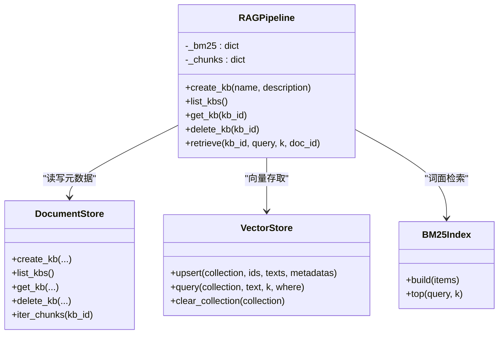
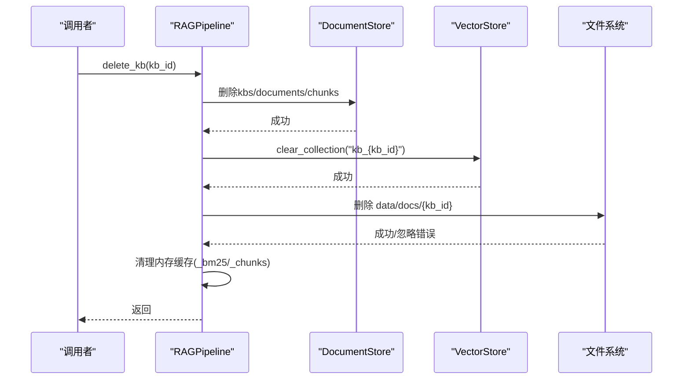
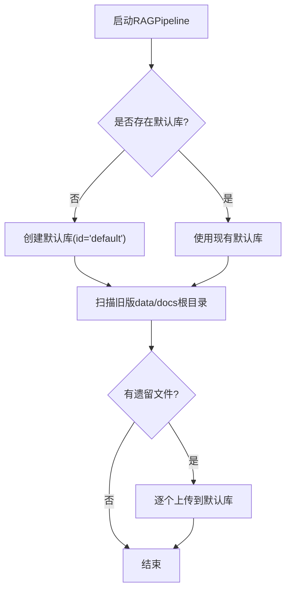
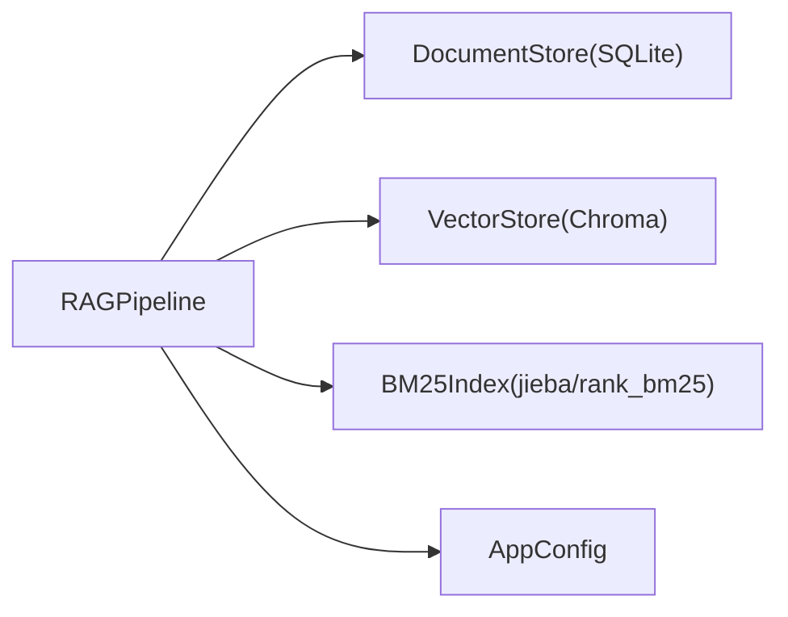

# 知识库管理

<cite>
**本文引用的文件**
- [rag_pipeline.py](file://rag_pipeline.py)
- [store.py](file://store.py)
- [vector_store.py](file://vector_store.py)
- [utils/retrieval.py](file://utils/retrieval.py)
- [config.py](file://config.py)
- [app.py](file://app.py)
</cite>

## 目录
1. [简介](#简介)
2. [项目结构](#项目结构)
3. [核心组件](#核心组件)
4. [架构总览](#架构总览)
5. [详细组件分析](#详细组件分析)
6. [依赖关系分析](#依赖关系分析)
7. [性能与扩展性](#性能与扩展性)
8. [故障排查指南](#故障排查指南)
9. [结论](#结论)
10. [附录：使用示例与错误处理](#附录使用示例与错误处理)

## 简介
本章节面向RAG管线中的“知识库管理”能力，围绕 create_kb、list_kbs、get_kb、delete_kb 等核心方法展开，说明其功能、参数与返回值格式；解释知识库的CRUD流程、与向量存储和BM25索引的关系；阐述删除时的级联清理机制；并给出创建与管理多个独立知识库的实践方式、默认知识库的处理逻辑与向后兼容设计。

## 项目结构
- RAGPipeline 作为门面类，统一封装知识库管理、文档入库、混合检索与问答。
- DocumentStore 基于SQLite持久化知识库、文档、片段与元数据。
- VectorStore 基于Chroma实现向量存储，按知识库隔离collection。
- utils.retrieval 提供中文分词、BM25索引、RRF融合与MMR重排。
- config 集中管理运行参数（如top_k、融合池大小、阈值、MMR开关等）。
- app.py 提供Web界面，演示知识库创建、切换、删除等操作。

图表来源
- [rag_pipeline.py:196-258](file://rag_pipeline.py#L196-L258)
- [store.py:123-212](file://store.py#L123-L212)
- [vector_store.py:38-148](file://vector_store.py#L38-L148)
- [utils/retrieval.py:48-106](file://utils/retrieval.py#L48-L106)
- [config.py:56-113](file://config.py#L56-L113)

章节来源
- [rag_pipeline.py:196-258](file://rag_pipeline.py#L196-L258)
- [store.py:123-212](file://store.py#L123-L212)
- [vector_store.py:38-148](file://vector_store.py#L38-L148)
- [utils/retrieval.py:48-106](file://utils/retrieval.py#L48-L106)
- [config.py:56-113](file://config.py#L56-L113)
- [app.py:136-235](file://app.py#L136-L235)

## 核心组件
- RAGPipeline：对外暴露知识库管理接口，协调元数据、向量与BM25索引。
- DocumentStore：负责知识库、文档、片段、版本与配置的持久化。
- VectorStore：按 kb_id 隔离 collection，提供 upsert/query/delete/clear_collection 等能力。
- BM25Index：轻量词面索引，支持 top(k) 查询。
- AppConfig：集中配置检索与切分参数。

章节来源
- [rag_pipeline.py:196-258](file://rag_pipeline.py#L196-L258)
- [store.py:88-212](file://store.py#L88-L212)
- [vector_store.py:38-148](file://vector_store.py#L38-L148)
- [utils/retrieval.py:48-106](file://utils/retrieval.py#L48-L106)
- [config.py:56-113](file://config.py#L56-L113)

## 架构总览
知识库在系统中的角色与交互如下：
- 每个知识库对应一个独立的 Chroma collection（命名 kb_<kb_id>），以及一份SQLite元数据。
- 文档入库时生成片段（chunks），写入SQLite，同时向量化后存入向量库；BM25索引按需重建。
- 检索阶段进行向量检索与BM25检索，通过RRF融合结果，可选MMR去重。
- 删除知识库时，级联清理元数据、向量集合与物理文件目录，并清空内存缓存。

图表来源
- [rag_pipeline.py:239-248](file://rag_pipeline.py#L239-L248)
- [store.py:200-212](file://store.py#L200-L212)
- [vector_store.py:142-148](file://vector_store.py#L142-L148)

章节来源
- [rag_pipeline.py:239-248](file://rag_pipeline.py#L239-L248)
- [store.py:200-212](file://store.py#L200-L212)
- [vector_store.py:142-148](file://vector_store.py#L142-L148)

## 详细组件分析

### 知识库CRUD方法
- create_kb(name, description="")
  - 功能：创建知识库，名称唯一。
  - 参数：name（必填）、description（可选）。
  - 返回：Kb对象（id、name、description、created_at）。
  - 异常：名称重复时抛出 ValueError。
  - 实现要点：写入SQLite kbs表，事务保护，并发安全。
  - 参考路径：[create_kb:223-224](file://rag_pipeline.py#L223-L224)、[create_kb:158-175](file://store.py#L158-L175)

- list_kbs()
  - 功能：列出所有知识库，按创建时间排序。
  - 返回：Kb列表。
  - 参考路径：[list_kbs:226-227](file://rag_pipeline.py#L226-L227)、[list_kbs:176-182](file://store.py#L176-L182)

- get_kb(kb_id)
  - 功能：根据ID获取知识库。
  - 返回：Kb或None。
  - 参考路径：[get_kb:229-230](file://rag_pipeline.py#L229-L230)、[get_kb:184-190](file://store.py#L184-L190)

- delete_kb(kb_id)
  - 功能：删除知识库及其关联数据，并进行级联清理。
  - 参数：kb_id（必填）。
  - 返回：无。
  - 级联清理：
    - SQLite：删除 chunks、documents、kbs 记录。
    - 向量库：清空对应 collection（kb_<kb_id>）。
    - 文件系统：删除 data/docs/{kb_id} 目录。
    - 内存：清除该kb的BM25索引与片段缓存。
  - 参考路径：[delete_kb:239-248](file://rag_pipeline.py#L239-L248)、[delete_kb:200-212](file://store.py#L200-L212)

- get_or_create_default_kb()
  - 功能：确保存在固定id为“default”的默认知识库，用于命令行/旧数据兼容。
  - 返回：Kb对象。
  - 参考路径：[get_or_create_default_kb:232-237](file://rag_pipeline.py#L232-L237)

- kb_stats(kb_id)
  - 功能：统计知识库的文档数、片段数、向量数量。
  - 返回：字典，包含 kb_id、documents、chunks、vector_count。
  - 参考路径：[kb_stats:249-256](file://rag_pipeline.py#L249-L256)

图表来源
- [rag_pipeline.py:232-237](file://rag_pipeline.py#L232-L237)

章节来源
- [rag_pipeline.py:223-256](file://rag_pipeline.py#L223-L256)
- [store.py:158-212](file://store.py#L158-L212)

### 知识库与向量存储、BM25索引的关系
- 向量存储：
  - 每个知识库对应一个Chroma collection，命名规则为 kb_<kb_id>。
  - 入库时批量upsert文本与元数据；删除知识库时清空整个collection。
  - 参考路径：[collection_name:727-728](file://rag_pipeline.py#L727-L728)、[clear_collection:142-148](file://vector_store.py#L142-L148)

- BM25索引：
  - 内存中维护 per-kb 的BM25Index实例，惰性构建与缓存。
  - 当片段变化或入库完成后，标记stale并在下次检索时重建。
  - 参考路径：[_bm25_index:550-556](file://rag_pipeline.py#L550-L556)、[BM25Index.top:71-94](file://utils/retrieval.py#L71-L94)

- 片段缓存：
  - 内存中维护 per-kb 的片段映射，避免频繁读库。
  - 入库或删除后标记stale，下次检索时重建。
  - 参考路径：[_chunks_map:558-562](file://rag_pipeline.py#L558-L562)

图表来源
- [rag_pipeline.py:196-258](file://rag_pipeline.py#L196-L258)
- [store.py:123-212](file://store.py#L123-L212)
- [vector_store.py:38-148](file://vector_store.py#L38-L148)
- [utils/retrieval.py:48-106](file://utils/retrieval.py#L48-L106)

章节来源
- [rag_pipeline.py:550-562](file://rag_pipeline.py#L550-L562)
- [vector_store.py:38-148](file://vector_store.py#L38-L148)
- [utils/retrieval.py:48-106](file://utils/retrieval.py#L48-L106)

### 删除操作的级联清理机制
- 元数据层：删除kbs、documents、chunks记录。
- 向量层：删除对应collection，释放向量索引。
- 文件层：删除知识库对应的物理文件目录。
- 内存层：清除该kb的BM25索引与片段缓存，避免脏读。

图表来源
- [rag_pipeline.py:239-248](file://rag_pipeline.py#L239-L248)
- [store.py:200-212](file://store.py#L200-L212)
- [vector_store.py:142-148](file://vector_store.py#L142-L148)

章节来源
- [rag_pipeline.py:239-248](file://rag_pipeline.py#L239-L248)
- [store.py:200-212](file://store.py#L200-L212)
- [vector_store.py:142-148](file://vector_store.py#L142-L148)

### 默认知识库与向后兼容
- 默认知识库固定id为“default”，便于命令行与历史数据兼容。
- 首次启动若不存在，自动创建名为“默认知识库”的默认库。
- 迁移逻辑会将旧版根目录下的遗留文件导入默认知识库。

图表来源
- [rag_pipeline.py:232-237](file://rag_pipeline.py#L232-L237)
- [rag_pipeline.py:754-773](file://rag_pipeline.py#L754-L773)

章节来源
- [rag_pipeline.py:232-237](file://rag_pipeline.py#L232-L237)
- [rag_pipeline.py:754-773](file://rag_pipeline.py#L754-L773)

## 依赖关系分析
- RAGPipeline 依赖：
  - DocumentStore：知识库与文档元数据、片段、版本、配置。
  - VectorStore：向量存储与查询。
  - BM25Index：词面检索与召回。
  - AppConfig：检索与切分参数。
- 外部依赖：
  - SQLite：本地数据库。
  - Chroma：向量数据库。
  - jieba/rank_bm25/numpy：检索工具。

图表来源
- [rag_pipeline.py:196-258](file://rag_pipeline.py#L196-L258)
- [store.py:123-212](file://store.py#L123-L212)
- [vector_store.py:38-148](file://vector_store.py#L38-L148)
- [utils/retrieval.py:48-106](file://utils/retrieval.py#L48-L106)
- [config.py:56-113](file://config.py#L56-L113)

章节来源
- [rag_pipeline.py:196-258](file://rag_pipeline.py#L196-L258)
- [store.py:123-212](file://store.py#L123-L212)
- [vector_store.py:38-148](file://vector_store.py#L38-L148)
- [utils/retrieval.py:48-106](file://utils/retrieval.py#L48-L106)
- [config.py:56-113](file://config.py#L56-L113)

## 性能与扩展性
- 向量入库采用分批embedding，避免单次请求过大导致失败。
- BM25索引惰性构建与缓存，减少重复计算。
- 片段缓存降低频繁读取SQLite的压力。
- 可通过配置调整top_k、融合池大小、相关性阈值、MMR开关与权重，平衡召回与质量。
- 建议：
  - 大库场景下适当增大融合池以改善召回。
  - 开启MMR以减少重复片段，提升上下文多样性。
  - 合理设置相关性阈值，避免无关问题硬凑答案。

章节来源
- [vector_store.py:61-79](file://vector_store.py#L61-L79)
- [rag_pipeline.py:439-523](file://rag_pipeline.py#L439-L523)
- [config.py:56-113](file://config.py#L56-L113)

## 故障排查指南
- 创建知识库失败：
  - 可能原因：名称重复。
  - 现象：抛出 ValueError。
  - 处理：更换名称或先检查已有知识库。
  - 参考路径：[create_kb异常](file://store.py:168-L170)

- 删除知识库后仍可见残留：
  - 检查是否调用了级联清理（元数据、向量、文件、缓存）。
  - 确认上层未保留引用或未刷新客户端连接。
  - 参考路径：[delete_kb级联清理](file://rag_pipeline.py:239-L248)

- 检索结果为空：
  - 可能原因：相关性阈值过高、无片段、向量/BM25均无命中。
  - 处理：降低阈值、确认入库完成、检查片段与索引状态。
  - 参考路径：[retrieve阈值判断](file://rag_pipeline.py:483-L486)

- 向量库不一致：
  - 可能原因：入库中途失败或客户端连接过期。
  - 处理：调用 refresh 重置向量客户端，并标记BM25/片段缓存失效。
  - 参考路径：[refresh](file://rag_pipeline.py:720-L726)

章节来源
- [store.py:168-170](file://store.py#L168-L170)
- [rag_pipeline.py:239-248](file://rag_pipeline.py#L239-L248)
- [rag_pipeline.py:483-486](file://rag_pipeline.py#L483-L486)
- [rag_pipeline.py:720-726](file://rag_pipeline.py#L720-L726)

## 结论
知识库管理通过RAGPipeline统一封装，结合SQLite元数据、Chroma向量存储与BM25词面索引，实现了多知识库隔离、增量入库、混合检索与可配置的重排策略。删除操作具备完善的级联清理机制，确保元数据、向量与文件的一致性。默认知识库与迁移逻辑保障了向后兼容。通过合理的配置与缓存策略，系统在召回质量与性能之间取得良好平衡。

## 附录：使用示例与错误处理

### 创建与管理多个独立知识库
- 步骤概览：
  - 创建知识库：调用 create_kb 指定名称与描述。
  - 列举知识库：调用 list_kbs 获取全部知识库列表。
  - 获取知识库：调用 get_kb 按ID查询。
  - 删除知识库：调用 delete_kb 执行级联清理。
  - 查看统计：调用 kb_stats 获取文档与片段数量。
- 参考路径：
  - [create_kb](file://rag_pipeline.py:223-L224)
  - [list_kbs](file://rag_pipeline.py:226-L227)
  - [get_kb](file://rag_pipeline.py:229-L230)
  - [delete_kb](file://rag_pipeline.py:239-L248)
  - [kb_stats](file://rag_pipeline.py:249-L256)

### 错误处理与异常
- 名称重复：
  - 现象：创建时抛出 ValueError。
  - 处理：捕获异常并提示用户更换名称。
  - 参考路径：[create_kb异常](file://store.py:168-L170)
- 删除非存在知识库：
  - 行为：底层删除语句会静默处理，上层无需额外校验。
  - 参考路径：[delete_kb](file://store.py:200-L212)
- 向量库清理失败：
  - 行为：clear_collection 内部抑制异常，保证主流程继续。
  - 参考路径：[clear_collection](file://vector_store.py:142-L148)

### Web界面操作参考
- 侧边栏提供新建知识库、切换当前知识库、删除当前知识库等功能。
- 参考路径：
  - [新建知识库](file://app.py:153-L167)
  - [删除当前知识库](file://app.py:224-L230)

章节来源
- [rag_pipeline.py:223-256](file://rag_pipeline.py#L223-L256)
- [store.py:168-170](file://store.py#L168-L170)
- [vector_store.py:142-148](file://vector_store.py#L142-L148)
- [app.py:153-167](file://app.py#L153-L167)
- [app.py:224-230](file://app.py#L224-L230)