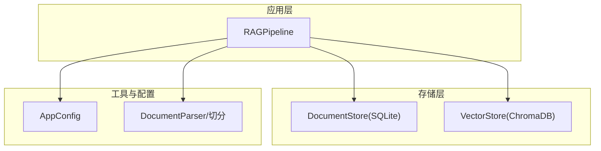
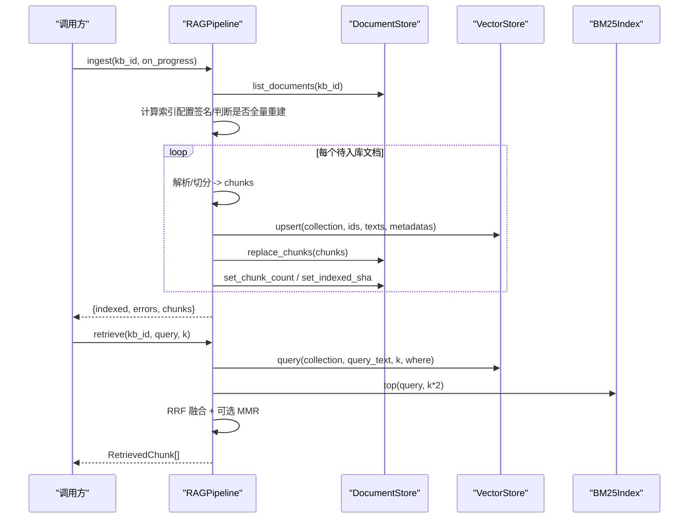
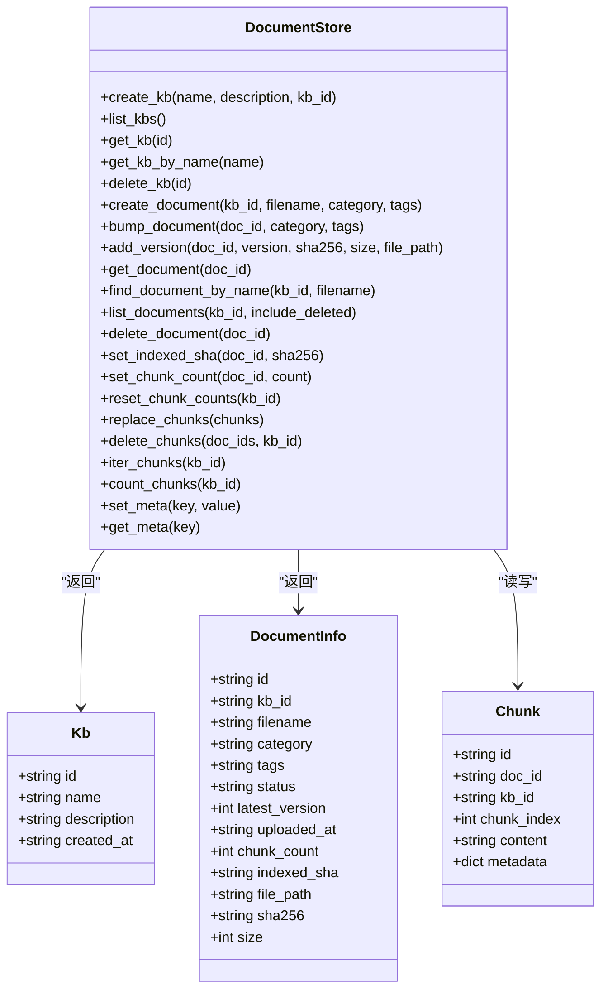
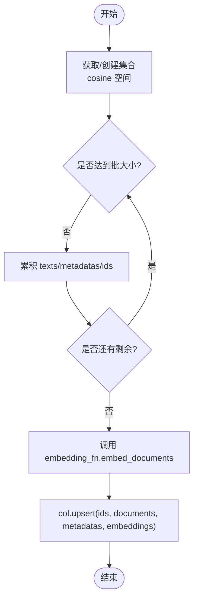
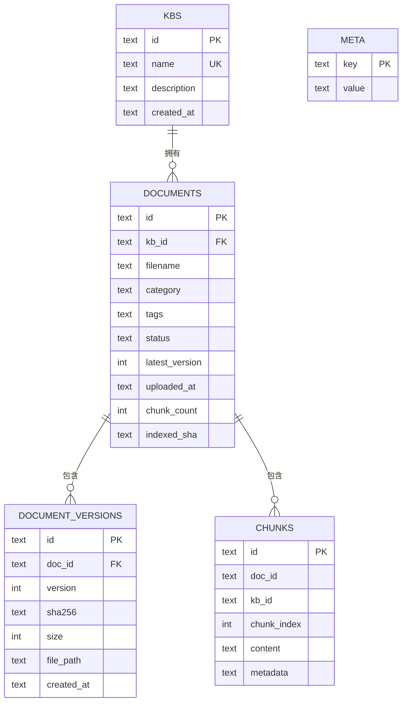
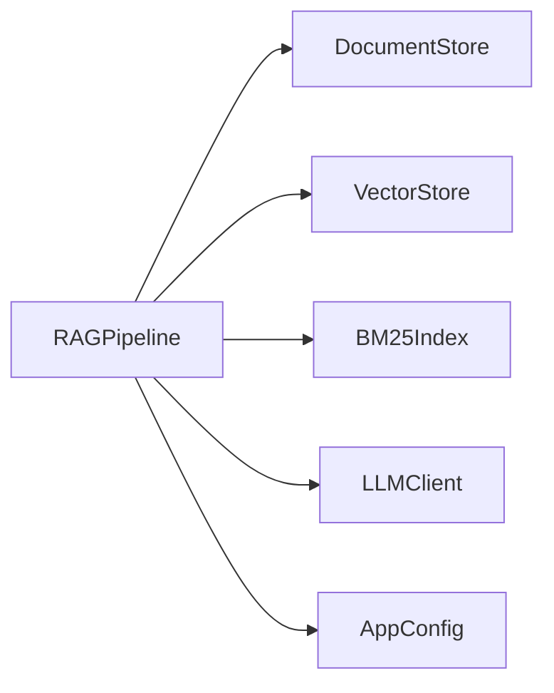

# 数据存储模块

<cite>
**本文引用的文件**
- [store.py](file://store.py)
- [vector_store.py](file://vector_store.py)
- [config.py](file://config.py)
- [ingestion.py](file://ingestion.py)
- [rag_pipeline.py](file://rag_pipeline.py)
- [tests/test_store.py](file://tests/test_store.py)
</cite>

## 目录
1. [简介](#简介)
2. [项目结构](#项目结构)
3. [核心组件](#核心组件)
4. [架构总览](#架构总览)
5. [详细组件分析](#详细组件分析)
6. [依赖关系分析](#依赖关系分析)
7. [性能与并发优化](#性能与并发优化)
8. [故障排查指南](#故障排查指南)
9. [结论](#结论)
10. [附录：使用示例与迁移指引](#附录使用示例与迁移指引)

## 简介
本模块为 RAG 系统的数据持久化层，包含两类存储：
- SQLite 元数据存储（DocumentStore）：负责知识库、文档、片段、版本与配置等结构化数据的 CRUD。
- ChromaDB 向量存储（VectorStore）：负责按知识库隔离的集合管理、批量向量化写入、条件删除与相似度检索。

上层通过 RAGPipeline 统一编排入库、检索与问答流程，屏蔽底层存储细节，提供一致的接口与可配置行为。

## 项目结构
- store.py：SQLite 封装，定义数据模型与数据库操作。
- vector_store.py：ChromaDB 封装，定义集合管理与向量检索。
- config.py：集中配置项（路径、切分参数、检索阈值、批大小等）。
- ingestion.py：文档解析与文本切分，生成片段及元数据。
- rag_pipeline.py：RAG 管线门面，组合 DocumentStore、VectorStore、BM25Index 与 LLM 客户端。
- tests/test_store.py：针对 DocumentStore 的单元测试用例。

图表来源
- [rag_pipeline.py:196-219](file://rag_pipeline.py#L196-L219)
- [store.py:123-138](file://store.py#L123-L138)
- [vector_store.py:38-55](file://vector_store.py#L38-L55)
- [config.py:56-113](file://config.py#L56-L113)
- [ingestion.py:24-39](file://ingestion.py#L24-L39)

章节来源
- [rag_pipeline.py:196-219](file://rag_pipeline.py#L196-L219)
- [store.py:1-17](file://store.py#L1-L17)
- [vector_store.py:1-10](file://vector_store.py#L1-L10)
- [config.py:1-6](file://config.py#L1-L6)

## 核心组件
- DocumentStore：基于 SQLite 的知识库/文档/片段/版本/配置的持久化封装，提供线程安全的写事务与 WAL 模式。
- VectorStore：基于 ChromaDB 的向量存储封装，支持按知识库命名集合、批量 upsert、条件删除、相似度查询与向量获取。
- AppConfig：集中式配置，控制数据路径、切分参数、检索阈值、MMR 开关、嵌入批大小等。
- RAGPipeline：将上述组件串联，实现增量入库、混合检索（向量+BM25）、重排（MMR）与带引用回答。

章节来源
- [store.py:88-121](file://store.py#L88-L121)
- [vector_store.py:22-35](file://vector_store.py#L22-L35)
- [config.py:56-113](file://config.py#L56-L113)
- [rag_pipeline.py:196-219](file://rag_pipeline.py#L196-L219)

## 架构总览
RAGPipeline 在初始化时创建 DocumentStore、VectorStore 与 BM25Index 缓存；上传文档后触发解析、切分、向量化与持久化；检索阶段先向量召回再 BM25 召回，经 RRF 融合与可选 MMR 重排后返回片段；问答阶段组装上下文并调用 LLM。

图表来源
- [rag_pipeline.py:306-435](file://rag_pipeline.py#L306-L435)
- [rag_pipeline.py:439-523](file://rag_pipeline.py#L439-L523)
- [vector_store.py:61-126](file://vector_store.py#L61-L126)
- [store.py:386-411](file://store.py#L386-L411)

## 详细组件分析

### DocumentStore（SQLite 元数据存储）
职责与数据模型
- 表结构：kbs（知识库）、documents（文档主记录）、document_versions（版本历史）、chunks（片段内容+元数据 JSON）、meta（键值配置）。
- 数据类：Kb、DocumentInfo、Chunk，用于映射行数据到对象。
- 关键能力：
  - 知识库：创建、列出、按名称/ID 查询、删除（级联清理片段与文档）。
  - 文档与版本：创建文档、同名重传升版本、登记版本信息、软删除（status=deleted）、更新 indexed_sha 与 chunk_count。
  - 片段：整体替换某文档片段（先删后插，保证与向量库一致）、按 doc_id/kb_id 删除、迭代遍历、计数。
  - 配置：设置/读取 meta 键值对（如索引配置版本号）。

并发与事务
- 写操作使用 RLock 串行化，避免并发写冲突。
- 连接采用 WAL 模式与 busy_timeout，提升并发读与短事务吞吐。
- 外键约束开启，确保引用完整性。

迁移与兼容性
- 自动检测并补齐旧库缺失列（如 indexed_sha），保障平滑升级。

图表来源
- [store.py:31-77](file://store.py#L31-L77)
- [store.py:88-121](file://store.py#L88-L121)
- [store.py:123-470](file://store.py#L123-L470)

章节来源
- [store.py:31-77](file://store.py#L31-L77)
- [store.py:88-121](file://store.py#L88-L121)
- [store.py:123-470](file://store.py#L123-L470)
- [tests/test_store.py:15-69](file://tests/test_store.py#L15-L69)

### VectorStore（ChromaDB 向量存储）
职责与能力
- 集合管理：按知识库命名集合（kb_<kb_id>），空间为余弦距离。
- 批量写入：upsert 分批向量化并写入，id 相同覆盖，天然支持增量更新。
- 条件删除：支持按 where 或 ids 删除。
- 相似度检索：query 返回 VectorHit（id、text、metadata、score=1-distance）。
- 向量获取：get_embeddings 用于 MMR 重排。
- 集合统计与清空：count、clear_collection、list_collections。

嵌入函数协议
- EmbeddingFunction 协议兼容 LangChain Embeddings，默认优先 DashScope，未配置时回退 MockEmbedding。

图表来源
- [vector_store.py:38-78](file://vector_store.py#L38-L78)

章节来源
- [vector_store.py:22-149](file://vector_store.py#L22-L149)
- [vector_store.py:151-189](file://vector_store.py#L151-L189)

### 数据模型与关系映射
- 知识库（kbs）与文档（documents）一对多，外键级联删除。
- 文档（documents）与版本（document_versions）一对多，唯一约束 (doc_id, version)。
- 文档（documents）与片段（chunks）一对多，唯一约束 (doc_id, chunk_index)。
- 片段（chunks）同时保留 kb_id 便于跨文档聚合统计。
- 配置（meta）独立键值表，用于索引配置版本等。

图表来源
- [store.py:31-77](file://store.py#L31-L77)

章节来源
- [store.py:31-77](file://store.py#L31-L77)

### 与上层组件的接口设计与依赖关系
- RAGPipeline 依赖：
  - DocumentStore：知识库/文档/片段/配置 CRUD。
  - VectorStore：集合 upsert/query/delete/count/clear。
  - BM25Index：词面检索（由 rag_pipeline 内部维护）。
  - LLMClient：聊天与嵌入（可通过 Protocol 注入测试替身）。
- 配置来自 AppConfig，所有可调参数集中管理。

图表来源
- [rag_pipeline.py:196-219](file://rag_pipeline.py#L196-L219)
- [config.py:56-113](file://config.py#L56-L113)

章节来源
- [rag_pipeline.py:196-219](file://rag_pipeline.py#L196-L219)
- [config.py:56-113](file://config.py#L56-L113)

## 依赖关系分析
- 直接依赖：
  - DocumentStore 依赖 sqlite3、json、uuid、threading.RLock。
  - VectorStore 依赖 chromadb 与自定义 EmbeddingFunction。
  - RAGPipeline 依赖 store、vector_store、ingestion、llm_client、utils.retrieval、config。
- 间接依赖：
  - 解析器依赖 langchain_community.document_loaders 与 langchain_text_splitters。
  - 可选 OCR 依赖 pymupdf 与 rapidocr。

潜在耦合点
- RAGPipeline 与 BM25Index 的缓存失效策略（_bm25_stale/_chunks_stale）需与入库流程保持一致。
- VectorStore 的 reset 需在后台入库完成后调用以刷新内存索引。

章节来源
- [rag_pipeline.py:215-219](file://rag_pipeline.py#L215-L219)
- [vector_store.py:57-59](file://vector_store.py#L57-L59)
- [ingestion.py:13-15](file://ingestion.py#L13-L15)

## 性能与并发优化
- SQLite 优化
  - WAL 模式与 busy_timeout 降低锁竞争，提高并发读与短事务吞吐。
  - 写操作使用 RLock 串行化，避免并发写冲突。
  - 外键约束开启，保证一致性。
  - 批量插入使用 executemany，减少往返开销。
- 向量存储优化
  - 分批向量化（batch_size 可配），避免单次请求过大导致超时或限流。
  - 集合按知识库隔离，缩小检索范围。
  - 余弦距离空间，分数转换简单高效。
- 检索优化
  - 混合检索（向量+BM25）+ RRF 融合，提升召回质量。
  - 可选 MMR 去重，平衡相关性与多样性。
  - 相关性阈值过滤低质结果，减少无效上下文。
- 缓存与失效
  - BM25Index 与片段字典按知识库缓存，变更时标记 stale 延迟重建。
  - 向量客户端在后台入库完成后 reset，避免索引过期。

[本节为通用性能讨论，不直接分析具体代码行]

## 故障排查指南
常见问题与定位
- 重复知识库名称：create_kb 抛出 ValueError，检查名称唯一性。
- 文档不存在：bump_document/get_document 返回 None 或 KeyError，确认 kb_id 与 doc_id。
- 软删除后不可见：list_documents 默认仅显示 active，需要 include_deleted=True 查看已删除。
- 向量检索为空：检查集合是否存在、where 条件是否正确、embedding 是否可用。
- 入库失败：ingest 返回 errors 列表，查看具体文件名与异常信息。
- 配置变更未生效：检查 index_config_version 是否更新，必要时强制全量重建。

调试建议
- 使用 test_store.py 中的用例思路验证基本 CRUD。
- 打印 KB 统计（kb_stats）对比文档数、片段数与向量数。
- 逐步缩小问题范围：先验证 SQLite 数据正确性，再验证向量检索。

章节来源
- [tests/test_store.py:15-69](file://tests/test_store.py#L15-L69)
- [rag_pipeline.py:415-435](file://rag_pipeline.py#L415-L435)

## 结论
本数据存储模块通过 DocumentStore 与 VectorStore 分别承担结构化元数据与高维向量的持久化，配合 RAGPipeline 完成从入库到检索再到问答的完整链路。设计强调：
- 清晰的职责边界与接口抽象。
- 并发安全与事务一致性（WAL、RLock、外键）。
- 可扩展与可配置（AppConfig、EmbeddingFunction 协议）。
- 性能优化（批量写入、混合检索、缓存失效）。

该方案易于演进至更强大的后端（如 PostgreSQL 与分布式向量库），同时保持上层 API 稳定。

[本节为总结性内容，不直接分析具体代码行]

## 附录：使用示例与迁移指引

### 数据持久化操作示例（路径引用）
- 创建知识库与文档
  - 参考：[store.py:158-174](file://store.py#L158-L174)、[store.py:214-234](file://store.py#L214-L234)
- 版本管理与软删除
  - 参考：[store.py:236-253](file://store.py#L236-L253)、[store.py:322-335](file://store.py#L322-L335)
- 片段替换与删除
  - 参考：[store.py:386-423](file://store.py#L386-L423)
- 配置键值存取
  - 参考：[store.py:454-469](file://store.py#L454-L469)

### 向量检索与批量操作示例（路径引用）
- 批量 upsert 与查询
  - 参考：[vector_store.py:61-126](file://vector_store.py#L61-L126)
- 条件删除与集合管理
  - 参考：[vector_store.py:80-98](file://vector_store.py#L80-L98)、[vector_store.py:142-148](file://vector_store.py#L142-L148)
- 获取向量用于 MMR
  - 参考：[vector_store.py:128-137](file://vector_store.py#L128-L137)

### 数据迁移与重建
- 首次运行迁移旧版文件到默认知识库
  - 参考：[rag_pipeline.py:754-774](file://rag_pipeline.py#L754-L774)
- 索引配置变化触发全量重建
  - 参考：[rag_pipeline.py:318-347](file://rag_pipeline.py#L318-L347)、[rag_pipeline.py:739-752](file://rag_pipeline.py#L739-L752)
- 向量客户端重置以避免索引过期
  - 参考：[vector_store.py:57-59](file://vector_store.py#L57-L59)、[rag_pipeline.py:720-726](file://rag_pipeline.py#L720-L726)

### 与上层组件的集成要点
- RAGPipeline 初始化与依赖注入
  - 参考：[rag_pipeline.py:196-219](file://rag_pipeline.py#L196-L219)
- 配置集中管理
  - 参考：[config.py:56-113](file://config.py#L56-L113)
- 解析与切分
  - 参考：[ingestion.py:24-39](file://ingestion.py#L24-L39)、[ingestion.py:178-216](file://ingestion.py#L178-L216)