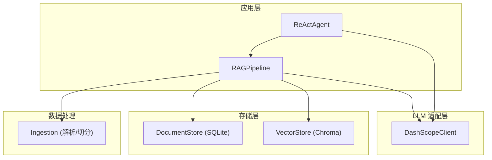
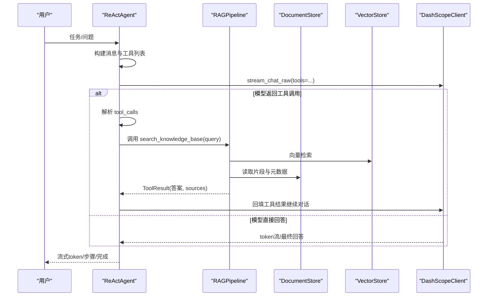
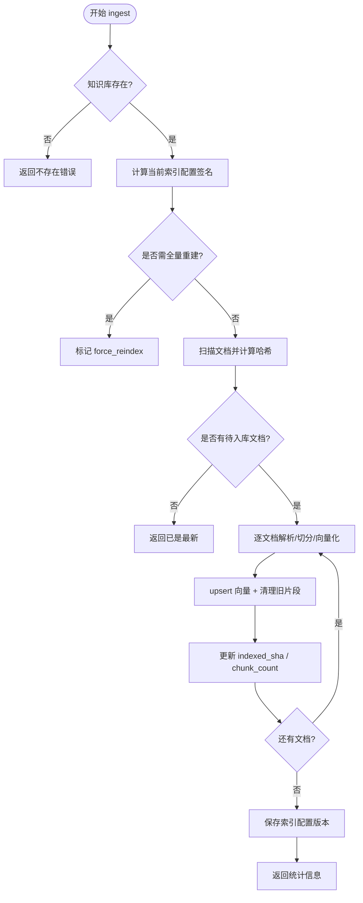
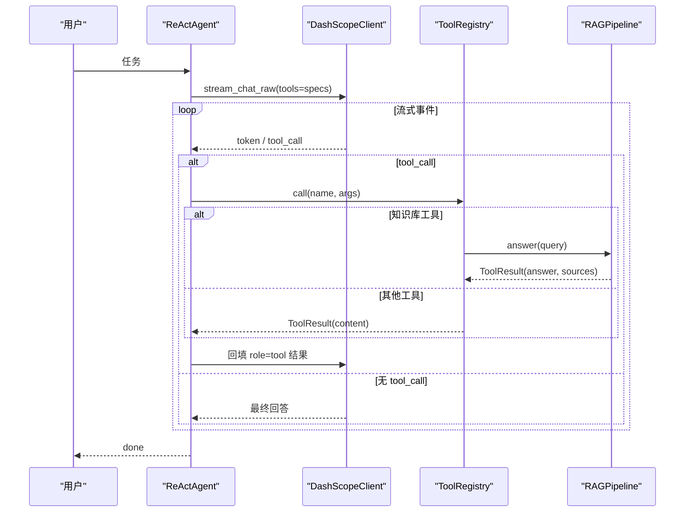
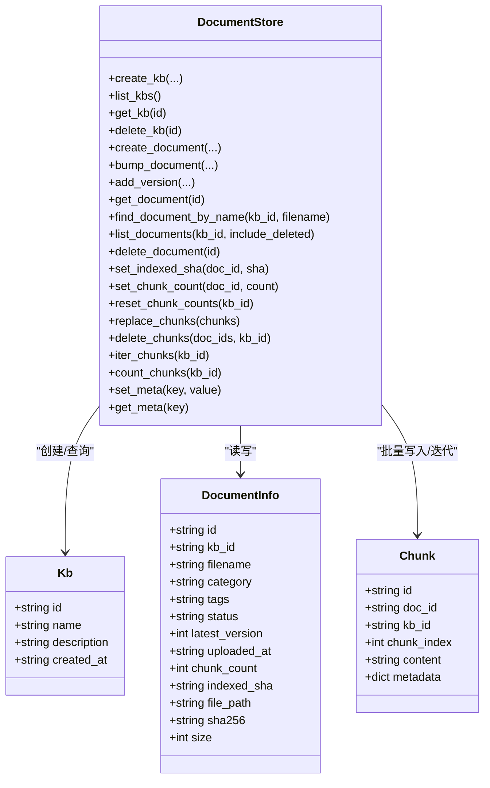
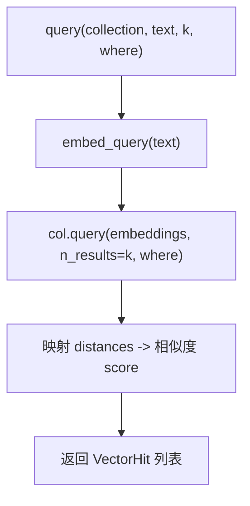
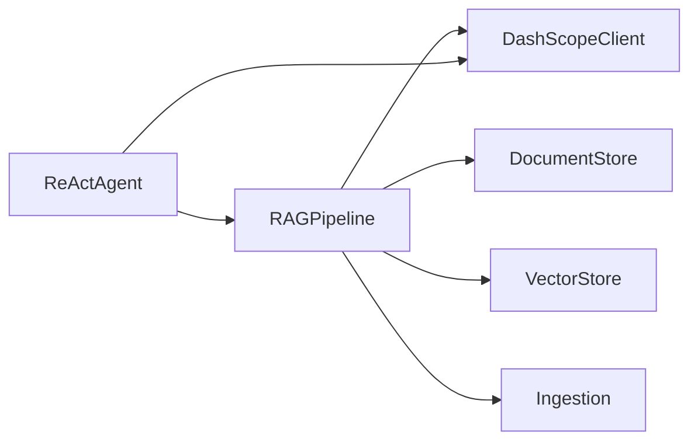

# 核心组件设计

<cite>
**本文引用的文件**
- [rag_pipeline.py](file://rag_pipeline.py)
- [react_agent.py](file://react_agent.py)
- [store.py](file://store.py)
- [vector_store.py](file://vector_store.py)
- [llm_client.py](file://llm_client.py)
- [config.py](file://config.py)
- [ingestion.py](file://ingestion.py)
- [README.md](file://README.md)
</cite>

## 目录
1. [简介](#简介)
2. [项目结构](#项目结构)
3. [核心组件](#核心组件)
4. [架构总览](#架构总览)
5. [详细组件分析](#详细组件分析)
6. [依赖关系分析](#依赖关系分析)
7. [性能考虑](#性能考虑)
8. [故障排查指南](#故障排查指南)
9. [结论](#结论)
10. [附录：使用示例与最佳实践](#附录使用示例与最佳实践)

## 简介
本设计文档聚焦 RAG 与 Agent 的核心模块：RAGPipeline、ReActAgent、DocumentStore、VectorStore、DashScopeClient，系统阐述其职责边界、设计模式、关键方法与接口契约，并说明组件间的依赖与调用流程。重点解释：
- RAGPipeline 如何协调检索与生成（混合检索、上下文裁剪、引用生成）
- ReActAgent 如何实现 Function Calling 多步循环（工具注册、流式事件、回填与收敛）
- 存储层如何管理元数据（SQLite）与向量数据（Chroma），以及版本化与增量更新策略
- 配置、错误处理与性能优化建议

## 项目结构
仓库采用“按能力分层 + 单文件高内聚”的组织方式：
- 管线与编排：rag_pipeline.py、react_agent.py
- 存储层：store.py（SQLite 元数据）、vector_store.py（Chroma 向量）
- LLM 封装：llm_client.py（DashScope OpenAI 兼容接口）
- 解析与切分：ingestion.py（PDF/Word/Markdown/TXT，含 OCR 兜底）
- 配置：config.py（集中环境变量参数）
- 入口与文档：app.py、api.py、README.md

图表来源
- [rag_pipeline.py:196-792](file://rag_pipeline.py#L196-L792)
- [react_agent.py:144-567](file://react_agent.py#L144-L567)
- [store.py:123-470](file://store.py#L123-L470)
- [vector_store.py:38-149](file://vector_store.py#L38-L149)
- [llm_client.py:22-295](file://llm_client.py#L22-L295)
- [ingestion.py:24-216](file://ingestion.py#L24-L216)

章节来源
- [README.md:1-171](file://README.md#L1-L171)

## 核心组件
- RAGPipeline：知识库管理、增量入库、混合检索（向量+BM25，RRF融合，MMR重排）、问答生成（带引用）。对外暴露 create_kb/list_kbs/get_kb/delete_kb/upload_document/delete_document/list_documents/ingest/retrieve/answer/chat 等接口。
- ReActAgent：基于 Function Calling 的轻量 Agent，维护工具注册表，执行 observe→think→act 多步循环，支持流式输出与轨迹记录。
- DocumentStore：SQLite 元数据存储，维护知识库、文档、版本、片段、键值配置；提供事务安全与并发访问（WAL、busy_timeout、RLock）。
- VectorStore：Chroma 向量存储封装，按知识库隔离 collection，支持批量 upsert、条件删除、相似度查询、获取嵌入向量（用于 MMR）。
- DashScopeClient：统一封装百炼 OpenAI 兼容接口，提供 chat/chat_raw/stream_chat/stream_chat_raw/web_search/embeddings，并做异常归一化与用量记录。

章节来源
- [rag_pipeline.py:196-792](file://rag_pipeline.py#L196-L792)
- [react_agent.py:93-567](file://react_agent.py#L93-L567)
- [store.py:123-470](file://store.py#L123-L470)
- [vector_store.py:38-149](file://vector_store.py#L38-L149)
- [llm_client.py:22-295](file://llm_client.py#L22-L295)

## 架构总览
RAG 与 Agent 通过统一的 LLM 抽象协作：RAGPipeline 负责“检索增强”，ReActAgent 负责“工具选择与多步推理”。存储层将“元数据”和“向量”解耦，便于独立扩展与替换。

图表来源
- [react_agent.py:272-369](file://react_agent.py#L272-L369)
- [rag_pipeline.py:439-523](file://rag_pipeline.py#L439-L523)
- [vector_store.py:100-126](file://vector_store.py#L100-L126)
- [store.py:425-442](file://store.py#L425-L442)
- [llm_client.py:203-278](file://llm_client.py#L203-L278)

## 详细组件分析

### RAGPipeline：检索增强问答门面
- 设计要点
  - 多知识库：每个 kb 对应独立 Chroma collection 与 BM25 索引，支持独立增删。
  - 增量入库：SHA-256 判重；当索引配置（chunk_size/chunk_overlap/embedding_model 等）变化时触发全量重建。
  - 混合检索：向量 Top-N + BM25 Top-N → RRF 融合 → 可选 MMR 去重；相关性阈值控制拒答。
  - 上下文裁剪：按 token 预算保留片段块，避免超出模型上下文。
  - 引用生成：为每个片段生成“来源: 文件名, 页码/段落”的可追溯引用。
- 关键方法
  - 知识库管理：create_kb/list_kbs/get_kb/delete_kb/kb_stats
  - 文档管理：upload_document/delete_document/list_documents
  - 入库：ingest（增量/全量重建、进度回调、错误收集）
  - 检索：retrieve（向量+BM25+RRF+MMR，doc_id 限定）
  - 问答：answer（改写历史问题、组装上下文、生成带引用回答）、chat（无知识库通用聊天）
  - 辅助：rewrite_query/truncate_history/fit_context_indices/citation
- 复杂度与性能
  - ingest 时间复杂度近似 O(N·E+B)，N 为待入库文档数，E 为切分后片段数，B 为向量化批次开销；通过 batch_size 控制内存峰值。
  - retrieve 中 RRF 融合 O(V+B)，MMR 重排 O(k^2) 或近似线性实现（取决于库），top_k 通常较小。
- 错误处理
  - 入库失败记录 errors 列表，不中断整体流程；问答/聊天捕获异常并返回友好提示。
- 依赖
  - 依赖 DocumentStore（元数据/片段）、VectorStore（向量）、DashScopeClient（Embedding/Chat）、ingestion（解析/切分）。

图表来源
- [rag_pipeline.py:306-435](file://rag_pipeline.py#L306-L435)

章节来源
- [rag_pipeline.py:196-792](file://rag_pipeline.py#L196-L792)
- [ingestion.py:24-216](file://ingestion.py#L24-L216)
- [config.py:56-113](file://config.py#L56-L113)

### ReActAgent：Function Calling 多步循环
- 设计要点
  - 工具注册表：ToolRegistry 以装饰器方式注册工具，自动生成 OpenAI tools 格式，并按名调用。
  - 多步循环：stream_chat_raw 流式聚合 tool_calls，执行工具后将结果回填 messages，直到模型给出最终回答或达到最大轮数。
  - 流式输出：事件驱动（tool_start/tool_end/token/step/done/error），UI 可逐帧渲染。
  - 内置工具：search_knowledge_base、get_weather、search_web、query_database（只读 SQLite）。
- 关键方法
  - run/run_stream：主循环与事件流
  - _build_registry：动态构建工具集
  - _weather/_query_database：外部服务与本地数据库访问
  - _parse_arguments：容错解析 JSON 参数
- 复杂度与性能
  - 每轮一次 LLM 调用；工具调用次数受 max_steps 限制；观测结果截断防止上下文膨胀。
- 错误处理
  - 工具异常包装为 ToolResult.content，交由模型自行重试或降级回答；网络/DB 异常统一 safe_error 展示。
- 依赖
  - 依赖 DashScopeClient（流式 Function Calling）、RAGPipeline（知识库问答）、utils.logger（轨迹日志）。

图表来源
- [react_agent.py:272-369](file://react_agent.py#L272-L369)
- [react_agent.py:93-142](file://react_agent.py#L93-L142)
- [rag_pipeline.py:590-666](file://rag_pipeline.py#L590-L666)
- [llm_client.py:203-278](file://llm_client.py#L203-L278)

章节来源
- [react_agent.py:93-567](file://react_agent.py#L93-L567)

### DocumentStore：SQLite 元数据与片段管理
- 设计要点
  - 表结构：kbs/documents/document_versions/chunks/meta，支持多知识库、文档版本、片段与键值配置。
  - 并发安全：WAL 模式 + busy_timeout + RLock 写锁，保证后台入库与前台问答并发安全。
  - 增量与一致性：replace_chunks 先删后插，确保与向量库一致；indexed_sha 用于增量判断。
- 关键方法
  - 知识库：create_kb/list_kbs/get_kb/delete_kb
  - 文档：create_document/bump_document/add_version/get_document/find_document_by_name/list_documents/delete_document
  - 片段：replace_chunks/delete_chunks/iter_chunks/count_chunks
  - 配置：set_meta/get_meta
- 复杂度与性能
  - 批量插入使用 executemany；迭代器按需加载片段，降低内存占用。
- 错误处理
  - 唯一约束冲突抛出 ValueError；软删除保留历史便于审计。

图表来源
- [store.py:88-121](file://store.py#L88-L121)
- [store.py:123-470](file://store.py#L123-L470)

章节来源
- [store.py:1-470](file://store.py#L1-L470)

### VectorStore：Chroma 向量存储封装
- 设计要点
  - 按知识库隔离 collection，固定余弦空间；批量 upsert 减少 API 调用；支持条件删除与 ID 列表查询。
  - 提供 get_embeddings 以便上层进行 MMR 重排。
- 关键方法
  - upsert/query/delete/list_ids/get_embeddings/query_embedding/count/clear_collection/list_collections/reset
- 复杂度与性能
  - 批量大小由 embedding_batch_size 控制，避免超限；query 返回距离并转换为相似度。
- 错误处理
  - clear_collection 忽略异常，保证健壮性。

图表来源
- [vector_store.py:100-126](file://vector_store.py#L100-L126)

章节来源
- [vector_store.py:1-255](file://vector_store.py#L1-L255)

### DashScopeClient：LLM 统一封装
- 设计要点
  - 从环境变量读取密钥与模型名，构造 OpenAI 兼容客户端；统一异常转换与用量记录。
  - 支持同步/流式对话、Function Calling、联网搜索与 Embedding。
- 关键方法
  - chat/chat_raw/stream_chat/stream_chat_raw/web_search/embeddings
- 错误处理
  - 所有外部调用包裹 try/except，统一 RuntimeError 并附带 model/base_url 信息；safe_error 隐藏堆栈。

章节来源
- [llm_client.py:1-322](file://llm_client.py#L1-L322)

## 依赖关系分析
- RAGPipeline 依赖：
  - DocumentStore：知识库/文档/片段/配置
  - VectorStore：向量检索与嵌入
  - DashScopeClient：Embedding/Chat
  - ingestion：解析与切分
- ReActAgent 依赖：
  - DashScopeClient：流式 Function Calling
  - RAGPipeline：作为工具之一（知识库问答）
  - utils.logger：轨迹记录
- 存储层解耦：
  - 元数据（SQLite）与向量（Chroma）分离，便于独立扩容与替换
- 配置中心：
  - AppConfig 集中管理所有可调参数，支持环境变量覆盖

图表来源
- [rag_pipeline.py:196-792](file://rag_pipeline.py#L196-L792)
- [react_agent.py:144-567](file://react_agent.py#L144-L567)
- [store.py:123-470](file://store.py#L123-L470)
- [vector_store.py:38-149](file://vector_store.py#L38-L149)
- [llm_client.py:22-295](file://llm_client.py#L22-L295)
- [ingestion.py:24-216](file://ingestion.py#L24-L216)

章节来源
- [config.py:56-113](file://config.py#L56-L113)

## 性能考虑
- 向量化批处理：embedding_batch_size 默认 16，避免超过厂商限制（如单次最多 20 条）。
- 混合检索优化：fusion_pool 扩大候选池，RRF 融合提升召回质量；MMR 控制重复度。
- 上下文裁剪：truncate_history 与 fit_context_indices 控制历史与片段 token 预算，降低延迟与成本。
- 增量入库：indexed_sha 与配置签名避免重复计算；缺失文件检测快速返回。
- 并发安全：WAL + busy_timeout + RLock 保障后台入库与前台问答并发。
- 流式交互：stream_chat_raw 降低首字延迟，提升用户体验。

[本节为通用指导，不直接分析具体文件]

## 故障排查指南
- 未配置 API Key：启动时报错提示缺少 DASHSCOPE_API_KEY，需在 .env 中配置。
- 模型调用失败：检查 base_url 是否以 /compatible-mode/v1 结尾；查看 last_usage 与错误信息定位。
- 向量检索为空：确认已执行 ingest；检查 relevance_threshold 是否过高；必要时增大 fusion_pool 或调整 top_k。
- 工具调用失败：查看 ToolResult.content 中的错误摘要；检查天气/数据库/网络可用性；必要时降低 max_steps。
- 数据库锁定：WAL 模式下仍可能 busy，可增大 busy_timeout 或减少并发写入。

章节来源
- [llm_client.py:59-86](file://llm_client.py#L59-L86)
- [llm_client.py:94-170](file://llm_client.py#L94-L170)
- [react_agent.py:373-470](file://react_agent.py#L373-L470)
- [store.py:132-138](file://store.py#L132-L138)

## 结论
该方案通过清晰的组件划分与解耦的存储层，实现了可扩展、可配置的 RAG 与 Agent 系统。RAGPipeline 提供稳健的检索与生成流程，ReActAgent 实现真正的工具选择与多步推理，DocumentStore 与 VectorStore 分别承担元数据与向量数据的持久化与检索。配合集中配置与完善的错误处理，系统在易用性与可靠性上具备工程落地价值。

[本节为总结，不直接分析具体文件]

## 附录：使用示例与最佳实践
- 初始化与配置
  - 通过环境变量设置 DASHSCOPE_API_KEY、DASHSCOPE_BASE_URL、CHUNK_SIZE、RETRIEVAL_TOP_K 等；或使用 AppConfig.from_env(data_dir) 指定数据目录。
  - 参考路径：[config.py:56-113](file://config.py#L56-L113)
- 知识库与文档
  - 创建知识库、上传文档、执行入库、查看统计；参考路径：[rag_pipeline.py:223-303](file://rag_pipeline.py#L223-L303)、[rag_pipeline.py:306-435](file://rag_pipeline.py#L306-L435)
- 检索与问答
  - 使用 retrieve 获取混合检索结果；使用 answer 生成带引用回答；参考路径：[rag_pipeline.py:439-523](file://rag_pipeline.py#L439-L523)、[rag_pipeline.py:590-666](file://rag_pipeline.py#L590-L666)
- Agent 工具循环
  - 使用 ReActAgent.run_stream 获取事件流；内置工具包括知识库、天气、联网搜索、只读数据库；参考路径：[react_agent.py:272-369](file://react_agent.py#L272-L369)、[react_agent.py:165-246](file://react_agent.py#L165-L246)
- 存储与向量
  - 使用 DocumentStore 管理元数据与片段；使用 VectorStore 进行向量 upsert/query；参考路径：[store.py:386-442](file://store.py#L386-L442)、[vector_store.py:61-126](file://vector_store.py#L61-L126)
- 错误处理与调试
  - 使用 safe_error 获取可读错误；检查 last_usage 与日志；参考路径：[llm_client.py:297-299](file://llm_client.py#L297-L299)、[llm_client.py:48-57](file://llm_client.py#L48-L57)

章节来源
- [config.py:56-113](file://config.py#L56-L113)
- [rag_pipeline.py:223-666](file://rag_pipeline.py#L223-L666)
- [react_agent.py:165-369](file://react_agent.py#L165-L369)
- [store.py:386-442](file://store.py#L386-L442)
- [vector_store.py:61-126](file://vector_store.py#L61-L126)
- [llm_client.py:48-57](file://llm_client.py#L48-L57)
- [llm_client.py:297-299](file://llm_client.py#L297-L299)