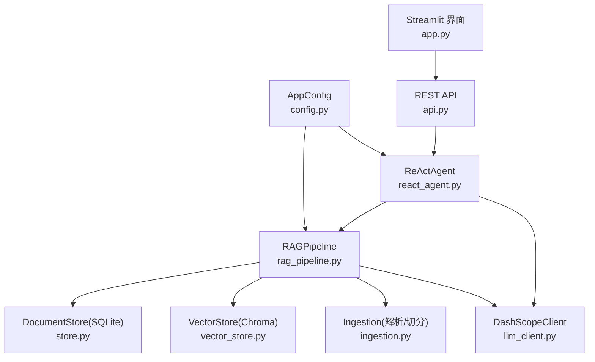
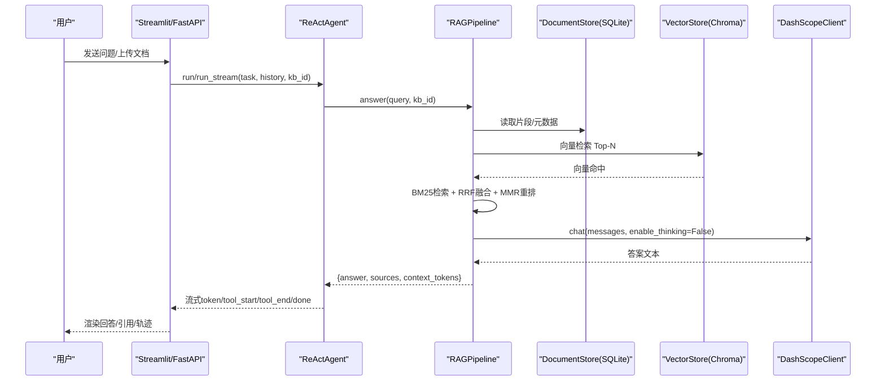
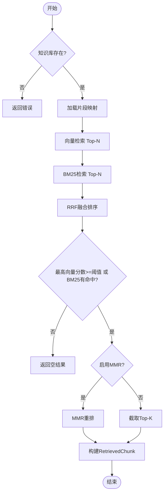
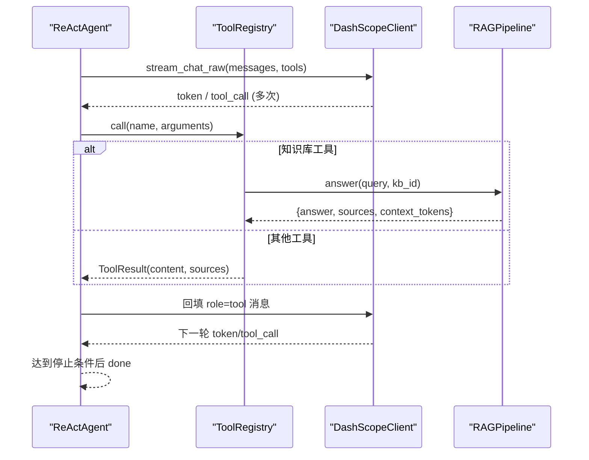
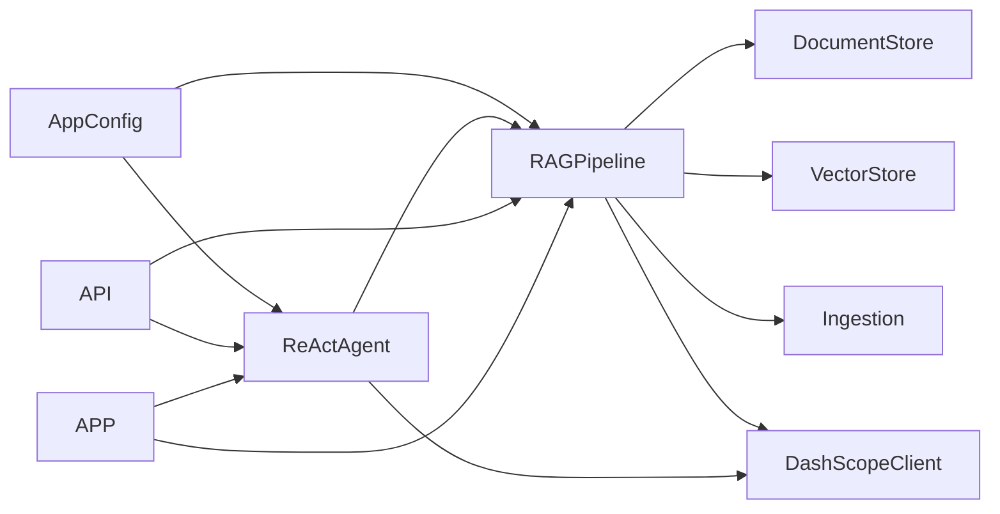
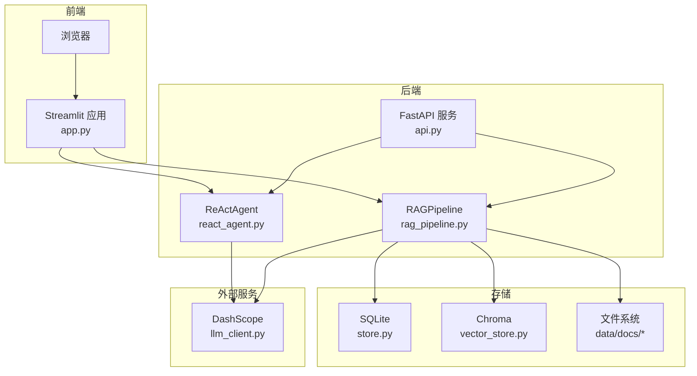

# 系统架构

<cite>
**本文引用的文件**
- [README.md](file://README.md)
- [config.py](file://config.py)
- [rag_pipeline.py](file://rag_pipeline.py)
- [react_agent.py](file://react_agent.py)
- [store.py](file://store.py)
- [vector_store.py](file://vector_store.py)
- [llm_client.py](file://llm_client.py)
- [ingestion.py](file://ingestion.py)
- [api.py](file://api.py)
- [app.py](file://app.py)
</cite>

## 目录
1. [简介](#简介)
2. [项目结构](#项目结构)
3. [核心组件](#核心组件)
4. [架构总览](#架构总览)
5. [详细组件分析](#详细组件分析)
6. [依赖关系分析](#依赖关系分析)
7. [性能与可扩展性](#性能与可扩展性)
8. [部署拓扑与基础设施](#部署拓扑与基础设施)
9. [故障排查指南](#故障排查指南)
10. [结论](#结论)

## 简介
本系统是一个面向企业知识库的 RAG + Agent 原型，支持多知识库、混合检索（向量+BM25）、增量入库、文档版本管理、Function Calling 驱动的 ReAct Agent、流式对话与引用可追溯。技术选型上采用 ChromaDB 作为向量存储、SQLite 作为元数据存储、DashScope（阿里云百炼）作为 LLM/Embedding 服务，并通过 FastAPI 暴露 REST API，Streamlit 提供交互式界面。

## 项目结构
- 入口与交互层：app.py（Streamlit 界面）、api.py（FastAPI 服务）
- 业务编排层：rag_pipeline.py（RAGPipeline）、react_agent.py（ReActAgent）
- 数据与检索层：store.py（SQLite 元数据）、vector_store.py（Chroma 向量）、ingestion.py（文档解析与切分）
- 模型与服务层：llm_client.py（DashScope 封装）
- 配置与工具：config.py（集中配置）、utils/*（日志、检索工具等）

图表来源
- [app.py:51-54](file://app.py#L51-L54)
- [api.py:52-57](file://api.py#L52-L57)
- [rag_pipeline.py:196-219](file://rag_pipeline.py#L196-L219)
- [react_agent.py:144-157](file://react_agent.py#L144-L157)
- [store.py:123-138](file://store.py#L123-L138)
- [vector_store.py:38-59](file://vector_store.py#L38-L59)
- [ingestion.py:24-38](file://ingestion.py#L24-L38)
- [llm_client.py:22-46](file://llm_client.py#L22-L46)
- [config.py:56-112](file://config.py#L56-L112)

章节来源
- [README.md:116-142](file://README.md#L116-L142)
- [config.py:56-112](file://config.py#L56-L112)

## 核心组件
- RAGPipeline：知识库管理、文档上传与版本化、增量入库、混合检索（向量+BM25，RRF融合，可选MMR去重）、查询改写、带引用问答。
- ReActAgent：基于 Function Calling 的工具选择与多步循环，内置知识库检索、天气查询、联网搜索、只读数据库查询等工具；支持流式事件输出。
- DocumentStore：SQLite 持久化知识库、文档、版本、片段与配置；WAL 模式与锁保证并发安全。
- VectorStore：Chroma 向量库封装，按知识库隔离 collection，支持批量 upsert、条件删除、相似度查询、取回嵌入用于 MMR。
- DashScopeClient：统一封装 DashScope OpenAI 兼容接口，提供 chat/chat_raw/stream_chat/stream_chat_raw/embeddings/web_search，并记录 token 用量。
- Ingestion：PDF/Word/Markdown/TXT 解析，PDF 文本质量评估与本地 OCR 兜底，递归字符切分与片段元数据构建。
- AppConfig：集中配置项，全部来自环境变量，控制切分、检索、重排、上下文长度、Agent 轮数等。

章节来源
- [rag_pipeline.py:196-219](file://rag_pipeline.py#L196-L219)
- [react_agent.py:144-157](file://react_agent.py#L144-L157)
- [store.py:123-138](file://store.py#L123-L138)
- [vector_store.py:38-59](file://vector_store.py#L38-L59)
- [llm_client.py:22-46](file://llm_client.py#L22-L46)
- [ingestion.py:24-38](file://ingestion.py#L24-L38)
- [config.py:56-112](file://config.py#L56-L112)

## 架构总览
整体采用“服务层 → Agent/RAG → 存储/检索 → LLM”的分层架构。用户通过 Streamlit 或 REST API 发起请求，ReActAgent 根据问题动态调用工具（如知识库检索），RAGPipeline 完成混合检索与生成回答，底层由 SQLite 与 Chroma 分别承载元数据与向量索引，LLM 通过 DashScope 提供服务。

图表来源
- [api.py:185-199](file://api.py#L185-L199)
- [app.py:303-349](file://app.py#L303-L349)
- [react_agent.py:250-369](file://react_agent.py#L250-L369)
- [rag_pipeline.py:590-666](file://rag_pipeline.py#L590-L666)
- [vector_store.py:100-126](file://vector_store.py#L100-L126)
- [llm_client.py:94-127](file://llm_client.py#L94-L127)

## 详细组件分析

### RAGPipeline 组件
职责
- 知识库生命周期管理（创建/列表/删除/默认库）
- 文档上传与版本化（同名文件自动升版本，旧版本保留）
- 增量入库（SHA-256 判重，索引配置变化时全量重建）
- 混合检索（向量+BM25，RRF融合，可选MMR去重，相关性阈值保护）
- 查询改写（多轮对话追问题改写）
- 带引用问答（组装上下文、历史截断、token预算控制）

关键流程
- 入库：解析→切分→向量化→upsert→清理旧向量→写片段→更新计数与哈希
- 检索：向量Top-N + BM25Top-N → RRF融合 → 阈值判断 → MMR重排 → 组装RetrievedChunk
- 问答：历史截断 → 检索 → 上下文裁剪 → 生成回答

图表来源
- [rag_pipeline.py:439-523](file://rag_pipeline.py#L439-L523)
- [rag_pipeline.py:306-435](file://rag_pipeline.py#L306-L435)

章节来源
- [rag_pipeline.py:196-219](file://rag_pipeline.py#L196-L219)
- [rag_pipeline.py:306-435](file://rag_pipeline.py#L306-L435)
- [rag_pipeline.py:439-523](file://rag_pipeline.py#L439-L523)
- [rag_pipeline.py:566-666](file://rag_pipeline.py#L566-L666)

### ReActAgent 组件
职责
- 工具注册表（ToolRegistry）：声明式注册工具，生成 OpenAI tools 格式，按名调用
- 多步循环：LLM 选择工具 → 执行 → 回填结果 → 继续直到最终回答或达到最大轮数
- 内置工具：search_knowledge_base、get_weather、search_web、query_database（只读）
- 流式事件：tool_start/tool_end/token/done/error，便于 UI 实时渲染

关键流程
- 构建消息与工具规格
- 流式调用 LLM，聚合 tool_calls
- 执行工具，限制观察长度，追加 role=tool 消息
- 记录轨迹与成本估算

图表来源
- [react_agent.py:165-246](file://react_agent.py#L165-L246)
- [react_agent.py:272-369](file://react_agent.py#L272-L369)
- [rag_pipeline.py:590-666](file://rag_pipeline.py#L590-L666)

章节来源
- [react_agent.py:69-142](file://react_agent.py#L69-L142)
- [react_agent.py:144-157](file://react_agent.py#L144-L157)
- [react_agent.py:250-369](file://react_agent.py#L250-L369)

### DocumentStore（SQLite）
职责
- 多知识库、文档主记录、版本历史、片段、键值配置的 CRUD
- WAL 模式与 busy_timeout，线程安全访问
- 软删除与片段清理，索引哈希记录避免重复入库

设计要点
- 每个公开方法独立连接，写操作使用 RLock 保护
- 旧库迁移：动态补列
- 片段以 JSON 存储 metadata，便于检索与展示

章节来源
- [store.py:31-77](file://store.py#L31-L77)
- [store.py:123-138](file://store.py#L123-L138)
- [store.py:158-210](file://store.py#L158-L210)
- [store.py:214-354](file://store.py#L214-L354)
- [store.py:386-450](file://store.py#L386-L450)
- [store.py:454-469](file://store.py#L454-L469)

### VectorStore（Chroma）
职责
- 按知识库隔离 collection（kb_<kb_id>），余弦空间
- 批量 upsert、条件删除、相似度查询、取回嵌入用于 MMR
- 客户端重置以避免内存索引过期

设计要点
- 直接对接 chromadb.PersistentClient，精确控制批量大小
- 支持 where 过滤（如 doc_id）
- 提供 count/clear/list_collections 等运维能力

章节来源
- [vector_store.py:1-10](file://vector_store.py#L1-L10)
- [vector_store.py:38-59](file://vector_store.py#L38-L59)
- [vector_store.py:61-148](file://vector_store.py#L61-L148)

### DashScopeClient（LLM/Embedding）
职责
- 统一封装 DashScope OpenAI 兼容接口
- 提供 chat/chat_raw/stream_chat/stream_chat_raw/embeddings/web_search
- 记录 token 用量，异常转换与安全提示

设计要点
- base_url 强制要求 /compatible-mode/v1
- 支持 enable_search/enable_thinking 扩展参数
- web_search 通过开启搜索能力实现

章节来源
- [llm_client.py:22-46](file://llm_client.py#L22-L46)
- [llm_client.py:94-127](file://llm_client.py#L94-L127)
- [llm_client.py:129-170](file://llm_client.py#L129-L170)
- [llm_client.py:172-278](file://llm_client.py#L172-L278)
- [llm_client.py:283-294](file://llm_client.py#L283-L294)

### Ingestion（文档解析与切分）
职责
- 支持 PDF/Word/Markdown/TXT 解析
- PDF 文本质量评估，低于阈值切换本地 OCR（PyMuPDF + RapidOCR）
- 递归字符切分，保留 page/paragraph 等元数据

设计要点
- 逐页处理 PDF，避免整本误判
- 切分器按段落/句子边界切分，提升检索粒度

章节来源
- [ingestion.py:24-38](file://ingestion.py#L24-L38)
- [ingestion.py:40-78](file://ingestion.py#L40-L78)
- [ingestion.py:104-150](file://ingestion.py#L104-L150)
- [ingestion.py:178-216](file://ingestion.py#L178-L216)

## 依赖关系分析
- RAGPipeline 依赖：
  - DocumentStore（元数据与片段）
  - VectorStore（向量检索与嵌入）
  - Ingestion（解析与切分）
  - DashScopeClient（LLM/Embedding）
  - AppConfig（运行参数）
- ReActAgent 依赖：
  - RAGPipeline（知识库检索工具）
  - DashScopeClient（流式 Function Calling）
  - ToolRegistry（工具注册与调用）
- API/APP 依赖：
  - FastAPI/Streamlit 作为入口
  - 共享 RAGPipeline 与 ReActAgent 实例

图表来源
- [config.py:56-112](file://config.py#L56-L112)
- [rag_pipeline.py:196-219](file://rag_pipeline.py#L196-L219)
- [react_agent.py:144-157](file://react_agent.py#L144-L157)
- [api.py:52-57](file://api.py#L52-L57)
- [app.py:51-54](file://app.py#L51-L54)

章节来源
- [rag_pipeline.py:196-219](file://rag_pipeline.py#L196-L219)
- [react_agent.py:144-157](file://react_agent.py#L144-L157)
- [api.py:52-57](file://api.py#L52-L57)
- [app.py:51-54](file://app.py#L51-L54)

## 性能与可扩展性
- 混合检索优化
  - 向量与 BM25 各自取候选，RRF 融合排名，兼顾语义与关键词匹配
  - 相关性阈值防止无相关内容时的幻觉
  - MMR 去重提升多样性，减少重复片段
- 上下文与历史控制
  - 历史截断与上下文 token 预算，避免注意力稀释与成本浪费
- 增量入库与版本化
  - SHA-256 判重，仅处理变化文件；索引配置变化触发全量重建
  - 同名文件自动升版本，旧版本物理文件保留
- 可扩展性设计
  - 工具注册表：新增工具只需实现函数并用 @registry.register 注册，无需修改循环逻辑
  - 插件化架构：LLM 抽象为 Protocol，便于替换不同厂商或测试注入 Fake 实现
  - 存储解耦：SQLite 与 Chroma 通过明确接口交互，便于后续替换或扩展

章节来源
- [rag_pipeline.py:439-523](file://rag_pipeline.py#L439-L523)
- [rag_pipeline.py:566-666](file://rag_pipeline.py#L566-L666)
- [rag_pipeline.py:306-435](file://rag_pipeline.py#L306-L435)
- [react_agent.py:93-142](file://react_agent.py#L93-L142)
- [rag_pipeline.py:81-132](file://rag_pipeline.py#L81-L132)

## 部署拓扑与基础设施
- 运行时组件
  - Streamlit 应用：单机演示界面，支持后台异步入库与流式聊天
  - FastAPI 服务：REST API，支持 Bearer Token 鉴权
  - SQLite：元数据存储（WAL 模式，单文件，零部署）
  - Chroma：向量存储（每个知识库一个 collection）
  - DashScope：LLM/Embedding/搜索服务（需 API Key）
- 数据路径
  - data/kb.sqlite3：元数据
  - data/chroma/：向量索引
  - data/docs/<kb_id>/<doc_id>/v<版本>/<文件名>：版本化文档
  - data/agent_trace.jsonl：Agent 轨迹日志
- 启动方式
  - Streamlit：streamlit run app.py
  - FastAPI：uvicorn api:app --host 0.0.0.0 --port 8000
- 环境要求
  - Python 3.10+
  - DASHSCOPE_API_KEY 必填
  - 可选：LOGO_PATH、CHROMA_DIR、KB_DB_PATH 等环境变量

图表来源
- [app.py:51-54](file://app.py#L51-L54)
- [api.py:52-57](file://api.py#L52-L57)
- [store.py:123-138](file://store.py#L123-L138)
- [vector_store.py:38-59](file://vector_store.py#L38-L59)
- [llm_client.py:22-46](file://llm_client.py#L22-L46)

章节来源
- [README.md:25-65](file://README.md#L25-L65)
- [README.md:136-142](file://README.md#L136-L142)
- [config.py:90-112](file://config.py#L90-L112)

## 故障排查指南
- 未配置 API Key
  - 现象：DashScope 初始化失败或调用报错
  - 处理：复制 .env.example 为 .env 并填写 DASHSCOPE_API_KEY
- 向量检索为空或低相关
  - 现象：问答返回“没有检索到相关内容”
  - 处理：调整 RETRIEVAL_RELEVANCE_THRESHOLD、RETRIEVAL_FUSION_POOL、RETRIEVAL_MMR_ENABLED/LAMBDA
- 入库失败或 OCR 不可用
  - 现象：PDF 解析失败或 OCR 依赖缺失
  - 处理：安装 pymupdf、rapidocr、onnxruntime；检查 PDF 可读性与权限
- 数据库写入冲突
  - 现象：SQLite busy 或锁等待
  - 处理：确认 WAL 模式与 busy_timeout；避免并发写热点；必要时串行化服务层
- Agent 工具调用异常
  - 现象：工具执行失败或参数解析错误
  - 处理：检查工具定义与参数 Schema；查看 agent_trace.jsonl 轨迹；调整 TOOL_OBSERVATION_MAX_CHARS

章节来源
- [llm_client.py:59-66](file://llm_client.py#L59-L66)
- [rag_pipeline.py:439-523](file://rag_pipeline.py#L439-L523)
- [ingestion.py:124-150](file://ingestion.py#L124-L150)
- [store.py:132-138](file://store.py#L132-L138)
- [react_agent.py:493-504](file://react_agent.py#L493-L504)

## 结论
本系统以清晰的模块化设计与明确的职责划分，实现了从文档入库到问答响应的完整 RAG 流程，并通过 ReAct Agent 增强了工具调度与多步推理能力。技术选型上，ChromaDB 提供轻量高效的向量存储，SQLite 满足元数据的稳定与便捷管理，DashScope 提供稳定的 LLM/Embedding 服务。系统在检索质量、上下文控制、增量入库与版本化管理方面具备良好工程实践，同时通过工具注册表与协议抽象具备良好的可扩展性。未来可在阶段 B/C 中引入多租户、任务队列、观测与成本统计、MCP 工具接入等能力，进一步提升平台化水平。