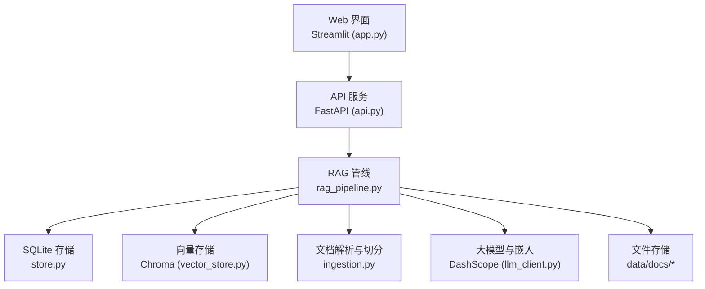
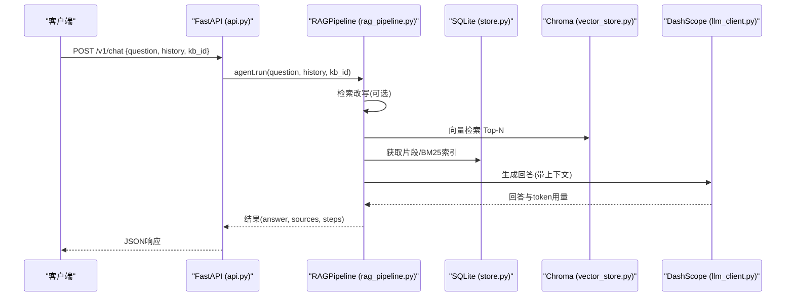
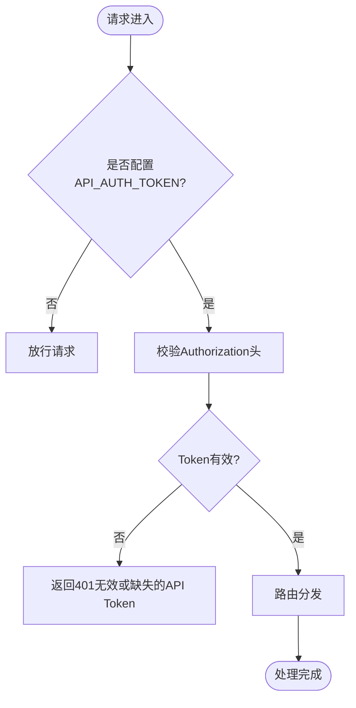
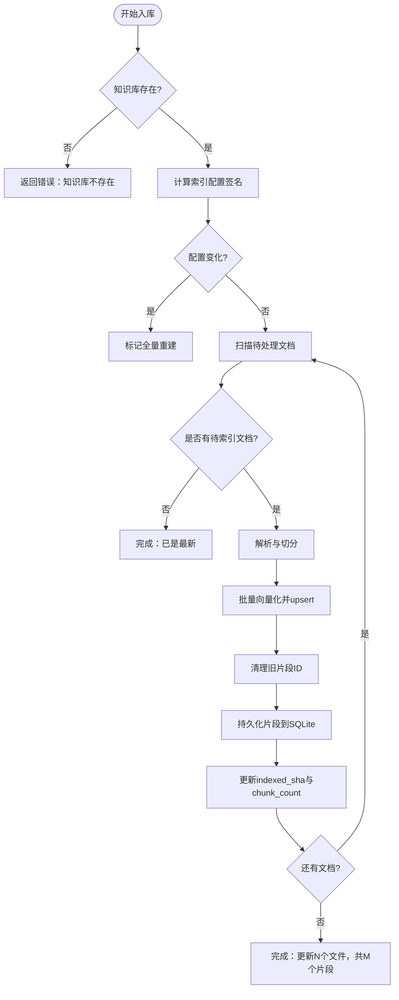
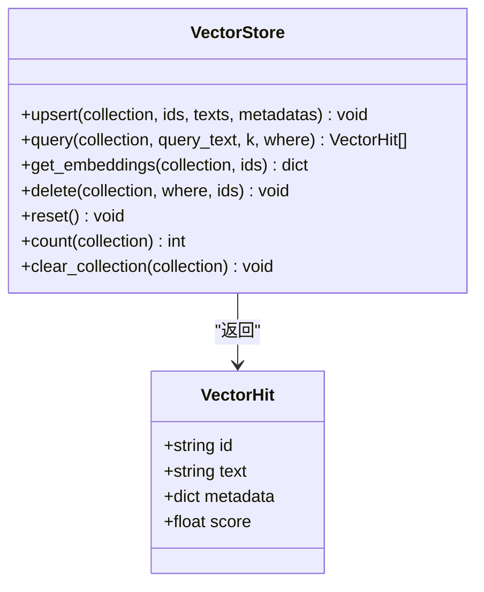
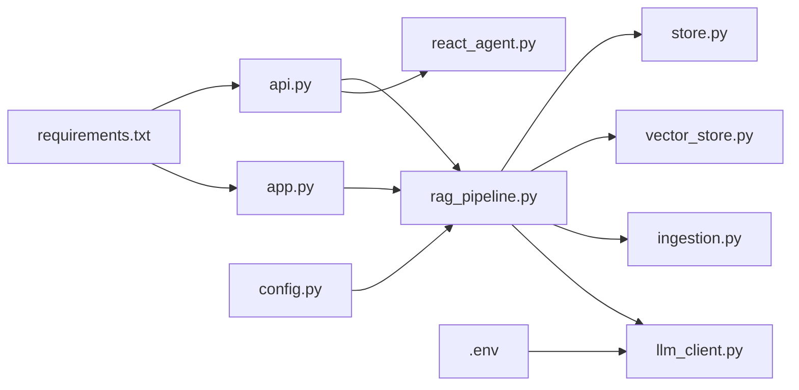

# 部署拓扑与基础设施

<cite>
**本文引用的文件**
- [README.md](file://README.md)
- [config.py](file://config.py)
- [api.py](file://api.py)
- [app.py](file://app.py)
- [rag_pipeline.py](file://rag_pipeline.py)
- [store.py](file://store.py)
- [vector_store.py](file://vector_store.py)
- [ingestion.py](file://ingestion.py)
- [llm_client.py](file://llm_client.py)
- [requirements.txt](file://requirements.txt)
- [pyproject.toml](file://pyproject.toml)
- [.env](file://.env)
</cite>

## 目录
1. [简介](#简介)
2. [项目结构](#项目结构)
3. [核心组件](#核心组件)
4. [架构总览](#架构总览)
5. [详细组件分析](#详细组件分析)
6. [依赖关系分析](#依赖关系分析)
7. [性能考虑](#性能考虑)
8. [故障排查指南](#故障排查指南)
9. [结论](#结论)
10. [附录：环境变量与配置清单](#附录：环境变量与配置清单)

## 简介
本文件面向生产部署，描述该 RAG + Agent 系统的部署拓扑、基础设施需求与运维要点。系统包含 Web 界面（Streamlit）、API 服务（FastAPI）、向量数据库（Chroma）、元数据与片段存储（SQLite）、本地文件存储（文档与版本）、以及外部大模型与 Embedding 服务（DashScope）。文档覆盖单机部署、容器化部署方案、生产环境配置要求、组件部署位置与数据流向、Docker 相关配置建议、环境变量设置、性能调优参数、监控方案，以及故障恢复、数据备份与安全加固等运维考虑。

## 项目结构
- 入口与交互层
  - Streamlit 应用：提供多知识库管理、上传与后台索引、流式聊天与引用展示。
  - FastAPI 服务：暴露 REST API（/v1），支持 Bearer Token 鉴权，统一封装 RAG/Agent 能力。
- 业务逻辑层
  - RAG 管线：知识库管理、增量入库、混合检索（向量+BM25，RRF融合，可选MMR重排）、问答与上下文裁剪。
  - 文档解析与切分：PDF/Word/Markdown/TXT 解析，自动 OCR 兜底，文本按段落/句子切分。
  - Agent：Function Calling 工具调度（知识库检索、天气、联网搜索等），多步循环与流式事件。
- 数据存储层
  - SQLite：知识库、文档、版本、片段、键值配置；WAL 模式与 busy_timeout 保证并发安全。
  - Chroma：每个知识库一个 collection，余弦相似度空间，批量 upsert/query。
  - 文件系统：data/docs/<kb_id>/<doc_id>/v<版本>/<文件名>，版本化保存。
- 外部依赖
  - DashScope：对话、Embedding、流式接口；OpenAI 兼容客户端封装。
  - 第三方库：LangChain、ChromaDB、FastAPI、Uvicorn、pypdf/docx2txt/pymupdf/rapidocr 等。

图表来源
- [api.py:1-204](file://api.py#L1-L204)
- [app.py:1-352](file://app.py#L1-L352)
- [rag_pipeline.py:196-792](file://rag_pipeline.py#L196-L792)
- [store.py:1-470](file://store.py#L1-L470)
- [vector_store.py:1-255](file://vector_store.py#L1-L255)
- [ingestion.py:1-216](file://ingestion.py#L1-L216)
- [llm_client.py:1-322](file://llm_client.py#L1-L322)

章节来源
- [README.md:116-142](file://README.md#L116-L142)
- [requirements.txt:1-21](file://requirements.txt#L1-L21)

## 核心组件
- 配置中心：集中读取环境变量，提供默认值与类型转换，冻结配置对象避免运行时修改。
- 存储服务：SQLite 实现知识库、文档、版本、片段、配置；WAL 模式与锁保护写操作。
- 向量存储：Chroma 持久化客户端，按 collection 隔离知识库，批量向量化与查询。
- 文档解析：PDF/Word/Markdown/TXT 解析，质量阈值判断与本地 OCR 兜底。
- 大模型客户端：DashScope OpenAI 兼容接口，统一封装 chat/stream/raw/embeddings，记录 token 用量。
- RAG 管线：整合上述组件，提供入库、检索、问答、上下文裁剪、引用生成。
- 服务层：FastAPI 路由封装，Bearer Token 鉴权，健康检查，统一异常处理。
- Web 界面：Streamlit 页面，后台线程异步入库，流式聊天与轨迹展示。

章节来源
- [config.py:1-113](file://config.py#L1-L113)
- [store.py:1-470](file://store.py#L1-L470)
- [vector_store.py:1-255](file://vector_store.py#L1-L255)
- [ingestion.py:1-216](file://ingestion.py#L1-L216)
- [llm_client.py:1-322](file://llm_client.py#L1-L322)
- [rag_pipeline.py:196-792](file://rag_pipeline.py#L196-L792)
- [api.py:1-204](file://api.py#L1-L204)
- [app.py:1-352](file://app.py#L1-L352)

## 架构总览
系统采用“前端界面 + API 服务 + 业务管线 + 存储 + 外部模型”的分层架构。API 服务作为统一入口，对外暴露 /v1 接口；内部通过 RAG 管线协调文档解析、向量检索、BM25 词面检索、LLM 生成与 Agent 工具调用。数据落盘包括 SQLite 元数据、Chroma 向量索引与文件系统文档版本。

图表来源
- [api.py:185-199](file://api.py#L185-L199)
- [rag_pipeline.py:590-666](file://rag_pipeline.py#L590-L666)
- [vector_store.py:100-126](file://vector_store.py#L100-L126)
- [store.py:425-450](file://store.py#L425-L450)
- [llm_client.py:94-127](file://llm_client.py#L94-L127)

## 详细组件分析

### 组件A：API 服务与鉴权
- 功能：REST 路由（知识库管理、文档上传、入库、问答），健康检查，Bearer Token 鉴权。
- 并发：使用全局 RLock 串行化读写，避免 SQLite/Chroma 并发问题。
- 错误处理：统一将业务异常转换为 HTTP 状态码与可读消息。

图表来源
- [api.py:31-50](file://api.py#L31-L50)
- [api.py:98-100](file://api.py#L98-L100)
- [api.py:185-199](file://api.py#L185-L199)

章节来源
- [api.py:1-204](file://api.py#L1-L204)

### 组件B：RAG 管线与混合检索
- 功能：知识库管理、增量入库（SHA-256判重、索引配置变更全量重建）、混合检索（向量+BM25，RRF融合，可选MMR重排）、问答与上下文裁剪。
- 数据流：upload_document → ingest → retrieve → answer。
- 相关性门槛：向量与 BM25 均无命中则拒答，避免幻觉；精确匹配时放宽限制。

图表来源
- [rag_pipeline.py:306-435](file://rag_pipeline.py#L306-L435)
- [store.py:386-411](file://store.py#L386-L411)
- [vector_store.py:61-78](file://vector_store.py#L61-L78)

章节来源
- [rag_pipeline.py:196-792](file://rag_pipeline.py#L196-L792)

### 组件C：向量存储与检索
- 功能：Chroma 持久化客户端，collection 级隔离，批量 upsert/query，MMR 所需向量获取。
- 距离度量：cosine 空间，相似度 = 1 - distance。
- 回退机制：未配置密钥时使用模拟嵌入函数进行演示。

图表来源
- [vector_store.py:38-148](file://vector_store.py#L38-L148)
- [vector_store.py:151-188](file://vector_store.py#L151-L188)

章节来源
- [vector_store.py:1-255](file://vector_store.py#L1-L255)

### 组件D：文档解析与切分
- 功能：PDF/Word/Markdown/TXT 解析，PDF 质量阈值判断与本地 OCR 兜底，递归字符切分保留页码与段落信息。
- 输出：Document 列表，附带 source/page/paragraph 等元数据，供后续构建片段与引用。

章节来源
- [ingestion.py:1-216](file://ingestion.py#L1-L216)

### 组件E：大模型客户端
- 功能：DashScope OpenAI 兼容接口，chat/stream/raw/embeddings，记录 token 用量，统一异常转换。
- 配置：从环境变量读取模型名、base_url、是否启用思考过程等。

章节来源
- [llm_client.py:1-322](file://llm_client.py#L1-L322)

### 组件F：SQLite 存储
- 功能：知识库、文档、版本、片段、键值配置；WAL 模式与 busy_timeout 保证并发安全；软删除与版本历史保留。
- 表结构：kbs/documents/document_versions/chunks/meta。

章节来源
- [store.py:1-470](file://store.py#L1-L470)

## 依赖关系分析
- 运行时依赖：Python 3.10+，LangChain、ChromaDB、DashScope、OpenAI、Streamlit、FastAPI、Uvicorn、文档解析与OCR 相关库。
- 配置文件：requirements.txt 定义版本范围；pyproject.toml 定义测试与代码规范工具；.env 提供密钥与端点。

图表来源
- [api.py:1-204](file://api.py#L1-L204)
- [rag_pipeline.py:196-792](file://rag_pipeline.py#L196-L792)
- [store.py:1-470](file://store.py#L1-L470)
- [vector_store.py:1-255](file://vector_store.py#L1-L255)
- [ingestion.py:1-216](file://ingestion.py#L1-L216)
- [llm_client.py:1-322](file://llm_client.py#L1-L322)
- [app.py:1-352](file://app.py#L1-L352)
- [config.py:1-113](file://config.py#L1-L113)
- [requirements.txt:1-21](file://requirements.txt#L1-L21)
- [.env:1-10](file://.env#L1-L10)

章节来源
- [requirements.txt:1-21](file://requirements.txt#L1-L21)
- [pyproject.toml:1-41](file://pyproject.toml#L1-L41)

## 性能考虑
- 向量批量大小：EMBEDDING_BATCH_SIZE 限制在 1-20，避免超出 DashScope 单次上限。
- 检索参数：RETRIEVAL_TOP_K、RETRIEVAL_FUSION_POOL、RETRIEVAL_RELEVANCE_THRESHOLD、RETRIEVAL_MMR_ENABLED/LAMBDA 控制召回与去重。
- 上下文预算：HISTORY_MAX_TOKENS、RAG_CONTEXT_MAX_TOKENS 控制历史与上下文长度，降低延迟与成本。
- 索引配置：CHUNK_SIZE/CHUNK_OVERLAP 影响切分粒度；配置变化触发全量重建，确保一致性。
- 并发与锁：API 层使用 RLock 串行化，避免 SQLite/Chroma 并发冲突；Streamlit 后台线程异步入库不阻塞聊天。
- 网络超时：llm_client 设置 timeout 与重试次数，提升稳定性。

章节来源
- [config.py:90-113](file://config.py#L90-L113)
- [rag_pipeline.py:439-523](file://rag_pipeline.py#L439-L523)
- [llm_client.py:75-86](file://llm_client.py#L75-L86)
- [api.py:31-33](file://api.py#L31-L33)
- [app.py:76-104](file://app.py#L76-L104)

## 故障排查指南
- 鉴权失败：确认 API_AUTH_TOKEN 已设置且 Authorization 头正确；未设置时仅本机调试开放访问。
- 模型调用失败：检查 DASHSCOPE_API_KEY、DASHSCOPE_BASE_URL、DASHSCOPE_CHAT_MODEL/EMBEDDING_MODEL；错误会被包装为可读消息。
- 向量检索为空：检查相关性门槛与 BM25 命中；必要时调整 RETRIEVAL_RELEVANCE_THRESHOLD 或关闭 MMR。
- 入库失败：查看缺失文件、OCR 依赖安装情况；错误会记录到结果中并可由 UI 展示。
- 并发冲突：SQLite WAL 与 busy_timeout 缓解争用；如仍出现锁定，减少并发写入或升级存储。

章节来源
- [api.py:42-50](file://api.py#L42-L50)
- [llm_client.py:59-66](file://llm_client.py#L59-L66)
- [rag_pipeline.py:306-435](file://rag_pipeline.py#L306-L435)
- [store.py:132-138](file://store.py#L132-L138)

## 结论
该系统以 RAG 管线为核心，结合向量与词面检索、Agent 工具调度与流式交互，提供了企业知识库问答的完整能力。部署上支持单机运行与容器化扩展，存储层采用 SQLite + Chroma + 文件系统，外部依赖通过环境变量灵活配置。生产环境需关注鉴权、性能调优、监控与备份恢复，确保安全与稳定。

## 附录：环境变量与配置清单
- 必填
  - DASHSCOPE_API_KEY：阿里云百炼密钥
- 可选
  - DASHSCOPE_BASE_URL：百炼 OpenAI 兼容接口地址
  - DASHSCOPE_CHAT_MODEL：对话模型
  - DASHSCOPE_EMBEDDING_MODEL：Embedding 模型
  - DASHSCOPE_ENABLE_THINKING：是否启用思考过程
  - CHUNK_SIZE / CHUNK_OVERLAP：文本切分参数
  - RETRIEVAL_TOP_K / RETRIEVAL_FUSION_POOL / RETRIEVAL_RELEVANCE_THRESHOLD：检索参数
  - RETRIEVAL_MMR_ENABLED / RETRIEVAL_MMR_LAMBDA：去重重排开关与权重
  - QUERY_REWRITE_ENABLED：多轮对话是否先改写追问题
  - HISTORY_MAX_TOKENS / RAG_CONTEXT_MAX_TOKENS：历史与上下文 token 预算
  - AGENT_MAX_STEPS：Agent 最大工具调用轮数
  - EMBEDDING_BATCH_SIZE：Embedding 批量大小（1-20）
  - LOGO_PATH：页面 Logo 图片路径
  - API_AUTH_TOKEN：API 鉴权 Token
  - CHROMA_DIR / KB_DB_PATH：向量与元数据存储路径

章节来源
- [README.md:93-114](file://README.md#L93-L114)
- [config.py:90-113](file://config.py#L90-L113)
- [.env:1-10](file://.env#L1-L10)