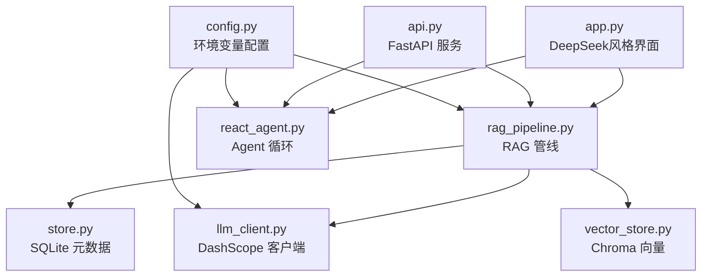
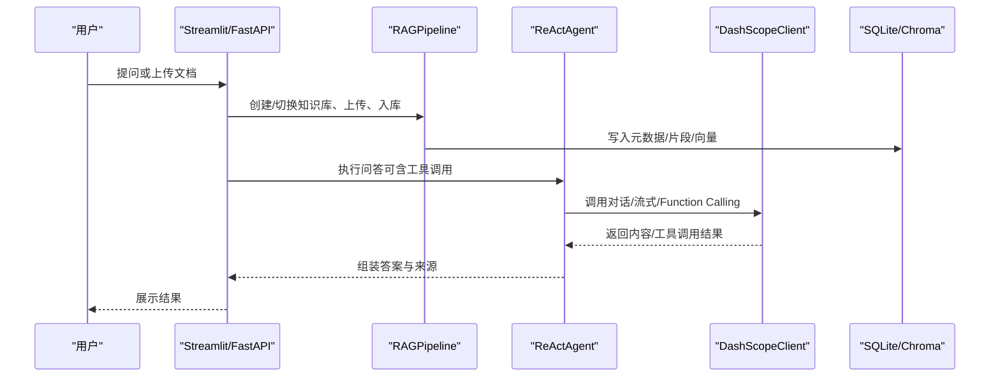
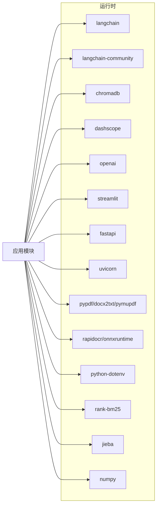

# 本地开发环境搭建

<cite>
**本文引用的文件**
- [README.md](file://README.md)
- [pyproject.toml](file://pyproject.toml)
- [requirements.txt](file://requirements.txt)
- [requirements-dev.txt](file://requirements-dev.txt)
- [config.py](file://config.py)
- [llm_client.py](file://llm_client.py)
- [api.py](file://api.py)
- [app.py](file://app.py)
- [rag_pipeline.py](file://rag_pipeline.py)
- [react_agent.py](file://react_agent.py)
- [store.py](file://store.py)
- [tests/conftest.py](file://tests/conftest.py)
</cite>

## 更新摘要
**所做更改**
- 更新了Streamlit界面配置章节，反映DeepSeek风格的重新设计和新增的上下文菜单系统
- 添加了新的CSS样式配置说明，包括会话管理菜单的悬停显示效果
- 修复了侧边栏折叠/展开问题的详细说明
- 增强了界面配置和环境变量说明，包含LOGO_PATH环境变量
- 更新了欢迎页面功能的描述和交互体验说明

## 目录
1. [简介](#简介)
2. [项目结构](#项目结构)
3. [核心组件](#核心组件)
4. [架构总览](#架构总览)
5. [详细组件分析](#详细组件分析)
6. [依赖关系分析](#依赖关系分析)
7. [性能注意事项](#性能注意事项)
8. [故障排查指南](#故障排查指南)
9. [结论](#结论)
10. [附录：快速启动脚本与工作流](#附录：快速启动脚本与工作流)

## 简介
本指南面向首次在本机运行该"智能文档助手（RAG + Agent）"项目的开发者，目标是帮助你从零开始完成 Python 环境、虚拟环境、依赖包安装与环境变量配置，并给出常用 IDE 建议、常见问题排查与快速启动工作流。项目要求 Python 3.10+，并通过环境变量加载 DashScope API 密钥与模型/端点等配置；数据默认落盘在 data 目录下，支持 SQLite 与 Chroma 向量库。

**更新** 项目现已采用全新的Streamlit界面设计，遵循DeepSeek的简洁美学原则，提供优化的中文文本渲染和现代化的用户交互体验。新增的上下文菜单系统支持会话管理的悬停显示效果，修复了侧边栏折叠/展开问题，确保用户可以正常使用侧边栏的展开功能。

## 项目结构
- 应用入口与界面
  - Streamlit 页面：app.py（全新DeepSeek风格界面）
  - FastAPI 服务层：api.py
- 核心逻辑
  - RAG 管线：rag_pipeline.py
  - Function Calling Agent：react_agent.py
  - LLM 客户端封装：llm_client.py
  - 配置集中管理：config.py
  - 存储层：store.py（SQLite）、vector_store.py（Chroma）
- 开发与测试
  - 运行时依赖：requirements.txt
  - 开发依赖：requirements-dev.txt
  - 测试夹具：tests/conftest.py
  - 代码规范与类型检查：pyproject.toml

图表来源
- [app.py:1-613](file://app.py#L1-L613)
- [api.py:1-200](file://api.py#L1-L200)
- [rag_pipeline.py:1-200](file://rag_pipeline.py#L1-L200)
- [react_agent.py:1-200](file://react_agent.py#L1-L200)
- [llm_client.py:1-200](file://llm_client.py#L1-L200)
- [store.py:1-200](file://store.py#L1-L200)
- [config.py:1-113](file://config.py#L1-L113)

章节来源
- [README.md:25-91](file://README.md#L25-L91)
- [README.md:116-142](file://README.md#L116-L142)

## 核心组件
- 配置中心（config.py）
  - 通过环境变量读取所有可调参数，提供 AppConfig.from_env() 构建配置对象。
  - 关键路径：data_dir、chroma_dir、db_path；检索与切分参数；Agent 步数；Embedding 批量大小等。
- LLM 客户端（llm_client.py）
  - 统一封装 DashScope OpenAI 兼容接口，负责对话、流式输出、Function Calling、Embedding。
  - 从环境变量读取 DASHSCOPE_API_KEY、DASHSCOPE_BASE_URL、DASHSCOPE_CHAT_MODEL、DASHSCOPE_EMBEDDING_MODEL。
- RAG 管线（rag_pipeline.py）
  - 知识库管理、增量入库、混合检索（向量 + BM25）、查询改写、带引用回答。
  - 依赖 store.py（SQLite）、vector_store.py（Chroma）、ingestion.py（解析与切分）。
- Agent（react_agent.py）
  - 基于 Function Calling 的工具注册表与多步循环，支持知识库检索、天气、联网搜索等工具。
- 存储（store.py）
  - SQLite 实现知识库、文档、版本、片段、配置等元数据；WAL 模式与锁保证并发安全。
- 服务层（api.py）
  - FastAPI 暴露 /v1 路由，可选 Bearer Token 鉴权；文档上传、入库、问答等接口。
- 界面（app.py）
  - **全新DeepSeek风格Streamlit界面**：全局CSS样式隐藏Streamlit默认装饰，优化中文文本渲染的系统字体，圆角输入字段带微妙阴影和焦点状态，增强的欢迎页面体验。
  - **新增上下文菜单系统**：会话行悬停时显示操作菜单，支持重命名、置顶、删除等操作，带有平滑的透明度过渡效果。
  - **侧边栏功能增强**：修复了折叠/展开问题，确保用户可以正常使用侧边栏的展开功能，初始状态设置为展开。

章节来源
- [config.py:1-113](file://config.py#L1-L113)
- [llm_client.py:1-200](file://llm_client.py#L1-L200)
- [rag_pipeline.py:1-200](file://rag_pipeline.py#L1-L200)
- [react_agent.py:1-200](file://react_agent.py#L1-L200)
- [store.py:1-200](file://store.py#L1-L200)
- [api.py:1-200](file://api.py#L1-L200)
- [app.py:1-613](file://app.py#L1-L613)

## 架构总览
下图展示了本地开发时主要模块的交互关系：UI/REST 调用 RAG 管线与 Agent，后者通过 LLM 客户端访问百炼服务，同时读写 SQLite 与 Chroma。

图表来源
- [app.py:1-613](file://app.py#L1-L613)
- [api.py:1-200](file://api.py#L1-L200)
- [rag_pipeline.py:1-200](file://rag_pipeline.py#L1-L200)
- [react_agent.py:1-200](file://react_agent.py#L1-L200)
- [llm_client.py:1-200](file://llm_client.py#L1-L200)
- [store.py:1-200](file://store.py#L1-L200)

## 详细组件分析

### 环境与依赖安装
- Python 版本
  - 要求 Python 3.10+。
- 虚拟环境
  - 使用 venv 创建隔离环境，并在 Windows/macOS/Linux 下激活。
- 依赖安装
  - 运行时依赖：requirements.txt
  - 开发依赖：requirements-dev.txt（包含 pytest、ruff、mypy）
- 配置文件
  - 复制 .env.example 为 .env（若仓库未提供示例，请根据 README 中的环境变量说明创建），填入必要的环境变量。

章节来源
- [README.md:25-45](file://README.md#L25-L45)
- [requirements.txt:1-21](file://requirements.txt#L1-L21)
- [requirements-dev.txt:1-6](file://requirements-dev.txt#L1-L6)

### 环境变量配置
- 必需项
  - DASHSCOPE_API_KEY：阿里云百炼密钥，缺失将抛出运行时错误。
- 推荐项
  - DASHSCOPE_BASE_URL：百炼 OpenAI 兼容接口地址，需以 /compatible-mode/v1 结尾。
  - DASHSCOPE_CHAT_MODEL：对话模型名（如 qwen-plus）。
  - DASHSCOPE_EMBEDDING_MODEL：Embedding 模型名（如 text-embedding-v3）。
- 其他重要开关
  - DASHSCOPE_ENABLE_THINKING：是否启用思考过程（true/false）。
  - API_AUTH_TOKEN：FastAPI 鉴权 Token（可选，用于 REST 接口保护）。
- 数据存储路径
  - CHROMA_DIR：Chroma 向量库目录（默认 data/chroma）。
  - KB_DB_PATH：SQLite 数据库路径（默认 data/kb.sqlite3）。
  - LOGO_PATH：页面 Logo 图片路径（可选）。

**更新** 新增界面相关环境变量：
- LOGO_PATH：自定义Logo图片路径，支持替换默认的品牌标识

章节来源
- [llm_client.py:22-86](file://llm_client.py#L22-L86)
- [config.py:56-113](file://config.py#L56-L113)
- [api.py:31-50](file://api.py#L31-L50)
- [README.md:93-114](file://README.md#L93-L114)

### 数据库与向量存储
- SQLite（store.py）
  - 使用 WAL 模式与 busy_timeout，支持多线程并发访问；提供知识库、文档、版本、片段、配置的 CRUD。
- Chroma（vector_store.py）
  - 每个知识库一个 collection，用于向量检索。
- 数据落盘位置
  - data/kb.sqlite3、data/chroma/、data/docs/<kb_id>/<doc_id>/v<版本>/<文件名>。

章节来源
- [store.py:1-200](file://store.py#L1-L200)
- [README.md:136-142](file://README.md#L136-L142)

### 服务与界面启动
- Streamlit 界面
  - 命令：streamlit run app.py
  - **全新功能**：DeepSeek风格界面，包含全局CSS样式、优化的中文排版、圆角输入框、增强的欢迎页面体验
  - **新增特性**：上下文菜单系统，支持会话管理的悬停显示效果，平滑的透明度过渡动画
  - **功能增强**：知识库管理、文档上传与后台索引、流式聊天、多会话独立管理
  - **侧边栏修复**：修复了折叠/展开问题，确保用户可以正常使用侧边栏的展开功能
- FastAPI 服务
  - 命令：uvicorn api:app --host 0.0.0.0 --port 8000
  - 功能：REST API（/v1），可选 Bearer Token 鉴权。

**更新** Streamlit界面特性：
- 隐藏Streamlit默认装饰元素（菜单、页脚、工具栏），但保留stToolbar以确保侧边栏展开功能正常
- 系统级中文字体优化（PingFang SC、Microsoft YaHei等）
- 现代化圆角输入框设计，带阴影和焦点状态
- 居中标题和输入框的欢迎页面
- 多会话独立管理，支持历史对话保存和切换
- **新增上下文菜单系统**：会话行悬停时显示操作菜单，支持重命名、置顶、删除等操作
- **侧边栏功能增强**：初始状态设置为展开，修复了折叠/展开问题

章节来源
- [README.md:41-65](file://README.md#L41-L65)
- [api.py:1-200](file://api.py#L1-L200)
- [app.py:1-613](file://app.py#L1-L613)

### 测试与质量保障
- 离线测试
  - 命令：pytest
  - 夹具：tests/conftest.py 提供 pipeline 与 agent 的 mock 实例。
- 代码规范与类型检查
  - ruff check .
  - mypy（按 pyproject.toml 配置）

章节来源
- [README.md:74-91](file://README.md#L74-L91)
- [tests/conftest.py:1-23](file://tests/conftest.py#L1-L23)
- [pyproject.toml:1-41](file://pyproject.toml#L1-L41)

## 依赖关系分析
- 运行时依赖
  - langchain、langchain-community、chromadb、dashscope、openai、streamlit、fastapi、uvicorn、pypdf/docx2txt/pymupdf、rapidocr/onnxruntime、python-dotenv、rank-bm25、jieba、numpy。
- 开发依赖
  - pytest、ruff、mypy。

图表来源
- [requirements.txt:1-21](file://requirements.txt#L1-L21)

章节来源
- [requirements.txt:1-21](file://requirements.txt#L1-L21)
- [requirements-dev.txt:1-6](file://requirements-dev.txt#L1-L6)

## 性能注意事项
- Embedding 批量大小
  - 受限于 DashScope 单次最大 20 条，默认取 16 避免超限报错。可通过 EMBEDDING_BATCH_SIZE 调整。
- 上下文长度控制
  - HISTORY_MAX_TOKENS 与 RAG_CONTEXT_MAX_TOKENS 限制历史与上下文 token 预算，防止过长导致注意力稀释与费用增加。
- 检索阈值与去重
  - RETRIEVAL_RELEVANCE_THRESHOLD 控制相关性门槛；RETRIEVAL_MMR_ENABLED/LAMBDA 控制 MMR 去重多样性权重。
- 并发与锁
  - SQLite 使用 WAL 与 busy_timeout；服务层使用线程锁串行化读写以避免并发冲突。

章节来源
- [config.py:90-113](file://config.py#L90-L113)
- [README.md:93-114](file://README.md#L93-L114)
- [store.py:123-138](file://store.py#L123-L138)
- [api.py:31-50](file://api.py#L31-L50)

## 故障排查指南
- 未配置 DASHSCOPE_API_KEY
  - 现象：初始化 LLM 客户端时报错提示缺少密钥。
  - 处理：复制 .env.example 为 .env，填写有效的 DASHSCOPE_API_KEY。
- DASHSCOPE_BASE_URL 格式不正确
  - 现象：初始化客户端时报错，要求以 /compatible-mode/v1 结尾。
  - 处理：修正环境变量中的 base_url。
- 百炼服务返回为空或未返回内容
  - 现象：调用 chat/chat_raw/stream_chat 时报错。
  - 处理：检查网络、模型名、base_url 与 API Key；必要时降低 temperature 或重试。
- 向量库/数据库路径问题
  - 现象：无法写入 data/chroma 或 data/kb.sqlite3。
  - 处理：确认 CHROMA_DIR、KB_DB_PATH 指向有效目录；确保进程有写权限。
- 并发写入冲突
  - 现象：SQLite 报忙或锁冲突。
  - 处理：保持 WAL 模式；减少并发写入；必要时在服务层加锁（已内置）。
- 测试失败
  - 现象：pytest 报错或断言失败。
  - 处理：确认 fixtures 正确注入 FakeLLMClient；检查临时目录与配置。
- **新增** Streamlit界面显示异常
  - 现象：界面样式错乱或中文显示异常。
  - 处理：确认Streamlit版本>=1.40.0；检查系统字体支持；清理浏览器缓存后重试。
- **新增** 侧边栏折叠/展开问题
  - 现象：侧边栏折叠后无法恢复或展开按钮不可用。
  - 处理：确认stToolbar未被完全隐藏，initial_sidebar_state设置为"expanded"；检查CSS样式是否正确应用。
- **新增** 上下文菜单不显示
  - 现象：会话行的⋯菜单按钮不显示或悬停无响应。
  - 处理：确认CSS样式中的stPopoverButton选择器正确；检查hover事件是否正常触发；验证st.popover组件是否正确嵌套。

章节来源
- [llm_client.py:22-86](file://llm_client.py#L22-L86)
- [llm_client.py:94-200](file://llm_client.py#L94-L200)
- [store.py:123-138](file://store.py#L123-L138)
- [tests/conftest.py:1-23](file://tests/conftest.py#L1-L23)
- [app.py:30-131](file://app.py#L30-L131)
- [app.py:107-121](file://app.py#L107-L121)
- [app.py:323-355](file://app.py#L323-L355)

## 结论
通过本指南，你可以在本机快速搭建并运行"智能文档助手"项目。重点在于：
- 使用 Python 3.10+ 与 venv 隔离环境
- 安装 requirements.txt 与 requirements-dev.txt
- 配置 .env 中的 DASHSCOPE_API_KEY 及其他必要环境变量
- 使用 Streamlit 或 FastAPI 启动应用
- 借助 pytest/ruff/mypy 进行开发与质量保障

**更新** 新项目现已提供全新的DeepSeek风格界面，具有更好的用户体验和现代化的设计语言，支持多会话管理和增强的中文文本渲染。新增的上下文菜单系统和修复的侧边栏功能进一步提升了界面的易用性和稳定性。

## 附录：快速启动脚本与工作流

### 快速启动脚本（Windows PowerShell）
- 创建并激活虚拟环境
  - python -m venv .venv
  - .\.venv\Scripts\Activate.ps1
- 安装依赖
  - pip install -r requirements.txt
  - pip install -r requirements-dev.txt
- 准备环境变量
  - 复制 .env.example 为 .env（若存在），填写 DASHSCOPE_API_KEY 等
- 启动 Streamlit
  - streamlit run app.py
- 启动 FastAPI（可选）
  - uvicorn api:app --host 0.0.0.0 --port 8000

### 快速启动脚本（macOS/Linux）
- 创建并激活虚拟环境
  - python -m venv .venv
  - source .venv/bin/activate
- 安装依赖
  - pip install -r requirements.txt
  - pip install -r requirements-dev.txt
- 准备环境变量
  - cp .env.example .env（若存在），填写 DASHSCOPE_API_KEY 等
- 启动 Streamlit
  - streamlit run app.py
- 启动 FastAPI（可选）
  - uvicorn api:app --host 0.0.0.0 --port 8000

### 开发工作流建议
- 编码与调试
  - 使用 IDE（VS Code、PyCharm）打开项目根目录，选择 .venv 解释器。
  - 在 IDE 中设置运行配置：
    - Streamlit：运行 app.py（享受全新DeepSeek风格界面）
    - FastAPI：运行 uvicorn api:app --host 0.0.0.0 --port 8000
- 代码质量
  - 运行 ruff check . 进行风格检查
  - 运行 mypy 进行类型检查（按 pyproject.toml 配置）
- 测试
  - 运行 pytest 执行离线测试
- 迭代流程
  - 修改 config.py 或 .env 后重启应用
  - 修改 rag_pipeline.py/react_agent.py 后重新运行测试与服务
  - 使用 Streamlit 界面验证 UI 与流式输出

**更新** 界面开发建议：
- 关注app.py中的全局CSS样式配置，特别是stToolbar的处理逻辑
- 测试不同屏幕尺寸下的响应式布局
- 验证中文字体的渲染效果
- 测试多会话切换和欢迎页面的交互体验
- **新增** 测试上下文菜单的悬停显示效果和透明度过渡动画
- **新增** 验证侧边栏折叠/展开功能的正常工作
- **新增** 检查stPopoverButton的CSS选择器和hover事件处理

章节来源
- [README.md:25-91](file://README.md#L25-L91)
- [pyproject.toml:1-41](file://pyproject.toml#L1-L41)
- [tests/conftest.py:1-23](file://tests/conftest.py#L1-L23)
- [app.py:1-613](file://app.py#L1-L613)