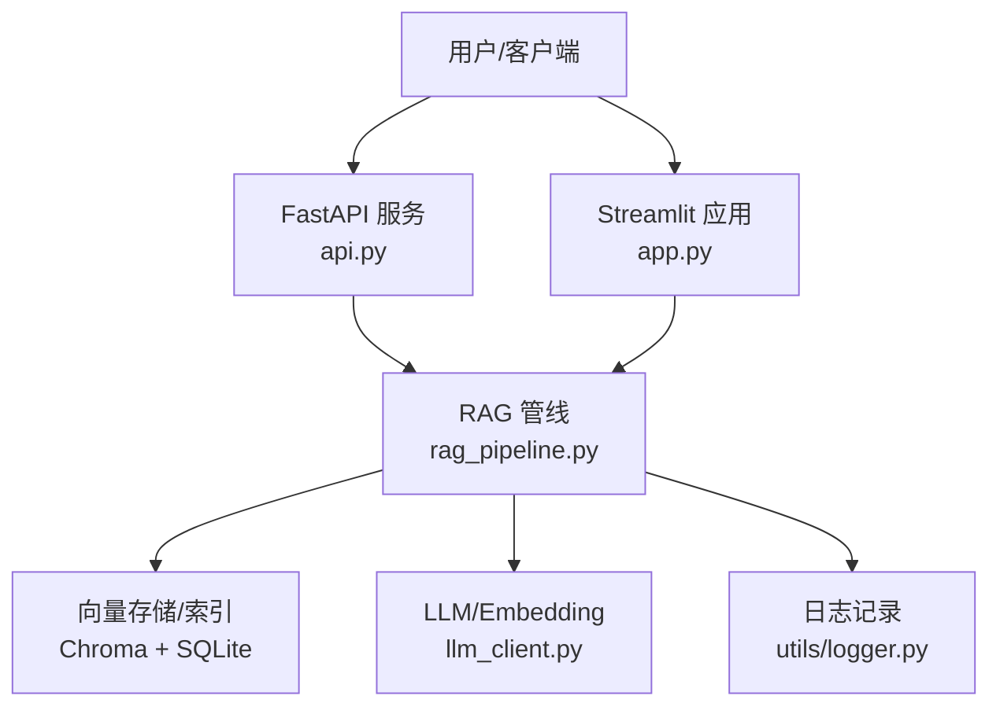
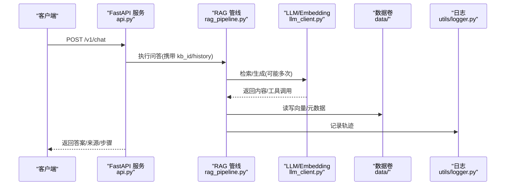
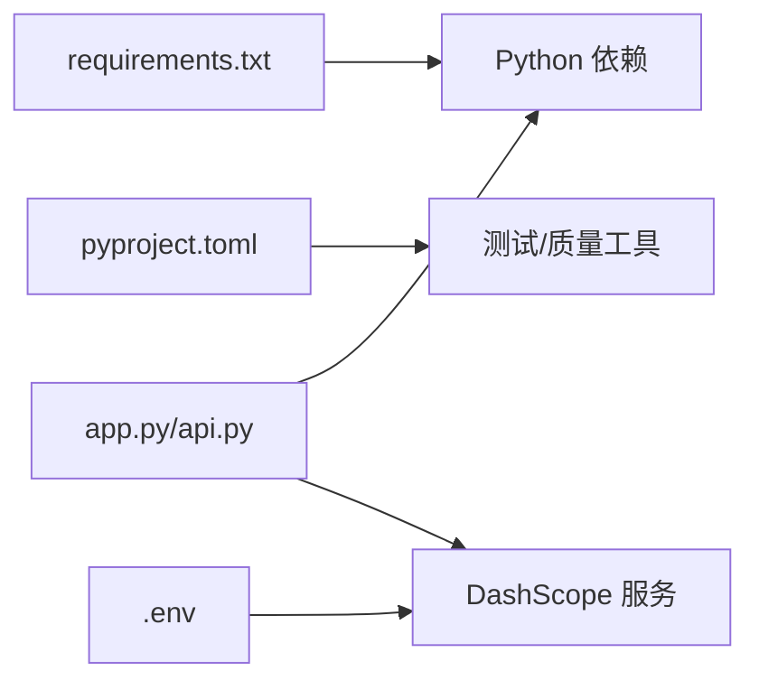

# Docker容器化部署

<cite>
**本文引用的文件**
- [README.md](file://README.md)
- [app.py](file://app.py)
- [api.py](file://api.py)
- [config.py](file://config.py)
- [llm_client.py](file://llm_client.py)
- [rag_pipeline.py](file://rag_pipeline.py)
- [requirements.txt](file://requirements.txt)
- [pyproject.toml](file://pyproject.toml)
- [.env](file://.env)
- [utils/logger.py](file://utils/logger.py)
</cite>

## 目录
1. [简介](#简介)
2. [项目结构](#项目结构)
3. [核心组件](#核心组件)
4. [架构总览](#架构总览)
5. [详细组件分析](#详细组件分析)
6. [依赖关系分析](#依赖关系分析)
7. [性能与资源限制](#性能与资源限制)
8. [故障排查指南](#故障排查指南)
9. [结论](#结论)
10. [附录：多环境编排与运维清单](#附录多环境编排与运维清单)

## 简介
本文件面向将本项目容器化并投入生产的目标，提供从镜像构建、环境变量管理、数据持久化到服务编排、健康检查、日志与监控的完整方案。项目包含两种运行形态：
- Streamlit 界面应用（app.py）：用于交互式演示与调试。
- FastAPI 服务（api.py）：对外暴露 REST API，支持可选 Bearer Token 鉴权。

两者共享同一套 RAG/Agent 能力与配置体系，均通过环境变量注入运行时参数，便于在容器内按环境差异化配置。

## 项目结构
- 入口与服务
  - app.py：Streamlit 单页应用，负责知识库管理、文档上传、后台入库与流式聊天。
  - api.py：FastAPI 服务层，提供知识库、文档、问答等接口，含 /health 健康端点。
- 配置与环境
  - config.py：集中读取环境变量，构造 AppConfig，控制切分、检索、重排、上下文预算等。
  - llm_client.py：DashScope OpenAI 兼容客户端封装，统一读取密钥与模型配置。
  - .env：本地开发密钥与端点示例。
- 业务逻辑
  - rag_pipeline.py：RAG 管线（知识库管理、增量入库、混合检索、问答）。
  - utils/logger.py：线程安全的 Agent 轨迹日志写入。
- 依赖与工程
  - requirements.txt：运行时依赖。
  - pyproject.toml：测试与代码质量工具配置。
  - README.md：快速开始、配置说明、数据存储路径等。

图表来源
- [api.py:98-100](file://api.py#L98-L100)
- [app.py:21-23](file://app.py#L21-L23)
- [rag_pipeline.py:196-200](file://rag_pipeline.py#L196-L200)
- [llm_client.py:22-46](file://llm_client.py#L22-L46)
- [utils/logger.py:12-45](file://utils/logger.py#L12-L45)

章节来源
- [README.md:93-142](file://README.md#L93-L142)
- [api.py:1-204](file://api.py#L1-L204)
- [app.py:1-342](file://app.py#L1-L342)
- [config.py:1-113](file://config.py#L1-L113)
- [llm_client.py:1-200](file://llm_client.py#L1-L200)
- [utils/logger.py:1-76](file://utils/logger.py#L1-L76)

## 核心组件
- 配置中心（AppConfig）
  - 所有可调参数从环境变量读取，包括数据目录、向量库路径、切分参数、检索阈值、MMR、上下文 token 预算、Agent 步数、Embedding 批量大小等。
  - 默认数据目录为 data，可通过环境变量覆盖 CHROMA_DIR、KB_DB_PATH。
- LLM 客户端（DashScopeClient）
  - 从环境变量读取 API Key、Base URL、模型名、是否启用思考模式；对异常进行安全包装。
- RAG 管线（RAGPipeline）
  - 提供知识库创建/删除、文档上传、增量入库、混合检索（向量+BM25）、查询改写、带引用回答。
- 服务层（FastAPI）
  - 路由前缀 /v1，支持可选鉴权；提供 /health 健康检查；提供知识库、文档、问答接口。
- 日志记录（AgentTraceLogger）
  - 线程安全地追加 JSONL 轨迹日志，失败不阻塞主流程。

章节来源
- [config.py:56-113](file://config.py#L56-L113)
- [llm_client.py:22-86](file://llm_client.py#L22-L86)
- [rag_pipeline.py:196-200](file://rag_pipeline.py#L196-L200)
- [api.py:34-58](file://api.py#L34-L58)
- [utils/logger.py:12-45](file://utils/logger.py#L12-L45)

## 架构总览
下图展示容器化后的服务交互：外部请求进入 FastAPI，调用 RAG 管线完成检索与生成，必要时调用 LLM/Embedding 服务，并将结果与轨迹日志落盘。

图表来源
- [api.py:185-199](file://api.py#L185-L199)
- [rag_pipeline.py:196-200](file://rag_pipeline.py#L196-L200)
- [llm_client.py:94-127](file://llm_client.py#L94-L127)
- [utils/logger.py:20-45](file://utils/logger.py#L20-L45)

## 详细组件分析

### 多阶段 Dockerfile 构建优化
目标：最小化镜像体积、加速构建、隔离构建期与运行期依赖。

建议分层策略
- 基础镜像：选择官方 Python 3.10 或更高版本 slim 镜像。
- 依赖安装阶段：复制 requirements.txt，执行 pip install 并缓存 wheel。
- 源码拷贝阶段：仅拷贝必要源码与资源。
- 运行阶段：以非 root 用户运行，设置工作目录，暴露端口，定义启动命令。

关键要点
- 使用 .dockerignore 排除 .git、__pycache__、tests、evals 等非必需目录。
- 将 requirements.txt 单独 COPY 以利用 Docker 缓存。
- 若使用 GPU 推理，需基于对应 CUDA/cuDNN 基础镜像并在运行阶段安装驱动。
- 将 data 目录作为数据卷挂载，避免写入镜像层导致不可变性与扩容问题。

参考实现位置
- 依赖声明：[requirements.txt:1-21](file://requirements.txt#L1-L21)
- 运行入口：
  - FastAPI：[api.py:202-204](file://api.py#L202-L204)
  - Streamlit：见 README 中的启动方式 [README.md:41-45](file://README.md#L41-L45)

章节来源
- [requirements.txt:1-21](file://requirements.txt#L1-L21)
- [api.py:202-204](file://api.py#L202-L204)
- [README.md:41-45](file://README.md#L41-L45)

### 生产级镜像配置
- 安全
  - 非 root 用户运行；最小权限原则。
  - 仅暴露必要端口（FastAPI 默认 8000）。
- 可观测性
  - 标准输出日志；轨迹日志写入 data/agent_trace.jsonl（通过数据卷持久化）。
- 健壮性
  - 健康检查端点：GET /health。
  - 优雅退出：uvicorn 默认支持信号处理。
- 可移植性
  - 全部配置通过环境变量注入，镜像不包含敏感信息。

章节来源
- [api.py:98-100](file://api.py#L98-L100)
- [utils/logger.py:17-45](file://utils/logger.py#L17-L45)
- [README.md:93-142](file://README.md#L93-L142)

### 环境变量管理
- 运行时必须变量
  - DASHSCOPE_API_KEY：必填，阿里云百炼密钥。
  - DASHSCOPE_BASE_URL：OpenAI 兼容端点地址。
  - DASHSCOPE_CHAT_MODEL / DASHSCOPE_EMBEDDING_MODEL：模型名称。
- 行为开关
  - DASHSCOPE_ENABLE_THINKING：是否启用思考模式。
  - QUERY_REWRITE_ENABLED：是否开启查询改写。
  - RETRIEVAL_MMR_ENABLED / MMR_LAMBDA：去重重排开关与权重。
- 性能与容量
  - CHUNK_SIZE / CHUNK_OVERLAP：文本切分。
  - RETRIEVAL_TOP_K / RETRIEVAL_FUSION_POOL：检索候选数量。
  - HISTORY_MAX_TOKENS / RAG_CONTEXT_MAX_TOKENS：上下文预算。
  - AGENT_MAX_STEPS：最大工具调用轮数。
  - EMBEDDING_BATCH_SIZE：向量化批量大小（受限于服务端上限）。
- 路径与存储
  - CHROMA_DIR：向量库目录。
  - KB_DB_PATH：SQLite 数据库路径。
  - LOGO_PATH：页面 Logo 路径（可选）。
- 服务鉴权
  - API_AUTH_TOKEN：FastAPI 鉴权令牌（未设置则放行，仅建议本机/内网调试）。

章节来源
- [config.py:56-113](file://config.py#L56-L113)
- [llm_client.py:22-46](file://llm_client.py#L22-L46)
- [api.py:31-49](file://api.py#L31-L49)
- [README.md:93-115](file://README.md#L93-L115)
- [.env:1-10](file://.env#L1-L10)

### 数据卷挂载策略
- 必须持久化的目录
  - data/：包含 SQLite（kb.sqlite3）、Chroma 向量库（chroma/）、文档（docs/<kb_id>/...）、轨迹日志（agent_trace.jsonl）。
- 建议挂载
  - data/chroma：向量索引，频繁读写，建议使用高性能磁盘。
  - data/kb.sqlite3：元数据与片段，WAL 模式，适合并发读。
  - data/docs：原始文档与版本化文件，建议备份。
  - data/agent_trace.jsonl：轨迹日志，便于审计与回溯。
- 注意事项
  - 容器内路径与宿主机映射一致，确保进程有写权限。
  - 不同环境（开发/测试/生产）通过挂载不同宿主路径实现数据隔离。

章节来源
- [README.md:136-142](file://README.md#L136-L142)
- [config.py:92-100](file://config.py#L92-L100)
- [utils/logger.py:17-45](file://utils/logger.py#L17-L45)

### Docker Compose 编排配置
- 服务定义
  - fastapi：运行 FastAPI 服务，暴露 8000 端口，挂载 data 卷，注入环境变量。
  - streamlit：运行 Streamlit 界面（可选），暴露 8501 端口，挂载 data 卷。
- 网络
  - 默认桥接网络；如需跨主机通信，可自定义网络并命名。
- 健康检查
  - 使用 GET /health 检查服务可用性。
- 依赖
  - 无外部服务依赖（向量与元数据落盘），但需要外网访问 DashScope 服务。
- 资源限制
  - 为 CPU/内存设置上限，防止单实例占用过多资源。
- 日志
  - 使用 docker 默认日志驱动；轨迹日志通过数据卷持久化。

章节来源
- [api.py:98-100](file://api.py#L98-L100)
- [README.md:41-65](file://README.md#L41-L65)
- [config.py:92-100](file://config.py#L92-L100)

### 不同环境的 docker-compose 文件
- 开发环境
  - 特点：关闭鉴权（或不设置 API_AUTH_TOKEN），启用更多调试输出，数据卷指向本地开发目录。
  - 建议：使用较大数据预算（HISTORY_MAX_TOKENS、RAG_CONTEXT_MAX_TOKENS）以便调试。
- 测试环境
  - 特点：启用 API_AUTH_TOKEN，固定模型与端点，限制资源，数据卷隔离。
  - 建议：设置较小 TOP_K/FUSION_POOL 以缩短测试时延。
- 生产环境
  - 特点：强制鉴权，严格资源限制，启用健康检查，数据卷使用高性能存储，日志收集接入集中平台。
  - 建议：根据负载调整并发与超时，结合反向代理与 WAF。

章节来源
- [api.py:31-49](file://api.py#L31-L49)
- [config.py:92-113](file://config.py#L92-L113)
- [README.md:93-115](file://README.md#L93-L115)

### 容器资源限制
- CPU/内存
  - 为每个服务设置 limits/reservations，避免争用。
- I/O
  - 将 data/chroma 与 data/kb.sqlite3 放在 SSD 上，提升检索与入库性能。
- 网络
  - 限制出站带宽（如需要），避免 Embedding/LLM 调用拥塞。
- 进程模型
  - FastAPI 使用 uvicorn 多 worker 时注意内存峰值；Streamlit 单进程即可。

章节来源
- [api.py:202-204](file://api.py#L202-L204)
- [README.md:136-142](file://README.md#L136-L142)

### 日志收集与监控集成
- 应用日志
  - 标准输出由容器日志驱动收集；轨迹日志写入 data/agent_trace.jsonl，建议挂载到宿主机或日志系统。
- 指标
  - 可在 FastAPI 中增加 Prometheus 指标（如请求耗时、错误率、token 用量），结合 exporter 采集。
- 链路追踪
  - 将 agent 轨迹与请求 ID 关联，便于端到端追踪。
- 告警
  - 基于 /health 与健康探针，结合监控系统对服务可用性进行告警。

章节来源
- [utils/logger.py:12-45](file://utils/logger.py#L12-L45)
- [api.py:98-100](file://api.py#L98-L100)

## 依赖关系分析
- 运行时依赖
  - langchain、langchain-community、chromadb、dashscope、openai、streamlit、fastapi、uvicorn、pypdf、docx2txt、pymupdf、rapidocr、onnxruntime、python-dotenv、rank-bm25、jieba、numpy。
- 工程工具
  - pytest、ruff、mypy（见 pyproject.toml）。
- 外部依赖
  - DashScope 服务（对话/Embedding/搜索/思考模式）。

图表来源
- [requirements.txt:1-21](file://requirements.txt#L1-L21)
- [pyproject.toml:1-41](file://pyproject.toml#L1-L41)
- [.env:1-10](file://.env#L1-L10)
- [app.py:21-23](file://app.py#L21-L23)
- [api.py:27-29](file://api.py#L27-L29)

章节来源
- [requirements.txt:1-21](file://requirements.txt#L1-L21)
- [pyproject.toml:1-41](file://pyproject.toml#L1-L41)
- [.env:1-10](file://.env#L1-L10)

## 性能与资源限制
- 检索与生成
  - 合理设置 RETRIEVAL_TOP_K、RETRIEVAL_FUSION_POOL 与 RAG_CONTEXT_MAX_TOKENS，平衡召回与成本。
  - 使用 MMR 去重提升多样性，避免重复片段。
- 入库性能
  - EMBEDDING_BATCH_SIZE 控制在服务端允许范围内（默认 16，上限 20）。
  - 将 data/chroma 与 data/kb.sqlite3 置于高性能磁盘。
- 并发与扩展
  - FastAPI 可使用多 worker；Streamlit 通常单进程。
  - 水平扩展时，注意数据卷共享与一致性（SQLite WAL 模式适合并发读）。
- 成本优化
  - 限制 HISTORY_MAX_TOKENS，减少历史长度；按需开启查询改写。

章节来源
- [config.py:92-113](file://config.py#L92-L113)
- [README.md:93-115](file://README.md#L93-L115)

## 故障排查指南
- 无法连接 DashScope
  - 检查 DASHSCOPE_API_KEY、DASHSCOPE_BASE_URL、DASHSCOPE_CHAT_MODEL 是否正确。
  - 确认网络可达与域名解析正常。
- 健康检查失败
  - 检查 /health 端点是否返回 ok；查看容器日志定位启动失败原因。
- 入库失败
  - 检查 data 目录权限与空间；确认 CHROMA_DIR、KB_DB_PATH 路径有效。
  - 关注 EMBEDDING_BATCH_SIZE 是否超出服务端限制。
- 鉴权失败
  - 确认 API_AUTH_TOKEN 已设置且请求头携带正确 Bearer Token。
- 轨迹日志缺失
  - 检查 data/agent_trace.jsonl 是否存在并可写；确认日志写入路径未被覆盖。

章节来源
- [llm_client.py:59-86](file://llm_client.py#L59-L86)
- [api.py:98-100](file://api.py#L98-L100)
- [config.py:92-100](file://config.py#L92-L100)
- [utils/logger.py:17-45](file://utils/logger.py#L17-L45)

## 结论
通过将应用容器化，配合环境变量注入、数据卷持久化与 Compose 编排，可实现开发、测试、生产环境的标准化交付。结合健康检查、资源限制与日志收集，能够稳定支撑 RAG/Agent 服务的日常运行与持续演进。后续可按阶段引入指标采集、链路追踪与更细粒度的权限控制。

## 附录：多环境编排与运维清单
- 镜像构建
  - 使用多阶段构建，分离依赖安装与运行环境。
  - 使用 .dockerignore 减小镜像体积。
- 环境变量模板
  - 提供 .env.example，列出所有必填与可选变量。
- 数据卷
  - 开发：本地目录映射。
  - 测试：隔离目录。
  - 生产：高性能存储，定期备份。
- 健康检查
  - 使用 /health 进行存活与就绪探测。
- 日志
  - 标准输出 + 轨迹日志持久化。
- 监控
  - 指标导出（Prometheus）、告警规则、容量规划。
- 回滚与升级
  - 镜像标签化管理，滚动升级，保留旧版本数据卷快照。

章节来源
- [README.md:93-142](file://README.md#L93-L142)
- [api.py:98-100](file://api.py#L98-L100)
- [config.py:92-113](file://config.py#L92-L113)
- [utils/logger.py:17-45](file://utils/logger.py#L17-L45)