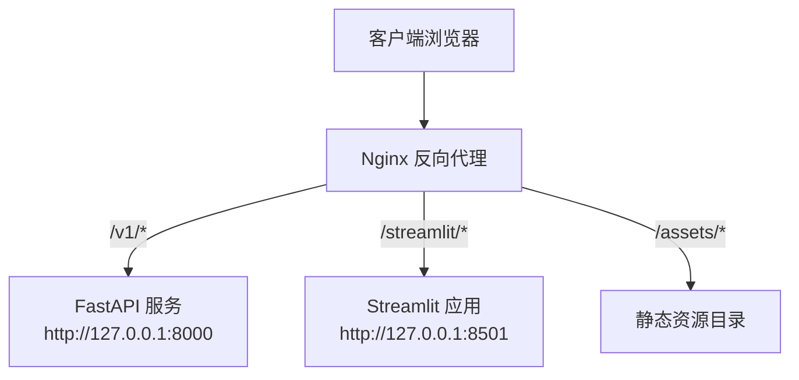
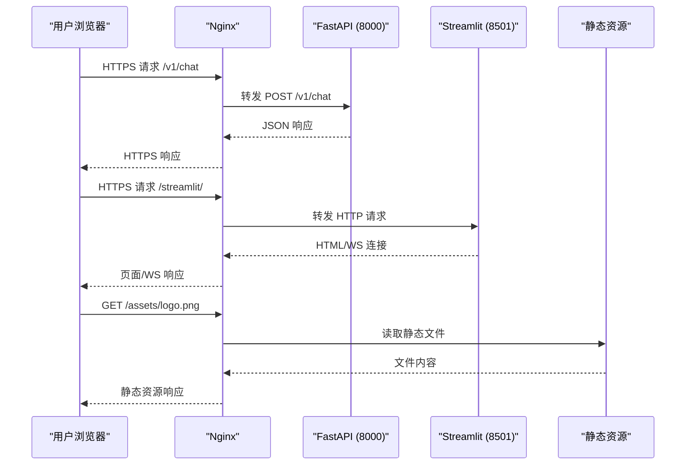
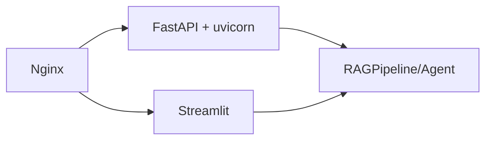

# Nginx反向代理配置

<cite>
**本文引用的文件**
- [api.py](file://api.py)
- [app.py](file://app.py)
- [config.py](file://config.py)
- [README.md](file://README.md)
- [requirements.txt](file://requirements.txt)
</cite>

## 目录
1. [简介](#简介)
2. [项目结构](#项目结构)
3. [核心组件](#核心组件)
4. [架构总览](#架构总览)
5. [详细组件分析](#详细组件分析)
6. [依赖关系分析](#依赖关系分析)
7. [性能与缓存策略](#性能与缓存策略)
8. [故障排查指南](#故障排查指南)
9. [结论](#结论)
10. [附录：完整Nginx配置示例与最佳实践](#附录完整nginx配置示例与最佳实践)

## 简介
本文件面向生产部署，提供基于Nginx的反向代理配置方案，覆盖以下目标：
- 将FastAPI（REST API）和Streamlit（Web UI）统一暴露到公网域名
- 支持WebSocket（用于流式交互场景）
- 静态资源服务与合理的缓存策略
- HTTPS强制重定向与Let's Encrypt自动续期
- 负载均衡、请求限流与安全头设置
- 给出可直接落地的nginx.conf示例与最佳实践

说明：
- FastAPI服务监听本地端口（默认8000），通过Nginx对外暴露
- Streamlit应用以单页形式运行，建议通过Nginx代理其WSGI/HTTP入口
- 文档中的路径、端口、域名等均为占位符，请根据实际环境替换

## 项目结构
本项目包含两个对外服务：
- FastAPI REST API：提供知识库管理、文档上传、入库与问答接口
- Streamlit Web界面：提供多知识库管理、文档上传、后台索引与流式聊天



**图示来源**
- [api.py:1-204](file://api.py#L1-L204)
- [app.py:1-342](file://app.py#L1-L342)
- [README.md:25-65](file://README.md#L25-L65)

**章节来源**
- [README.md:25-65](file://README.md#L25-L65)
- [api.py:1-204](file://api.py#L1-L204)
- [app.py:1-342](file://app.py#L1-L342)

## 核心组件
- FastAPI服务层
  - 路由前缀：/v1
  - 鉴权：可选Bearer Token（环境变量控制）
  - 典型接口：/health、/v1/kbs、/v1/chat、/v1/documents等
- Streamlit应用
  - 页面功能：知识库管理、文档上传、后台索引、流式聊天
  - 启动方式：streamlit run app.py（默认端口8501）
- 配置中心
  - 集中读取环境变量，便于部署时调整行为

**章节来源**
- [api.py:1-204](file://api.py#L1-L204)
- [app.py:1-342](file://app.py#L1-L342)
- [config.py:1-113](file://config.py#L1-L113)
- [README.md:25-65](file://README.md#L25-L65)

## 架构总览
Nginx作为边缘网关，负责TLS终止、安全头、限流、缓存与转发；后端由FastAPI与Streamlit组成。



**图示来源**
- [api.py:1-204](file://api.py#L1-L204)
- [app.py:1-342](file://app.py#L1-L342)
- [README.md:25-65](file://README.md#L25-L65)

## 详细组件分析

### FastAPI反向代理要点
- 路径映射：/v1/* → http://127.0.0.1:8000
- 请求体大小限制：上传文档使用multipart表单，需适当调大client_max_body_size
- 超时设置：问答可能耗时较长，需合理设置proxy_read_timeout
- 鉴权透传：可保留Authorization头至后端
- 健康检查：/health可用于探针

**章节来源**
- [api.py:98-204](file://api.py#L98-L204)
- [README.md:50-65](file://README.md#L50-L65)

### Streamlit反向代理要点
- 路径映射：/streamlit/* → http://127.0.0.1:8501
- WebSocket支持：启用upgrade与connection头透传，确保流式交互稳定
- 静态资源：若Streamlit自带静态资源，可通过alias或root指向对应目录并设置缓存头
- 会话与会话状态：注意跨域与Cookie策略

**章节来源**
- [app.py:1-342](file://app.py#L1-L342)
- [README.md:25-45](file://README.md#L25-L45)

### 静态文件服务与缓存策略
- 静态资源目录：/assets/* 可由Nginx直接提供，减少后端压力
- 缓存头：为图片、CSS、JS等设置较长的Cache-Control与Expires
- 版本化：对需要强一致的资源采用文件名哈希或查询参数版本控制

**章节来源**
- [app.py:25-48](file://app.py#L25-L48)
- [README.md:116-143](file://README.md#L116-L143)

### SSL证书与HTTPS强制重定向
- 使用Let's Encrypt自动申请与续期证书
- 所有HTTP请求301重定向到HTTPS
- 开启HSTS、CSP、X-Frame-Options等安全头

**章节来源**
- [README.md:25-65](file://README.md#L25-L65)

### 负载均衡
- 针对FastAPI与Streamlit分别定义upstream组，实现多实例轮询或加权
- 结合健康检查与失败重试策略

**章节来源**
- [api.py:1-204](file://api.py#L1-L204)
- [app.py:1-342](file://app.py#L1-L342)

### 请求限流
- 按IP或按路径限制并发与速率，防止滥用
- 对上传接口与问答接口单独设置更严格的限制

**章节来源**
- [api.py:126-160](file://api.py#L126-L160)
- [api.py:185-199](file://api.py#L185-L199)

### 安全头设置
- 推荐设置：Strict-Transport-Security、Content-Security-Policy、X-Content-Type-Options、X-Frame-Options、Referrer-Policy等
- 隐藏服务器标识与敏感头

**章节来源**
- [README.md:25-65](file://README.md#L25-L65)

## 依赖关系分析
- FastAPI依赖uvicorn作为ASGI服务器
- Streamlit依赖自身内置的WSGI/HTTP服务
- 两者均通过Nginx对外暴露，Nginx承担TLS终止、安全与流量治理



**图示来源**
- [api.py:1-204](file://api.py#L1-L204)
- [app.py:1-342](file://app.py#L1-L342)
- [requirements.txt:1-21](file://requirements.txt#L1-L21)

**章节来源**
- [requirements.txt:1-21](file://requirements.txt#L1-L21)
- [api.py:1-204](file://api.py#L1-L204)
- [app.py:1-342](file://app.py#L1-L342)

## 性能与缓存策略
- 连接复用：保持upstream长连接，减少握手开销
- 缓冲优化：合理设置proxy_buffer_size与proxy_buffers
- 压缩：启用gzip/brotli压缩文本类响应
- 缓存分层：Nginx层缓存静态资源与可缓存的只读响应；后端按需缓存热点数据
- 超时与重试：问答接口设置较长read timeout；上传接口限制最大请求体大小

[本节为通用指导，不直接分析具体文件]

## 故障排查指南
- 无法访问：检查Nginx监听端口、防火墙与域名解析
- 502/504：确认后端服务是否启动且端口正确；检查超时设置
- WebSocket断连：检查upgrade与connection头透传；确认后端WS支持
- 上传失败：检查client_max_body_size与后端接收限制
- 鉴权错误：检查Authorization头与后端Token配置

**章节来源**
- [api.py:98-204](file://api.py#L98-L204)
- [app.py:1-342](file://app.py#L1-L342)

## 结论
通过Nginx作为统一入口，可将FastAPI与Streamlit安全、稳定地暴露到公网，并提供WebSocket、静态资源、缓存、限流、安全头等关键能力。配合Let's Encrypt自动续期与HTTPS强制重定向，可满足生产环境的合规与可用性要求。

[本节为总结性内容，不直接分析具体文件]

## 附录：完整Nginx配置示例与最佳实践
以下为可直接参考的nginx.conf片段（请根据实际环境替换域名、端口、路径与证书路径）。该示例涵盖：
- HTTPS强制重定向
- Let's Encrypt证书路径
- FastAPI与Streamlit反向代理
- WebSocket支持
- 静态资源与缓存
- 请求限流与安全头
- 负载均衡upstream

```nginx
# 全局设置
user nginx;
worker_processes auto;
error_log /var/log/nginx/error.log warn;
pid /var/run/nginx.pid;

events {
    worker_connections 4096;
}

http {
    include       /etc/nginx/mime.types;
    default_type  application/octet-stream;

    log_format main '$remote_addr - $remote_user [$time_local] "$request" '
                    '$status $body_bytes_sent "$http_referer" '
                    '"$http_user_agent" "$http_x_forwarded_for"';
    access_log /var/log/nginx/access.log main;

    sendfile on;
    tcp_nopush on;
    keepalive_timeout 65;
    types_hash_max_size 2048;

    # 压缩
    gzip on;
    gzip_vary on;
    gzip_proxied any;
    gzip_comp_level 6;
    gzip_types text/plain text/css application/json application/javascript text/xml application/xml;

    # 限流
    limit_req_zone $binary_remote_addr zone=api_limit:10m rate=10r/s;
    limit_req_zone $binary_remote_addr zone=upload_limit:10m rate=2r/s;

    # 上游定义（可按需扩展为多实例）
    upstream fastapi_backend {
        server 127.0.0.1:8000;
    }
    upstream streamlit_backend {
        server 127.0.0.1:8501;
    }

    # HTTP -> HTTPS 强制重定向
    server {
        listen 80;
        server_name your.domain.com;
        return 301 https://$host$request_uri;
    }

    # HTTPS 主站点
    server {
        listen 443 ssl http2;
        server_name your.domain.com;

        # Let's Encrypt 证书路径
        ssl_certificate     /etc/letsencrypt/live/your.domain.com/fullchain.pem;
        ssl_certificate_key /etc/letsencrypt/live/your.domain.com/privkey.pem;
        ssl_protocols       TLSv1.2 TLSv1.3;
        ssl_ciphers         HIGH:!aNULL:!MD5;
        ssl_prefer_server_ciphers on;

        # HSTS
        add_header Strict-Transport-Security "max-age=63072000; includeSubDomains; preload" always;

        # 安全头
        add_header X-Content-Type-Options "nosniff" always;
        add_header X-Frame-Options "SAMEORIGIN" always;
        add_header Referrer-Policy "strict-origin-when-cross-origin" always;
        add_header Content-Security-Policy "default-src 'self'; script-src 'self' 'unsafe-inline' 'unsafe-eval'; style-src 'self' 'unsafe-inline'; img-src 'self' data:; font-src 'self' data:;" always;

        # 静态资源
        location /assets/ {
            alias /path/to/assets/;
            expires 30d;
            add_header Cache-Control "public, immutable";
            access_log off;
        }

        # FastAPI 反向代理
        location /v1/ {
            limit_req zone=api_limit burst=20 nodelay;

            proxy_pass http://fastapi_backend;
            proxy_set_header Host $host;
            proxy_set_header X-Real-IP $remote_addr;
            proxy_set_header X-Forwarded-For $proxy_add_x_forwarded_for;
            proxy_set_header X-Forwarded-Proto $scheme;
            proxy_set_header Authorization $http_authorization;

            # 超时
            proxy_connect_timeout 60s;
            proxy_send_timeout 120s;
            proxy_read_timeout 120s;

            # 缓冲
            proxy_buffer_size 16k;
            proxy_buffers 4 32k;
            proxy_busy_buffers_size 64k;
        }

        # Streamlit 反向代理（含WebSocket）
        location /streamlit/ {
            proxy_pass http://streamlit_backend;
            proxy_set_header Host $host;
            proxy_set_header X-Real-IP $remote_addr;
            proxy_set_header X-Forwarded-For $proxy_add_x_forwarded_for;
            proxy_set_header X-Forwarded-Proto $scheme;

            # WebSocket 支持
            proxy_http_version 1.1;
            proxy_set_header Upgrade $http_upgrade;
            proxy_set_header Connection "upgrade";

            # 超时
            proxy_connect_timeout 60s;
            proxy_send_timeout 300s;
            proxy_read_timeout 300s;

            # 缓冲
            proxy_buffer_size 16k;
            proxy_buffers 4 32k;
            proxy_busy_buffers_size 64k;
        }

        # 上传接口限流与大小限制
        location /v1/kbs/ {
            limit_req zone=upload_limit burst=5 nodelay;
            client_max_body_size 50m;

            proxy_pass http://fastapi_backend;
            proxy_set_header Host $host;
            proxy_set_header X-Real-IP $remote_addr;
            proxy_set_header X-Forwarded-For $proxy_add_x_forwarded_for;
            proxy_set_header X-Forwarded-Proto $scheme;
            proxy_set_header Authorization $http_authorization;

            proxy_connect_timeout 60s;
            proxy_send_timeout 120s;
            proxy_read_timeout 120s;
        }

        # 健康检查
        location /health {
            proxy_pass http://fastapi_backend;
        }
    }
}
```

最佳实践清单
- 始终使用HTTPS，并在Nginx层做TLS终止
- 对所有HTTP请求执行301重定向到HTTPS
- 为静态资源设置长期缓存与不可变头
- 对上传与问答接口分别设置独立的限流策略
- 合理设置超时与缓冲，避免慢请求拖垮进程
- 启用安全头，最小化攻击面
- 使用upstream实现多实例负载均衡与健康检查
- 定期轮换日志并监控错误率与延迟

[本节为通用指导，不直接分析具体文件]