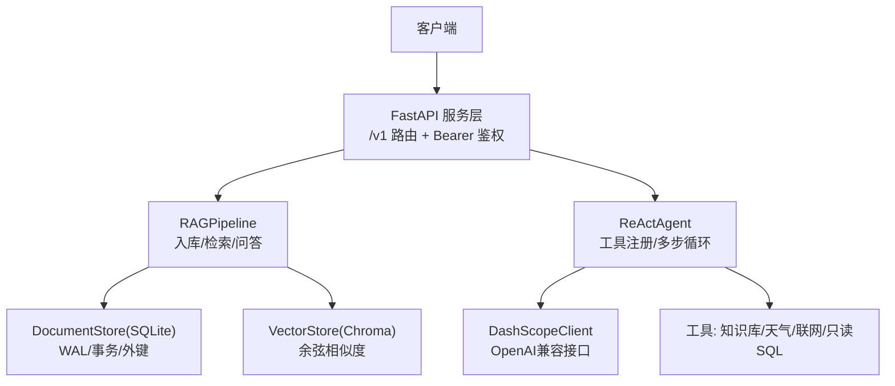
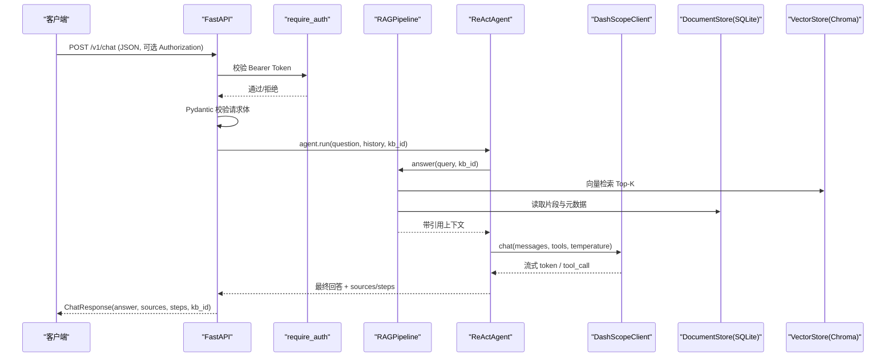
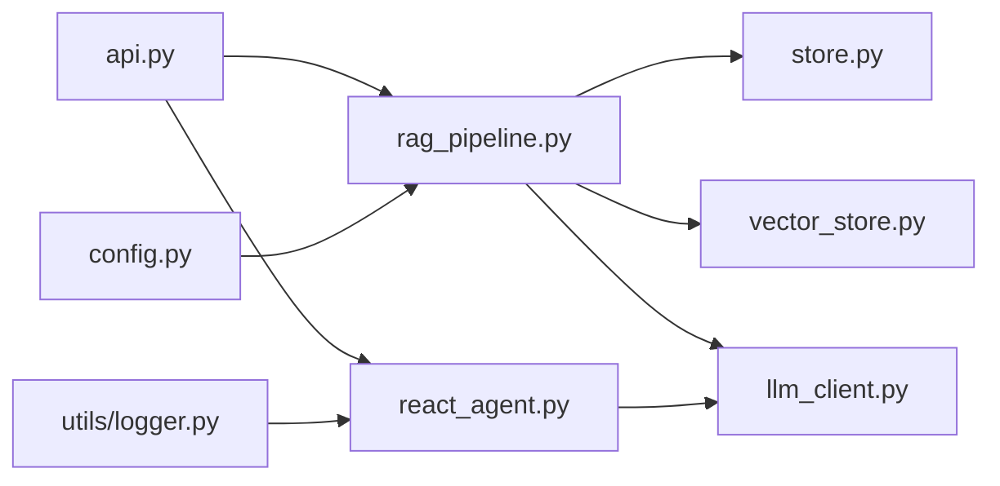

# 安全加固措施

<cite>
**本文引用的文件**
- [api.py](file://api.py)
- [config.py](file://config.py)
- [llm_client.py](file://llm_client.py)
- [rag_pipeline.py](file://rag_pipeline.py)
- [react_agent.py](file://react_agent.py)
- [store.py](file://store.py)
- [vector_store.py](file://vector_store.py)
- [utils/logger.py](file://utils/logger.py)
- [requirements.txt](file://requirements.txt)
- [pyproject.toml](file://pyproject.toml)
- [README.md](file://README.md)
</cite>

## 目录
1. [简介](#简介)
2. [项目结构](#项目结构)
3. [核心组件](#核心组件)
4. [架构总览](#架构总览)
5. [详细组件分析](#详细组件分析)
6. [依赖关系分析](#依赖关系分析)
7. [性能与安全权衡](#性能与安全权衡)
8. [故障排查指南](#故障排查指南)
9. [结论](#结论)
10. [附录](#附录)

## 简介
本文件面向“智能文档助手”项目的安全加固，覆盖以下方面：
- API 认证与授权机制（当前为可选 Bearer Token）
- 敏感信息加密与密钥管理（环境变量、最小化暴露）
- 输入验证与输出过滤（Pydantic 校验、长度限制、类型约束）
- 网络安全配置（服务绑定、反向代理建议、外部调用超时与重试）
- 访问控制与权限边界（知识库隔离、只读数据库工具、路径防穿越）
- 安全扫描与漏洞检测（CI 中的静态检查、依赖版本约束）
- 应急响应流程（错误封装、降级策略、回滚与恢复）
- 合规性与审计日志（Agent 轨迹日志、SQLite WAL、可观测性）

本项目处于阶段 A，具备基础鉴权与可观测能力；RBAC、多租户、任务队列等高级能力规划在后续阶段。

## 项目结构
- 服务层：FastAPI 提供 REST 接口，支持可选的 Bearer Token 鉴权
- RAG/Agent 核心：RAGPipeline 负责检索增强生成，ReActAgent 实现工具选择与多步推理
- 存储层：SQLite 持久化元数据，Chroma 向量库存储嵌入向量
- 配置中心：集中从环境变量读取参数，避免硬编码
- 日志与可观测：Agent 轨迹 JSONL 日志，token 估算用于上下文裁剪

图表来源
- [api.py:34-50](file://api.py#L34-L50)
- [rag_pipeline.py:196-220](file://rag_pipeline.py#L196-L220)
- [react_agent.py:144-162](file://react_agent.py#L144-L162)
- [store.py:123-138](file://store.py#L123-L138)
- [vector_store.py:38-55](file://vector_store.py#L38-L55)
- [llm_client.py:22-86](file://llm_client.py#L22-L86)

章节来源
- [api.py:1-50](file://api.py#L1-L50)
- [config.py:1-113](file://config.py#L1-L113)
- [README.md:93-171](file://README.md#L93-L171)

## 核心组件
- API 认证与授权：通过 FastAPI 的 HTTPBearer 实现可选鉴权，未设置令牌时放行（仅内网调试），生产需强制开启并配合反向代理
- 输入验证：使用 Pydantic 模型对请求体进行严格校验（长度、必填、类型）
- 输出过滤：统一错误封装 safe_error，隐藏堆栈细节，返回可读原因
- 数据存储安全：SQLite 启用 WAL、busy_timeout、外键约束；Agent 的 SQL 工具以只读模式连接并做关键字白名单校验
- 外部调用安全：LLM 客户端设置超时与重试，URL 格式校验，失败时抛出明确异常
- 日志与审计：Agent 轨迹写入 JSONL，线程安全追加，不影响主流程

章节来源
- [api.py:31-50](file://api.py#L31-L50)
- [api.py:63-87](file://api.py#L63-L87)
- [llm_client.py:297-300](file://llm_client.py#L297-L300)
- [store.py:132-138](file://store.py#L132-L138)
- [react_agent.py:443-470](file://react_agent.py#L443-L470)
- [utils/logger.py:12-45](file://utils/logger.py#L12-L45)

## 架构总览
下图展示一次受保护的聊天请求从进入 API 到返回结果的完整链路，包括鉴权、输入校验、RAG 检索、Agent 工具执行与结果封装。

图表来源
- [api.py:185-199](file://api.py#L185-L199)
- [rag_pipeline.py:590-666](file://rag_pipeline.py#L590-L666)
- [react_agent.py:250-370](file://react_agent.py#L250-L370)
- [llm_client.py:94-127](file://llm_client.py#L94-L127)
- [store.py:132-138](file://store.py#L132-L138)
- [vector_store.py:100-126](file://vector_store.py#L100-L126)

## 详细组件分析

### API 认证与授权
- 使用 FastAPI 的 HTTPBearer，auto_error=False，允许在未配置令牌时放行（便于本地调试）
- require_auth 中间件逻辑：若配置了 API_AUTH_TOKEN，则必须携带且匹配，否则返回 401
- 所有 /v1 路由均附加依赖，确保受保护
- 健康检查 /health 不鉴权，便于探针存活检测

建议
- 生产环境务必设置 API_AUTH_TOKEN，并通过反向代理强制 HTTPS、IP 白名单、速率限制
- 后续阶段引入 RBAC 与租户隔离

章节来源
- [api.py:31-50](file://api.py#L31-L50)
- [api.py:98-106](file://api.py#L98-L106)
- [api.py:103-199](file://api.py#L103-L199)

### 输入验证与输出过滤
- 请求体使用 Pydantic BaseModel 定义，包含 min_length/max_length、必填字段、默认值
- 上传文件名使用 Path(filename).name 防止路径穿越
- 错误统一通过 HTTPException 返回，异常消息经 safe_error 处理，避免泄露内部堆栈

建议
- 对 category/tags 增加白名单或正则校验
- 对历史消息 history 增加结构与长度限制，防止注入长上下文攻击

章节来源
- [api.py:63-87](file://api.py#L63-L87)
- [api.py:126-150](file://api.py#L126-L150)
- [rag_pipeline.py:260-288](file://rag_pipeline.py#L260-L288)
- [llm_client.py:297-300](file://llm_client.py#L297-L300)

### 敏感信息加密与密钥管理
- 所有密钥与端点通过环境变量加载（DASHSCOPE_API_KEY、BASE_URL、CHAT_MODEL、EMBEDDING_MODEL 等）
- 未配置密钥时显式报错，避免静默失败
- 客户端创建 OpenAI 兼容实例时校验 base_url 格式，防止误配
- 建议在生产中使用密钥管理服务（如 KMS/Secrets Manager），并在容器/主机层面限制 .env 权限

章节来源
- [llm_client.py:22-86](file://llm_client.py#L22-L86)
- [config.py:21-54](file://config.py#L21-L54)
- [config.py:89-113](file://config.py#L89-L113)

### 网络安全配置
- 服务监听 0.0.0.0:8000，生产应通过反向代理（Nginx/Traefik）暴露，并启用 TLS
- 外部网络调用（天气、联网搜索）使用 urllib 发起，设置超时与 User-Agent
- LLM 客户端设置 timeout=90.0、max_retries=2，降低雪崩风险
- 建议配置防火墙规则：仅开放必要端口，限制源 IP，启用 WAF 与请求大小限制

章节来源
- [api.py:202-204](file://api.py#L202-L204)
- [react_agent.py:373-441](file://react_agent.py#L373-L441)
- [llm_client.py:75-86](file://llm_client.py#L75-L86)

### 访问控制与权限边界
- 知识库隔离：每个知识库对应独立 Chroma collection 与 SQLite 记录，删除操作级联清理
- 只读数据库工具：Agent 的 query_database 以 sqlite3 uri mode=ro 打开，首关键字软校验（SELECT/PRAGMA/EXPLAIN/WITH）
- 路径安全：上传文件名仅取 basename，避免路径穿越
- 建议：后续加入基于角色的访问控制（RBAC）、知识库级权限、操作审计

章节来源
- [vector_store.py:50-55](file://vector_store.py#L50-L55)
- [store.py:158-210](file://store.py#L158-L210)
- [react_agent.py:443-470](file://react_agent.py#L443-L470)
- [rag_pipeline.py:260-288](file://rag_pipeline.py#L260-L288)

### 安全扫描与漏洞检测
- CI 集成 ruff 与 mypy，代码质量与类型检查纳入流水线
- 依赖版本锁定在 requirements.txt，减少供应链风险
- 建议：引入依赖漏洞扫描（如 pip-audit）、镜像扫描（Trivy）、SAST/DAST 工具链

章节来源
- [pyproject.toml:5-27](file://pyproject.toml#L5-L27)
- [requirements.txt:1-21](file://requirements.txt#L1-L21)

### 应急响应流程
- 错误封装：safe_error 将异常转为可读字符串，避免泄露内部细节
- 降级策略：当 LLM 不可用时，Agent 返回错误并完成流程；天气/联网搜索失败时提示
- 恢复与回滚：删除知识库会清理向量集合与物理文件目录；文档删除保留版本历史以便审计恢复
- 建议：建立告警与熔断机制，关键错误上报监控平台，自动触发回滚与通知

章节来源
- [llm_client.py:297-300](file://llm_client.py#L297-L300)
- [react_agent.py:373-441](file://react_agent.py#L373-L441)
- [rag_pipeline.py:239-248](file://rag_pipeline.py#L239-L248)
- [store.py:322-335](file://store.py#L322-L335)

### 合规性与审计日志
- Agent 轨迹日志：线程安全的 JSONL 追加，包含时间戳、步骤、工具、参数、观察结果、成本估算
- 日志失败不影响主流程，保证可用性
- 建议：对日志进行脱敏（去除敏感字段）、集中收集（ELK/Loki）、设置保留策略与访问控制

章节来源
- [utils/logger.py:12-45](file://utils/logger.py#L12-L45)
- [react_agent.py:506-524](file://react_agent.py#L506-L524)

## 依赖关系分析

图表来源
- [api.py:27-30](file://api.py#L27-L30)
- [rag_pipeline.py:27-38](file://rag_pipeline.py#L27-L38)
- [react_agent.py:27-29](file://react_agent.py#L27-L29)
- [config.py:89-113](file://config.py#L89-L113)
- [utils/logger.py:12-45](file://utils/logger.py#L12-L45)

章节来源
- [api.py:27-30](file://api.py#L27-L30)
- [rag_pipeline.py:27-38](file://rag_pipeline.py#L27-L38)
- [react_agent.py:27-29](file://react_agent.py#L27-L29)

## 性能与安全权衡
- 并发与一致性：SQLite 使用 WAL 与 busy_timeout，读写加锁；Chroma 批量 upsert 提升吞吐
- 上下文预算：history_max_tokens 与 rag_context_max_tokens 控制 token 用量，降低延迟与成本
- 检索阈值：relevance_threshold 与 BM25 兜底避免低相关答案
- 建议：根据负载调整 embedding_batch_size、top_k、fusion_pool；在高并发场景考虑连接池与缓存

章节来源
- [store.py:132-138](file://store.py#L132-L138)
- [vector_store.py:61-78](file://vector_store.py#L61-L78)
- [rag_pipeline.py:159-193](file://rag_pipeline.py#L159-L193)
- [rag_pipeline.py:439-523](file://rag_pipeline.py#L439-L523)
- [config.py:89-113](file://config.py#L89-L113)

## 故障排查指南
- 鉴权失败：检查 API_AUTH_TOKEN 是否设置且请求头携带正确 Bearer Token
- 模型调用失败：确认 DASHSCOPE_API_KEY、BASE_URL 格式正确；查看 safe_error 返回的原因
- 数据库问题：检查 SQLite 文件是否存在、WAL 模式是否生效；Agent SQL 工具仅允许只读语句
- 向量检索为空：检查相关性阈值、BM25 索引是否重建；确认文档已入库且 chunks 存在
- 日志缺失：确认 data/agent_trace.jsonl 路径可写；日志写入失败不会阻塞主流程

章节来源
- [api.py:42-50](file://api.py#L42-L50)
- [llm_client.py:59-86](file://llm_client.py#L59-L86)
- [react_agent.py:443-470](file://react_agent.py#L443-L470)
- [rag_pipeline.py:306-435](file://rag_pipeline.py#L306-L435)
- [utils/logger.py:12-45](file://utils/logger.py#L12-L45)

## 结论
本项目在阶段 A 实现了基础的安全能力：可选 Bearer 鉴权、严格的输入校验、统一的错误封装、只读数据库访问、外部调用超时与重试、以及线程安全的审计日志。生产部署时应结合反向代理、TLS、IP 白名单、速率限制与依赖漏洞扫描，逐步引入 RBAC、多租户与更完善的观测体系。

## 附录

### 安全加固清单（建议）
- 强制启用 API_AUTH_TOKEN，禁用无鉴权模式
- 通过反向代理启用 HTTPS、WAF、请求大小限制与速率限制
- 使用密钥管理服务托管 DASHSCOPE_API_KEY 等敏感信息
- 对 category/tags 增加白名单校验，限制上传文件类型与大小
- 启用依赖漏洞扫描与镜像扫描，定期更新依赖
- 集中收集与脱敏 Agent 轨迹日志，设置保留策略与访问控制
- 建立告警与熔断机制，关键错误自动通知与回滚

章节来源
- [README.md:144-171](file://README.md#L144-L171)
- [api.py:31-50](file://api.py#L31-L50)
- [requirements.txt:1-21](file://requirements.txt#L1-L21)
- [utils/logger.py:12-45](file://utils/logger.py#L12-L45)