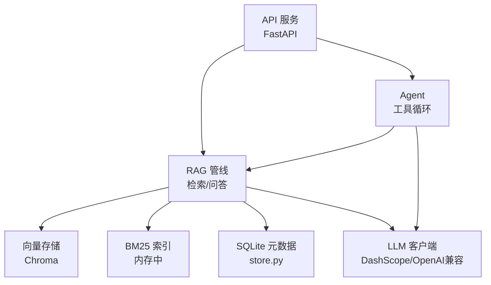
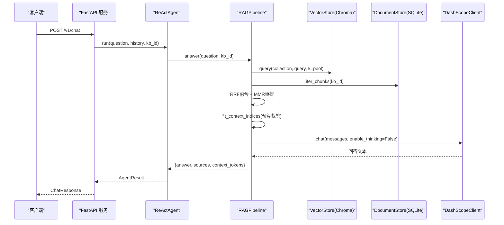
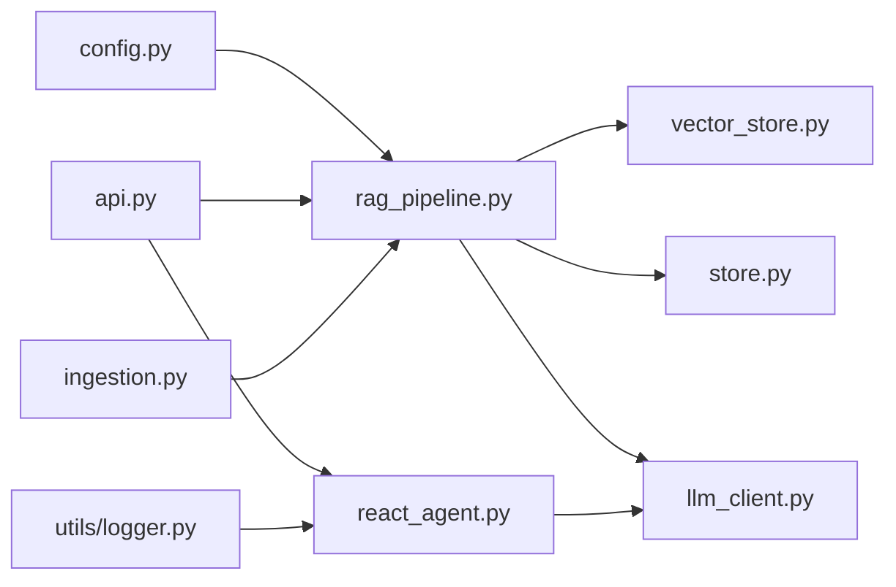

# 性能优化与调优

<cite>
**本文引用的文件**
- [config.py](file://config.py)
- [vector_store.py](file://vector_store.py)
- [store.py](file://store.py)
- [rag_pipeline.py](file://rag_pipeline.py)
- [api.py](file://api.py)
- [llm_client.py](file://llm_client.py)
- [ingestion.py](file://ingestion.py)
- [react_agent.py](file://react_agent.py)
- [utils/logger.py](file://utils/logger.py)
- [tests/test_retrieval.py](file://tests/test_retrieval.py)
- [requirements.txt](file://requirements.txt)
</cite>

## 目录
1. [简介](#简介)
2. [项目结构](#项目结构)
3. [核心组件](#核心组件)
4. [架构总览](#架构总览)
5. [详细组件分析](#详细组件分析)
6. [依赖关系分析](#依赖关系分析)
7. [性能考量](#性能考量)
8. [故障排查指南](#故障排查指南)
9. [结论](#结论)
10. [附录](#附录)

## 简介
本指南面向生产部署与压测场景，围绕数据库连接池、向量检索、内存管理、并发处理、缓存策略、查询优化、监控与瓶颈定位、负载测试以及不同硬件配置的参数建议展开。内容基于仓库现有实现进行提炼与扩展，确保可落地、可验证。

## 项目结构
系统由配置中心、文档解析与切分、SQLite 元数据存储、Chroma 向量存储、RAG 管线（混合检索+重排）、Agent（工具调用）、API 服务层、日志与估算工具组成。关键路径：
- 配置集中化：所有可调参数通过环境变量注入，便于部署期调优。
- 入库链路：上传 → 解析/切分 → 向量化 → 写入 Chroma → 更新 SQLite 片段与版本。
- 检索链路：向量检索 + BM25 词面检索 → RRF 融合 → MMR 去重 → 上下文裁剪 → LLM 生成。
- API 层：FastAPI 暴露知识库管理、文档上传、入库、问答等接口，使用进程内锁串行化写操作以保护 SQLite/Chroma。

图表来源
- [api.py:34-57](file://api.py#L34-L57)
- [rag_pipeline.py:196-219](file://rag_pipeline.py#L196-L219)
- [vector_store.py:38-55](file://vector_store.py#L38-L55)
- [store.py:123-138](file://store.py#L123-L138)
- [llm_client.py:22-86](file://llm_client.py#L22-L86)

章节来源
- [api.py:1-57](file://api.py#L1-L57)
- [rag_pipeline.py:1-40](file://rag_pipeline.py#L1-L40)

## 核心组件
- 配置中心 AppConfig：集中读取环境变量，提供 chunk_size/chunk_overlap/top_k/fusion_pool/relevance_threshold/mmr_enabled/mmr_lambda/query_rewrite_enabled/history_max_tokens/rag_context_max_tokens/agent_max_steps/embedding_batch_size 等关键调优开关。
- 向量存储 VectorStore：封装 Chroma，支持批量 upsert、按条件删除、相似度查询、取回向量用于 MMR。
- 文档存储 DocumentStore：SQLite WAL 模式 + busy_timeout，线程安全写事务，维护知识库、文档版本、片段与键值配置。
- RAGPipeline：增量入库（SHA-256 判重）、混合检索（向量+BM25→RRF→MMR）、上下文裁剪、问答。
- Agent ReActAgent：工具注册表、多步循环、流式输出；内置知识库搜索、天气、联网搜索、只读 SQL 工具。
- API 服务：REST 路由，全局 RLock 串行化写访问，可选鉴权。
- 日志与估算：AgentTraceLogger 记录轨迹；estimate_tokens 用于历史与上下文预算控制。

章节来源
- [config.py:56-113](file://config.py#L56-L113)
- [vector_store.py:38-149](file://vector_store.py#L38-L149)
- [store.py:123-138](file://store.py#L123-L138)
- [rag_pipeline.py:196-219](file://rag_pipeline.py#L196-L219)
- [react_agent.py:144-157](file://react_agent.py#L144-L157)
- [api.py:31-57](file://api.py#L31-L57)
- [utils/logger.py:12-62](file://utils/logger.py#L12-L62)

## 架构总览
下图展示一次“问答”请求的端到端流程，包括检索、重排、上下文裁剪与模型调用。

图表来源
- [api.py:185-199](file://api.py#L185-L199)
- [react_agent.py:250-270](file://react_agent.py#L250-L270)
- [rag_pipeline.py:590-666](file://rag_pipeline.py#L590-L666)
- [vector_store.py:100-126](file://vector_store.py#L100-L126)
- [store.py:425-442](file://store.py#L425-L442)
- [llm_client.py:94-127](file://llm_client.py#L94-L127)

## 详细组件分析

### 数据库连接与持久化（SQLite）
- 连接与并发：每次方法独立创建连接，写操作使用 RLock 保护；启用 WAL 模式与 busy_timeout，降低读写冲突。
- 索引与迁移：建表时定义主键/唯一约束；升级时动态补列，保证向后兼容。
- 片段写入：replace_chunks 先删后插，executemany 批量插入，减少往返开销。
- 计数与迭代：count_chunks 与 iter_chunks 提供统计与流式遍历，避免全量加载。

调优要点
- 将 db_path 指向高性能磁盘（NVMe），提升 WAL 写入吞吐。
- 在高频写入场景下，适当增大 busy_timeout，避免忙等待失败。
- 对大库定期 VACUUM 或归档旧版本，保持索引高效。

章节来源
- [store.py:123-138](file://store.py#L123-L138)
- [store.py:386-411](file://store.py#L386-L411)
- [store.py:425-448](file://store.py#L425-L448)

### 向量检索与重排（Chroma + BM25 + RRF + MMR）
- 向量检索：cosine 空间，批量 upsert，query 返回距离并转换为相似度。
- BM25 索引：内存构建，top 查询；与向量结果做 RRF 融合，兼顾语义与关键词匹配。
- MMR 重排：可选开启，平衡相关性与多样性，lambda 控制权衡。
- 阈值兜底：当向量相似度低于阈值且无 BM25 命中时直接返回空，避免无效上下文。

调优要点
- embedding_batch_size：受嵌入模型限制（默认上限 20），根据 GPU/CPU 能力调整。
- fusion_pool：增大可提升召回但增加后续计算成本；结合 top_k 控制最终上下文大小。
- relevance_threshold：过高易误杀，过低引入噪声；可按业务语料分布校准。
- mmr_lambda：高相关性优先 vs 高多样性优先，依据答案重复度观察调节。

章节来源
- [vector_store.py:38-149](file://vector_store.py#L38-L149)
- [rag_pipeline.py:439-523](file://rag_pipeline.py#L439-L523)
- [tests/test_retrieval.py:40-80](file://tests/test_retrieval.py#L40-L80)

### 上下文与历史裁剪（内存与 Token 预算）
- truncate_history：从后向前保留最近消息，避免长对话稀释注意力与浪费 token。
- fit_context_indices：按 token 预算选择上下文块，不拆分块，至少保留首块。
- estimate_tokens：轻量估算中英文混合 token，用于预算控制。

调优要点
- history_max_tokens：控制对话历史长度，避免超出模型上下文窗口。
- rag_context_max_tokens：控制检索上下文大小，减少 LLM 输入与延迟。
- 在高并发下，合理设置预算可降低峰值内存与网络传输。

章节来源
- [rag_pipeline.py:159-193](file://rag_pipeline.py#L159-L193)
- [utils/logger.py:48-62](file://utils/logger.py#L48-L62)

### 并发与缓存策略
- 进程级串行化：API 层使用全局 RLock 串行化写操作，避免 SQLite/Chroma 并发问题。
- 内存缓存：RAGPipeline 维护 _bm25 与 _chunks 字典，按 kb_id 缓存 BM25 索引与片段映射；变更时标记 stale 并在下次访问重建。
- 向量客户端重置：后台入库完成后 reset，避免索引过期导致的内存不一致。

调优要点
- 单机演示阶段可用 RLock 简化并发；生产环境应迁移到任务队列与多实例，配合外部缓存（如 Redis）共享 BM25/片段缓存。
- 对于只读热点查询，可在上层加一层查询缓存（按 kb_id+query_hash 缓存结果）。

章节来源
- [api.py:31-57](file://api.py#L31-L57)
- [rag_pipeline.py:215-219](file://rag_pipeline.py#L215-L219)
- [rag_pipeline.py:550-562](file://rag_pipeline.py#L550-L562)
- [rag_pipeline.py:720-726](file://rag_pipeline.py#L720-L726)

### 模型调用与流式输出
- DashScopeClient：统一 OpenAI 兼容接口，支持 chat/chat_raw/stream_chat/stream_chat_raw；记录 usage；异常转换。
- 流式事件：token/tool_call/done/error，便于 UI 低延迟渲染与工具调用追踪。
- 思考开关：enable_thinking 可关闭以降低首字延迟。

调优要点
- 问答场景关闭 thinking 显著降低首字延迟。
- 合理设置 timeout 与 max_retries，避免长时间阻塞。
- 流式输出可减少前端等待时间，提升用户体验。

章节来源
- [llm_client.py:22-86](file://llm_client.py#L22-L86)
- [llm_client.py:94-127](file://llm_client.py#L94-L127)
- [llm_client.py:172-201](file://llm_client.py#L172-L201)
- [llm_client.py:203-278](file://llm_client.py#L203-L278)

### 文档解析与切分
- 支持 PDF/docx/md/txt；PDF 逐页质量评估，必要时切换本地 OCR。
- 递归字符切分器：按段落/句子边界切分，保留 page 等元数据。
- 构建片段元数据：source/page/paragraph/category/tags/doc_id/kb_id，便于引用与过滤。

调优要点
- 对扫描版 PDF，OCR 会显著增加 CPU 耗时；可考虑预批处理与缓存识别结果。
- chunk_size/chunk_overlap 影响召回与上下文大小，需结合业务语料与模型上下文窗口调参。

章节来源
- [ingestion.py:24-78](file://ingestion.py#L24-L78)
- [ingestion.py:178-190](file://ingestion.py#L178-L190)
- [ingestion.py:193-216](file://ingestion.py#L193-L216)

### Agent 工具与只读 SQL
- 工具注册表：search_knowledge_base、get_weather、search_web、query_database。
- 只读 SQL：仅允许 SELECT/PRAGMA/EXPLAIN/WITH，uri mode=ro 防止写入。
- 最大步骤限制：agent_max_steps 控制工具调用轮数，避免无限循环。

调优要点
- 工具结果截断（TOOL_OBSERVATION_MAX_CHARS）防止长响应污染上下文。
- 对频繁使用的工具结果可加缓存（如城市天气），减少外部依赖延迟。

章节来源
- [react_agent.py:165-246](file://react_agent.py#L165-L246)
- [react_agent.py:443-470](file://react_agent.py#L443-L470)
- [react_agent.py:250-270](file://react_agent.py#L250-L270)

## 依赖关系分析

图表来源
- [config.py:56-113](file://config.py#L56-L113)
- [rag_pipeline.py:196-219](file://rag_pipeline.py#L196-L219)
- [vector_store.py:38-55](file://vector_store.py#L38-L55)
- [store.py:123-138](file://store.py#L123-L138)
- [llm_client.py:22-86](file://llm_client.py#L22-L86)
- [api.py:34-57](file://api.py#L34-L57)
- [react_agent.py:144-157](file://react_agent.py#L144-L157)
- [ingestion.py:24-78](file://ingestion.py#L24-L78)
- [utils/logger.py:12-45](file://utils/logger.py#L12-L45)

章节来源
- [requirements.txt:1-21](file://requirements.txt#L1-L21)

## 性能考量

### 数据库连接池配置
- 当前实现为每写操作独立连接 + RLock 串行化，适合单机演示；生产建议：
  - 使用连接池（如 SQLAlchemy 连接池）管理 SQLite 连接，设置 pool_size、max_overflow、timeout。
  - 将 WAL 文件置于高速磁盘，定期 checkpoint 减少 WAL 膨胀。
  - 对只读查询走副本或缓存，降低主库压力。

### 向量检索性能优化
- 批量嵌入：embedding_batch_size 受模型限制（默认上限 20），根据硬件能力调整。
- 融合候选池：fusion_pool 越大召回越高但计算成本上升；结合 top_k 控制最终上下文。
- MMR：仅在候选较多时开启，lambda 按相关性/多样性需求调节。
- 阈值：relevance_threshold 避免无关查询进入上下文，减少无用计算。

### 内存管理策略
- 历史与上下文裁剪：history_max_tokens 与 rag_context_max_tokens 控制内存与 token 预算。
- 缓存失效：_bm25/_chunks 按 kb_id 缓存，变更时标记 stale 并在下次访问重建，避免全量重建。
- 向量客户端重置：后台入库完成后 reset，避免索引过期导致内存不一致。

### 并发处理配置
- 进程级串行化：API 层使用 RLock 串行化写操作，避免 SQLite/Chroma 并发问题。
- 生产扩展：引入任务队列（如 Celery/RQ）与多工作进程，配合外部缓存共享状态。
- 流式输出：LLM 流式事件降低首字延迟，提高交互体验。

### 缓存策略实施
- 查询缓存：对热点 kb_id+query 组合缓存结果（TTL 可控）。
- 工具结果缓存：如天气、联网搜索结果短期缓存。
- 索引缓存：BM25 与片段映射按 kb_id 缓存，避免重复构建。

### 查询优化技巧
- 混合检索：向量+BM25→RRF→MMR，兼顾语义与关键词匹配。
- 文档限定：当问题提到特定文档或人物短名时，自动限定 doc_id，减少无关片段。
- 阈值兜底：向量与 BM25 均无命中时直接返回空，避免无效上下文。

### 性能监控工具使用
- AgentTraceLogger：记录每一步工具调用、观察与估计 token 消耗，便于离线分析。
- 日志位置：data/agent_trace.jsonl，逐行追加，单条失败不影响主流程。
- 指标采集：结合 last_usage 记录 prompt/completion/total tokens，用于成本与延迟分析。

### 瓶颈分析方法
- 端到端时序：在 API 层打点，测量入库、检索、重排、上下文裁剪、模型调用各阶段耗时。
- 向量检索：监控 Chroma 查询耗时与返回数量，调整 fusion_pool/top_k。
- 模型调用：关注超时、重试、thinking 开关对首字延迟的影响。
- 磁盘 I/O：WAL 文件增长与碎片，评估 NVMe 与定期维护。

### 负载测试脚本
- 基础压测：使用 curl 或 httpie 对 /v1/chat 发送并发请求，观察 P50/P95/P99 延迟与错误率。
- 入库压测：对 /v1/kbs/{kb_id}/documents 与 /v1/kbs/{kb_id}/ingest 进行批量上传与索引。
- 监控指标：结合 AgentTraceLogger 与 last_usage，统计 token 用量与步骤数。
- 逐步加压：从低并发开始，逐步增加并发度，观察资源占用与降级行为。

### 不同硬件配置的推荐参数
- 低配 CPU（无 GPU）：
  - embedding_batch_size=8~12，fusion_pool=8~12，top_k=3~5，mmr_enabled=false。
  - history_max_tokens=1500，rag_context_max_tokens=1500。
- 中配 CPU/GPU：
  - embedding_batch_size=12~16，fusion_pool=10~16，top_k=5~8，mmr_enabled=true，mmr_lambda=0.6~0.8。
  - history_max_tokens=2000，rag_context_max_tokens=2000。
- 高配 GPU：
  - embedding_batch_size=16~20，fusion_pool=12~20，top_k=5~10，mmr_enabled=true，mmr_lambda=0.5~0.7。
  - history_max_tokens=2500，rag_context_max_tokens=2500。
- 通用建议：
  - 问答场景关闭 enable_thinking 以降低首字延迟。
  - 对扫描版 PDF 预批处理 OCR，避免在线推理卡顿。
  - 定期清理旧版本文件与向量集合，保持索引紧凑。

## 故障排查指南
- 未配置密钥：DashScopeClient 在未设置 DASHSCOPE_API_KEY 时抛出明确错误；检查 .env 与环境变量。
- 模型调用失败：统一转换为可读错误，包含 model/base_url；检查网络与 base_url 格式。
- 向量检索为空：检查 relevance_threshold 是否过高；确认 BM25 兜底逻辑是否生效。
- 并发冲突：API 层已串行化写操作；若仍出现冲突，检查外部并发源与锁粒度。
- 日志写入失败：AgentTraceLogger 单条失败不影响主流程；检查 data/agent_trace.jsonl 权限与磁盘空间。

章节来源
- [llm_client.py:59-66](file://llm_client.py#L59-L66)
- [llm_client.py:94-127](file://llm_client.py#L94-L127)
- [rag_pipeline.py:483-503](file://rag_pipeline.py#L483-L503)
- [api.py:31-57](file://api.py#L31-L57)
- [utils/logger.py:12-45](file://utils/logger.py#L12-L45)

## 结论
本项目在配置集中化、混合检索、上下文裁剪与流式输出方面具备良好基础。生产调优应聚焦于：
- 数据库连接池与 WAL 维护；
- 向量检索参数（batch_size、fusion_pool、top_k、threshold、MMR）；
- 内存与 token 预算控制；
- 并发与缓存策略；
- 监控与压测闭环。
通过上述措施，可在不同硬件环境下获得稳定、低延迟、高可用的 RAG/Agent 服务。

## 附录
- 依赖清单：见 requirements.txt，涵盖 LangChain、Chroma、DashScope、OpenAI 兼容、FastAPI、Uvicorn、PDF/OCR 等。
- 学习指南：BM25 与混合检索、MMR 去重、相关性阈值的概念与实验建议，参见 docs/LEARNING_GUIDE.md。

章节来源
- [requirements.txt:1-21](file://requirements.txt#L1-L21)
- [docs/LEARNING_GUIDE.md:38-75](file://docs/LEARNING_GUIDE.md#L38-L75)