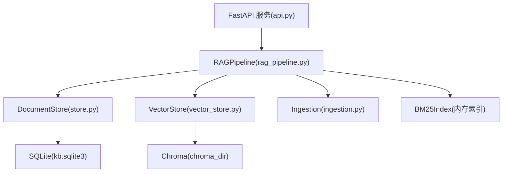
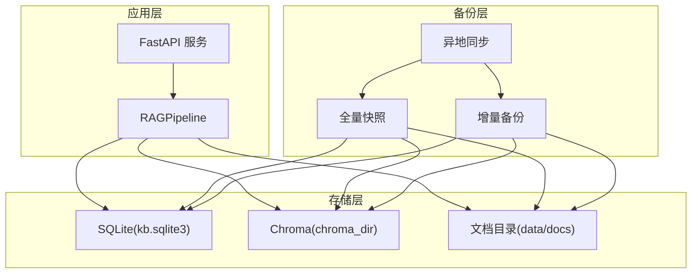
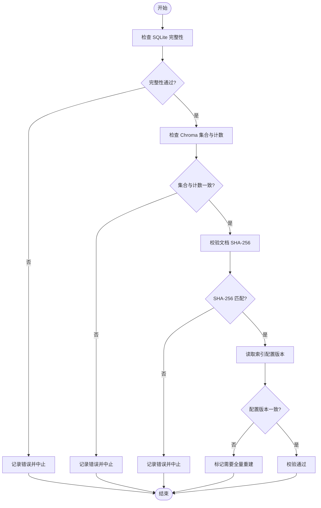
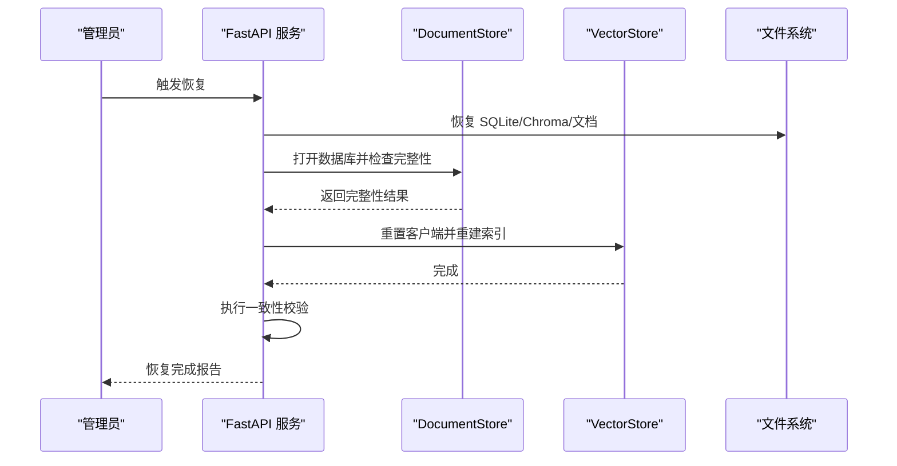

# 数据备份与恢复

<cite>
**本文引用的文件**
- [config.py](file://config.py)
- [store.py](file://store.py)
- [vector_store.py](file://vector_store.py)
- [rag_pipeline.py](file://rag_pipeline.py)
- [ingestion.py](file://ingestion.py)
- [api.py](file://api.py)
- [react_agent.py](file://react_agent.py)
- [llm_client.py](file://llm_client.py)
- [requirements.txt](file://requirements.txt)
</cite>

## 目录
1. [简介](#简介)
2. [项目结构与数据位置](#项目结构与数据位置)
3. [核心组件与数据流](#核心组件与数据流)
4. [架构总览](#架构总览)
5. [详细备份策略](#详细备份策略)
6. [增量备份与一致性校验](#增量备份与一致性校验)
7. [异地容灾配置](#异地容灾配置)
8. [数据恢复流程](#数据恢复流程)
9. [灾难恢复计划](#灾难恢复计划)
10. [备份存储优化与压缩](#备份存储优化与压缩)
11. [自动化脚本与调度](#自动化脚本与调度)
12. [故障排查指南](#故障排查指南)
13. [结论](#结论)

## 简介
本文件面向本项目的数据备份与恢复，覆盖 SQLite 元数据、ChromaDB 向量数据、文档文件的备份方案；提供自动化备份脚本设计、增量备份策略、异地容灾配置；给出数据恢复流程、灾难恢复计划与数据一致性验证方法；并包含备份存储优化与压缩建议。内容严格基于仓库现有代码与配置进行推导与落地。

## 项目结构与数据位置
- 配置集中管理路径与参数，支持通过环境变量覆盖：
  - data_dir：原始文档与知识库根目录（默认在项目根 data 下）
  - chroma_dir：Chroma 持久化目录（默认 data/chroma）
  - db_path：SQLite 数据库文件路径（默认 data/kb.sqlite3）
- 文档物理存储：
  - 每个知识库在 data/docs/{kb_id} 下按版本分目录存放，如 v1/v2…
- 向量存储：
  - Chroma 以集合为单位，命名规则为 kb_{kb_id}，余弦空间
- 元数据存储：
  - SQLite 维护知识库、文档、版本、片段、索引配置等元数据，使用 WAL 模式提升并发读写能力

**章节来源**
- [config.py:56-113](file://config.py#L56-L113)
- [rag_pipeline.py:196-219](file://rag_pipeline.py#L196-L219)
- [vector_store.py:38-55](file://vector_store.py#L38-L55)
- [store.py:31-77](file://store.py#L31-L77)

## 核心组件与数据流
- RAGPipeline：统一入口，负责知识库管理、文档上传、入库、检索与问答；内部组合 DocumentStore、VectorStore、解析器与 BM25 索引
- DocumentStore：SQLite 封装，提供知识库/文档/版本/片段/键值操作，WAL + busy_timeout 保证并发安全
- VectorStore：Chroma 封装，批量 upsert、按条件删除、相似度查询、取回向量
- Ingestion：文档解析与切分，PDF 文本质量评估与本地 OCR 兜底
- API：FastAPI 服务层，暴露知识库管理、文档上传、入库、问答接口，使用全局锁串行化访问以避免 SQLite/Chroma 并发问题

**图表来源**
- [api.py:1-204](file://api.py#L1-L204)
- [rag_pipeline.py:196-219](file://rag_pipeline.py#L196-L219)
- [store.py:123-138](file://store.py#L123-L138)
- [vector_store.py:38-55](file://vector_store.py#L38-L55)
- [ingestion.py:24-39](file://ingestion.py#L24-L39)

**章节来源**
- [api.py:1-204](file://api.py#L1-L204)
- [rag_pipeline.py:196-219](file://rag_pipeline.py#L196-L219)
- [store.py:123-138](file://store.py#L123-L138)
- [vector_store.py:38-55](file://vector_store.py#L38-L55)
- [ingestion.py:24-39](file://ingestion.py#L24-L39)

## 架构总览
下图展示备份视角下的系统架构：应用层通过 API 调用 RAGPipeline，后者协调 SQLite 与 Chroma 的读写；备份任务直接对底层数据源（SQLite 文件、Chroma 目录、文档目录）执行快照或增量复制。

[此图为概念性架构图，不直接映射具体源码文件]

## 详细备份策略
### 备份目标
- SQLite 数据库文件：kb.sqlite3（含 WAL 文件）
- Chroma 向量数据：chroma_dir（持久化客户端目录）
- 文档文件：data/docs/{kb_id}/v{version}/{filename}

### 备份类型
- 全量备份：定期完整拷贝上述三类数据
- 增量备份：仅备份自上次备份以来发生变化的文件与记录
- 归档与压缩：对备份产物进行压缩与归档，便于长期保存与传输

### 备份频率建议
- 全量备份：每日一次（低峰期）
- 增量备份：每小时或更频繁（根据写入频率调整）
- 异地同步：每次备份完成后立即触发

### 关键注意事项
- SQLite 使用 WAL 模式，备份时应确保事务一致性与 WAL 文件完整性
- Chroma 为持久化客户端，需整体拷贝其目录以保证索引一致性
- 文档目录存在多版本，增量备份应保留历史版本以便回滚

**章节来源**
- [store.py:132-138](file://store.py#L132-L138)
- [vector_store.py:45-55](file://vector_store.py#L45-L55)
- [rag_pipeline.py:260-288](file://rag_pipeline.py#L260-L288)

## 增量备份与一致性校验
### 增量策略
- 基于文件时间戳与大小变化检测变更
- 对于 SQLite，结合 WAL 文件与数据库内 indexed_sha 字段判断是否需要重新索引
- 对于 Chroma，按集合维度进行差异比对（集合名 kb_{kb_id}）
- 对于文档，按版本目录进行差异复制

### 一致性校验
- SQLite：使用 PRAGMA integrity_check 检查数据库完整性
- Chroma：通过 list_collections 与 count 核对集合数量与条目数
- 文档：计算 SHA-256 并与 store 中记录的 sha256 对比
- 索引配置：读取 meta.index_config_version，若发生变化则标记需要全量重建

[此流程图用于说明校验步骤，不直接映射具体源码文件]

**章节来源**
- [store.py:337-345](file://store.py#L337-L345)
- [rag_pipeline.py:739-752](file://rag_pipeline.py#L739-L752)
- [vector_store.py:139-148](file://vector_store.py#L139-L148)

## 异地容灾配置
### 目标
- 将备份数据同步至异地存储（对象存储或远程服务器），实现跨地域容灾
- 支持断点续传与失败重试

### 配置要点
- 使用环境变量配置异地存储连接信息（如 S3 兼容端点、密钥、桶名）
- 备份任务完成后触发同步，失败时告警并重试
- 保留多份历史备份，设置生命周期策略自动清理过期副本

### 实施建议
- 加密传输与静态加密（KMS）
- 校验和校验（SHA-256）确保数据一致性
- 监控与告警（备份成功率、延迟、容量阈值）

[本节为通用容灾建议，不直接引用具体源码文件]

## 数据恢复流程
### 恢复场景
- 单文档恢复：从版本目录恢复指定文件
- 知识库恢复：恢复 SQLite、Chroma 集合与对应文档目录
- 全系统恢复：恢复所有数据并重建索引

### 恢复步骤
1. 停止服务，避免写入冲突
2. 恢复 SQLite 文件与 WAL 文件
3. 恢复 Chroma 目录
4. 恢复文档目录
5. 启动服务，刷新缓存与索引
6. 执行一致性校验

**图表来源**
- [api.py:1-204](file://api.py#L1-L204)
- [store.py:132-138](file://store.py#L132-L138)
- [vector_store.py:57-59](file://vector_store.py#L57-L59)

**章节来源**
- [api.py:1-204](file://api.py#L1-L204)
- [store.py:132-138](file://store.py#L132-L138)
- [vector_store.py:57-59](file://vector_store.py#L57-L59)

## 灾难恢复计划
### 目标
- 定义 RTO（恢复时间目标）与 RPO（恢复点目标）
- 制定不同级别灾难的应对流程
- 明确责任人、沟通机制与演练计划

### 关键要素
- 数据分类与优先级（SQLite > Chroma > 文档）
- 恢复顺序与依赖关系
- 回滚策略与验证步骤
- 演练频率与复盘改进

[本节为通用灾难恢复建议，不直接引用具体源码文件]

## 备份存储优化与压缩
### 压缩策略
- 对备份产物进行 gzip/zstd 压缩，减少存储空间与传输成本
- 分卷压缩便于大文件传输与并行处理

### 存储优化
- 冷热分层：近期备份存于高性能介质，历史备份归档至低成本存储
- 去重与增量：利用工具实现块级去重，减少重复数据
- 生命周期管理：自动清理过期备份，释放空间

### 性能考虑
- 压缩算法选择权衡 CPU 与压缩率
- 并行压缩与解压提升吞吐
- 网络带宽与 I/O 瓶颈监控

[本节为通用优化建议，不直接引用具体源码文件]

## 自动化脚本与调度
### 脚本设计
- 全量备份脚本：拷贝 SQLite、Chroma、文档目录，生成校验和与日志
- 增量备份脚本：检测变更并复制新/修改文件，更新增量清单
- 同步脚本：将备份上传至异地存储，支持断点续传
- 恢复脚本：按恢复目标执行数据还原与索引重建

### 调度方式
- 使用 cron/systemd timer 定时执行备份任务
- 事件驱动：文档上传或入库完成后触发增量备份
- 监控与告警：备份成功/失败通知，异常自动重试

### 集成点
- 读取 config.py 中的路径配置
- 调用 store.py 与 vector_store.py 提供的状态接口进行一致性检查
- 与 api.py 的服务启停配合，避免写入冲突

**章节来源**
- [config.py:56-113](file://config.py#L56-L113)
- [store.py:132-138](file://store.py#L132-L138)
- [vector_store.py:139-148](file://vector_store.py#L139-L148)
- [api.py:1-204](file://api.py#L1-L204)

## 故障排查指南
### 常见问题
- SQLite 损坏：使用 PRAGMA integrity_check 诊断，必要时从备份恢复
- Chroma 索引不一致：重建集合或重置客户端
- 文档缺失：检查版本目录与 store 中 file_path 是否一致
- 索引配置变更：根据 index_config_version 触发全量重建

### 排查步骤
1. 检查服务日志与备份日志
2. 验证数据完整性与一致性
3. 逐步恢复并测试功能
4. 定位根因并修复

**章节来源**
- [store.py:132-138](file://store.py#L132-L138)
- [vector_store.py:57-59](file://vector_store.py#L57-L59)
- [rag_pipeline.py:739-752](file://rag_pipeline.py#L739-L752)

## 结论
本项目采用 SQLite 与 Chroma 双存储架构，具备完善的元数据管理与向量检索能力。通过全量与增量备份、异地容灾、一致性校验与自动化调度，可实现高可靠的数据保护与快速恢复。建议在生产环境部署前完善监控告警与演练机制，确保业务连续性。