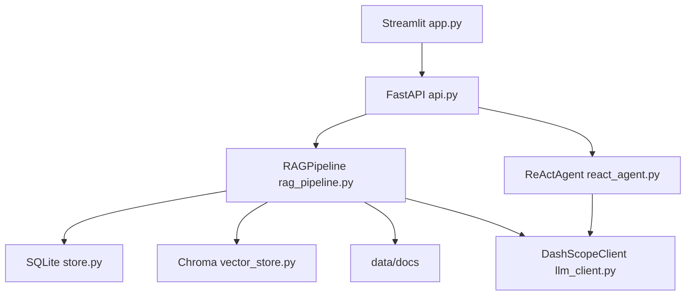
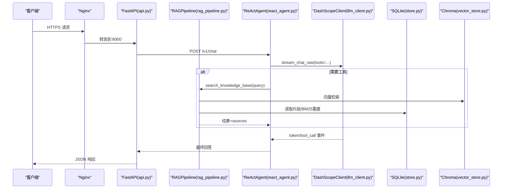
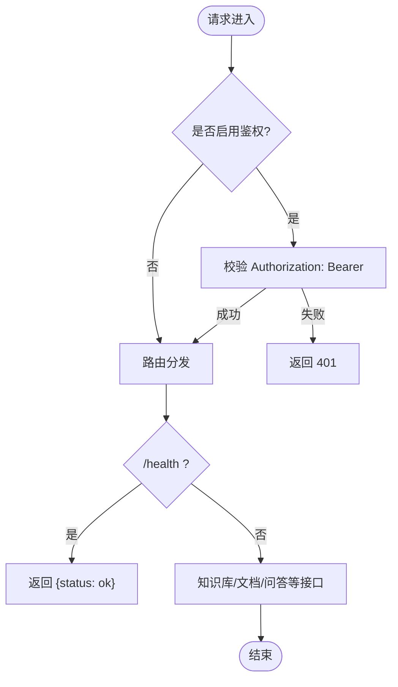
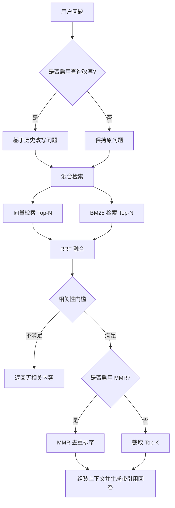
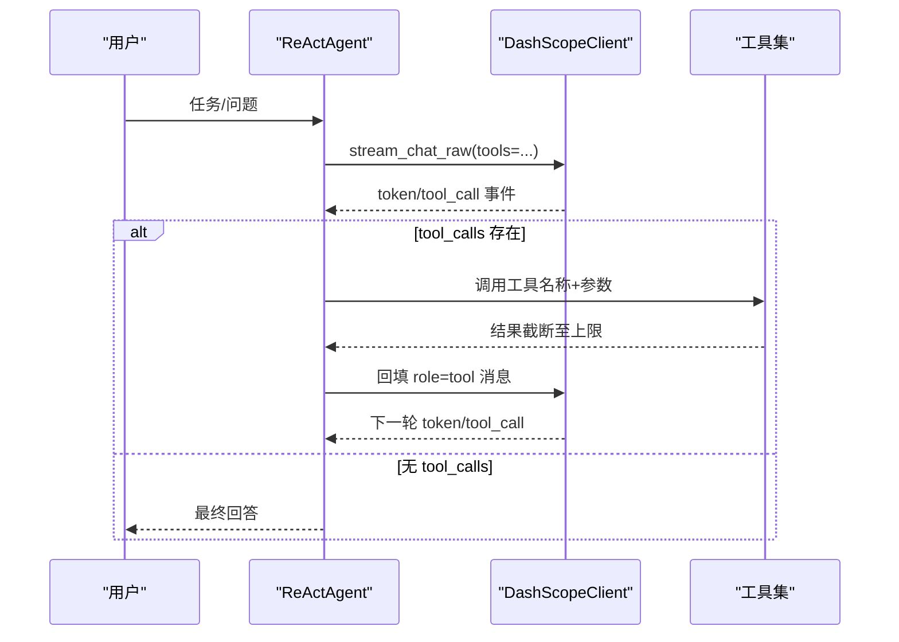
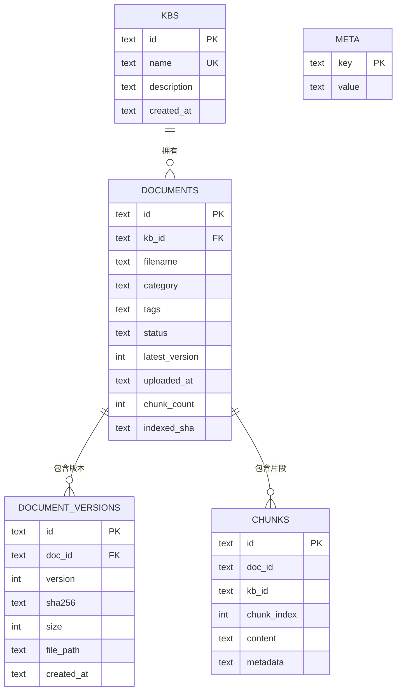
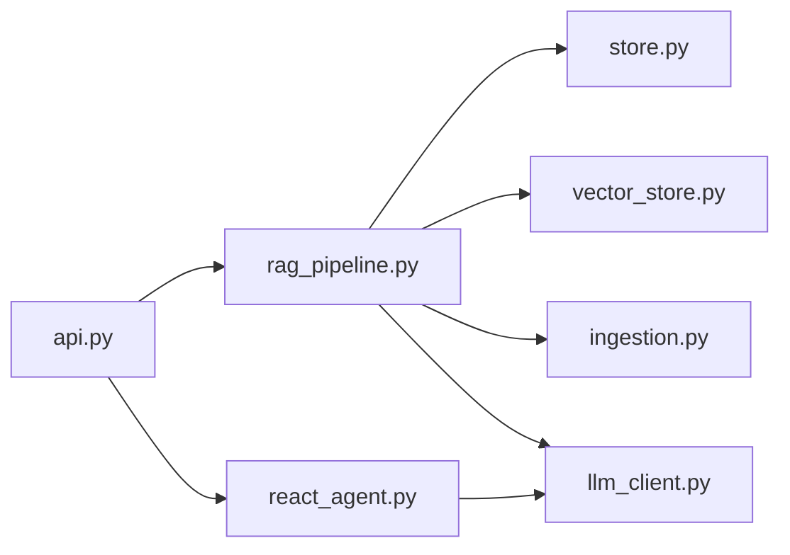

# 生产环境部署

<cite>
**本文引用的文件**
- [README.md](file://README.md)
- [api.py](file://api.py)
- [app.py](file://app.py)
- [config.py](file://config.py)
- [rag_pipeline.py](file://rag_pipeline.py)
- [store.py](file://store.py)
- [vector_store.py](file://vector_store.py)
- [ingestion.py](file://ingestion.py)
- [react_agent.py](file://react_agent.py)
- [llm_client.py](file://llm_client.py)
- [utils/logger.py](file://utils/logger.py)
- [requirements.txt](file://requirements.txt)
- [pyproject.toml](file://pyproject.toml)
- [.github/workflows/ci.yml](file://.github/workflows/ci.yml)
- [docs/ARCHITECTURE.md](file://docs/ARCHITECTURE.md)
</cite>

## 目录
1. [简介](#简介)
2. [项目结构](#项目结构)
3. [核心组件](#核心组件)
4. [架构总览](#架构总览)
5. [详细组件分析](#详细组件分析)
6. [依赖关系分析](#依赖关系分析)
7. [性能调优](#性能调优)
8. [安全加固](#安全加固)
9. [容器化与编排](#容器化与编排)
10. [反向代理与负载均衡（Nginx）](#反向代理与负载均衡nginx)
11. [进程管理与日志轮转](#进程管理与日志轮转)
12. [数据备份策略](#数据备份策略)
13. [云平台部署模板与自动化脚本](#云平台部署模板与自动化脚本)
14. [故障排查指南](#故障排查指南)
15. [结论](#结论)

## 简介
本文件面向生产环境，提供该 RAG + Agent 项目的完整部署方案。内容涵盖：Docker 容器化、docker-compose 编排、Nginx 反向代理与 SSL、systemd/gunicorn 进程管理、日志轮转、性能调优、安全加固、数据备份、以及主流云平台的部署模板与自动化脚本。文档以代码仓库中的实际实现为依据，确保可落地、可运维。

## 项目结构
- 应用入口
  - Streamlit 界面：app.py
  - FastAPI REST API：api.py（含 Bearer Token 鉴权）
- 核心逻辑
  - RAG 管线：rag_pipeline.py（入库、检索、问答）
  - Agent：react_agent.py（Function Calling、多步循环、流式事件）
  - LLM 客户端：llm_client.py（DashScope OpenAI 兼容接口）
- 数据存储
  - SQLite 元数据：store.py（WAL 模式、版本化、片段存储）
  - Chroma 向量库：vector_store.py（按知识库 collection）
  - 文档物理文件：data/docs/<kb_id>/<doc_id>/v<version>/...
- 配置与环境
  - 集中配置：config.py（全部通过环境变量覆盖）
  - 依赖：requirements.txt、pyproject.toml
- 工程化
  - CI：.github/workflows/ci.yml
  - 架构说明：docs/ARCHITECTURE.md

**图示来源**
- [app.py:1-352](file://app.py#L1-L352)
- [api.py:1-204](file://api.py#L1-L204)
- [rag_pipeline.py:1-792](file://rag_pipeline.py#L1-L792)
- [react_agent.py:1-567](file://react_agent.py#L1-L567)
- [store.py:1-470](file://store.py#L1-L470)
- [vector_store.py:1-255](file://vector_store.py#L1-L255)
- [llm_client.py:1-322](file://llm_client.py#L1-L322)

**章节来源**
- [README.md:1-171](file://README.md#L1-L171)
- [docs/ARCHITECTURE.md:1-200](file://docs/ARCHITECTURE.md#L1-L200)

## 核心组件
- 配置中心：AppConfig 从环境变量加载所有运行参数，冻结 dataclass，避免运行时修改。关键路径与阈值均可调。
- 服务层：FastAPI 暴露 /v1/* 接口，支持可选 Bearer Token 鉴权；健康检查 /health。
- RAG 管线：增量入库（SHA-256 判重）、混合检索（向量+BM25，RRF融合，MMR去重）、查询改写、带引用回答。
- Agent：工具注册表（知识库、天气、联网搜索、只读数据库），Function Calling 多步循环，流式事件输出。
- 存储：SQLite WAL 模式保证并发读写；Chroma 按知识库隔离 collection；文档版本化保存。
- LLM 客户端：DashScope OpenAI 兼容接口，统一封装 chat/chat_raw/stream_chat/embeddings/web_search。

**章节来源**
- [config.py:1-113](file://config.py#L1-L113)
- [api.py:1-204](file://api.py#L1-L204)
- [rag_pipeline.py:1-792](file://rag_pipeline.py#L1-L792)
- [react_agent.py:1-567](file://react_agent.py#L1-L567)
- [store.py:1-470](file://store.py#L1-L470)
- [vector_store.py:1-255](file://vector_store.py#L1-L255)
- [llm_client.py:1-322](file://llm_client.py#L1-L322)

## 架构总览
系统由 UI、API、RAG、Agent、LLM 客户端、SQLite、Chroma、文件系统组成。API 作为对外入口，内部调用 RAG 与 Agent；RAG 负责检索与问答，Agent 负责工具调度；两者均依赖 LLM 客户端；数据落盘在 SQLite 与 Chroma，原始文档保存在磁盘。

**图示来源**
- [api.py:185-199](file://api.py#L185-L199)
- [react_agent.py:272-369](file://react_agent.py#L272-L369)
- [rag_pipeline.py:439-523](file://rag_pipeline.py#L439-L523)
- [vector_store.py:100-126](file://vector_store.py#L100-L126)
- [store.py:123-138](file://store.py#L123-L138)
- [llm_client.py:203-278](file://llm_client.py#L203-L278)

## 详细组件分析

### FastAPI 服务层（api.py）
- 路由前缀 /v1，JSON 输入输出，支持知识库管理、文档上传、入库与问答。
- 可选 Bearer Token 鉴权：未设置 API_AUTH_TOKEN 时放行（仅建议本机/内网调试）。
- 使用全局锁串行化读写，避免 SQLite/Chroma 并发问题。
- 健康检查 /health。

**图示来源**
- [api.py:31-50](file://api.py#L31-L50)
- [api.py:98-100](file://api.py#L98-L100)
- [api.py:103-199](file://api.py#L103-L199)

**章节来源**
- [api.py:1-204](file://api.py#L1-L204)

### RAG 管线（rag_pipeline.py）
- 增量入库：SHA-256 判重，索引配置变化触发全量重建。
- 混合检索：向量 Top-N + BM25 Top-N → RRF 融合 → MMR 去重（可选）→ Top-K。
- 相关性门槛：向量与 BM25 均未命中则视为无相关内容。
- 查询改写：多轮对话时先改写追问题，提升召回质量。
- 带引用回答：上下文组装后生成答案，附带来源片段与得分。

**图示来源**
- [rag_pipeline.py:306-435](file://rag_pipeline.py#L306-L435)
- [rag_pipeline.py:439-523](file://rag_pipeline.py#L439-L523)
- [rag_pipeline.py:566-696](file://rag_pipeline.py#L566-L696)

**章节来源**
- [rag_pipeline.py:1-792](file://rag_pipeline.py#L1-L792)

### Agent（react_agent.py）
- 工具注册表：知识库检索、天气、联网搜索、只读数据库查询。
- Function Calling：LLM 自主选择工具，多步循环执行，直到给出最终回答或达到最大轮数。
- 流式事件：tool_start/tool_end/step/token/done/error，便于 UI 实时渲染。

**图示来源**
- [react_agent.py:165-246](file://react_agent.py#L165-L246)
- [react_agent.py:272-369](file://react_agent.py#L272-L369)
- [llm_client.py:203-278](file://llm_client.py#L203-L278)

**章节来源**
- [react_agent.py:1-567](file://react_agent.py#L1-L567)

### 存储与向量（store.py, vector_store.py）
- SQLite：WAL 模式、busy_timeout、外键约束；五张表（kbs/documents/document_versions/chunks/meta）。
- Chroma：每个知识库一个 collection，余弦空间；批量 upsert、按 where 删除、取回向量用于 MMR。

**图示来源**
- [store.py:31-77](file://store.py#L31-L77)
- [store.py:123-138](file://store.py#L123-L138)
- [vector_store.py:38-59](file://vector_store.py#L38-L59)

**章节来源**
- [store.py:1-470](file://store.py#L1-L470)
- [vector_store.py:1-255](file://vector_store.py#L1-L255)

### 文档解析与切分（ingestion.py）
- 支持 PDF/Word/Markdown/TXT；PDF 文本质量检测，低于阈值自动切换本地 OCR（PyMuPDF + RapidOCR）。
- 递归字符切分，保留 page/paragraph 等元数据，便于引用定位。

**章节来源**
- [ingestion.py:1-216](file://ingestion.py#L1-L216)

## 依赖关系分析
- 外部依赖：DashScope（聊天/Embedding/联网搜索）、Open-Meteo（天气）、Chroma、SQLite、pypdf/docx2txt/pymupdf/rapidocr/onnxruntime、jieba/rank-bm25 等。
- 内部耦合：api.py 依赖 rag_pipeline.py 与 react_agent.py；rag_pipeline.py 依赖 store.py、vector_store.py、ingestion.py、llm_client.py；react_agent.py 依赖 llm_client.py 与 rag_pipeline.py。

**图示来源**
- [api.py:1-204](file://api.py#L1-L204)
- [rag_pipeline.py:1-792](file://rag_pipeline.py#L1-L792)
- [react_agent.py:1-567](file://react_agent.py#L1-L567)
- [store.py:1-470](file://store.py#L1-L470)
- [vector_store.py:1-255](file://vector_store.py#L1-L255)
- [ingestion.py:1-216](file://ingestion.py#L1-L216)
- [llm_client.py:1-322](file://llm_client.py#L1-L322)

**章节来源**
- [requirements.txt:1-21](file://requirements.txt#L1-L21)
- [pyproject.toml:1-41](file://pyproject.toml#L1-L41)

## 性能调优
- 检索与上下文预算
  - HISTORY_MAX_TOKENS：控制历史长度，避免注意力稀释。
  - RAG_CONTEXT_MAX_TOKENS：裁剪检索片段，控制上下文大小。
  - RETRIEVAL_TOP_K、RETRIEVAL_FUSION_POOL：平衡召回与计算开销。
  - RETRIEVAL_RELEVANCE_THRESHOLD：过滤低相关结果，降低幻觉。
  - RETRIEVAL_MMR_ENABLED/MMR_LAMBDA：开启去重，提升多样性。
- 向量化批处理
  - EMBEDDING_BATCH_SIZE：默认 16，钳制到 ≤20，避免 DashScope 限制报错。
- 模型调用
  - DASHSCOPE_CHAT_MODEL/DASHSCOPE_EMBEDDING_MODEL：选择合适模型。
  - DASHSCOPE_BASE_URL：指向私有 MaaS 或公共端点。
  - DASHSCOPE_ENABLE_THINKING：关闭思考过程可降低首字延迟。
- 存储与并发
  - SQLite WAL + busy_timeout：提高并发读能力。
  - Chroma cosine 空间：适合语义相似度。
- 日志与追踪
  - utils/logger.py：线程安全的 JSONL 轨迹日志，不影响主流程。

**章节来源**
- [config.py:56-113](file://config.py#L56-L113)
- [rag_pipeline.py:159-193](file://rag_pipeline.py#L159-L193)
- [rag_pipeline.py:439-523](file://rag_pipeline.py#L439-L523)
- [vector_store.py:38-59](file://vector_store.py#L38-L59)
- [store.py:123-138](file://store.py#L123-L138)
- [utils/logger.py:1-76](file://utils/logger.py#L1-L76)

## 安全加固
- 鉴权
  - 设置 API_AUTH_TOKEN 启用 Bearer Token 鉴权；未设置时开放访问（仅建议本机/内网调试）。
- 网络与传输
  - 通过 Nginx 终止 TLS，强制 HTTPS；配置 HSTS、安全头。
- 最小权限
  - 容器以非 root 用户运行；只挂载必要目录（data、assets）。
  - 数据库只读工具（Agent 的 SQL 工具仅允许 SELECT/PRAGMA/EXPLAIN/WITH）。
- 敏感信息
  - 密钥通过环境变量注入（DASHSCOPE_API_KEY、API_AUTH_TOKEN），不写入镜像。
- 输入校验
  - FastAPI Pydantic 模型校验；文件类型白名单；路径防穿越。
- 审计与观测
  - Agent 轨迹日志（data/agent_trace.jsonl）；健康检查 /health。

**章节来源**
- [api.py:31-50](file://api.py#L31-L50)
- [react_agent.py:443-470](file://react_agent.py#L443-L470)
- [llm_client.py:59-66](file://llm_client.py#L59-L66)
- [utils/logger.py:12-45](file://utils/logger.py#L12-L45)

## 容器化与编排
- 基础镜像
  - Python 3.10+；安装系统依赖（如 OCR 所需 ONNXRuntime 依赖）。
- 构建步骤
  - 复制 requirements.txt 并 pip install；复制源码；设置工作目录。
- 运行命令
  - API：uvicorn api:app --host 0.0.0.0 --port 8000
  - Streamlit：streamlit run app.py（如需）
- 环境变量
  - DASHSCOPE_API_KEY、DASHSCOPE_BASE_URL、DASHSCOPE_CHAT_MODEL、DASHSCOPE_EMBEDDING_MODEL、API_AUTH_TOKEN、CHUNK_SIZE、CHUNK_OVERLAP、RETRIEVAL_TOP_K、RETRIEVAL_FUSION_POOL、RETRIEVAL_RELEVANCE_THRESHOLD、RETRIEVAL_MMR_ENABLED、RETRIEVAL_MMR_LAMBDA、QUERY_REWRITE_ENABLED、HISTORY_MAX_TOKENS、RAG_CONTEXT_MAX_TOKENS、AGENT_MAX_STEPS、EMBEDDING_BATCH_SIZE、LOGO_PATH、CHROMA_DIR、KB_DB_PATH。
- 数据持久化
  - 挂载 data/ 目录（SQLite、Chroma、文档文件、日志）。
- docker-compose 建议
  - 定义 api 服务（端口 8000）、可选 streamlit 服务（端口 8501）、Nginx 服务（端口 443/80）。
  - 使用 volumes 挂载 data/ 与 assets/。
  - 使用 secrets 或环境变量注入密钥。
  - 添加 healthcheck 与 restart policy。

[本节为通用部署指导，不直接分析具体文件]

## 反向代理与负载均衡（Nginx）
- 反向代理
  - 将 /v1/* 与 /chat 等路径转发到后端 FastAPI 8000 端口。
  - 静态资源（assets/logo.png）可直接由 Nginx 提供。
- SSL 证书
  - 使用 Let’s Encrypt 或自有证书；配置 ssl_certificate 与 ssl_certificate_key。
  - 启用 HSTS、TLS1.2+、推荐套件。
- 负载均衡
  - 多实例 FastAPI 通过 upstream 池；根据 CPU/内存与连接数调整 worker 数量。
  - 会话亲和：若需粘性会话，可使用 ip_hash；本项目无状态，无需粘性。
- 限流与安全
  - 限制请求速率；屏蔽恶意 UA；启用访问日志与错误日志。
- 健康检查
  - 对 /health 进行上游健康检查，剔除异常节点。

[本节为通用配置指导，不直接分析具体文件]

## 进程管理与日志轮转
- systemd 单元
  - 定义 ExecStart 启动 uvicorn 或 gunicorn；指定 User/Group、WorkingDirectory、EnvironmentFile。
  - Restart=always；RestartSec；LimitNOFILE；LimitNPROC。
- Gunicorn 配置（可选）
  - workers、threads、timeout、accesslog、errorlog、preload-app。
- 日志轮转
  - 使用 logrotate 管理 access.log、error.log、agent_trace.jsonl。
  - 压缩旧日志、保留周期、按大小/时间切割。
- 监控与告警
  - 结合 Prometheus/Grafana 或云监控采集指标；对 /health 做存活探测。

[本节为通用运维指导，不直接分析具体文件]

## 数据备份策略
- 备份范围
  - SQLite 文件：data/kb.sqlite3（WAL 模式，建议在空闲时段或使用一致性快照）。
  - Chroma 目录：data/chroma/（按知识库 collection 组织）。
  - 文档文件：data/docs/<kb_id>/<doc_id>/v<version>/...
  - 日志：data/agent_trace.jsonl（可选）。
- 备份方式
  - 定时快照（云盘快照/对象存储同步）。
  - 增量备份：基于文件变更时间戳或哈希。
- 恢复演练
  - 定期验证备份可恢复；记录恢复时间与步骤。
- 多副本与异地容灾
  - 跨可用区/跨区域复制；加密存储。

[本节为通用备份指导，不直接分析具体文件]

## 云平台部署模板与自动化脚本
- 阿里云
  - 使用 ACK（Kubernetes）部署 api 与 streamlit；Nginx Ingress 暴露 HTTPS；使用 ConfigMap/Secret 注入环境变量；PVC 持久化 data/。
  - 使用流水线（CI/CD）构建镜像并推送镜像仓库；滚动更新。
- AWS
  - ECS/Fargate 或 EKS；ALB/NLB 暴露服务；S3 持久化（或 EFS）；SSM Parameter Store 管理密钥。
- 腾讯云
  - TKE（Kubernetes）；CLB 暴露；COS 持久化；CAM 权限最小化。
- 自动化脚本
  - 一键部署脚本：拉取代码、构建镜像、创建命名空间、部署 Deployment/Service/Ingress、配置 Secret/ConfigMap。
  - 健康检查与自愈：探针 + 自动重启。
  - 灰度发布：蓝绿/金丝雀；流量切换与回滚。

[本节为通用云平台指导，不直接分析具体文件]

## 故障排查指南
- 无法连接 LLM
  - 检查 DASHSCOPE_API_KEY、DASHSCOPE_BASE_URL、网络连通性；查看 llm_client.py 的错误封装。
- 入库失败
  - 检查 PDF 解析与 OCR 依赖（pymupdf、rapidocr、onnxruntime）；查看 ingestion.py 的错误提示。
- 检索结果为空
  - 检查 RETRIEVAL_RELEVANCE_THRESHOLD、RETRIEVAL_TOP_K、RETRIEVAL_FUSION_POOL；确认已执行 ingest。
- 并发冲突
  - SQLite busy_timeout 与 WAL 模式；必要时减少并发或迁移到 PostgreSQL（阶段 B）。
- 日志定位
  - 查看 agent_trace.jsonl；检查 Nginx 访问/错误日志；FastAPI errorlog。

**章节来源**
- [llm_client.py:59-66](file://llm_client.py#L59-L66)
- [ingestion.py:40-78](file://ingestion.py#L40-L78)
- [store.py:123-138](file://store.py#L123-L138)
- [utils/logger.py:12-45](file://utils/logger.py#L12-L45)

## 结论
本部署文档基于仓库实际实现，提供了从容器化、反向代理、进程管理、日志轮转到性能调优、安全加固、数据备份与云平台模板的全链路方案。建议在生产环境优先启用鉴权与 HTTPS，合理配置检索与上下文预算，建立完善的备份与监控体系，并通过 CI/CD 实现自动化发布与回滚。