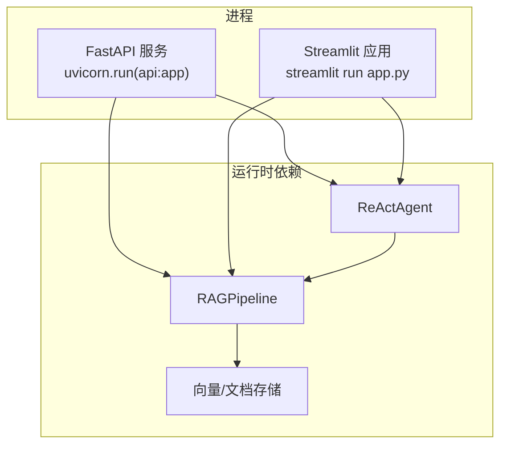
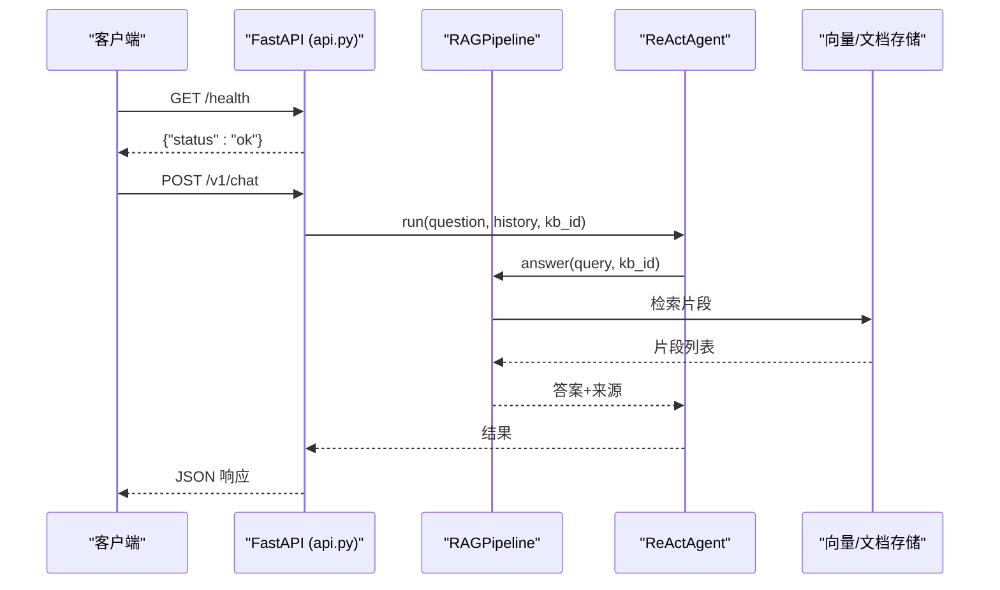
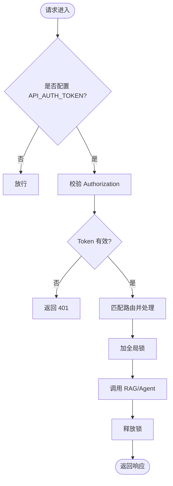
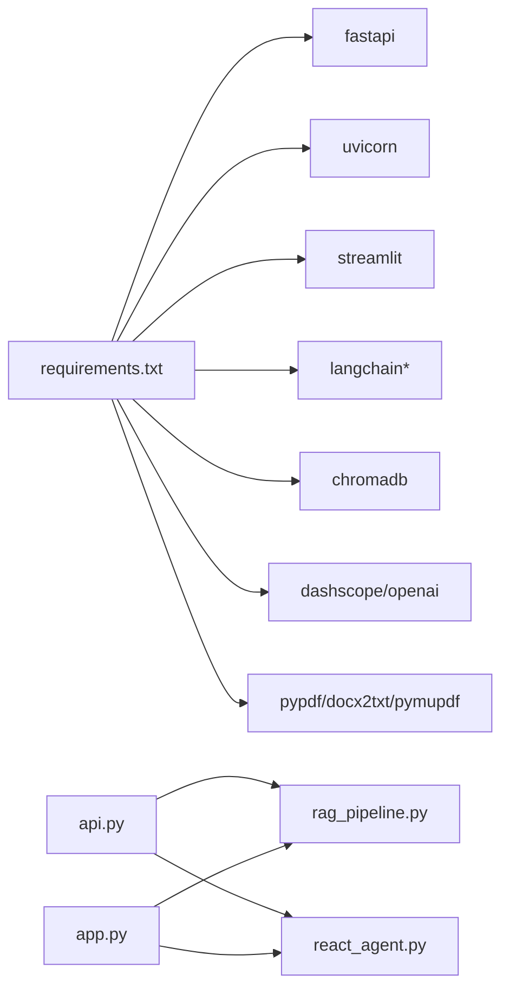

# 进程管理与监控

<cite>
**本文引用的文件**
- [api.py](file://api.py)
- [app.py](file://app.py)
- [config.py](file://config.py)
- [rag_pipeline.py](file://rag_pipeline.py)
- [react_agent.py](file://react_agent.py)
- [utils/logger.py](file://utils/logger.py)
- [requirements.txt](file://requirements.txt)
- [README.md](file://README.md)
</cite>

## 目录
1. [简介](#简介)
2. [项目结构](#项目结构)
3. [核心组件](#核心组件)
4. [架构总览](#架构总览)
5. [详细组件分析](#详细组件分析)
6. [依赖关系分析](#依赖关系分析)
7. [性能与调优](#性能与调优)
8. [日志与错误追踪](#日志与错误追踪)
9. [监控、指标与健康检查](#监控指标与健康检查)
10. [部署与进程管理](#部署与进程管理)
11. [故障排查指南](#故障排查指南)
12. [结论](#结论)

## 简介
本文件面向生产化部署，提供基于 systemd 或 supervisor 的进程管理方案，覆盖 FastAPI 服务（api.py）与 Streamlit 应用（app.py）的启动、守护、重启策略；给出 Gunicorn + Uvicorn 工作进程配置建议与性能调优参数；说明日志轮转、错误追踪集成；补充 Prometheus 指标暴露思路、健康检查端点配置；并提供监控告警规则建议与性能基准测试方法。内容严格基于仓库现有代码与配置项进行推导与落地指导。

## 项目结构
本项目包含两个可独立运行的入口：
- FastAPI REST API：通过 uvicorn 运行 api:app，暴露 /v1/* 接口与 /health 健康检查
- Streamlit 界面：streamlit run app.py，用于交互式知识库管理与聊天

图示来源
- [api.py:34-38](file://api.py#L34-L38)
- [api.py:202-203](file://api.py#L202-L203)
- [app.py:127-128](file://app.py#L127-L128)
- [rag_pipeline.py:196-200](file://rag_pipeline.py#L196-L200)
- [react_agent.py:144-157](file://react_agent.py#L144-L157)

章节来源
- [README.md:25-65](file://README.md#L25-L65)
- [api.py:1-14](file://api.py#L1-L14)
- [app.py:1-9](file://app.py#L1-L9)

## 核心组件
- FastAPI 服务层：定义路由、鉴权、数据模型，封装 RAG/Agent 能力为 REST API
- Streamlit 应用：提供多知识库管理、上传入库、流式对话 UI
- RAG 管线：知识库管理、增量入库、混合检索、问答
- Agent：Function Calling 工具注册表、多步循环、流式事件
- 配置中心：集中读取环境变量，控制切分、检索、上下文、Agent 行为等

章节来源
- [api.py:60-99](file://api.py#L60-L99)
- [rag_pipeline.py:196-200](file://rag_pipeline.py#L196-L200)
- [react_agent.py:93-142](file://react_agent.py#L93-L142)
- [config.py:56-112](file://config.py#L56-L112)

## 架构总览
下图展示请求从客户端到服务层、再到 RAG/Agent 与存储的调用链，以及健康检查路径。

图示来源
- [api.py:98-100](file://api.py#L98-L100)
- [api.py:185-199](file://api.py#L185-L199)
- [rag_pipeline.py:196-200](file://rag_pipeline.py#L196-L200)
- [react_agent.py:144-157](file://react_agent.py#L144-L157)

## 详细组件分析

### FastAPI 服务层（api.py）
- 健康检查：GET /health 返回状态
- 鉴权：可选 Bearer Token，未设置时放行（仅本机调试）
- 路由：知识库 CRUD、文档上传、入库、统计、问答
- 并发保护：使用线程锁串行化读写，避免 SQLite/Chroma 并发问题

图示来源
- [api.py:31-49](file://api.py#L31-L49)
- [api.py:98-100](file://api.py#L98-L100)
- [api.py:103-199](file://api.py#L103-L199)

章节来源
- [api.py:1-14](file://api.py#L1-L14)
- [api.py:31-49](file://api.py#L31-L49)
- [api.py:98-100](file://api.py#L98-L100)
- [api.py:103-199](file://api.py#L103-L199)

### Streamlit 应用（app.py）
- 后台入库：使用独立线程执行索引，主线程只读状态，避免阻塞 UI
- 会话状态：消息历史、当前知识库 ID
- 侧边栏：知识库创建/切换、文档上传、重新索引、删除
- 聊天区域：流式渲染 Agent 输出与引用来源

章节来源
- [app.py:51-104](file://app.py#L51-L104)
- [app.py:127-237](file://app.py#L127-L237)
- [app.py:239-342](file://app.py#L239-L342)

### RAG 管线（rag_pipeline.py）
- 多知识库、增量入库（SHA-256 判重）、版本化文档
- 混合检索：向量 + BM25，RRF 融合，MMR 去重，相关性阈值
- 上下文裁剪：按 token 预算保留历史与片段，避免过长导致注意力稀释

章节来源
- [rag_pipeline.py:1-15](file://rag_pipeline.py#L1-L15)
- [rag_pipeline.py:159-193](file://rag_pipeline.py#L159-L193)
- [rag_pipeline.py:196-200](file://rag_pipeline.py#L196-L200)

### Agent（react_agent.py）
- 工具注册表：支持知识库检索、天气查询、联网搜索
- 多步循环：LLM 自主选择工具，多次调用直至最终回答
- 流式事件：tool_start/tool_end/token/done，便于 UI 实时渲染

章节来源
- [react_agent.py:1-14](file://react_agent.py#L1-L14)
- [react_agent.py:93-142](file://react_agent.py#L93-L142)
- [react_agent.py:144-157](file://react_agent.py#L144-L157)

### 配置中心（config.py）
- 集中读取环境变量，带默认值与类型转换
- 关键可调项：切分大小、检索 Top-K、融合候选数、阈值、MMR、上下文 token 预算、Agent 最大步骤、Embedding 批量大小等

章节来源
- [config.py:21-53](file://config.py#L21-L53)
- [config.py:56-112](file://config.py#L56-L112)

## 依赖关系分析
- 运行时依赖包括 FastAPI、Uvicorn、Streamlit、LangChain、ChromaDB、DashScope/OpenAI SDK、PDF/Word 解析库等
- 服务层依赖 RAGPipeline 与 ReActAgent；UI 同样依赖 RAGPipeline 与 ReActAgent
- 数据存储：SQLite（元数据/片段）、Chroma（向量）、本地文件系统（文档）

图示来源
- [requirements.txt:1-21](file://requirements.txt#L1-L21)
- [api.py:22-29](file://api.py#L22-L29)
- [app.py:19-23](file://app.py#L19-L23)

章节来源
- [requirements.txt:1-21](file://requirements.txt#L1-L21)

## 性能与调优
- 工作进程与线程
  - FastAPI：建议使用多 worker 模式（如 gunicorn 配合 uvicorn workers），根据 CPU 核数与并发需求调整 worker 数量；每个 worker 内由 Uvicorn 协程处理高并发 I/O
  - Streamlit：通常单实例即可，如需多用户访问可考虑反向代理 + 多实例
- 关键配置项（来自 config.py 与环境变量）
  - CHUNK_SIZE / CHUNK_OVERLAP：影响切分粒度与召回质量
  - RETRIEVAL_TOP_K / RETRIEVAL_FUSION_POOL：控制检索候选规模与融合效果
  - RETRIEVAL_RELEVANCE_THRESHOLD：过滤低相关结果，降低幻觉
  - RETRIEVAL_MMR_ENABLED / RETRIEVAL_MMR_LAMBDA：开启去重与多样性权衡
  - HISTORY_MAX_TOKENS / RAG_CONTEXT_MAX_TOKENS：限制历史与上下文长度，节省成本并提升稳定性
  - AGENT_MAX_STEPS：限制工具调用轮数，防止无限循环
  - EMBEDDING_BATCH_SIZE：嵌入批量大小，受供应商上限约束（例如 DashScope 单次最多 20 条）
- 存储与并发
  - 服务层已使用线程锁串行化读写，避免 SQLite/Chroma 并发问题；在高并发场景下建议评估数据库连接池与缓存策略
- 资源与容量规划
  - 根据 QPS、平均响应时间、峰值负载估算 worker 数与内存占用
  - 对大文档入库任务建议异步队列化，避免阻塞请求线程

章节来源
- [config.py:72-112](file://config.py#L72-L112)
- [api.py:31-32](file://api.py#L31-L32)
- [rag_pipeline.py:159-193](file://rag_pipeline.py#L159-L193)

## 日志与错误追踪
- 轨迹日志
  - Agent 轨迹以 JSONL 形式追加写入 data/agent_trace.jsonl，线程安全，单条失败不影响主流程
- 错误处理
  - FastAPI 路由中统一捕获异常并转换为 HTTP 错误码与详情
  - LLM 调用错误通过 safe_error 包装，避免敏感信息泄露
- 日志轮转建议
  - 使用 logrotate 对 data/agent_trace.jsonl 进行按天/大小轮转，保留 N 天归档
  - 将标准输出/错误重定向至 journald 或文件，并通过系统日志聚合收集
- 错误追踪集成建议
  - 接入 Sentry/Rollbar 等 APM 平台，捕获未处理异常、慢请求与外部依赖错误
  - 在关键路径埋点记录耗时、输入摘要与结果摘要（脱敏）

章节来源
- [utils/logger.py:12-45](file://utils/logger.py#L12-L45)
- [api.py:185-199](file://api.py#L185-L199)
- [README.md:136-142](file://README.md#L136-L142)

## 监控、指标与健康检查
- 健康检查
  - 提供 GET /health 返回 {"status": "ok"}，可用于负载均衡器存活探针与编排平台就绪检查
- Prometheus 指标暴露（建议实现）
  - 在 FastAPI 中添加中间件，暴露 /metrics 端点，采集以下指标：
    - 请求计数与延迟直方图（按路由与方法）
    - 错误率（按状态码分组）
    - 业务指标：知识库文档数、片段数、入库任务成功/失败次数、Agent 工具调用次数
    - 资源指标：CPU/内存/GC 停顿（通过 prometheus_client 暴露）
  - 注意：当前代码未内置 /metrics 端点，需自行扩展
- 健康检查端点
  - 除 /health 外，可扩展 /ready 检查依赖（数据库、向量库、外部 API 连通性）
- 告警规则建议
  - 错误率 > 阈值（如 5%）持续 N 分钟
  - P95/P99 延迟超过 SLA
  - 健康检查失败
  - 入库失败率升高
  - 外部依赖超时/错误增多

章节来源
- [api.py:98-100](file://api.py#L98-L100)

## 部署与进程管理

### systemd 单元示例（FastAPI）
- 目标：以非 root 用户运行，自动重启，标准输出/错误重定向到 journald
- 关键要点
  - ExecStart 指向虚拟环境中的 uvicorn，加载 api:app
  - Restart=always，RestartSec 设置退避间隔
  - EnvironmentFile 引入 .env 环境变量
  - LimitNOFILE 提高文件描述符上限
  - User/Group 指定运行账户
- 建议同时为 Streamlit 应用创建独立单元，或使用同一主机上的不同端口

章节来源
- [api.py:202-203](file://api.py#L202-L203)
- [README.md:50-65](file://README.md#L50-L65)

### supervisor 配置示例（FastAPI）
- 目标：进程守护、自动重启、日志轮转
- 关键要点
  - command 指向虚拟环境中的 uvicorn 命令
  - autorestart=true，redirect_stderr=true
  - logfile_maxbytes/logfile_backups 配置日志轮转
  - environment 注入必要的环境变量

章节来源
- [api.py:202-203](file://api.py#L202-L203)
- [README.md:50-65](file://README.md#L50-L65)

### Gunicorn + Uvicorn 工作进程配置
- 适用场景：需要多 worker 并行处理请求，结合 Uvicorn 作为 ASGI worker
- 关键参数建议
  - workers：通常为 2 * CPU 核数 + 1（根据 I/O 密集程度调整）
  - worker_class：uvicorn.workers.UvicornWorker
  - timeout：根据最长请求时间设置（如 120s）
  - keepalive：HTTP 长连接保持时间
  - limit_concurrency：限制单 worker 并发协程数
  - backlog：等待队列长度
  - accesslog/errorlog：访问与错误日志路径
- 注意：当前代码未直接依赖 Gunicorn，需在部署层引入

章节来源
- [requirements.txt:9-10](file://requirements.txt#L9-L10)
- [api.py:202-203](file://api.py#L202-L203)

### 环境变量与配置
- 所有可调参数通过环境变量或 .env 覆盖，无需修改代码
- 关键变量包括：模型地址、模型名、切分参数、检索参数、上下文 token 预算、Agent 最大步骤、嵌入批量大小等

章节来源
- [config.py:56-112](file://config.py#L56-L112)
- [README.md:93-115](file://README.md#L93-L115)

## 故障排查指南
- 常见问题定位
  - 健康检查失败：检查 /health 响应与依赖服务连通性
  - 鉴权失败：确认 API_AUTH_TOKEN 与请求头 Authorization
  - 入库失败：查看 agent_trace.jsonl 与后端日志，确认文件解析与向量化步骤
  - 响应缓慢：检查 RETRIEVAL_* 参数、上下文长度、外部 API 延迟
- 日志与追踪
  - 使用 AgentTraceLogger 输出的 JSONL 进行逐步骤回溯
  - 结合 APM 平台查看链路耗时与错误堆栈
- 回滚与恢复
  - 配置变更采用灰度发布，先小流量验证
  - 数据备份：定期备份 data/kb.sqlite3、data/chroma/、data/docs/

章节来源
- [utils/logger.py:12-45](file://utils/logger.py#L12-L45)
- [api.py:31-49](file://api.py#L31-L49)
- [api.py:185-199](file://api.py#L185-L199)

## 结论
本项目提供了清晰的 FastAPI 服务层与 Streamlit 应用，具备健康检查、鉴权、RAG 与 Agent 能力。通过 systemd/supervisor 可实现稳定守护与自动重启；结合 Gunicorn + Uvicorn 可进一步提升并发处理能力。建议在生产环境中完善 Prometheus 指标暴露、日志轮转与错误追踪，并建立监控告警与性能基准测试体系，确保服务在高可用与高性能要求下稳定运行。