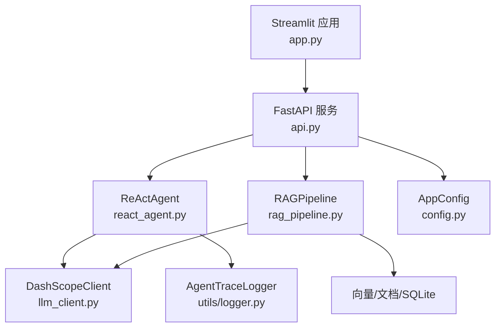
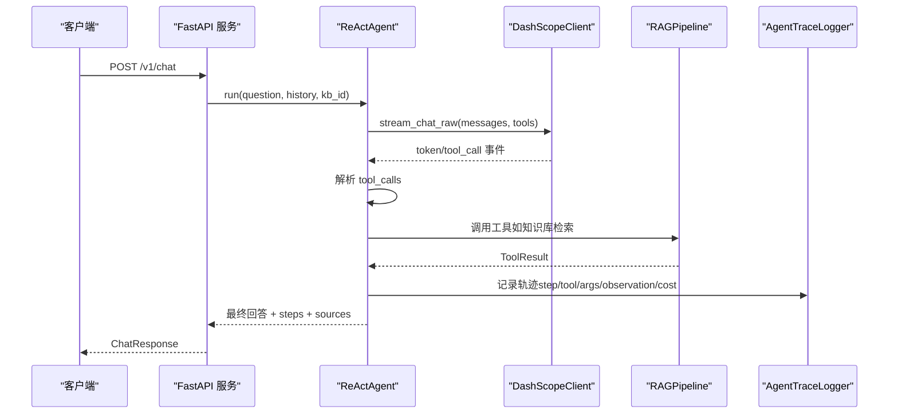
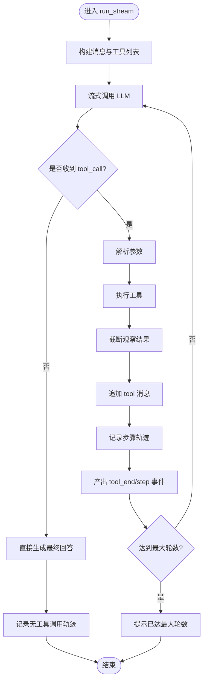
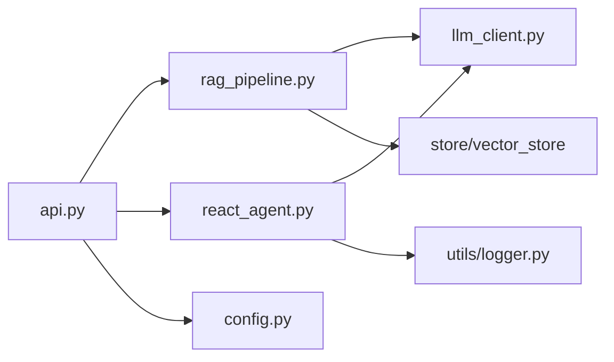

# 监控与日志

<cite>
**本文引用的文件**
- [utils/logger.py](file://utils/logger.py)
- [react_agent.py](file://react_agent.py)
- [rag_pipeline.py](file://rag_pipeline.py)
- [llm_client.py](file://llm_client.py)
- [api.py](file://api.py)
- [app.py](file://app.py)
- [config.py](file://config.py)
</cite>

## 目录
1. [简介](#简介)
2. [项目结构](#项目结构)
3. [核心组件](#核心组件)
4. [架构总览](#架构总览)
5. [详细组件分析](#详细组件分析)
6. [依赖关系分析](#依赖关系分析)
7. [性能指标与监控方案](#性能指标与监控方案)
8. [错误告警与故障诊断](#错误告警与故障诊断)
9. [日志聚合与分析方案](#日志聚合与分析方案)
10. [仪表板配置与告警模板](#仪表板配置与告警模板)
11. [结论](#结论)

## 简介
本方案围绕现有代码中的 Agent 轨迹日志、RAG 管线、LLM 客户端与 API 服务，设计一套可落地的监控与日志收集体系。目标包括：
- 统一记录 Agent 工具调用链、执行状态与错误信息；
- 采集并可视化关键性能指标（响应时间、吞吐量、资源使用率）；
- 提供错误告警策略与故障诊断流程；
- 给出日志聚合分析方案（ELK Stack/云监控集成）；
- 提供监控仪表板配置示例与告警规则模板。

## 项目结构
本项目采用分层模块化设计：
- 入口层：FastAPI 服务（api.py）与 Streamlit 应用（app.py）；
- 业务层：RAG 管线（rag_pipeline.py）、Agent（react_agent.py）；
- 基础设施层：LLM 客户端封装（llm_client.py）、配置（config.py）、轨迹日志（utils/logger.py）；
- 数据层：向量存储、文档存储、SQLite 元数据等。

**图表来源**
- [api.py:34-57](file://api.py#L34-L57)
- [react_agent.py:144-157](file://react_agent.py#L144-L157)
- [rag_pipeline.py:196-219](file://rag_pipeline.py#L196-L219)
- [llm_client.py:22-46](file://llm_client.py#L22-L46)
- [utils/logger.py:12-45](file://utils/logger.py#L12-L45)
- [config.py:56-112](file://config.py#L56-L112)

**章节来源**
- [api.py:1-57](file://api.py#L1-L57)
- [app.py:1-55](file://app.py#L1-L55)
- [react_agent.py:1-30](file://react_agent.py#L1-L30)
- [rag_pipeline.py:1-39](file://rag_pipeline.py#L1-L39)
- [llm_client.py:1-46](file://llm_client.py#L1-L46)
- [utils/logger.py:1-45](file://utils/logger.py#L1-L45)
- [config.py:1-55](file://config.py#L1-L55)

## 核心组件
- AgentTraceLogger：线程安全的 JSONL 轨迹日志写入器，单条失败不影响主流程。
- ReActAgent：基于 Function Calling 的 Agent，支持多步工具调用、流式输出与轨迹记录。
- RAGPipeline：知识库管理、增量入库、混合检索（向量+BM25）、问答生成。
- DashScopeClient：统一封装大模型聊天、流式输出、联网搜索与 token 用量记录。
- FastAPI 服务：REST 接口，包含健康检查、知识库管理、文档上传、入库、问答等。
- AppConfig：集中化配置，支持环境变量覆盖。

**章节来源**
- [utils/logger.py:12-45](file://utils/logger.py#L12-L45)
- [react_agent.py:144-157](file://react_agent.py#L144-L157)
- [rag_pipeline.py:196-219](file://rag_pipeline.py#L196-L219)
- [llm_client.py:22-46](file://llm_client.py#L22-L46)
- [api.py:34-57](file://api.py#L34-L57)
- [config.py:56-112](file://config.py#L56-L112)

## 架构总览
下图展示了从请求到响应的完整链路，以及日志与指标埋点位置。

**图表来源**
- [api.py:185-199](file://api.py#L185-L199)
- [react_agent.py:272-369](file://react_agent.py#L272-L369)
- [llm_client.py:203-278](file://llm_client.py#L203-L278)
- [rag_pipeline.py:590-666](file://rag_pipeline.py#L590-L666)
- [utils/logger.py:20-45](file://utils/logger.py#L20-L45)

## 详细组件分析

### Agent 轨迹日志结构与记录方式
- 字段说明
  - timestamp：UTC ISO 时间戳；
  - step：当前步骤序号；
  - thought_summary：人类可读的思考摘要；
  - tool：调用的工具名（可为空）；
  - args：工具参数；
  - observation：工具返回或最终回答片段；
  - cost_estimate：预估 token 成本（用于上下文预算控制）。
- 记录时机
  - 当模型未调用工具直接生成回答时记录一次；
  - 每次工具调用开始与结束后记录一次，包含工具名、参数、观察结果与估算成本；
  - 所有记录通过线程安全写入 JSONL，异常被吞掉以避免影响主流程。
- 扩展建议
  - 增加 request_id、kb_id、user_id、latency_ms、error_code 等字段，便于聚合与追踪；
  - 在 API 层注入 traceId，贯穿整个调用链。

**章节来源**
- [utils/logger.py:20-45](file://utils/logger.py#L20-L45)
- [react_agent.py:313-369](file://react_agent.py#L313-L369)
- [react_agent.py:506-524](file://react_agent.py#L506-L524)

### 工具调用链与执行状态
- 工具注册表：以装饰器方式注册工具，生成 OpenAI 兼容 tools 描述，按名称调用；
- 工具执行：捕获异常并包装为 ToolResult，将错误信息回填给模型以便重试或降级；
- 事件流：tool_start、tool_end、token、done、error 事件驱动 UI 渲染与日志记录。

**图表来源**
- [react_agent.py:272-369](file://react_agent.py#L272-L369)
- [react_agent.py:93-142](file://react_agent.py#L93-L142)

**章节来源**
- [react_agent.py:93-142](file://react_agent.py#L93-L142)
- [react_agent.py:272-369](file://react_agent.py#L272-L369)

### 错误信息与异常处理
- LLM 客户端：统一捕获外部异常，转换为可读错误，保留 model/base_url 等信息；
- Agent：工具执行异常被捕获并包装为 ToolResult，避免中断循环；
- API：对上层异常进行 HTTP 状态码映射（400/401/404/500），并附带 safe_error 信息；
- 轨迹日志：写入失败不抛错，确保主流程不受影响。

**章节来源**
- [llm_client.py:94-170](file://llm_client.py#L94-L170)
- [llm_client.py:172-278](file://llm_client.py#L172-L278)
- [react_agent.py:130-142](file://react_agent.py#L130-L142)
- [api.py:185-199](file://api.py#L185-L199)
- [utils/logger.py:39-45](file://utils/logger.py#L39-L45)

### RAG 管线与检索质量
- 混合检索：向量相似度 + BM25 词面匹配，RRF 融合，可选 MMR 去重；
- 相关性门槛：低于阈值且无 BM25 命中视为“无相关内容”；
- 上下文预算：按 token 预算裁剪历史与上下文块，降低延迟与成本；
- 增量入库：SHA-256 判重，索引配置变化触发全量重建。

**章节来源**
- [rag_pipeline.py:437-523](file://rag_pipeline.py#L437-L523)
- [rag_pipeline.py:590-666](file://rag_pipeline.py#L590-L666)
- [rag_pipeline.py:306-435](file://rag_pipeline.py#L306-L435)

## 依赖关系分析
- api.py 依赖 rag_pipeline.py 与 react_agent.py，暴露 REST 接口；
- react_agent.py 依赖 llm_client.py 与 utils/logger.py，实现工具调度与轨迹记录；
- rag_pipeline.py 依赖 llm_client.py、store/vector_store/ingestion/utils.retrieval；
- llm_client.py 依赖 OpenAI SDK 与 LangChain Embeddings；
- config.py 提供集中配置，被多处读取。

**图表来源**
- [api.py:27-57](file://api.py#L27-L57)
- [react_agent.py:27-29](file://react_agent.py#L27-L29)
- [rag_pipeline.py:27-38](file://rag_pipeline.py#L27-L38)
- [llm_client.py:9-13](file://llm_client.py#L9-L13)
- [config.py:56-112](file://config.py#L56-L112)

**章节来源**
- [api.py:27-57](file://api.py#L27-L57)
- [react_agent.py:27-29](file://react_agent.py#L27-L29)
- [rag_pipeline.py:27-38](file://rag_pipeline.py#L27-L38)
- [llm_client.py:9-13](file://llm_client.py#L9-L13)
- [config.py:56-112](file://config.py#L56-L112)

## 性能指标与监控方案
结合现有代码，建议采集以下指标：

- 响应时间
  - 端到端请求耗时：在 api.py 中统计 /v1/chat 请求的开始与结束时间；
  - LLM 调用耗时：在 llm_client.py 的 chat/stream_chat 方法前后计时；
  - 工具调用耗时：在 react_agent.py 的工具执行前后计时。
- 吞吐量
  - QPS：统计单位时间内 /v1/chat 成功请求数；
  - 并发度：统计同时处理的请求数（可通过中间件维护计数器）。
- 资源使用率
  - CPU/内存：通过系统探针或容器运行时指标采集；
  - I/O：向量库与 SQLite 读写频率与延迟。
- 业务指标
  - 工具调用成功率与失败原因分布；
  - 检索命中率（向量/BM25/RRF 得分分布）；
  - Token 用量：prompt/completion/total，来自 llm_client.last_usage；
  - 上下文长度：context_tokens，来自 rag_pipeline.answer/chat。

实施要点
- 在 api.py 路由层添加请求级计时与指标上报；
- 在 llm_client.py 中记录 last_usage 并对外暴露；
- 在 react_agent.py 中记录工具调用耗时与结果；
- 在 rag_pipeline.py 中记录检索得分与上下文长度；
- 使用 Prometheus 或云监控 SDK 上报指标，或使用结构化日志输出至 ELK。

**章节来源**
- [api.py:185-199](file://api.py#L185-L199)
- [llm_client.py:48-57](file://llm_client.py#L48-L57)
- [llm_client.py:203-278](file://llm_client.py#L203-L278)
- [react_agent.py:272-369](file://react_agent.py#L272-L369)
- [rag_pipeline.py:590-666](file://rag_pipeline.py#L590-L666)

## 错误告警与故障诊断
- 告警维度
  - LLM 调用失败：chat/stream_chat 抛出 RuntimeError；
  - 工具执行失败：ToolRegistry.call 返回错误内容；
  - 检索为空：retrieve 返回空结果，可能需调整 top_k 或相关性阈值；
  - 入库失败：ingest 返回 errors 列表；
  - API 层异常：HTTP 500/400/401/404。
- 告警策略
  - 错误率阈值：单位时间内错误占比超过阈值触发告警；
  - 延迟阈值：P95/P99 响应时间超过阈值；
  - Token 用量突增：单位时间 total_tokens 异常增长；
  - 检索命中率下降：RRF 得分低于阈值比例升高。
- 故障诊断流程
  - 定位请求 traceId，查看 API 层日志；
  - 检查 LLM 客户端日志与 last_usage；
  - 查看 Agent 轨迹日志，确认工具调用链与观察结果；
  - 检查 RAG 检索得分与上下文长度；
  - 验证配置文件与环境变量（模型、base_url、API Key）。

**章节来源**
- [llm_client.py:94-170](file://llm_client.py#L94-L170)
- [llm_client.py:172-278](file://llm_client.py#L172-L278)
- [react_agent.py:130-142](file://react_agent.py#L130-L142)
- [rag_pipeline.py:437-523](file://rag_pipeline.py#L437-L523)
- [rag_pipeline.py:306-435](file://rag_pipeline.py#L306-L435)
- [api.py:185-199](file://api.py#L185-L199)

## 日志聚合与分析方案
- 本地 JSONL 轨迹日志
  - 路径：data/agent_trace.jsonl；
  - 格式：每行一个 JSON 对象，包含 timestamp/step/thought_summary/tool/args/observation/cost_estimate；
  - 优点：轻量、易读、适合调试；
  - 缺点：不适合大规模实时分析。
- 结构化日志输出
  - 建议在 api.py、llm_client.py、react_agent.py、rag_pipeline.py 中输出结构化日志（JSON），包含 request_id、latency_ms、status、error_code、metrics；
  - 使用 Python logging 或第三方库（如 structlog）输出至 stdout，由容器平台采集。
- ELK Stack 集成
  - Filebeat/Fluent Bit 采集 stdout 与 JSONL 文件；
  - Logstash 解析与富化（添加环境标签、服务名）；
  - Elasticsearch 存储，Kibana 可视化；
  - 建立索引策略（按天滚动）、保留策略（热温冷分层）。
- 云监控服务集成
  - 阿里云 SLS：采集日志与指标，设置查询分析与告警；
  - Prometheus + Grafana：采集指标，构建仪表板；
  - 云厂商 APM：接入链路追踪，关联请求与日志。

**章节来源**
- [utils/logger.py:17-45](file://utils/logger.py#L17-L45)
- [api.py:185-199](file://api.py#L185-L199)
- [llm_client.py:48-57](file://llm_client.py#L48-L57)
- [react_agent.py:313-369](file://react_agent.py#L313-L369)
- [rag_pipeline.py:590-666](file://rag_pipeline.py#L590-L666)

## 仪表板配置与告警模板
- 仪表板建议
  - 概览：QPS、错误率、P95/P99 延迟、Token 用量；
  - 工具调用：各工具调用次数、成功率、平均耗时；
  - 检索质量：向量/BM25/RRF 得分分布、命中率；
  - 资源使用：CPU/内存/磁盘 I/O；
  - 错误分布：错误类型 Top N、最近错误列表。
- 告警规则模板
  - 错误率：过去 5 分钟错误率 > 5%；
  - 延迟：P95 响应时间 > 3s；
  - Token 用量：每小时 total_tokens 突增 > 200%；
  - 检索命中率：RRF 得分 < 0.1 的比例 > 30%；
  - LLM 调用失败：每分钟失败次数 > 10。
- 告警渠道
  - 企业微信/钉钉机器人；
  - 邮件/短信；
  - 云监控告警中心。

[本节为概念性内容，不直接分析具体文件]

## 结论
本方案基于现有代码中的 Agent 轨迹日志、RAG 管线、LLM 客户端与 API 服务，构建了完整的监控与日志收集体系。通过统一的轨迹记录、结构化日志输出、指标采集与告警策略，能够有效支撑生产环境的稳定性与可观测性。建议优先落地 API 层计时与指标上报、LLM 客户端用量记录、Agent 工具调用耗时统计，并结合 ELK 或云监控实现日志聚合与可视化。