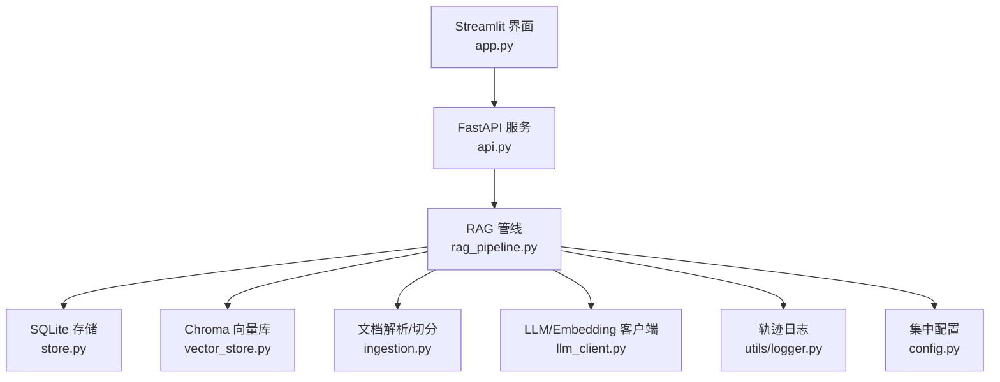
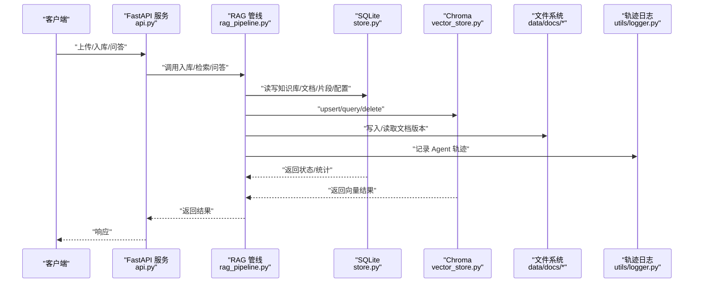
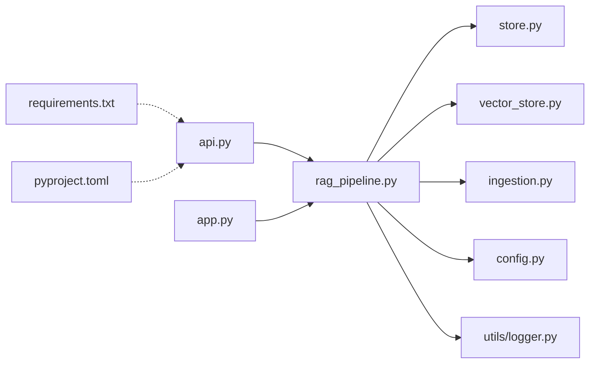

# 维护与升级

<cite>
**本文引用的文件**
- [README.md](file://README.md)
- [config.py](file://config.py)
- [store.py](file://store.py)
- [vector_store.py](file://vector_store.py)
- [rag_pipeline.py](file://rag_pipeline.py)
- [ingestion.py](file://ingestion.py)
- [api.py](file://api.py)
- [app.py](file://app.py)
- [utils/logger.py](file://utils/logger.py)
- [requirements.txt](file://requirements.txt)
- [pyproject.toml](file://pyproject.toml)
</cite>

## 目录
1. [简介](#简介)
2. [项目结构](#项目结构)
3. [核心组件](#核心组件)
4. [架构总览](#架构总览)
5. [详细组件分析](#详细组件分析)
6. [依赖关系分析](#依赖关系分析)
7. [性能考虑](#性能考虑)
8. [故障恢复指南](#故障恢复指南)
9. [结论](#结论)
10. [附录](#附录)

## 简介
本指南面向生产或准生产环境下的系统维护与升级，覆盖数据备份与恢复、版本升级步骤（依赖包更新、数据库迁移、配置变更处理）、健康检查脚本、性能优化建议、故障恢复预案、回滚策略与灾难恢复流程，以及维护最佳实践。内容基于仓库中实际代码与配置实现，确保可操作性和一致性。

## 项目结构
本项目采用“功能模块 + 数据层”的清晰分层：
- 服务层：FastAPI 提供 REST API；Streamlit 提供交互式界面。
- 业务层：RAG 管线负责知识库管理、文档入库、混合检索与问答；Agent 负责工具调用与多步推理。
- 数据层：SQLite 存储元数据与片段；Chroma 存储向量；本地文件系统存储文档与轨迹日志。
- 配置与工具：集中配置、解析切分、日志记录、评测与测试。

图表来源
- [api.py:1-204](file://api.py#L1-L204)
- [app.py:1-352](file://app.py#L1-L352)
- [rag_pipeline.py:196-792](file://rag_pipeline.py#L196-L792)
- [store.py:123-470](file://store.py#L123-L470)
- [vector_store.py:38-149](file://vector_store.py#L38-L149)
- [ingestion.py:24-216](file://ingestion.py#L24-L216)
- [utils/logger.py:12-76](file://utils/logger.py#L12-L76)
- [config.py:56-113](file://config.py#L56-L113)

章节来源
- [README.md:116-143](file://README.md#L116-L143)
- [api.py:1-204](file://api.py#L1-L204)
- [app.py:1-352](file://app.py#L1-L352)

## 核心组件
- 配置中心：通过环境变量集中控制数据路径、检索参数、模型与批大小等，便于部署与升级时调整。
- 文档存储：SQLite 使用 WAL 模式与事务锁，支持多知识库、文档版本、片段管理与键值配置。
- 向量存储：Chroma 持久化客户端，按知识库隔离 collection，支持批量 upsert、条件删除、相似度查询与 MMR 重排所需向量获取。
- RAG 管线：封装知识库管理、增量入库、混合检索（向量+BM25，RRF融合，MMR去重）与带引用问答。
- 文档解析：PDF/Word/Markdown/TXT 解析与切分，PDF 文本质量低时自动切换本地 OCR。
- 服务层：FastAPI 暴露知识库与问答接口，可选 Bearer Token 鉴权；Streamlit 提供可视化交互与后台索引进度。
- 日志与追踪：线程安全的 JSONL 轨迹日志，不影响主流程。

章节来源
- [config.py:56-113](file://config.py#L56-L113)
- [store.py:123-470](file://store.py#L123-L470)
- [vector_store.py:38-149](file://vector_store.py#L38-L149)
- [rag_pipeline.py:196-792](file://rag_pipeline.py#L196-L792)
- [ingestion.py:24-216](file://ingestion.py#L24-L216)
- [api.py:1-204](file://api.py#L1-L204)
- [app.py:1-352](file://app.py#L1-L352)
- [utils/logger.py:12-76](file://utils/logger.py#L12-L76)

## 架构总览
下图展示从请求到数据落盘的关键路径，包括备份与恢复涉及的三个数据域：SQLite、Chroma、文件存储。

图表来源
- [api.py:98-204](file://api.py#L98-L204)
- [rag_pipeline.py:306-435](file://rag_pipeline.py#L306-L435)
- [store.py:123-470](file://store.py#L123-L470)
- [vector_store.py:61-149](file://vector_store.py#L61-L149)
- [utils/logger.py:12-76](file://utils/logger.py#L12-L76)

## 详细组件分析

### 数据备份与恢复流程
目标：保证 SQLite、Chroma 与文件存储的一致性，支持增量与全量备份，并提供快速恢复与校验。

- 备份策略
  - SQLite 备份：WAL 模式下可直接复制 .sqlite3 与 .wal/.shm（若存在），或使用 sqlite3 提供的在线备份接口进行一致快照。建议在低峰期执行。
  - Chroma 备份：直接复制 data/chroma 目录（PersistentClient 持久化）。如需跨机器迁移，确保目标机器具备相同依赖与权限。
  - 文件存储备份：data/docs/<kb_id>/<doc_id>/v<版本>/<文件名> 为版本化文件，需递归备份整个 data/docs 目录。
  - 轨迹日志备份：data/agent_trace.jsonl 用于审计与问题定位，建议纳入备份集。
  - 配置备份：.env 或环境变量清单、pyproject.toml、requirements.txt 等。

- 恢复流程
  - 停止服务：先停 FastAPI/Streamlit，避免写入导致不一致。
  - 恢复顺序：优先恢复文件存储 → SQLite → Chroma → 轨迹日志 → 配置。
  - 一致性校验：
    - 检查 SQLite 表结构与外键约束是否完整（store.py 中的 _SCHEMA）。
    - 检查 Chroma collections 是否存在且数量与知识库匹配。
    - 核对文档版本目录与 store 中 document_versions 是否一致。
  - 重建索引：如向量与片段不一致，触发全量重建（见下文“版本升级与配置变更”）。

- 自动化建议
  - 定时任务：每日全量备份 + 每小时增量备份（WAL 与文件增量）。
  - 异地容灾：将备份同步至对象存储或远端 NAS。
  - 恢复演练：定期在隔离环境执行恢复演练，验证可用性。

章节来源
- [store.py:31-77](file://store.py#L31-L77)
- [store.py:132-138](file://store.py#L132-L138)
- [vector_store.py:45-59](file://vector_store.py#L45-L59)
- [rag_pipeline.py:754-774](file://rag_pipeline.py#L754-L774)
- [README.md:136-143](file://README.md#L136-L143)

### 版本升级步骤
- 依赖包更新
  - 使用 requirements.txt 锁定版本范围，升级前先在隔离环境验证兼容性。
  - 升级后运行离线测试与 ruff/mypy 检查，确保无回归。
  - 注意 LangChain/LangChain-Community、Chroma、DashScope 等关键依赖的版本区间。

- 数据库迁移
  - 启动时会自动创建/扩展 schema（_init_schema/_ensure_columns），新增字段会安全补齐。
  - 若引入新字段或表，需在升级脚本中显式添加 ALTER 语句并设置默认值。
  - 迁移前后对 SQLite 做备份，迁移失败立即回滚。

- 配置变更处理
  - 所有可调参数集中在 AppConfig.from_env，通过环境变量或 .env 覆盖，无需改代码。
  - 涉及索引配置的变更（chunk_size、chunk_overlap、embedding_model、parser_version）会触发全量重建，确保向量与片段一致。
  - 升级后首次 ingest 会检测 index_config_version，必要时强制重建。

- 升级顺序建议
  1) 备份数据（SQLite、Chroma、文件、日志、配置）。
  2) 升级依赖并安装新版本。
  3) 启动服务，观察初始化与迁移日志。
  4) 执行一次全量 ingest，确认向量与片段一致。
  5) 运行健康检查与离线测试。
  6) 灰度上线，监控错误率与延迟。

章节来源
- [config.py:89-113](file://config.py#L89-L113)
- [store.py:140-155](file://store.py#L140-L155)
- [rag_pipeline.py:318-320](file://rag_pipeline.py#L318-L320)
- [rag_pipeline.py:739-752](file://rag_pipeline.py#L739-L752)
- [requirements.txt:1-21](file://requirements.txt#L1-L21)
- [pyproject.toml:1-41](file://pyproject.toml#L1-L41)

### 健康检查脚本
- 服务健康
  - GET /health 返回 {"status": "ok"}，用于负载均衡与健康探针。
- 知识库健康
  - 列出知识库、统计文档数与片段数、向量库 count，确认三者一致。
- 向量与片段一致性
  - 对比 store 中 chunks 计数与 Chroma collection 计数，差异则触发重建。
- 文件完整性
  - 遍历 documents 的 file_path，检查是否存在；缺失则标记待修复。
- 外部依赖
  - 尝试连接 LLM/Embedding 接口，记录可用性与延迟。
- 日志与指标
  - 检查 agent_trace.jsonl 是否正常写入。
  - 收集上下文 token 估算、检索命中率、错误率等指标。

章节来源
- [api.py:98-100](file://api.py#L98-L100)
- [rag_pipeline.py:249-256](file://rag_pipeline.py#L249-L256)
- [vector_store.py:139-149](file://vector_store.py#L139-L149)
- [utils/logger.py:12-76](file://utils/logger.py#L12-L76)

### 性能优化建议
- 检索与生成
  - 调整 RETRIVAL_TOP_K、RETRIEVAL_FUSION_POOL、RETRIEVAL_RELEVANCE_THRESHOLD 平衡召回与精度。
  - 启用 MMR 去重提升多样性，调节 mmr_lambda 控制相关性与多样性权重。
  - 限制 HISTORY_MAX_TOKENS 与 RAG_CONTEXT_MAX_TOKENS，减少上下文过长导致的注意力分散与成本上升。
- 向量化与入库
  - EMBEDDING_BATCH_SIZE 控制在 16 以内，避免超出 DashScope 单次上限。
  - 增量入库利用 SHA-256 判重，仅处理变化文件；索引配置变化时自动全量重建。
- 存储与并发
  - SQLite 使用 WAL 模式与 busy_timeout，适合多线程访问；在高并发场景下评估迁移至 PostgreSQL。
  - Chroma 使用 PersistentClient，注意磁盘空间与集合数量增长。
- 观测与调优
  - 结合 agent_trace.jsonl 与上下文 token 估算，定位瓶颈。
  - 定期评估 BM25 与向量得分分布，优化阈值与 pool 大小。

章节来源
- [config.py:95-113](file://config.py#L95-L113)
- [rag_pipeline.py:439-523](file://rag_pipeline.py#L439-L523)
- [rag_pipeline.py:590-666](file://rag_pipeline.py#L590-L666)
- [store.py:132-138](file://store.py#L132-L138)
- [vector_store.py:61-78](file://vector_store.py#L61-L78)
- [utils/logger.py:48-62](file://utils/logger.py#L48-L62)

### 故障恢复预案
- 常见故障
  - 向量与片段不一致：重新执行 ingest，确保 upsert 与 replace_chunks 原子性完成。
  - 文件缺失：根据 document_versions 恢复物理文件，再触发增量入库。
  - SQLite 损坏：从最近备份恢复，重启服务后校验 schema。
  - Chroma 损坏：删除对应 collection 并重建；或恢复整个 data/chroma。
  - LLM/Embedding 不可用：降级为通用聊天模式，记录错误并告警。
- 恢复步骤
  1) 停止写入，隔离故障域。
  2) 从备份恢复数据（按文件→SQLite→Chroma→日志顺序）。
  3) 执行一致性校验与必要重建。
  4) 逐步恢复服务，观察健康检查与错误日志。
  5) 复盘根因，补充防护与监控。

章节来源
- [rag_pipeline.py:306-435](file://rag_pipeline.py#L306-L435)
- [store.py:200-210](file://store.py#L200-L210)
- [vector_store.py:142-149](file://vector_store.py#L142-L149)
- [api.py:185-199](file://api.py#L185-L199)

### 回滚策略
- 依赖回滚：保留上一版本的 requirements.lock 或镜像，回滚时恢复旧依赖并重启。
- 数据回滚：以备份为准，优先恢复文件与 SQLite，再恢复 Chroma；必要时清空 collection 重建。
- 配置回滚：恢复 .env 与 pyproject.toml 至稳定版本，避免引入未验证的配置。
- 灰度回滚：流量切回旧版本实例，同时保留新实例以便二次验证。

章节来源
- [requirements.txt:1-21](file://requirements.txt#L1-L21)
- [pyproject.toml:1-41](file://pyproject.toml#L1-L41)
- [store.py:140-155](file://store.py#L140-L155)
- [vector_store.py:142-149](file://vector_store.py#L142-L149)

### 灾难恢复流程
- 场景：机房断电/磁盘损坏/勒索软件。
- 流程：
  1) 启动备用环境，部署旧稳定版本。
  2) 从异地备份恢复数据（文件→SQLite→Chroma→日志→配置）。
  3) 执行一致性校验与重建。
  4) 逐步开放访问，监控健康与错误。
  5) 事后复盘，完善备份策略与监控告警。

[本节为概念性流程说明，不直接分析具体文件]

### 维护最佳实践与注意事项
- 变更前必备份：任何升级、配置修改、索引重建前执行全量备份。
- 小步快跑：依赖与配置变更尽量分批，配合灰度与回滚策略。
- 观测先行：上线前建立健康检查与关键指标看板（错误率、延迟、token 用量、检索命中率）。
- 幂等与健壮：入库与删除操作应幂等，异常时能重试或回滚。
- 安全与合规：敏感配置（API Key）不入仓，使用环境变量或密钥管理服务；对外接口开启鉴权。
- 文档与演练：维护手册与恢复演练常态化，确保团队熟悉流程。

[本节为通用实践指导，不直接分析具体文件]

## 依赖关系分析
- 服务层依赖业务层：api.py 依赖 rag_pipeline.py 与 react_agent.py。
- 业务层依赖数据层：rag_pipeline.py 依赖 store.py、vector_store.py、ingestion.py。
- 配置与工具：config.py 被多处引用；utils/logger.py 提供轨迹日志。
- 运行时依赖：requirements.txt 定义版本区间，pyproject.toml 配置测试与静态检查。

图表来源
- [api.py:1-204](file://api.py#L1-L204)
- [app.py:1-352](file://app.py#L1-L352)
- [rag_pipeline.py:196-792](file://rag_pipeline.py#L196-L792)
- [store.py:123-470](file://store.py#L123-L470)
- [vector_store.py:38-149](file://vector_store.py#L38-L149)
- [ingestion.py:24-216](file://ingestion.py#L24-L216)
- [config.py:56-113](file://config.py#L56-L113)
- [utils/logger.py:12-76](file://utils/logger.py#L12-L76)
- [requirements.txt:1-21](file://requirements.txt#L1-L21)
- [pyproject.toml:1-41](file://pyproject.toml#L1-L41)

章节来源
- [api.py:1-204](file://api.py#L1-L204)
- [rag_pipeline.py:196-792](file://rag_pipeline.py#L196-L792)
- [requirements.txt:1-21](file://requirements.txt#L1-L21)
- [pyproject.toml:1-41](file://pyproject.toml#L1-L41)

## 性能考虑
- 合理设置检索参数与上下文预算，避免过度拼接导致延迟与成本上升。
- 使用增量入库与 SHA-256 判重，减少重复计算。
- 控制 Embedding 批大小，避免超出供应商限制。
- 监控 SQLite 与 Chroma 的 I/O 与内存占用，必要时扩容或迁移。
- 结合 agent_trace.jsonl 与 token 估算，持续优化提示词与上下文裁剪策略。

[本节提供通用性能指导，不直接分析具体文件]

## 故障恢复指南
- 快速定位：查看 /health、错误日志与 agent_trace.jsonl。
- 数据一致性：比对 SQLite 与 Chroma 计数，不一致则重建。
- 文件恢复：依据 document_versions 恢复物理文件，再触发增量入库。
- 服务降级：外部 LLM 不可用时切换到通用聊天模式，保障基本可用性。
- 回滚与恢复：按“依赖→配置→数据→服务”的顺序执行回滚与恢复。

章节来源
- [api.py:98-100](file://api.py#L98-L100)
- [rag_pipeline.py:306-435](file://rag_pipeline.py#L306-L435)
- [store.py:200-210](file://store.py#L200-L210)
- [vector_store.py:142-149](file://vector_store.py#L142-L149)
- [utils/logger.py:12-76](file://utils/logger.py#L12-L76)

## 结论
本指南围绕 SQLite、Chroma 与文件存储的备份恢复、版本升级、健康检查、性能优化与故障恢复提供了系统化方案。通过集中配置、增量入库与 WAL 模式，系统在单机环境下具备良好的一致性与可维护性。建议在生产环境中结合监控与演练，持续完善备份策略与回滚机制，确保高可用与数据安全。

[本节为总结性内容，不直接分析具体文件]

## 附录
- 常用命令参考
  - 启动 Streamlit：streamlit run app.py
  - 启动 FastAPI：uvicorn api:app --host 0.0.0.0 --port 8000
  - 离线测试：pytest
  - 代码规范：ruff check .
- 关键路径
  - SQLite：data/kb.sqlite3
  - Chroma：data/chroma
  - 文档：data/docs/<kb_id>/<doc_id>/v<版本>/<文件名>
  - 轨迹日志：data/agent_trace.jsonl

章节来源
- [README.md:25-91](file://README.md#L25-L91)
- [README.md:136-143](file://README.md#L136-L143)