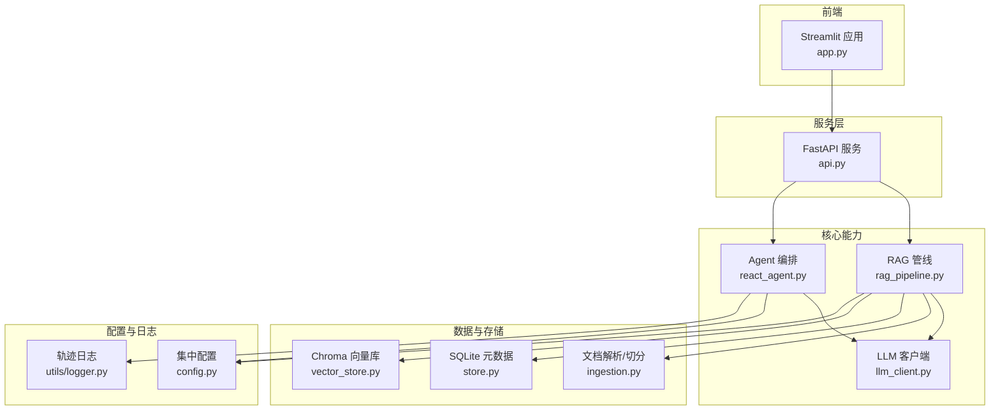
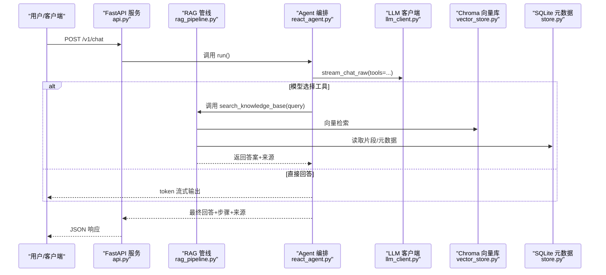
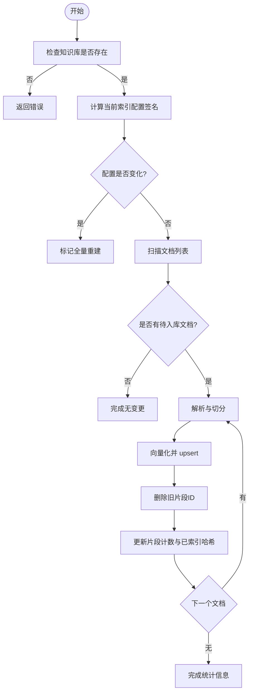
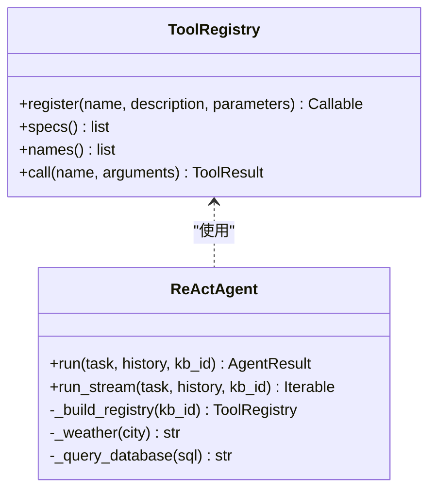
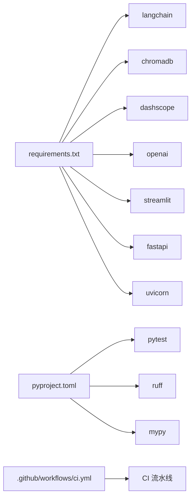

# 部署指南

<cite>
**本文引用的文件**
- [README.md](file://README.md)
- [config.py](file://config.py)
- [requirements.txt](file://requirements.txt)
- [pyproject.toml](file://pyproject.toml)
- [app.py](file://app.py)
- [api.py](file://api.py)
- [rag_pipeline.py](file://rag_pipeline.py)
- [react_agent.py](file://react_agent.py)
- [llm_client.py](file://llm_client.py)
- [store.py](file://store.py)
- [vector_store.py](file://vector_store.py)
- [ingestion.py](file://ingestion.py)
- [utils/logger.py](file://utils/logger.py)
- [.github/workflows/ci.yml](file://.github/workflows/ci.yml)
</cite>

## 目录
1. [简介](#简介)
2. [项目结构](#项目结构)
3. [核心组件](#核心组件)
4. [架构总览](#架构总览)
5. [详细组件分析](#详细组件分析)
6. [依赖关系分析](#依赖关系分析)
7. [性能与容量规划](#性能与容量规划)
8. [故障排查指南](#故障排查指南)
9. [结论](#结论)
10. [附录：部署模板与脚本](#附录部署模板与脚本)

## 简介
本指南面向本地开发与生产部署，覆盖环境搭建、配置管理、容器化、反向代理、负载均衡、监控日志、安全加固、数据备份恢复与升级维护流程。项目为基于 RAG + Agent 的企业知识库问答原型，提供 Streamlit 界面与 FastAPI 服务层，支持多知识库、混合检索（向量+BM25）、Function Calling Agent、流式回答与引用溯源。

## 项目结构
- 应用入口
  - Streamlit 前端：app.py
  - FastAPI 服务：api.py
- 业务核心
  - RAG 管线：rag_pipeline.py
  - Agent 编排：react_agent.py
  - LLM 客户端：llm_client.py
  - 文档解析与切分：ingestion.py
  - 元数据存储：store.py（SQLite）
  - 向量存储：vector_store.py（Chroma）
- 配置与依赖
  - 集中配置：config.py
  - 运行时依赖：requirements.txt
  - 开发工具配置：pyproject.toml
- 日志与观测
  - Agent 轨迹日志：utils/logger.py
- CI/CD
  - GitHub Actions：.github/workflows/ci.yml

图表来源
- [app.py:1-352](file://app.py#L1-L352)
- [api.py:1-204](file://api.py#L1-L204)
- [rag_pipeline.py:1-792](file://rag_pipeline.py#L1-L792)
- [react_agent.py:1-567](file://react_agent.py#L1-L567)
- [llm_client.py:1-322](file://llm_client.py#L1-L322)
- [ingestion.py:1-216](file://ingestion.py#L1-L216)
- [store.py:1-470](file://store.py#L1-L470)
- [vector_store.py:1-255](file://vector_store.py#L1-L255)
- [config.py:1-113](file://config.py#L1-L113)
- [utils/logger.py:1-76](file://utils/logger.py#L1-L76)

章节来源
- [README.md:25-134](file://README.md#L25-L134)

## 核心组件
- 配置中心：通过环境变量集中加载运行参数，避免硬编码；支持路径解析、类型转换与范围钳制。
- RAG 管线：负责知识库管理、增量入库（SHA-256 判重、索引配置变更触发全量重建）、混合检索（向量+BM25，RRF 融合，可选 MMR 去重）、带引用回答与上下文预算控制。
- Agent：Function Calling 驱动的多步工具调用循环，内置知识库检索、天气查询、联网搜索、只读数据库查询等工具，支持流式事件输出。
- LLM 客户端：统一封装百炼 OpenAI 兼容接口，支持对话、流式、Function Calling、Embedding 与联网搜索，并记录 token 用量。
- 存储层：SQLite 持久化知识库/文档/片段/版本/配置；Chroma 持久化向量集合，按知识库隔离 collection。
- 文档处理：PDF/Word/Markdown/TXT 解析，PDF 文本质量评估与本地 OCR 兜底，递归字符切分。
- 日志：线程安全的 JSONL 轨迹日志，记录 Agent 每步执行、工具调用与估算成本。

章节来源
- [config.py:1-113](file://config.py#L1-L113)
- [rag_pipeline.py:1-792](file://rag_pipeline.py#L1-L792)
- [react_agent.py:1-567](file://react_agent.py#L1-L567)
- [llm_client.py:1-322](file://llm_client.py#L1-L322)
- [store.py:1-470](file://store.py#L1-L470)
- [vector_store.py:1-255](file://vector_store.py#L1-L255)
- [ingestion.py:1-216](file://ingestion.py#L1-L216)
- [utils/logger.py:1-76](file://utils/logger.py#L1-L76)

## 架构总览

图表来源
- [api.py:185-199](file://api.py#L185-L199)
- [react_agent.py:250-370](file://react_agent.py#L250-L370)
- [rag_pipeline.py:439-523](file://rag_pipeline.py#L439-L523)
- [vector_store.py:100-127](file://vector_store.py#L100-L127)
- [store.py:123-139](file://store.py#L123-L139)
- [llm_client.py:203-278](file://llm_client.py#L203-L278)

## 详细组件分析

### 配置与环境变量
- 所有可调参数集中在 AppConfig，从环境变量读取并提供默认值；支持路径解析、布尔/整型/浮点转换与范围钳制。
- 关键配置项包括：数据目录、向量目录、SQLite 路径、切分大小与重叠、检索 Top-K、融合候选数、相关性阈值、MMR 开关与权重、历史与上下文 Token 预算、Agent 最大步数、Embedding 批量大小等。
- 建议在生产中通过容器环境变量注入，避免修改代码。

章节来源
- [config.py:1-113](file://config.py#L1-L113)
- [README.md:93-115](file://README.md#L93-L115)

### RAG 管线与混合检索
- 增量入库：基于 SHA-256 判重，索引配置变化时自动全量重建；先写新向量再清理旧片段 ID，保证一致性。
- 混合检索：向量 Top-N 与 BM25 Top-N 经 RRF 融合，可选 MMR 去重；低相关查询拒答以避免幻觉；精确关键词命中可绕过向量阈值。
- 上下文预算：历史消息与检索片段均按 Token 预算裁剪，防止注意力发散与费用浪费。
- 引用溯源：每个回答附带来源文件、页码/段落与相似度得分。

图表来源
- [rag_pipeline.py:306-435](file://rag_pipeline.py#L306-L435)
- [rag_pipeline.py:439-523](file://rag_pipeline.py#L439-L523)
- [ingestion.py:178-216](file://ingestion.py#L178-L216)

章节来源
- [rag_pipeline.py:196-753](file://rag_pipeline.py#L196-L753)
- [ingestion.py:1-216](file://ingestion.py#L1-L216)

### Agent 编排与工具注册表
- 工具注册表：以装饰器方式注册工具，生成 OpenAI tools 格式供模型选择；新增工具无需改动循环逻辑。
- 多步循环：模型可连续调用多个工具，将结果回填继续推理，直至给出最终回答或达到最大轮数。
- 内置工具：知识库检索、天气查询、联网搜索、只读数据库查询（仅 SELECT/PRAGMA/EXPLAIN/WITH）。
- 流式事件：tool_start/tool_end/step/token/done/error，便于 UI 实时渲染。

图表来源
- [react_agent.py:93-142](file://react_agent.py#L93-L142)
- [react_agent.py:144-370](file://react_agent.py#L144-L370)

章节来源
- [react_agent.py:1-567](file://react_agent.py#L1-L567)

### LLM 客户端与流式调用
- 统一封装百炼 OpenAI 兼容接口，支持对话、流式、Function Calling、Embedding 与联网搜索。
- 流式调用产出 token 与 tool_call 事件，便于 Agent 边到边渲染与工具调用组装。
- 记录最近一次调用的 token 用量，便于展示与成本估算。

章节来源
- [llm_client.py:1-322](file://llm_client.py#L1-L322)

### 存储层：SQLite 与 Chroma
- SQLite：WAL 模式、busy_timeout、外键约束；支持知识库/文档/版本/片段/配置的增删改查与并发安全。
- Chroma：按知识库隔离 collection，余弦空间；支持批量 upsert、条件删除、相似度查询、获取嵌入向量用于 MMR。

章节来源
- [store.py:1-470](file://store.py#L1-L470)
- [vector_store.py:1-255](file://vector_store.py#L1-L255)

### 文档解析与切分
- 支持 PDF/Word/Markdown/TXT；PDF 文本质量评估，低于阈值切换本地 OCR（PyMuPDF + RapidOCR）。
- 递归字符切分，保留 page/paragraph 等元数据，便于引用定位。

章节来源
- [ingestion.py:1-216](file://ingestion.py#L1-L216)

### 日志与轨迹
- 线程安全的 JSONL 轨迹日志，记录 step、thought_summary、tool、args、observation、cost_estimate。
- 轻量 token 估算函数，用于历史与上下文预算裁剪。

章节来源
- [utils/logger.py:1-76](file://utils/logger.py#L1-L76)

## 依赖关系分析
- 运行时依赖：langchain、chromadb、dashscope、openai、streamlit、fastapi、uvicorn、pypdf/docx2txt/pymupdf/rapidocr/onnxruntime/python-dotenv/rank-bm25/jieba/numpy 等。
- 开发工具：pytest、ruff、mypy，配置在 pyproject.toml。
- CI：GitHub Actions 工作流用于自动化测试与规范检查。

图表来源
- [requirements.txt:1-21](file://requirements.txt#L1-L21)
- [pyproject.toml:1-41](file://pyproject.toml#L1-L41)
- [.github/workflows/ci.yml:1-200](file://.github/workflows/ci.yml#L1-L200)

章节来源
- [requirements.txt:1-21](file://requirements.txt#L1-L21)
- [pyproject.toml:1-41](file://pyproject.toml#L1-L41)
- [.github/workflows/ci.yml:1-200](file://.github/workflows/ci.yml#L1-L200)

## 性能与容量规划
- 向量批量大小：默认 16，上限 20（DashScope 限制），可通过 EMBEDDING_BATCH_SIZE 调整。
- 检索参数：RETRIEVAL_TOP_K、RETRIEVAL_FUSION_POOL、RETRIEVAL_RELEVANCE_THRESHOLD、RETRIEVAL_MMR_ENABLED/LAMBDA。
- 上下文预算：HISTORY_MAX_TOKENS、RAG_CONTEXT_MAX_TOKENS，避免过长上下文导致性能下降与费用增加。
- 存储规模：SQLite 单文件适合单机；Chroma 按知识库隔离 collection，注意磁盘占用增长。
- 并发访问：SQLite WAL + busy_timeout；服务层使用全局锁串行化读写，避免并发问题。

章节来源
- [config.py:89-113](file://config.py#L89-L113)
- [rag_pipeline.py:439-523](file://rag_pipeline.py#L439-L523)
- [store.py:123-139](file://store.py#L123-L139)
- [api.py:31-33](file://api.py#L31-L33)

## 故障排查指南
- 未配置 API Key：启动时会抛出明确错误提示，请复制 .env.example 为 .env 并填写 DASHSCOPE_API_KEY。
- Base URL 格式错误：必须以 /compatible-mode/v1 结尾，否则抛出运行时错误。
- 流式调用失败：包装异常并转换为可读错误，便于上层捕获与降级。
- 文档解析失败：PDF 文本不可读且缺少 OCR 依赖时会提示安装 pymupdf/rapidocr/onnxruntime。
- 向量库写入失败：upsert 中途失败会保留旧向量，下次 ingest 重试完成。
- 数据库锁定：WAL + busy_timeout 缓解并发冲突；必要时降低并发或优化事务粒度。

章节来源
- [llm_client.py:59-86](file://llm_client.py#L59-L86)
- [llm_client.py:172-201](file://llm_client.py#L172-L201)
- [ingestion.py:124-150](file://ingestion.py#L124-L150)
- [rag_pipeline.py:395-416](file://rag_pipeline.py#L395-L416)
- [store.py:132-139](file://store.py#L132-L139)

## 结论
本项目提供了完整的 RAG + Agent 能力栈，具备多知识库、混合检索、流式回答与引用溯源。通过集中配置与模块化设计，易于本地开发与生产部署。建议在容器中运行，配合反向代理与负载均衡，结合日志与监控实现可观测性，并通过安全加固与备份恢复保障稳定性。

## 附录：部署模板与脚本

### 本地开发环境搭建
- Python 环境：Python 3.10+
- 创建虚拟环境并安装依赖
- 准备 .env 配置文件（复制 .env.example 并设置必要变量）
- 启动 Streamlit 界面或 FastAPI 服务

章节来源
- [README.md:25-65](file://README.md#L25-L65)
- [requirements.txt:1-21](file://requirements.txt#L1-L21)

### 生产环境部署最佳实践
- 容器化部署（Docker）
  - 基础镜像：选择 Python 3.10+ 官方镜像
  - 安装依赖：pip install -r requirements.txt
  - 环境变量：通过容器环境变量注入 DASHSCOPE_API_KEY、DASHSCOPE_BASE_URL、DASHSCOPE_CHAT_MODEL、DASHSCOPE_EMBEDDING_MODEL、CHUNK_SIZE、RETRIEVAL_TOP_K、EMBEDDING_BATCH_SIZE、API_AUTH_TOKEN 等
  - 数据持久化：挂载 data 目录（SQLite、Chroma、文档、轨迹日志）
  - 健康检查：暴露 /health 端点用于探针
- 反向代理配置
  - 使用 Nginx/Traefik 等作为反向代理，启用 HTTPS、限流、请求体大小限制
  - 将 /v1/* 路由至 FastAPI 服务，静态资源由 Web 服务器托管
- 负载均衡策略
  - 多实例横向扩展，基于会话亲和性或无状态设计
  - 使用健康检查与自动摘除机制
  - 注意 SQLite 并发限制，建议多实例共享只读副本或迁移至 PostgreSQL（阶段 B）

章节来源
- [api.py:98-100](file://api.py#L98-L100)
- [config.py:89-113](file://config.py#L89-L113)
- [store.py:123-139](file://store.py#L123-L139)

### 监控与日志收集方案
- Agent 轨迹日志
  - 位置：data/agent_trace.jsonl
  - 内容：时间戳、步骤、工具调用、观察结果、估算成本
  - 收集：日志采集 Agent（如 Filebeat/Fluent Bit）推送至集中日志平台
- 性能指标监控
  - 服务指标：QPS、延迟、错误率（通过反向代理或中间件采集）
  - 模型调用指标：token 用量（last_usage）、失败率、超时率
  - 存储指标：SQLite 连接池、Chroma collection 大小
- 错误告警配置
  - 基于日志关键字（如“失败”、“不可用”）触发告警
  - 基于指标阈值（如错误率 > 5%、延迟 P99 > 2s）触发告警
  - 告警渠道：邮件、企业微信、钉钉等

章节来源
- [utils/logger.py:12-45](file://utils/logger.py#L12-L45)
- [llm_client.py:48-57](file://llm_client.py#L48-L57)

### 安全加固措施
- 鉴权
  - 启用 API_AUTH_TOKEN，所有 /v1 接口需携带 Bearer Token
  - 反向代理层启用 IP 白名单与速率限制
- 网络安全
  - 强制 HTTPS，禁用弱加密套件
  - 最小权限原则：容器只暴露必要端口
- 数据安全
  - 敏感配置通过环境变量注入，不写入镜像
  - 定期备份 data 目录（SQLite、Chroma、文档、轨迹日志）
- 输入校验
  - 限制上传文件大小与类型
  - 对 SQL 查询进行只读白名单校验

章节来源
- [api.py:31-50](file://api.py#L31-L50)
- [react_agent.py:443-470](file://react_agent.py#L443-L470)

### 数据备份与恢复
- 备份策略
  - 定时备份 data 目录（SQLite WAL 文件、Chroma 数据、文档、轨迹日志）
  - 异地容灾：备份至对象存储或远程 NAS
- 恢复流程
  - 停止服务，替换 data 目录，重启服务
  - 验证 SQLite 完整性与 Chroma collection 可用性
  - 回放轨迹日志用于审计与问题定位

章节来源
- [store.py:132-139](file://store.py#L132-L139)
- [vector_store.py:48-60](file://vector_store.py#L48-L60)

### 升级与维护流程
- 灰度发布
  - 新版本并行部署，逐步切换流量
  - 通过健康检查与指标监控判断稳定性
- 回滚策略
  - 保留旧版本镜像与数据快照
  - 快速回滚至上一稳定版本
- 配置变更
  - 通过环境变量热更新（如检索参数、上下文预算）
  - 索引配置变更触发全量重建，注意耗时与资源占用

章节来源
- [rag_pipeline.py:739-753](file://rag_pipeline.py#L739-L753)
- [config.py:89-113](file://config.py#L89-L113)

### 不同部署场景的配置模板
- 开发环境
  - 启用调试模式，关闭严格鉴权（仅本机）
  - 使用模拟嵌入函数（未配置密钥时自动回退）
- 预生产环境
  - 启用鉴权，限制访问 IP
  - 开启完整日志与指标采集
- 生产环境
  - 启用 HTTPS、限流、熔断
  - 多实例负载均衡，数据持久化与备份
  - 监控告警与应急预案

章节来源
- [vector_store.py:179-189](file://vector_store.py#L179-L189)
- [api.py:31-50](file://api.py#L31-L50)

### 自动化脚本示例
- 构建与部署脚本
  - 构建 Docker 镜像，推送至镜像仓库
  - 拉取镜像并启动容器，挂载数据卷
  - 健康检查与自动重启
- 运维脚本
  - 备份/恢复 data 目录
  - 清理过期文档与向量
  - 重新索引指定知识库

章节来源
- [README.md:74-91](file://README.md#L74-L91)
- [rag_pipeline.py:720-728](file://rag_pipeline.py#L720-L728)