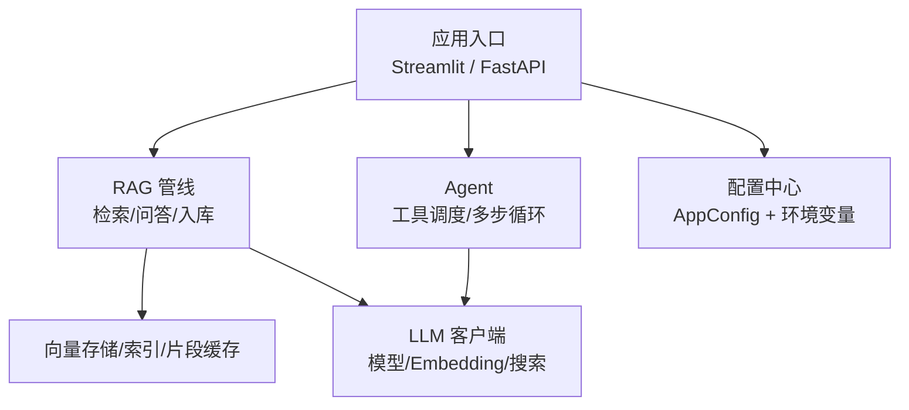
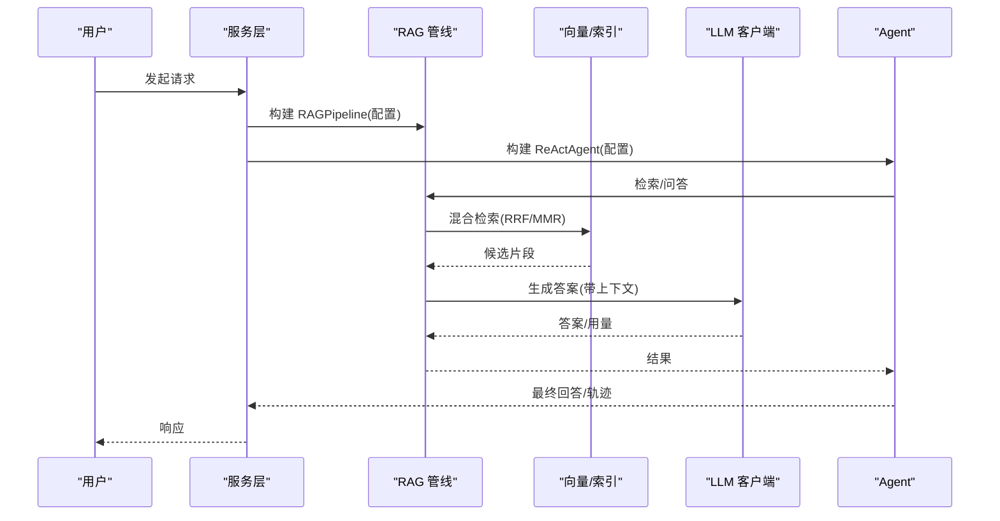

# 配置管理

<cite>
**本文引用的文件**
- [config.py](file://config.py)
- [llm_client.py](file://llm_client.py)
- [rag_pipeline.py](file://rag_pipeline.py)
- [react_agent.py](file://react_agent.py)
- [api.py](file://api.py)
- [app.py](file://app.py)
- [utils/logger.py](file://utils/logger.py)
</cite>

## 目录
1. [简介](#简介)
2. [项目结构与配置入口](#项目结构与配置入口)
3. [核心组件与职责](#核心组件与职责)
4. [架构总览](#架构总览)
5. [详细参数说明](#详细参数说明)
6. [环境变量覆盖机制与默认值管理](#环境变量覆盖机制与默认值管理)
7. [配置验证规则与边界保护](#配置验证规则与边界保护)
8. [不同部署场景的配置模板](#不同部署场景的配置模板)
9. [性能调优建议](#性能调优建议)
10. [安全配置指南](#安全配置指南)
11. [如何添加新配置项与扩展配置系统](#如何添加新配置项与扩展配置系统)
12. [故障排查与常见问题](#故障排查与常见问题)
13. [结论](#结论)

## 简介
本文件为集中式配置系统的完整说明，覆盖设计思路、环境变量覆盖机制、默认值管理、配置验证规则，以及所有可配置参数的含义、取值范围与影响效果。同时提供开发/测试/生产三类部署模板、最佳实践、性能调优与安全配置建议，并给出扩展配置系统的操作指南。

## 项目结构与配置入口
- 配置中心：集中定义在配置模块中，通过数据类冻结对象承载全部运行参数，避免运行时被意外修改。
- 应用入口：Web 界面与服务层在启动时读取配置，构建 RAG 管线与 Agent，从而统一受控于配置。
- LLM 客户端：从环境变量加载模型、端点与密钥等敏感信息，并提供统一的调用封装。

图表来源
- [config.py:56-112](file://config.py#L56-L112)
- [rag_pipeline.py:196-219](file://rag_pipeline.py#L196-L219)
- [react_agent.py:144-158](file://react_agent.py#L144-L158)
- [llm_client.py:22-46](file://llm_client.py#L22-L46)

章节来源
- [config.py:1-112](file://config.py#L1-L112)
- [app.py:21-54](file://app.py#L21-L54)
- [api.py:27-57](file://api.py#L27-L57)
- [llm_client.py:1-46](file://llm_client.py#L1-L46)

## 核心组件与职责
- 配置中心（AppConfig）：集中管理所有可调参数，支持从环境变量读取并带默认值；使用冻结数据类保证不可变。
- RAG 管线（RAGPipeline）：基于配置进行文档切分、向量化、混合检索、上下文裁剪与回答生成。
- Agent（ReActAgent）：基于配置限制最大工具调用轮数，结合工具注册表执行知识库检索、天气查询、联网搜索与数据库只读查询。
- LLM 客户端（DashScopeClient）：从环境变量加载模型、端点、密钥与功能开关，提供聊天、流式、Function Calling 与 Embedding 能力。
- 服务层（FastAPI/Streamlit）：暴露 REST API 与 Web UI，统一依赖配置实例化服务。

章节来源
- [config.py:56-112](file://config.py#L56-L112)
- [rag_pipeline.py:196-219](file://rag_pipeline.py#L196-L219)
- [react_agent.py:144-158](file://react_agent.py#L144-L158)
- [llm_client.py:22-46](file://llm_client.py#L22-L46)
- [api.py:27-57](file://api.py#L27-L57)
- [app.py:21-54](file://app.py#L21-L54)

## 架构总览
配置驱动的整体流程如下：
- 应用启动时读取环境变量，构造 AppConfig。
- RAGPipeline 根据配置初始化向量库、BM25 索引、片段缓存与 LLM 客户端。
- ReActAgent 根据配置限制最大步骤，并通过工具注册表动态选择工具。
- 检索阶段依据配置进行混合检索、相关性阈值过滤、MMR 去重与候选池大小控制。
- 问答阶段按配置裁剪历史与上下文，控制 token 预算，降低延迟与成本。

图表来源
- [rag_pipeline.py:439-523](file://rag_pipeline.py#L439-L523)
- [react_agent.py:272-369](file://react_agent.py#L272-L369)
- [llm_client.py:94-170](file://llm_client.py#L94-L170)

## 详细参数说明
以下列出所有关键配置项、含义、默认值、取值范围与影响效果。所有参数均通过环境变量覆盖，未设置时使用默认值。

- CHUNK_SIZE
  - 含义：文本切分的块大小（字符/字级别），影响片段粒度与后续检索质量。
  - 默认值：500
  - 取值范围：正整数；过小导致碎片过多，过大可能稀释语义。
  - 影响：切分粒度直接影响向量表示与 BM25 匹配效果；与 CHUNK_OVERLAP 共同决定重叠度。

- CHUNK_OVERLAP
  - 含义：相邻切块之间的重叠长度，有助于跨段语义连贯性。
  - 默认值：50
  - 取值范围：非负整数；通常小于 CHUNK_SIZE。
  - 影响：提高召回但增加冗余；需与 CHUNK_SIZE 配合调优。

- RETRIEVAL_TOP_K
  - 含义：最终返回给大模型的片段数量。
  - 默认值：5
  - 取值范围：正整数；越大上下文越长，成本越高。
  - 影响：直接决定回答的上下文量与准确性；过大会引入噪声。

- RETRIEVAL_FUSION_POOL
  - 含义：混合检索时向量与 BM25 各自取回的候选数上限，用于 RRF 融合。
  - 默认值：12
  - 取值范围：正整数；应不小于 RETRIEVAL_TOP_K。
  - 影响：候选池越大，融合越充分，但计算开销更高。

- RETRIEVAL_RELEVANCE_THRESHOLD
  - 含义：向量余弦相似度门槛，低于该值且无 BM25 命中视为“无相关内容”。
  - 默认值：0.3
  - 取值范围：[0, 1] 浮点数；阈值越高越严格。
  - 影响：防止低相关片段污染上下文；过低可能导致无关内容进入。

- RETRIEVAL_MMR_ENABLED
  - 含义：是否启用 MMR 去重重排以提升多样性。
  - 默认值：True
  - 取值范围：布尔；开启后对候选集做多样性重排。
  - 影响：减少重复片段，提升答案丰富度；增加一次嵌入计算。

- RETRIEVAL_MMR_LAMBDA
  - 含义：MMR 重排的多样性权重（lambda）。
  - 默认值：0.7
  - 取值范围：[0, 1] 浮点数；越大越强调多样性。
  - 影响：平衡相关性与多样性；过高可能牺牲相关性。

- QUERY_REWRITE_ENABLED
  - 含义：多轮对话时是否先用大模型改写问题，使其独立明确。
  - 默认值：True
  - 取值范围：布尔；关闭则直接使用原始问题。
  - 影响：改善追问理解；失败或异常时回退到原问题。

- HISTORY_MAX_TOKENS
  - 含义：历史消息的最大 token 预算，用于截断长对话历史。
  - 默认值：2000
  - 取值范围：正整数；越大保留越多历史，但增加成本。
  - 影响：控制对话记忆长度；过长会稀释注意力并增加计费。

- RAG_CONTEXT_MAX_TOKENS
  - 含义：检索上下文块的最大 token 预算，用于裁剪放入提示的片段。
  - 默认值：2500
  - 取值范围：正整数；越大包含更多上下文，但增加延迟与成本。
  - 影响：控制最终提示中的上下文量；需与模型窗口与成本权衡。

- AGENT_MAX_STEPS
  - 含义：Agent 最多调用工具的轮数，限制多步思考深度。
  - 默认值：5
  - 取值范围：正整数；越大允许更复杂任务，但增加延迟与风险。
  - 影响：控制工具调用次数；超过限制将终止并提示未完成。

- EMBEDDING_BATCH_SIZE
  - 含义：向量化时的批量大小，受限于 Embedding 接口单次上限。
  - 默认值：16
  - 取值范围：[1, 20] 整数；由系统自动钳制。
  - 影响：批大小越大吞吐越高，但受接口限制；过小影响效率。

- CHROMA_DIR
  - 含义：Chroma 向量库持久化目录路径。
  - 默认值：data/chroma
  - 取值范围：绝对或相对路径；解析为相对于项目根的路径。
  - 影响：向量集合存储位置；切换目录可实现隔离。

- KB_DB_PATH
  - 含义：SQLite 元数据存储路径。
  - 默认值：data/kb.sqlite3
  - 取值范围：绝对或相对路径；解析为相对于项目根的路径。
  - 影响：知识库元数据与版本信息存储位置。

- DATA_DIR
  - 含义：数据根目录，用于存放文档、向量与数据库等。
  - 默认值：项目根/data
  - 取值范围：绝对或相对路径；解析为相对于项目根的路径。
  - 影响：所有数据落盘位置；便于迁移与隔离。

- LOGO_PATH
  - 含义：Streamlit 页面 Logo 图片路径。
  - 默认值：assets/logo.png
  - 取值范围：有效文件路径。
  - 影响：仅影响 UI 展示。

- API_AUTH_TOKEN
  - 含义：FastAPI 服务的鉴权 Token；未设置时放行，设置后要求 Authorization: Bearer <token>。
  - 默认值：空（不鉴权）
  - 取值范围：任意字符串；生产环境务必设置。
  - 影响：接口访问控制；未设置不建议对外暴露。

- DASHSCOPE_API_KEY
  - 含义：百炼平台 API Key，必须配置。
  - 默认值：无（缺失时报错）
  - 取值范围：有效的平台密钥。
  - 影响：所有模型调用与 Embedding 的基础凭证。

- DASHSCOPE_CHAT_MODEL
  - 含义：聊天模型名称。
  - 默认值：qwen-plus
  - 取值范围：平台支持的模型名。
  - 影响：回答质量、延迟与成本。

- DASHSCOPE_EMBEDDING_MODEL
  - 含义：Embedding 模型名称。
  - 默认值：text-embedding-v3
  - 取值范围：平台支持的模型名。
  - 影响：向量质量与检索效果。

- DASHSCOPE_BASE_URL
  - 含义：百炼兼容端点地址，必须以 /compatible-mode/v1 结尾。
  - 默认值：https://dashscope.aliyuncs.com/compatible-mode/v1
  - 取值范围：合法 URL；格式校验严格。
  - 影响：连接目标；错误格式将拒绝创建客户端。

- DASHSCOPE_ENABLE_THINKING
  - 含义：是否启用模型“思考”过程（推理链）。
  - 默认值：true
  - 取值范围：布尔；可通过 1/true/yes/on 开启。
  - 影响：开启会增加首字延迟与成本；问答场景可考虑关闭。

- OPEN_METEO_GEOCODING_URL / OPEN_METEO_FORECAST_URL
  - 含义：天气查询使用的地理编码与预报接口地址。
  - 默认值：Open-Meteo 公共端点。
  - 取值范围：合法 URL。
  - 影响：天气工具可用性；可替换为私有代理或镜像。

章节来源
- [config.py:56-112](file://config.py#L56-L112)
- [llm_client.py:22-46](file://llm_client.py#L22-L46)
- [react_agent.py:55-66](file://react_agent.py#L55-L66)
- [api.py:31-49](file://api.py#L31-L49)
- [app.py:26-28](file://app.py#L26-L28)

## 环境变量覆盖机制与默认值管理
- 统一读取：配置模块提供 _env_str/_env_int/_env_float/_env_bool 四类读取器，统一处理类型转换与空值回退。
- 默认值策略：每个参数都有合理默认值，确保开箱即用；仅在需要时通过环境变量覆盖。
- 路径解析：CHROMA_DIR、KB_DB_PATH、DATA_DIR 支持相对路径解析为项目根下的绝对路径，便于容器化与迁移。
- 布尔值识别：支持 1/true/yes/on 多种写法，忽略大小写与空白。
- 安全兜底：LLM 客户端在未配置密钥时抛出明确错误，避免静默失败。

章节来源
- [config.py:21-53](file://config.py#L21-L53)
- [config.py:90-112](file://config.py#L90-L112)
- [llm_client.py:59-66](file://llm_client.py#L59-L66)

## 配置验证规则与边界保护
- 数值钳制：EMBEDDING_BATCH_SIZE 被强制限制在 [1, 20]，避免超出 Embedding 接口上限。
- 路径校验：相对路径会被解析为项目根下的绝对路径，防止误用。
- 端点格式：DASHSCOPE_BASE_URL 必须以 /compatible-mode/v1 结尾，否则拒绝创建客户端。
- 相关性阈值：RETRIEVAL_RELEVANCE_THRESHOLD 用于过滤低相关片段，避免无关内容污染上下文。
- 工具调用限制：AGENT_MAX_STEPS 限制多步循环深度，防止无限调用。
- 只读数据库：Agent 的 SQL 工具仅允许 SELECT/PRAGMA/EXPLAIN/WITH，并以只读模式连接 SQLite，写入将被拒绝。

章节来源
- [config.py:47-53](file://config.py#L47-L53)
- [config.py:95-112](file://config.py#L95-L112)
- [llm_client.py:75-86](file://llm_client.py#L75-L86)
- [react_agent.py:443-470](file://react_agent.py#L443-L470)

## 不同部署场景的配置模板
以下为三类典型部署的环境变量模板示例（以键值形式列出，实际使用时请置于 .env 或平台环境变量中）：

- 开发环境
  - DASHSCOPE_API_KEY=你的开发密钥
  - DASHSCOPE_CHAT_MODEL=qwen-plus
  - DASHSCOPE_EMBEDDING_MODEL=text-embedding-v3
  - DASHSCOPE_BASE_URL=https://dashscope.aliyuncs.com/compatible-mode/v1
  - DASHSCOPE_ENABLE_THINKING=true
  - CHUNK_SIZE=500
  - CHUNK_OVERLAP=50
  - RETRIEVAL_TOP_K=5
  - RETRIEVAL_FUSION_POOL=12
  - RETRIEVAL_RELEVANCE_THRESHOLD=0.3
  - RETRIEVAL_MMR_ENABLED=True
  - RETRIEVAL_MMR_LAMBDA=0.7
  - QUERY_REWRITE_ENABLED=True
  - HISTORY_MAX_TOKENS=2000
  - RAG_CONTEXT_MAX_TOKENS=2500
  - AGENT_MAX_STEPS=5
  - EMBEDDING_BATCH_SIZE=16
  - CHROMA_DIR=data/chroma
  - KB_DB_PATH=data/kb.sqlite3
  - DATA_DIR=data
  - LOGO_PATH=assets/logo.png
  - API_AUTH_TOKEN=（可选，开发可不设置）

- 测试环境
  - DASHSCOPE_API_KEY=你的测试密钥
  - DASHSCOPE_CHAT_MODEL=qwen-plus
  - DASHSCOPE_EMBEDDING_MODEL=text-embedding-v3
  - DASHSCOPE_BASE_URL=https://dashscope.aliyuncs.com/compatible-mode/v1
  - DASHSCOPE_ENABLE_THINKING=false
  - CHUNK_SIZE=400
  - CHUNK_OVERLAP=40
  - RETRIEVAL_TOP_K=4
  - RETRIEVAL_FUSION_POOL=10
  - RETRIEVAL_RELEVANCE_THRESHOLD=0.35
  - RETRIEVAL_MMR_ENABLED=True
  - RETRIEVAL_MMR_LAMBDA=0.6
  - QUERY_REWRITE_ENABLED=True
  - HISTORY_MAX_TOKENS=1500
  - RAG_CONTEXT_MAX_TOKENS=2000
  - AGENT_MAX_STEPS=4
  - EMBEDDING_BATCH_SIZE=12
  - CHROMA_DIR=/tmp/test_chroma
  - KB_DB_PATH=/tmp/test_kb.sqlite3
  - DATA_DIR=/tmp/test_data
  - LOGO_PATH=assets/logo.png
  - API_AUTH_TOKEN=测试令牌

- 生产环境
  - DASHSCOPE_API_KEY=你的生产密钥
  - DASHSCOPE_CHAT_MODEL=生产可用模型
  - DASHSCOPE_EMBEDDING_MODEL=生产可用模型
  - DASHSCOPE_BASE_URL=https://dashscope.aliyuncs.com/compatible-mode/v1
  - DASHSCOPE_ENABLE_THINKING=false
  - CHUNK_SIZE=600
  - CHUNK_OVERLAP=60
  - RETRIEVAL_TOP_K=6
  - RETRIEVAL_FUSION_POOL=15
  - RETRIEVAL_RELEVANCE_THRESHOLD=0.35
  - RETRIEVAL_MMR_ENABLED=True
  - RETRIEVAL_MMR_LAMBDA=0.65
  - QUERY_REWRITE_ENABLED=True
  - HISTORY_MAX_TOKENS=2000
  - RAG_CONTEXT_MAX_TOKENS=2500
  - AGENT_MAX_STEPS=5
  - EMBEDDING_BATCH_SIZE=16
  - CHROMA_DIR=/data/chroma
  - KB_DB_PATH=/data/kb.sqlite3
  - DATA_DIR=/data
  - LOGO_PATH=/app/assets/logo.png
  - API_AUTH_TOKEN=强随机令牌

注意：以上为模板示例，具体数值应根据业务数据规模、模型能力与成本目标调整。

## 性能调优建议
- 切分与重叠
  - CHUNK_SIZE 与 CHUNK_OVERLAP 需协同调优：中文文档可适当增大块大小以减少碎片；重叠度过高会增加冗余。
- 检索与重排
  - RETRIEVAL_TOP_K 控制上下文量，建议从 5 起步逐步上调；RETRIEVAL_FUSION_POOL 应大于等于 TOP_K 以保证融合空间。
  - RETRIEVAL_RELEVANCE_THRESHOLD 用于过滤低相关片段，避免噪声；若发现误杀精确匹配，可适当降低。
  - RETRIEVAL_MMR_ENABLED 与 RETRIEVAL_MMR_LAMBDA 控制多样性；当重复片段较多时可开启并调高 lambda。
- 历史与上下文
  - HISTORY_MAX_TOKENS 与 RAG_CONTEXT_MAX_TOKENS 控制提示长度；过长会增加延迟与成本，建议根据模型窗口与体验折中。
- 批大小
  - EMBEDDING_BATCH_SIZE 受接口限制，保持在 [1, 20]；较大批可提高吞吐，但需监控接口稳定性。
- 思考过程
  - DASHSCOPE_ENABLE_THINKING 在生产问答场景可关闭以降低首字延迟；在复杂推理任务可开启。
- 工具调用
  - AGENT_MAX_STEPS 限制多步深度；若任务简单可降低以减少延迟。

章节来源
- [rag_pipeline.py:439-523](file://rag_pipeline.py#L439-L523)
- [rag_pipeline.py:566-666](file://rag_pipeline.py#L566-L666)
- [react_agent.py:272-369](file://react_agent.py#L272-L369)
- [llm_client.py:88-92](file://llm_client.py#L88-L92)

## 安全配置指南
- 密钥管理
  - DASHSCOPE_API_KEY 必须配置且妥善保管；未配置时将抛出明确错误。
  - 建议使用环境变量或密钥管理服务注入，避免硬编码。
- 接口鉴权
  - 生产环境务必设置 API_AUTH_TOKEN，并对 /v1 路由启用 Bearer Token 校验。
- 端点校验
  - DASHSCOPE_BASE_URL 必须以 /compatible-mode/v1 结尾；错误格式将拒绝创建客户端。
- 数据库安全
  - Agent 的 SQL 工具仅允许只读语句，并以只读模式连接 SQLite；写入将被拒绝。
- 日志与追踪
  - AgentTraceLogger 线程安全写入 JSONL，单条失败不影响主流程；建议定期归档与分析。

章节来源
- [llm_client.py:59-86](file://llm_client.py#L59-L86)
- [api.py:31-49](file://api.py#L31-L49)
- [react_agent.py:443-470](file://react_agent.py#L443-L470)
- [utils/logger.py:12-45](file://utils/logger.py#L12-L45)

## 如何添加新配置项与扩展配置系统
- 在配置中心新增字段
  - 在 AppConfig 数据类中添加新字段，并在 from_env 中通过 _env_* 读取器从环境变量获取，设置合理默认值。
  - 如需范围限制，使用 _clamp 或自定义校验逻辑。
- 在组件中使用配置
  - RAGPipeline、ReActAgent 等组件通过 self.config 访问新配置项，并在相应逻辑中生效。
- 在 LLM 客户端扩展
  - 若新配置涉及模型或端点，可在 DashScopeClient 中读取环境变量并应用到客户端构造或调用参数。
- 在服务层暴露
  - 若新配置影响 API 行为，需在 api.py 中读取并应用于路由逻辑；必要时加入鉴权与校验。
- 文档更新
  - 同步更新本文档的参数说明与模板，确保使用者了解新配置的含义与影响。

章节来源
- [config.py:56-112](file://config.py#L56-L112)
- [rag_pipeline.py:196-219](file://rag_pipeline.py#L196-L219)
- [react_agent.py:144-158](file://react_agent.py#L144-L158)
- [llm_client.py:22-46](file://llm_client.py#L22-L46)
- [api.py:27-57](file://api.py#L27-L57)

## 故障排查与常见问题
- 未配置 API Key
  - 现象：启动或调用时报错提示缺少 DASHSCOPE_API_KEY。
  - 处理：复制 .env.example 为 .env 并填写有效密钥。
- 端点格式错误
  - 现象：创建客户端时报错 base_url 格式不正确。
  - 处理：确保 DASHSCOPE_BASE_URL 以 /compatible-mode/v1 结尾。
- 检索结果为空
  - 现象：问答返回“未检索到足够相关内容”。
  - 处理：检查 RETRIEVAL_RELEVANCE_THRESHOLD 是否过高；适当降低或调整 CHUNK_SIZE/CHUNK_OVERLAP。
- 工具调用受限
  - 现象：Agent 提示达到最大轮数。
  - 处理：调整 AGENT_MAX_STEPS；优化问题表述或工具描述。
- 数据库查询失败
  - 现象：SQL 工具返回错误或仅允许只读查询。
  - 处理：确认 SQL 为只读语句；检查数据库文件是否存在。

章节来源
- [llm_client.py:59-86](file://llm_client.py#L59-L86)
- [rag_pipeline.py:590-666](file://rag_pipeline.py#L590-L666)
- [react_agent.py:272-369](file://react_agent.py#L272-L369)
- [react_agent.py:443-470](file://react_agent.py#L443-L470)

## 结论
本配置系统通过集中式 AppConfig 与环境变量覆盖机制，实现了 RAG/Agent 的可配置化、可复现与易部署。通过合理的默认值、严格的验证与边界保护，系统在开发、测试与生产环境中均可稳定运行。结合性能调优与安全配置建议，可有效提升检索质量、降低延迟与成本，并确保服务的安全性与可维护性。