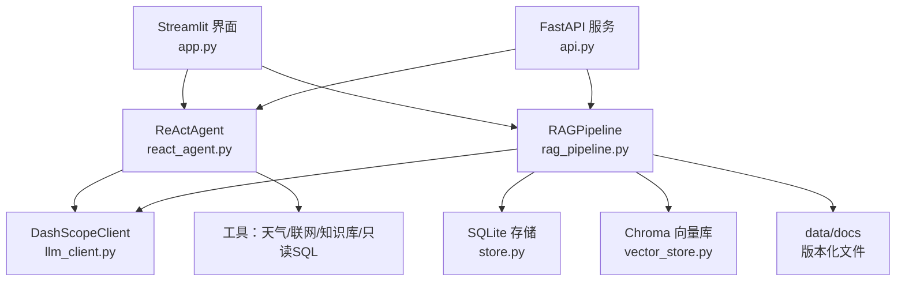
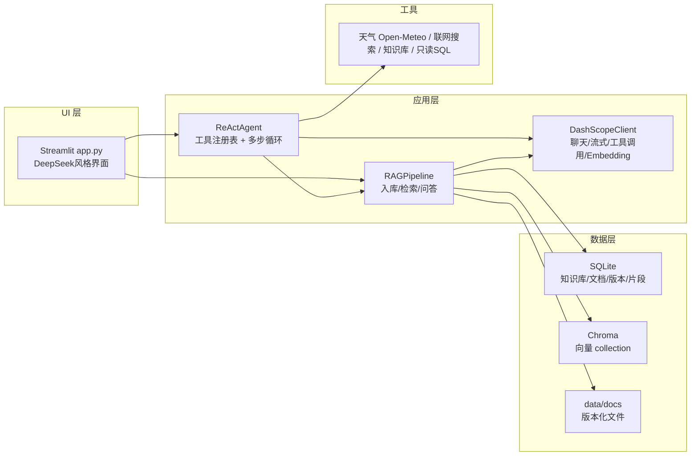
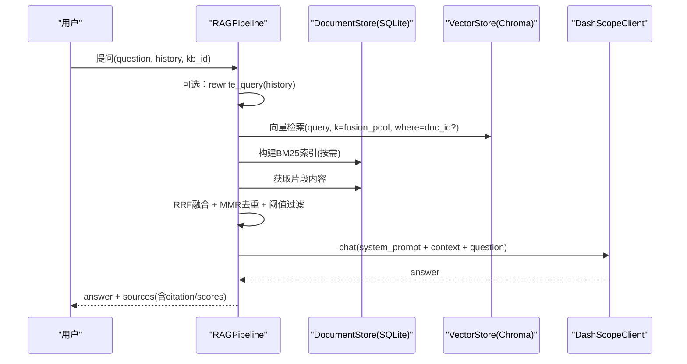
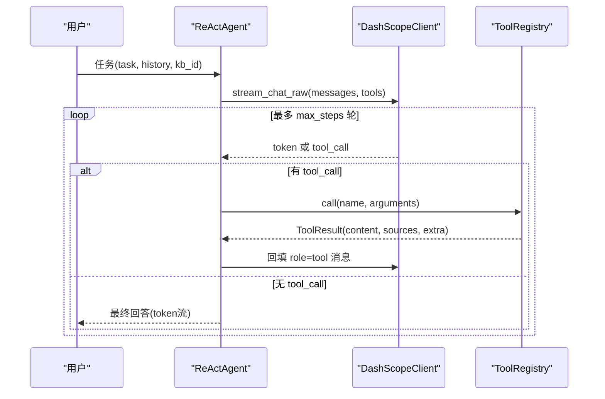
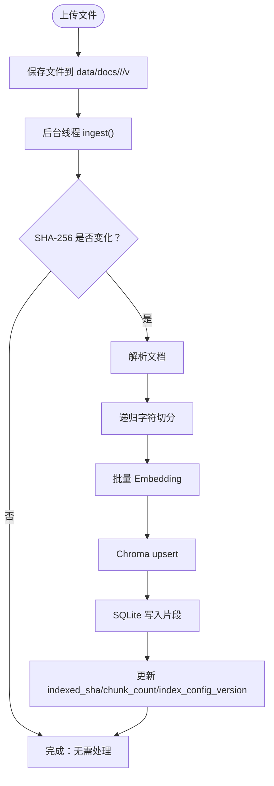
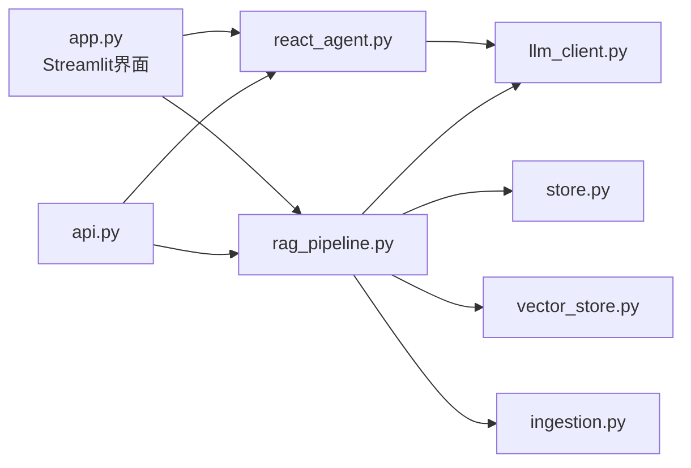

# 项目概述

<cite>
**本文引用的文件**
- [README.md](file://README.md)
- [config.py](file://config.py)
- [rag_pipeline.py](file://rag_pipeline.py)
- [react_agent.py](file://react_agent.py)
- [app.py](file://app.py)
- [api.py](file://api.py)
- [llm_client.py](file://llm_client.py)
- [store.py](file://store.py)
- [vector_store.py](file://vector_store.py)
- [ingestion.py](file://ingestion.py)
- [ARCHITECTURE.md](file://docs/ARCHITECTURE.md)
- [evals/README.md](file://evals/README.md)
</cite>

## 更新摘要
**所做更改**
- 更新了界面样式相关章节，反映Streamlit界面的CSS颜色格式优化
- 增强了用户界面体验描述，包含最新的UI改进细节
- 保持了整体文档结构的一致性和完整性

## 目录
1. [简介](#简介)
2. [项目结构](#项目结构)
3. [核心组件](#核心组件)
4. [架构总览](#架构总览)
5. [详细组件分析](#详细组件分析)
6. [依赖关系分析](#依赖关系分析)
7. [性能与可观测性](#性能与可观测性)
8. [快速开始指南](#快速开始指南)
9. [故障排查](#故障排查)
10. [结论](#结论)

## 简介
本项目是一个企业级知识库问答系统（RAG + Agent），在阶段 A 实现了"多知识库管理、混合检索、Function Calling Agent、流式对话、后台入库、引用可追溯"等能力，目标是把单知识库演示升级为可靠的单机产品，并为后续多租户平台化（阶段 B/C）打下基础。

- 核心目标：让企业内部文档"可检索、可溯源、可追问"，同时支持通用问答与工具调用（天气、联网搜索、只读数据库）。
- 关键特性：
  - 多知识库隔离：每个知识库独立向量索引与关键词索引；
  - 混合检索：向量语义检索 + BM25 词面检索，RRF 融合排序，可选 MMR 去重；
  - 相关性门槛：避免无相关内容时强行回答，降低幻觉；
  - 增量入库：SHA-256 判重，配置变化自动全量重建；
  - 文档版本：同名文件重传自动升版本，旧版本保留；
  - Function Calling Agent：LLM 自主选择工具并多步循环执行；
  - 真流式回答：边生成边渲染，工具调用过程实时展示；
  - 后台入库：上传后异步索引，不阻塞聊天；
  - 引用可追溯：回答附带来源文件、段落/页码与相似度得分；
  - REST API + 鉴权：FastAPI 服务层暴露接口，支持 Bearer Token；
  - 评测体系：golden set 量化检索命中率与回答质量；
  - **优化的用户界面**：采用 DeepSeek 风格的简洁界面设计，包含改进的CSS样式和用户体验优化。

**章节来源**
- [README.md:1-23](file://README.md#L1-L23)
- [README.md:93-114](file://README.md#L93-L114)
- [ARCHITECTURE.md:1-11](file://docs/ARCHITECTURE.md#L1-L11)

## 项目结构
项目采用分层与按职责划分的方式组织代码，便于理解与维护：
- 应用层：Streamlit 界面（app.py）、FastAPI 服务（api.py）
- 业务编排：RAG 管线（rag_pipeline.py）、Agent（react_agent.py）
- 模型接入：DashScope 客户端（llm_client.py）
- 数据层：SQLite 元数据（store.py）、Chroma 向量存储（vector_store.py）、本地文件（data/docs）
- 解析与切分：文档解析与切分（ingestion.py）
- 配置与工具：集中配置（config.py）、日志与评估（utils、evals）

**图表来源**
- [app.py:1-9](file://app.py#L1-L9)
- [api.py:1-14](file://api.py#L1-L14)
- [rag_pipeline.py:1-15](file://rag_pipeline.py#L1-L15)
- [react_agent.py:1-14](file://react_agent.py#L1-L14)
- [llm_client.py:1-20](file://llm_client.py#L1-L20)
- [store.py:1-17](file://store.py#L1-L17)
- [vector_store.py:1-10](file://vector_store.py#L1-L10)
- [ingestion.py:1-5](file://ingestion.py#L1-L5)

**章节来源**
- [README.md:116-134](file://README.md#L116-L134)
- [ARCHITECTURE.md:13-57](file://docs/ARCHITECTURE.md#L13-L57)

## 核心组件
- 配置中心（config.py）：集中读取环境变量，冻结 dataclass，所有可调参数统一入口。
- 文档解析与切分（ingestion.py）：PDF/Word/Markdown/TXT 解析，PDF 文本质量检测与本地 OCR 兜底，递归字符切分。
- 向量存储（vector_store.py）：Chroma 封装，批量 upsert、条件删除、相似度查询、取回原始向量用于 MMR。
- 元数据存储（store.py）：SQLite WAL 模式，知识库/文档/版本/片段/键值五表，支持软删除与并发安全。
- RAG 管线（rag_pipeline.py）：知识库管理、增量入库、混合检索（向量+BM25，RRF/MMR）、查询改写、带引用问答。
- Agent（react_agent.py）：工具注册表、Function Calling 多步循环、流式事件输出。
- 模型接入（llm_client.py）：DashScope OpenAI 兼容接口，chat/chat_raw/stream_chat/stream_chat_raw/embeddings/web_search。
- 界面与服务（app.py、api.py）：Streamlit 交互页面与 FastAPI REST 接口（含 Bearer 鉴权），**包含优化的用户界面样式**。

**章节来源**
- [config.py:1-113](file://config.py#L1-L113)
- [ingestion.py:1-216](file://ingestion.py#L1-L216)
- [vector_store.py:1-255](file://vector_store.py#L1-L255)
- [store.py:1-470](file://store.py#L1-L470)
- [rag_pipeline.py:1-792](file://rag_pipeline.py#L1-L792)
- [react_agent.py:1-567](file://react_agent.py#L1-L567)
- [llm_client.py:1-322](file://llm_client.py#L1-L322)
- [app.py:1-352](file://app.py#L1-L352)
- [api.py:1-204](file://api.py#L1-L204)

## 架构总览
阶段 A 的架构围绕"检索质量可调、数据可管理、Agent 真实可用、可测试、可演进"五个目标设计。整体由 UI 层、应用层、数据层与工具层组成，模块间职责清晰、耦合度低。

**图表来源**
- [ARCHITECTURE.md:13-43](file://docs/ARCHITECTURE.md#L13-L43)

**章节来源**
- [ARCHITECTURE.md:1-57](file://docs/ARCHITECTURE.md#L1-L57)

## 详细组件分析

### RAG 管线（检索与问答）
- 多知识库管理：创建/切换/删除，每个知识库独立向量 collection 与 BM25 索引。
- 增量入库：SHA-256 判重，索引配置签名变化触发全量重建；先写新向量再清理旧片段，失败可重试。
- 混合检索：向量 Top-N + BM25 Top-N → RRF 融合 → 可选 MMR 去重；相关性门槛拦截无相关内容。
- 查询改写：多轮对话时基于最近历史改写追问题，失败或异常长度时退回原问题。
- 带引用问答：组装上下文块（每块带来源标注），按 token 预算裁剪，生成答案并返回 sources（含向量/BM25 得分）。

**图表来源**
- [rag_pipeline.py:439-523](file://rag_pipeline.py#L439-L523)
- [rag_pipeline.py:566-666](file://rag_pipeline.py#L566-L666)
- [vector_store.py:100-137](file://vector_store.py#L100-L137)
- [store.py:425-442](file://store.py#L425-L442)
- [llm_client.py:94-127](file://llm_client.py#L94-L127)

**章节来源**
- [rag_pipeline.py:1-792](file://rag_pipeline.py#L1-L792)

### Function Calling Agent（工具调度与多步循环）
- 工具注册表：通过装饰器注册工具（search_knowledge_base、get_weather、search_web、query_database），自动生成 OpenAI tools 格式。
- 多步循环：LLM 返回 tool_calls → 解析参数 → 执行工具 → 结果回填 role=tool → 继续下一轮，直到最终回答或达到最大轮数。
- 流式输出：stream_chat_raw 产出 token/tool_call 事件，UI 逐帧渲染，工具调用过程可见。
- 安全限制：只读 SQL 白名单校验 + SQLite URI mode=ro；工具返回结果截断防止上下文爆炸。

**图表来源**
- [react_agent.py:144-370](file://react_agent.py#L144-L370)
- [react_agent.py:443-470](file://react_agent.py#L443-L470)
- [llm_client.py:203-278](file://llm_client.py#L203-L278)

**章节来源**
- [react_agent.py:1-567](file://react_agent.py#L1-L567)

### 文档解析与入库流程
- 解析策略：PDF 优先文本提取，质量低于阈值则切换本地 OCR；Word/Markdown/TXT 直接加载。
- 切分策略：递归字符切分，保留 page/paragraph 元数据，便于引用定位。
- 入库流程：upload_document 写磁盘并登记版本 → ingest 后台线程解析/切分/向量化 → Chroma upsert → SQLite 写入片段 → 更新 indexed_sha/chunk_count/索引配置版本。

**图表来源**
- [rag_pipeline.py:306-435](file://rag_pipeline.py#L306-L435)
- [ingestion.py:24-190](file://ingestion.py#L24-L190)
- [vector_store.py:61-78](file://vector_store.py#L61-L78)
- [store.py:337-354](file://store.py#L337-L354)

**章节来源**
- [ingestion.py:1-216](file://ingestion.py#L1-L216)
- [rag_pipeline.py:306-435](file://rag_pipeline.py#L306-L435)

### 数据存储与版本管理
- SQLite 表结构：kbs、documents、document_versions、chunks、meta；WAL 模式 + busy_timeout 保证并发安全。
- 版本控制：同名文件重传自动升版本，旧版本物理文件保留；软删除文档但保留历史。
- 片段管理：按 doc_id/kb_id 增删改查，供 BM25 重建与检索使用。

**章节来源**
- [store.py:31-77](file://store.py#L31-L77)
- [store.py:158-354](file://store.py#L158-L354)
- [store.py:386-442](file://store.py#L386-L442)

### 向量存储与检索
- Chroma 封装：cosine 空间，批量 upsert、where 条件删除、相似度查询、取回原始向量用于 MMR。
- 混合检索：向量检索 + BM25 检索 → RRF 融合 → MMR 去重 → 阈值过滤 → Top-K。

**章节来源**
- [vector_store.py:38-148](file://vector_store.py#L38-L148)
- [rag_pipeline.py:439-523](file://rag_pipeline.py#L439-L523)

### 用户界面优化（新增）
**更新** Streamlit 界面采用了 DeepSeek 风格的现代化设计，包含以下优化：

- **CSS样式优化**：修正了颜色格式，从十六进制格式转换为更标准的RGB格式，提升跨浏览器兼容性
- **界面布局改进**：圆角输入框、居中布局、响应式设计
- **用户体验增强**：会话管理、知识库面板、流式对话显示
- **视觉一致性**：统一的字体、颜色和间距标准

主要界面特性：
- 左侧对话面板：支持多会话独立管理、历史会话列表、会话操作（重命名、置顶、删除）
- 左侧知识库面板：多知识库管理、文档上传与后台异步入库
- 主聊天区域：干净的聊天流、欢迎页面、底部圆角输入框
- 实时状态反馈：入库进度、工具调用状态、错误提示

**章节来源**
- [app.py:37-151](file://app.py#L37-L151)
- [app.py:279-474](file://app.py#L279-L474)

## 依赖关系分析
- 模块耦合：
  - app.py 依赖 rag_pipeline 与 react_agent；
  - api.py 依赖 rag_pipeline 与 react_agent，并通过 FastAPI 暴露 REST 接口；
  - react_agent 依赖 llm_client 与 rag_pipeline；
  - rag_pipeline 依赖 ingestion、store、vector_store、llm_client；
  - store 与 vector_store 为底层数据访问抽象。
- 外部依赖：
  - DashScope（OpenAI 兼容接口）提供 chat/embeddings/web_search；
  - Chroma 作为向量数据库；
  - SQLite 作为元数据存储；
  - Streamlit 作为前端交互；
  - FastAPI/Uvicorn 作为服务层。

**图表来源**
- [app.py:21-24](file://app.py#L21-L24)
- [api.py:27-29](file://api.py#L27-L29)
- [react_agent.py:27-29](file://react_agent.py#L27-L29)
- [rag_pipeline.py:27-38](file://rag_pipeline.py#L27-L38)

**章节来源**
- [app.py:1-352](file://app.py#L1-L352)
- [api.py:1-204](file://api.py#L1-L204)
- [react_agent.py:1-567](file://react_agent.py#L1-L567)
- [rag_pipeline.py:1-792](file://rag_pipeline.py#L1-L792)

## 性能与可观测性
- 性能优化：
  - 嵌入批量大小限制（默认 16，上限 20），避免 DashScope 报错；
  - 上下文 token 预算控制（历史与检索片段裁剪），防止注意力稀释；
  - 后台线程异步入库，不阻塞聊天；
  - 增量入库减少重复计算。
- 可观测性：
  - Agent 轨迹日志（JSONL），记录步骤、工具调用、观察结果；
  - 回答附带 sources（citation、content、scores），便于回溯；
  - 评测脚本输出 hit@k、keyword_hit、citation 指标。

**章节来源**
- [config.py:90-113](file://config.py#L90-L113)
- [rag_pipeline.py:159-193](file://rag_pipeline.py#L159-L193)
- [react_agent.py:506-524](file://react_agent.py#L506-L524)
- [evals/README.md:1-24](file://evals/README.md#L1-L24)

## 快速开始指南
- 环境要求：Python 3.10+，阿里云 DashScope API Key。
- 安装与启动：
  - 创建虚拟环境并安装依赖；
  - 复制 .env.example 为 .env 并填写 DASHSCOPE_API_KEY；
  - 运行 Streamlit 界面；
  - 首次启动会自动导入 data/docs/ 根目录示例文档到"默认知识库"。
- REST API（可选）：
  - 设置 API_AUTH_TOKEN 后启动 uvicorn；
  - 支持知识库管理、文档上传、入库与问答接口。
- 评测（可选）：
  - 离线模式验证链路；在线模式得到真实指标。

**章节来源**
- [README.md:25-72](file://README.md#L25-L72)
- [README.md:93-114](file://README.md#L93-L114)

## 故障排查
- 常见错误与处理：
  - 未配置 DASHSCOPE_API_KEY：抛出运行时错误，需检查 .env；
  - PDF 无法识别：提示安装 pymupdf/rapidocr/onnxruntime；
  - 向量库连接异常：重启服务或清理 data/chroma；
  - 数据库锁冲突：WAL 模式 + busy_timeout，必要时重试；
  - 工具调用失败：异常会回填给模型，尝试换参数或直接回答。
- 调试建议：
  - 查看 Agent 轨迹日志（data/agent_trace.jsonl）；
  - 使用离线测试（pytest）验证核心逻辑；
  - 调整配置参数（如 relevance_threshold、mmr_lambda）优化检索效果。

**章节来源**
- [llm_client.py:59-66](file://llm_client.py#L59-L66)
- [ingestion.py:124-150](file://ingestion.py#L124-L150)
- [store.py:132-138](file://store.py#L132-L138)
- [react_agent.py:136-141](file://react_agent.py#L136-L141)

## 结论
阶段 A 已实现企业级知识库问答的核心能力：多知识库管理、混合检索、Function Calling Agent、流式对话、后台入库、引用可追溯与 REST API。**最新的界面优化进一步提升了用户体验**，采用 DeepSeek 风格的现代化设计，包含改进的CSS样式和更好的交互体验。相比 MVP，项目在检索质量、数据管理、Agent 可用性、可测试性、可演进性与用户体验方面显著提升。下一阶段将引入多租户、分布式存储、任务队列、观测与成本统计，以及 MCP 工具接入与公司系统集成。

**章节来源**
- [README.md:151-170](file://README.md#L151-L170)
- [ARCHITECTURE.md:187-200](file://docs/ARCHITECTURE.md#L187-L200)