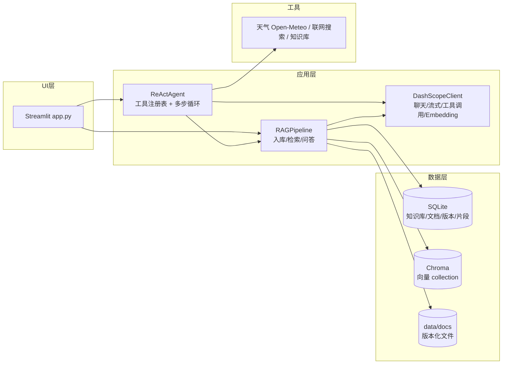

# 阶段 A 架构说明

## 1. 设计目标

阶段 A 把原版“单知识库演示”升级为可靠的单机产品，围绕五个目标设计：

1. **检索质量可调**：混合检索 + 融合排序 + 去重 + 相关性门槛，效果可量化；
2. **数据可管理**：多知识库、文档版本、按文档删除，元数据落库；
3. **Agent 真实可用**：LLM 自主选工具、多步循环、流式输出；
4. **可测试**：核心逻辑全部离线可测（mock LLM 与 Embedding）；
5. **可演进**：存储层和检索层隔离，阶段 B 可平滑替换为 PostgreSQL / 分布式向量库。

## 2. 总体架构



## 3. 核心模块职责

| 模块 | 职责 | 关键点 |
| --- | --- | --- |
| `config.py` | 集中配置 | 所有参数环境变量可覆盖，冻结 dataclass |
| `llm_client.py` | 模型接入 | `chat`（普通）、`chat_raw`（返回 tool_calls）、`stream_chat`、`embeddings` |
| `store.py` | 元数据存储 | SQLite WAL；知识库/文档/版本/片段/键值 5 张表 |
| `vector_store.py` | 向量存储 | Chroma 原生客户端；批量 upsert、按 where 删除、取向量 |
| `ingestion.py` | 文档解析 | PDF 文本质量检测 + 本地 OCR 兜底；递归字符切分 |
| `rag_pipeline.py` | RAG 编排 | 入库、混合检索、查询改写、带引用问答 |
| `react_agent.py` | Agent 编排 | 工具注册表、Function Calling 循环、流式事件 |
| `app.py` | 交互界面 | 知识库管理、后台入库、流式聊天、轨迹展示 |

## 4. 数据流

### 4.1 入库流

```text
上传文件 → upload_document（写磁盘 + 登记版本）
        → ingest（后台线程）
            ├─ SHA-256 与 indexed_sha 对比，跳过未变化文件
            ├─ 索引配置签名变化？→ 全量重建
            ├─ 解析 → 切分 → 批量 Embedding → Chroma upsert
            ├─ 片段写 SQLite（供 BM25 重建与检索）
            └─ 更新 indexed_sha / chunk_count / 索引配置版本
```

两个关键设计：

- **上传哈希与已索引哈希分离**：`document_versions.sha256` 记录“上传的文件内容”，
  `documents.indexed_sha` 记录“最后一次索引的内容”。否则上传即更新哈希会导致
  入库永远检测不到变化。
- **Embedding 批量上限**：DashScope 单次 Embedding 最多 20 条，
  `EMBEDDING_BATCH_SIZE` 默认 16 并在配置层强制钳制到 20 以内，避免长文档入库报
  “batch size is invalid, it should not be larger than 20”。
- **索引配置签名**：`index_config_version` 由 chunk 参数 + Embedding 模型名 + 向量空间
  计算。任一变化，下次 ingest 全量重建，避免新旧向量混用。

### 4.2 检索流（混合检索）

```text
问题 → （可选）查询改写
     ├─ 向量检索：Embedding → Chroma 余弦 Top-N
     ├─ BM25 检索：jieba 分词 → BM25 Top-N
     └─ RRF 融合：score = Σ 1/(k + rank)
          ├─ 相关性门槛：最高向量相似度 < 阈值 → 视为无相关内容
          └─ 可选 MMR 去重 → 最终 Top-K
```

**上下文 token 预算（防注意力发散）**：对话历史按
`HISTORY_MAX_TOKENS`（默认 2000）从后往前截断；检索片段按
`RAG_CONTEXT_MAX_TOKENS`（默认 2500）裁剪；Agent 工具返回结果截断到
2000 字符；查询改写只看最近两轮并带长度护栏。qwen3.7-max 上下文窗口为
100 万 tokens，应用单次请求实际约 3000 tokens，远不会超窗，但预算控制
能显著降低长历史/长上下文对注意力的稀释。

**来源限定检索（防幻觉）**：当问题中出现某文档的文件名或人物短名（如
“李明”→“李明简历.pdf”）时，检索范围自动限定到该文档，避免其他文档的
相似片段混入上下文诱导模型“串台”。这是简历问答场景的核心防幻觉手段，
实现见 `rag_pipeline.py::_source_hint`。

为什么这样做：

- **向量检索**擅长语义相近但用词不同的情况（“设备报警”≈“系统告警”）；
- **BM25** 擅长精确术语（型号、编号、人名），且可解释；
- **RRF** 只看排名不看得分，避免两个检索器得分尺度不同的问题；
- **MMR** 惩罚与已选片段重复的候选，防止 Top-K 全是同一段话的复述；
- **相关性门槛**把“没有相关内容”和“有相关内容但模型没答好”区分开，直接降低幻觉。

### 4.3 问答流

```text
question + history
  → 查询改写（可选，多轮时把“它是什么”改成独立问题）
  → retrieve() 混合检索 Top-K
  → 组装 context（每个片段带 [来源: 文件, 页码/段落]）
  → LLM 生成带引用的回答
  → 返回 answer + sources（含向量/BM25 得分，供 UI 展示）
```

### 4.4 Agent 流（Function Calling）

```text
用户问题 + history
  → 构建 system + 消息 + tools（JSON Schema）
  → LLM 返回：要么直接回答，要么带 tool_calls
  → 有 tool_calls：
      解析参数 → 执行工具（异常回填给模型）→ 结果以 role=tool 回填
      → 回到 LLM（最多 max_steps 轮）
  → 无 tool_calls：把最终回答切成小块流式输出
```

工具注册表的设计让新增工具只写一个普通函数 + 一段 Schema：

```python
@registry.register("tool_name", "描述", {"type": "object", "properties": {...}})
def tool_name(...) -> ToolResult:
    return ToolResult(content="结果", sources=[...])
```

## 5. 数据库设计（SQLite）

| 表 | 字段要点 | 作用 |
| --- | --- | --- |
| `kbs` | id, name(唯一), description | 多知识库 |
| `documents` | kb_id, filename, category, tags, status, latest_version, indexed_sha | 文档主记录 |
| `document_versions` | doc_id, version, sha256, size, file_path | 版本历史与物理文件定位 |
| `chunks` | doc_id, kb_id, chunk_index, content, metadata(JSON) | 片段全文，BM25 重建来源 |
| `meta` | key, value | 索引配置版本等键值 |

设计取舍：

- **为什么用 SQLite 而不是 JSON manifest**：多知识库/版本/按文档删除需要事务与查询；
  WAL 模式支持后台写 + 前台读；
- **为什么片段全文存 SQLite**：删除文档时级联清理；BM25 索引可在内存重建，
  不需要重新解析原始文件；
- **为什么文档软删除**：保留文件与版本历史，便于审计与恢复。

## 6. 并发模型

后台入库使用**独立 RAGPipeline 实例**（新 Chroma 客户端）在线程中执行，
避免与前台共享同一个 Chroma 客户端。完成后调用主实例的 `refresh()`：

- `vectors.reset()`：重建 Chroma 客户端，丢弃过期的内存索引；
- 使 BM25 / 片段缓存失效，下次检索自动重建。

已知限制：入库过程中前台可继续聊天，但检索可能读到半新半旧的索引；
阶段 B 用任务队列 + 版本号快照彻底解决。

## 7. 可测试性设计

`tests/helpers.py` 提供：

- `FakeEmbeddings`：n-gram 词袋确定性嵌入，不依赖网络；
- `FakeLLMClient`：按脚本返回 `chat_raw` 结果（可模拟工具调用序列）。

因此 46 项测试覆盖分词/BM25/RRF/MMR、SQLite 版本管理、增量入库、配置重索引、
阈值拦截与 BM25 兜底、查询改写、PDF 按页 OCR、Agent 工具循环/最大轮数/天气桩/
只读数据库工具/真流式输出、端到端冒烟，全部离线可跑。

评测脚本（``evals/run_eval.py``）基于 golden set 输出检索 hit@k、
回答关键词命中率与可溯源率，结果写入 ``evals/last_run_report.json``。

## 8. 已知限制与阶段 B 演进

| 限制 | 阶段 B 方案 |
| --- | --- |
| 无用户/鉴权/审计 | SSO/LDAP + RBAC + 审计日志 |
| 单机 SQLite | PostgreSQL |
| Chroma 单机向量库 | pgvector / Milvus / Qdrant |
| 后台线程入库 | Celery/RQ 任务队列 |
| 无 REST API | FastAPI 服务层（阶段 A 已实现：见 ``api.py``，含 Bearer 鉴权） |
| 无成本/指标观测 | 结构化日志 + 按租户 token 计费 |
| 无评测体系 | golden set 已实现；接入 RAGAS 自动评估 |
| 工具只限本地三个 | MCP 协议接入公司系统 + 人工审批 |
